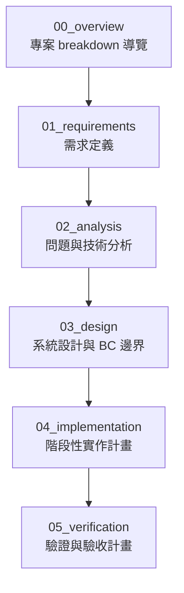
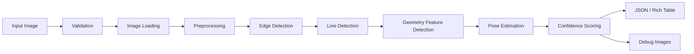
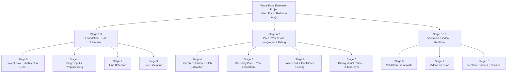

# Project Breakdown Overview

## 1. 文件目的

本文件用來說明本專案 `breakdown/` 資料夾的整體組織方式、閱讀順序與各文件的責任範圍。

本專案原先是一個以 **EXIF / metadata 讀取** 為主的 Python CLI 工具，主要功能是讀取照片中的相機、鏡頭、曝光、GPS、方向等資訊，並輸出成 Rich Table 或 JSON。

目前專案主題已調整為：

> 從單張影像內容中的幾何特徵估計相機姿態角度：yaw、pitch、roll。

因此，`breakdown/` 的目的不是只描述目前程式碼，而是將新主題從需求、分析、設計、實作到驗證完整拆解，讓後續開發可以分階段推進，並避免一次給出過大的任務範圍，導致 LM coding agent 不清楚目前要處理哪個階段。

---

## 2. 專案主題重新定義

### 2.1 原始專案主題

原本專案是：

> 一個 Python CLI 工具，用來讀取照片 EXIF / metadata，整理相機、鏡頭、曝光、GPS、方向等資訊，並輸出成 Rich Table 或 JSON。

原本流程大致為：

```text
使用者輸入圖片路徑
→ 驗證副檔名與檔案存在
→ 用 Pillow / pillow-heif 開圖
→ 讀取 EXIF metadata
→ 轉換常見欄位格式
→ 輸出 Rich Table 或 JSON
```

---

### 2.2 新專案主題

新主題是：

> 從影像內容本身估計 yaw、pitch、roll，而不是只依賴 EXIF / metadata。

新流程會逐步轉向：

```text
輸入圖片
→ 驗證與讀取圖片
→ 影像前處理
→ 邊緣偵測
→ 直線偵測
→ 地平線 / 消失點 / 垂直線偵測
→ yaw / pitch / roll 姿態估計
→ confidence scoring
→ JSON / Rich Table / debug images 輸出
```

---

## 3. Breakdown 文件總覽

目前建議的 `breakdown/` 結構如下：

```text
breakdown/
├── 00_overview/
│   ├── project_breakdown_overview.md
│   └── breakdown_architecture_principles.md
│
├── 01_requirements/
│   └── requirements_breakdown.md
│
├── 02_analysis/
│   └── geometry_pose_analysis.md
│
├── 03_design/
│   ├── system_design_breakdown.md
│   └── bounded_context_map.md
│
├── 04_implementation/
│   ├── stage_0_3_foundation_and_roll.md
│   ├── stage_4_7_pose_integration_and_debug.md
│   └── stage_8_10_validation_video_realtime.md
│
└── 05_verification/
    └── verification_plan.md
```

---

## 4. Breakdown 閱讀順序

建議閱讀順序如下：



---

## 5. 各資料夾的意義

### 5.1 `00_overview/`

`00_overview/` 是整個 breakdown 的導覽層。

它負責說明：

- 專案目前的主題是什麼
- 為什麼從 EXIF / metadata 讀取轉向 visual pose estimation
- breakdown 文件應該如何閱讀
- 為什麼本專案採用軟體工程流程搭配 Lightweight DDD + Bounded Context 概念

此資料夾不負責深入技術實作，也不負責列出完整演算法細節。

---

### 5.2 `01_requirements/`

`01_requirements/` 是需求定義層。

它負責回答：

> 系統要做什麼？

主要內容包括：

- 輸入需求
- 輸出需求
- 核心功能需求
- 非功能需求
- 未來擴充需求

對本專案而言，核心需求是：

```text
輸入：一張照片
輸出：yaw、pitch、roll、confidence、debug artifacts
未來擴充：影片與即時鏡頭
```

需求文件不應該深入說明每個 OpenCV 技術細節，也不應該直接規定具體程式實作方式。

---

### 5.3 `02_analysis/`

`02_analysis/` 是問題與技術分析層。

它負責回答：

> 為什麼可以用影像幾何特徵估計 yaw / pitch / roll？有哪些限制與風險？

主要分析對象包括：

- 邊緣 edges
- 直線 lines
- 地平線 horizon
- 消失點 vanishing point
- 垂直線 vertical lines

以及它們與姿態角度的關係：

```text
roll  → 地平線傾斜角、垂直線偏移
pitch → 地平線上下位置、消失點幾何關係
yaw   → 消失點左右偏移、透視線主方向
```

此層也需要記錄可能失敗的場景，例如：

- 畫面中沒有明顯直線
- 地平線不清楚
- 場景不符合 Manhattan World 假設
- 廣角或魚眼鏡頭造成變形
- 自然場景幾何特徵較弱

---

### 5.4 `03_design/`

`03_design/` 是系統設計層。

它負責回答：

> 系統要如何組成？模組之間如何交換資料？各模組的責任邊界是什麼？

主要文件包括：

- `system_design_breakdown.md`
- `bounded_context_map.md`

`system_design_breakdown.md` 負責定義整體 pipeline、主要模組與資料流。

`bounded_context_map.md` 負責定義本專案使用的 Bounded Context，例如：

- Input Context
- Preprocessing Context
- Geometry Feature Context
- Pose Estimation Context
- Output Context
- Evaluation Context

此層的重點是讓專案從一支混雜的大型 script，逐步轉向具有清楚責任邊界的系統。

---

### 5.5 `04_implementation/`

`04_implementation/` 是階段性實作層。

它負責回答：

> 實作要如何分階段完成？每個階段的輸入、處理、輸出與完成條件是什麼？

目前規劃分為三份文件：

```text
stage_0_3_foundation_and_roll.md
stage_4_7_pose_integration_and_debug.md
stage_8_10_validation_video_realtime.md
```

三份文件分別對應三個里程碑：

| 文件 | 階段 | 主要成果 |
|---|---|---|
| `stage_0_3_foundation_and_roll.md` | Stage 0-3 | 專案轉向、前處理、直線偵測、roll estimation |
| `stage_4_7_pose_integration_and_debug.md` | Stage 4-7 | pitch、yaw、PoseResult、confidence、debug output |
| `stage_8_10_validation_video_realtime.md` | Stage 8-10 | 驗證框架、影片擴充、即時鏡頭擴充 |

此層最重要的目標是避免任務過大，讓 LM coding agent 可以一次只處理明確階段。

---

### 5.6 `05_verification/`

`05_verification/` 是驗證與驗收層。

它負責回答：

> 系統如何被驗證？什麼叫做完成？什麼情況可以接受失敗？

主要內容包括：

- 單元測試
- 合成旋轉圖片測試
- 人工標註測試
- batch evaluation
- failure case analysis
- MAE / RMSE / success rate
- confidence calibration

它和 `04_implementation/stage_8_10_validation_video_realtime.md` 的差異是：

```text
stage_8_10_validation_video_realtime.md
→ 說明驗證功能如何被實作

verification_plan.md
→ 說明整個專案最終如何被驗收
```

---

## 6. 文件與 Mermaid 的使用原則

Mermaid 不需要每份文件都大量使用，但當文件在說明以下內容時，建議使用 Mermaid：

- 流程
- 架構
- 模組關係
- 階段順序
- 上下游資料流
- Bounded Context 邊界

建議最重要的 Mermaid 圖包括：

1. 文件閱讀順序圖
2. 需求 breakdown 圖
3. 幾何特徵到姿態參數關係圖
4. 系統 pipeline 圖
5. Bounded Context Map
6. Stage 0-3 / 4-7 / 8-10 實作階段圖

每份文件通常放 0 到 1 張 Mermaid 即可，重要設計文件可放 1 到 2 張。Mermaid 的目的不是裝飾，而是幫助讀者理解關係、流程與責任邊界。

---

## 7. 舊專案可保留的部分

雖然專案主題已經轉向 visual pose estimation，但原本 EXIF / metadata 專案中仍有部分可以保留：

- CLI 入口
- 檔案存在檢查
- 副檔名驗證
- 圖片讀取基礎
- JSON 輸出
- Rich Table 輸出
- FOV 計算基礎
- metadata reader 作為輔助資訊來源

但主流程的核心將從：

```text
metadata extraction
```

轉為：

```text
visual geometric feature extraction + pose estimation
```

---

## 8. 新專案核心 pipeline

新專案的核心 pipeline 建議如下：



---

## 9. 實作階段總覽



---

## 10. 本文件的使用方式

當後續新增或修改 breakdown 文件時，應先回到本文件確認：

1. 該文件屬於哪個軟體工程階段？
2. 該文件是否需要提到 Bounded Context？
3. 該文件是否在描述需求、分析、設計、實作或驗證？
4. 該文件是否需要 Mermaid 圖？
5. 該文件是否和其他文件責任重疊？

本文件的目標是讓整個 `breakdown/` 保持清楚、可維護、可擴充。
