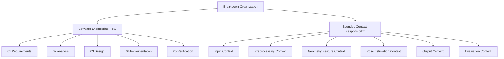
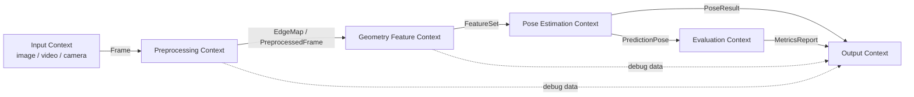

# Breakdown Architecture Principles

## 1. 文件目的

本文件說明本專案 breakdown 文件的架構原則。

目前專案正從原本的 **EXIF / metadata 讀取工具**，轉向 **從影像內容估計 yaw、pitch、roll 的 visual pose estimation 系統**。

由於新主題不再只是讀取照片欄位，而是包含影像來源、前處理、幾何特徵偵測、姿態估計、輸出與驗證等多個責任區塊，因此本專案需要一套清楚的文件拆分原則。

本文件的重點是說明：

- 為什麼 breakdown 文件採用軟體工程流程
- 為什麼引入 Lightweight DDD + Bounded Context
- Bounded Context 在本專案中扮演什麼角色
- 每個文件應該如何避免責任混雜
- 後續 LM coding agent 應如何根據文件邊界進行實作

---

## 2. 本專案使用的兩條拆分軸線

本專案的 breakdown 採用兩條主要軸線：

1. 軟體工程流程軸
2. Bounded Context 責任邊界軸

這兩條軸線解決的是不同問題。

---

## 3. 軟體工程流程軸

軟體工程流程軸用來安排思考與開發順序。

```text
Requirements
→ Analysis
→ Design
→ Implementation
→ Verification
```

在本專案中，對應到：

```text
01_requirements
→ 02_analysis
→ 03_design
→ 04_implementation
→ 05_verification
```

各階段的定位如下：

| 階段 | 主要問題 | 文件角色 |
|---|---|---|
| Requirements | 系統要做什麼？ | 定義輸入、輸出、功能與限制 |
| Analysis | 為什麼這樣做？有哪些技術與風險？ | 分析幾何特徵、姿態估計可行性與失敗情境 |
| Design | 系統怎麼組成？ | 定義模組、資料流與 Bounded Context |
| Implementation | 要怎麼分階段完成？ | 拆成 Stage 0-10 的實作任務 |
| Verification | 怎麼確認做對？ | 定義測試方法、metrics 與驗收條件 |

---

## 4. Bounded Context 責任邊界軸

Bounded Context 軸用來安排系統責任邊界。

本專案採用 Lightweight DDD + Bounded Context，目的是避免所有程式邏輯集中在同一個 `main.py` 或單一 pipeline 中。

建議的 Bounded Context 包括：

```text
Input Context
Preprocessing Context
Geometry Feature Context
Pose Estimation Context
Output Context
Evaluation Context
```

各 Context 的責任如下：

| Context | 責任 |
|---|---|
| Input Context | 處理圖片、影片、即時鏡頭等影像來源 |
| Preprocessing Context | 處理 resize、grayscale、blur、edge detection 等前處理 |
| Geometry Feature Context | 偵測邊緣、直線、地平線、消失點、垂直線等幾何特徵 |
| Pose Estimation Context | 根據 FeatureSet / CameraModel 估計 yaw、pitch、roll |
| Output Context | 輸出 JSON、Rich Table、debug images、overlay |
| Evaluation Context | 處理 ground truth、metrics、batch evaluation 與 failure analysis |

---

## 5. 兩條軸線的關係

軟體工程流程軸回答：

> 這個專案應該照什麼順序思考與開發？

Bounded Context 軸回答：

> 系統內部責任應該如何拆分，避免模組混雜？

兩者不是互相取代，而是互補。



---

## 6. 為什麼使用 Lightweight DDD + Bounded Context

本專案不需要完整企業級 DDD，但需要 DDD 的「責任邊界」概念。

使用 Lightweight DDD + Bounded Context 的原因包括：

1. 避免影像讀取、前處理、特徵偵測、姿態估計與輸出全部混在一起。
2. 讓每個模組有明確責任，方便分階段實作。
3. 讓 LM coding agent 修改專案時，不會把不相關邏輯寫進錯誤位置。
4. 方便未來從單張照片擴充到影片與即時鏡頭。
5. 讓 `FeatureSet`、`PoseResult`、`Frame` 等資料物件成為 Context 之間的明確交換格式。
6. 讓系統可以在不破壞其他模組的情況下替換演算法，例如從 Hough Lines 改成 LSD，或從簡單 VP voting 改成 RANSAC VP estimation。

---

## 7. 本專案使用的 DDD 概念

本專案目前只使用輕量 DDD 概念。

### 7.1 使用的概念

```text
Bounded Context
Domain Object
Service
Context Boundary
Ubiquitous Language
```

### 7.2 暫不使用的概念

為了避免過度設計，目前不強制使用：

```text
Aggregate
Repository
Domain Event
Event Sourcing
CQRS
```

原因是本專案目前的核心問題是影像處理 pipeline 與姿態估計，不是複雜交易系統或大型業務流程管理系統。

---

## 8. 本專案的 Ubiquitous Language

為了讓文件、程式碼與 prompt 使用一致語言，以下名詞應保持一致。

| 名詞 | 意義 |
|---|---|
| Frame | 統一後的一幀影像，可來自圖片、影片或即時鏡頭 |
| EdgeMap | 邊緣偵測後的影像結果 |
| LineSegment | 影像中偵測到的線段 |
| HorizonLine | 地平線候選或最終地平線 |
| VanishingPoint | 消失點 |
| VerticalLineSet | 垂直線集合 |
| FeatureSet | 幾何特徵集合，包含 lines、horizon、vanishing points、vertical lines 等 |
| CameraModel | 相機模型，包含 FOV、焦距、影像中心等資訊 |
| PoseResult | 姿態估計結果，包含 yaw、pitch、roll、confidence |
| DebugArtifact | debug 圖或中間輸出檔案 |
| MetricsReport | 驗證與評估報告 |

---

## 9. Context Map

本專案的主要資料流如下：



此圖的核心原則是：

```text
Input Context 不知道如何估角度。
Preprocessing Context 不直接輸出 yaw / pitch / roll。
Geometry Feature Context 只輸出 FeatureSet。
Pose Estimation Context 才負責輸出 PoseResult。
Output Context 不重新計算特徵或姿態。
Evaluation Context 不參與正常推論流程，只負責測試與評估。
```

---

## 10. Context 邊界規則

### 10.1 Input Context

Input Context 只負責影像來源。

允許：

- 檢查圖片路徑
- 讀取圖片
- 未來讀取影片
- 未來讀取即時鏡頭
- 將輸入轉換為統一 `Frame`

禁止：

- 執行 Canny edge detection
- 偵測直線
- 計算 yaw / pitch / roll
- 輸出 JSON 報告

---

### 10.2 Preprocessing Context

Preprocessing Context 只負責影像前處理。

允許：

- resize
- grayscale
- denoise
- Gaussian Blur
- CLAHE
- Canny Edge Detection
- 產生 `EdgeMap`

禁止：

- 判斷地平線是否可信
- 計算 yaw / pitch / roll
- 產生最終 PoseResult

---

### 10.3 Geometry Feature Context

Geometry Feature Context 只負責幾何特徵偵測。

允許：

- 偵測線段
- 篩選水平線與垂直線
- 估計地平線候選
- 估計消失點候選
- 產生 `FeatureSet`

禁止：

- 直接輸出最終 yaw / pitch / roll
- 輸出最終 JSON 報告
- 直接處理 CLI 參數

---

### 10.4 Pose Estimation Context

Pose Estimation Context 負責姿態估計。

允許：

- 根據 `FeatureSet` 估計 roll
- 根據 horizon 估計 pitch
- 根據 vanishing point 估計 yaw
- 整合 yaw / pitch / roll
- 計算 confidence
- 輸出 `PoseResult`

禁止：

- 直接讀取圖片檔案
- 直接執行影像前處理
- 儲存 debug image
- 寫入 JSON 檔案

---

### 10.5 Output Context

Output Context 只負責輸出與可視化。

允許：

- 輸出 JSON
- 輸出 Rich Table
- 儲存 debug images
- 產生 pose overlay
- 整理 debug artifact paths

禁止：

- 重新計算線段
- 重新估計 yaw / pitch / roll
- 修改 PoseResult 的核心數值

---

### 10.6 Evaluation Context

Evaluation Context 負責驗證與評估。

允許：

- 讀取測試資料集
- 讀取 ground truth
- 比對 prediction 與 ground truth
- 計算 MAE / RMSE / success rate
- 產生 failure case report

禁止：

- 參與一般使用者的正常推論流程
- 直接改變姿態估計結果

---

## 11. 文件撰寫原則

每份 breakdown 文件都應該明確標示自己的角色。

### 11.1 Requirements 文件

需求文件應回答：

```text
系統要做什麼？
```

不應過度深入：

```text
具體 OpenCV 實作參數
類別名稱
函式細節
```

---

### 11.2 Analysis 文件

分析文件應回答：

```text
為什麼可以這樣做？有哪些技術選項、限制與風險？
```

應包含：

- 幾何特徵分析
- 技術候選
- 姿態角度對應關係
- 失敗情境
- 風險分析

---

### 11.3 Design 文件

設計文件應回答：

```text
系統要如何被組織？資料如何流動？模組邊界在哪裡？
```

應包含：

- 系統 pipeline
- 模組設計
- Context Map
- Domain Object
- 跨 Context 資料流

---

### 11.4 Implementation 文件

實作文件應回答：

```text
要怎麼分階段完成？每個階段的完成條件是什麼？
```

每個 stage 建議包含：

- Stage 目標
- 輸入
- 處理步驟
- 輸出
- 相關 Bounded Contexts
- 完成條件
- 不在本階段處理的事情

---

### 11.5 Verification 文件

驗證文件應回答：

```text
怎麼知道系統做對？
```

應包含：

- 測試資料設計
- Ground truth 設計
- metrics
- acceptance criteria
- failure case analysis

---

## 12. Implementation Stage 與 Context 對應

本專案的 Stage 0-10 可對應到以下 Context：

| Stage | 主題 | 主要涉及 Context |
|---|---|---|
| Stage 0 | Project Pivot + Architecture Reset | 全部 Context 骨架 |
| Stage 1 | Image Input + Preprocessing | Input、Preprocessing |
| Stage 2 | Line Detection | Geometry Feature |
| Stage 3 | Roll Estimation | Geometry Feature、Pose Estimation |
| Stage 4 | Horizon + Pitch | Geometry Feature、Pose Estimation |
| Stage 5 | Vanishing Point + Yaw | Geometry Feature、Pose Estimation |
| Stage 6 | PoseResult + Confidence | Pose Estimation |
| Stage 7 | Debug Visualization + Output | Output |
| Stage 8 | Validation Framework | Evaluation |
| Stage 9 | Video Extension | Input、Pose Pipeline |
| Stage 10 | Realtime Camera Extension | Input、Pose Pipeline、Output |

---

## 13. Prompt 與 LM Coding Agent 使用原則

當使用 LM coding agent 修改專案時，prompt 應明確指出：

1. 目前正在處理哪一個 Stage
2. 目前涉及哪些 Bounded Context
3. 目前不應該修改哪些 Context
4. 本階段輸入是什麼
5. 本階段輸出是什麼
6. 完成條件是什麼

例如：

```yaml
current_stage: Stage 3 - Roll Estimation
related_bounded_contexts:
  - Geometry Feature Context
  - Pose Estimation Context
allowed_changes:
  - contexts/geometry_features/
  - contexts/pose_estimation/
forbidden_changes:
  - contexts/output/
  - contexts/evaluation/
stage_goal: 根據偵測到的線段估計 roll angle
expected_output:
  - roll value
  - roll_confidence
  - roll_debug metadata
completion_criteria:
  - 對人工旋轉圖片能產生合理 roll 估計
  - 不處理 pitch 與 yaw
```

---

## 14. Mermaid 使用原則

Mermaid 應用於說明：

- 文件閱讀順序
- 系統 pipeline
- Bounded Context Map
- Stage 流程
- 幾何特徵與姿態參數關係
- 驗證流程

Mermaid 不應為了裝飾而加入。每張 Mermaid 都應該回答一個清楚問題，例如：

```text
這些文件如何閱讀？
資料如何流動？
哪些 Context 互相依賴？
目前 Stage 的上下游是什麼？
```

建議：

- 一般文件放 0 到 1 張 Mermaid
- 核心設計文件可放 1 到 2 張 Mermaid
- 不要在同一份文件中重複畫相似的圖

---

## 15. 最終原則

本專案的 breakdown 文件應遵守以下原則：

1. 先釐清「文件目的」，再寫內容。
2. 需求、分析、設計、實作、驗證不要混在同一份文件。
3. Bounded Context 是用來說明責任邊界，不是為了增加架構複雜度。
4. 實作階段要拆小，避免一次處理 yaw、pitch、roll、video、realtime。
5. 優先完成 Stage 0-3，先讓 roll estimation 成為第一個可交付成果。
6. 每個 Stage 都要有清楚的輸入、處理、輸出、完成條件。
7. 跨 Context 的資料交換應透過明確物件，例如 `Frame`、`EdgeMap`、`FeatureSet`、`PoseResult`。
8. Output Context 不應重新計算姿態，Evaluation Context 不應參與正常推論流程。
9. 舊 EXIF / metadata 功能可保留為輔助資訊，但不再是主流程核心。
10. 文件應服務於後續實作，而不是單純展示架構名詞。
