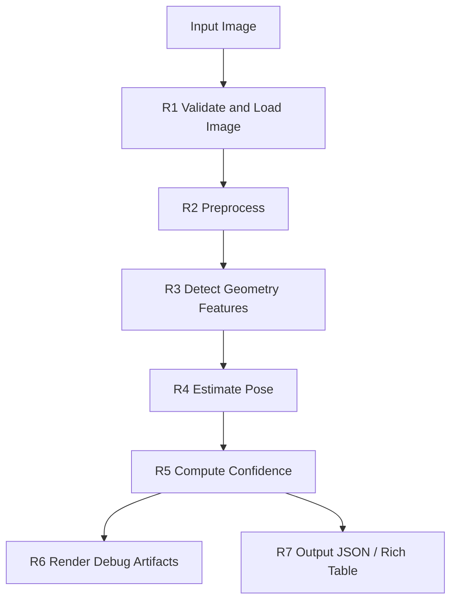

# Geometry Based Pose Requirements

## Evaluation Requirements

| ID | Requirement | Acceptance definition |
|---|---|---|
| ER-01 | 計算 `Precision@θ` | `correct_valid_predictions / valid_predictions` |
| ER-02 | 計算 `Recall@θ` | `correct_valid_predictions / reference_samples`；無姿態輸出仍納入分母 |
| ER-03 | 計算 `Geodesic MAE` | 有效姿態 SO(3) Geodesic Error 平均值，單位 degree |
| ER-04 | 計算 `P95 Error` | 有效姿態 Geodesic Error 第 95 百分位 |
| ER-05 | 影片模式計算 `Jitter` | 連續幀 rotation-error Geodesic 變化量 RMS；單張影像回傳 N/A |
| ER-06 | 允許設定 `θ` | Geometry 預設 `3.0°`，使用 `--theta-deg` 覆寫 |
| ER-07 | 驗證姿態語意 | 只有 calibrated heading 且 `comparison_ready=true` 才能進行正式 OXTS absolute pose 解讀 |
| ER-08 | 標記非嚴格比較 | raw geometry yaw 評估必須輸出 `diagnostic_only=true` 與 comparison warning |
| ER-09 | 預設精簡輸出 | 僅輸出 comparison CSV、summary JSON 與 evaluation report |

## 1. 目的

本文件定義 Geometry Based Pose 第一版需要完成的需求。需求階段只描述系統要做到什麼，不規定完整程式架構與 OpenCV 參數。

## 2. 需求總覽

| ID | 需求類別 | 需求重點 | 後續對應 |
|---|---|---|---|
| R1 | Image Input | 支援單張圖片路徑輸入，並驗證檔案存在與格式 | A1 Input Analysis |
| R2 | Preprocessing | 產生適合幾何特徵偵測的 gray / edge image | A2 Preprocessing Analysis |
| R3 | Geometry Features | 偵測 edges、line segments、horizon、vanishing point、vertical lines | A3-A6 Feature Analysis |
| R4 | Pose Estimation | 根據幾何特徵估計 yaw / pitch / roll | A7 Pose Analysis |
| R5 | Confidence | 依特徵數量、穩定性與一致性輸出 confidence | A8 Confidence Analysis |
| R6 | Debug Output | 輸出中間 debug images 與 pose overlay | A9 Debug Analysis |
| R7 | Result Output | 輸出 JSON / Rich Table，保留 warnings 與 features_used | A10 Output Analysis |
| R8 | Future Extension | 保留影片與即時鏡頭擴充方向 | Design / Implementation |

## 3. 輸入需求

第一版輸入：

```text
image_path
```

支援格式：

- `.jpg`
- `.jpeg`
- `.png`

可保留後續擴充：

- `.heic`
- `.heif`
- batch folder
- video
- realtime camera

## 4. 輸出需求

核心輸出：

| 欄位 | 說明 |
|---|---|
| `yaw` | 相機左右轉向，單位 degree |
| `pitch` | 相機上下抬頭或低頭，單位 degree |
| `roll` | 畫面順逆時針傾斜，單位 degree |
| `confidence` | 整體可信度 |
| `features_used` | 本次估計使用到的幾何特徵 |
| `warnings` | 特徵不足、估計不穩或 fallback 使用紀錄 |
| `debug_artifacts` | 中間圖與 overlay 路徑 |

建議 JSON：

```json
{
  "image": "sample_001.jpg",
  "yaw": 12.4,
  "pitch": -6.8,
  "roll": 1.9,
  "unit": "degree",
  "confidence": 0.78,
  "method": "geometry_based_estimation",
  "features_used": ["edges", "lines", "horizon", "vanishing_point"],
  "warnings": [],
  "debug_artifacts": {
    "input": "debug/01_input.png",
    "edges": "debug/04_edges.png",
    "lines": "debug/05_detected_lines.png",
    "horizon": "debug/12_selected_horizon.png",
    "vanishing_point": "debug/16_selected_vanishing_point.png",
    "overlay": "debug/18_pose_overlay.png"
  }
}
```

## 5. 核心功能需求



## 6. 可靠性需求

| 情況 | 系統行為 |
|---|---|
| line segments 不足 | 允許部分 pose 為 `null`，降低 confidence |
| horizon 不可靠 | pitch 標記 warning，避免輸出高可信度 |
| vanishing point 不穩 | yaw 標記 warning，保留 candidate debug |
| FOV / focal length 為 fallback | yaw / pitch 標記 approximate |
| 場景不符合 Manhattan World | 輸出 low confidence 與 warning |

## 7. 本階段不處理

- 完整 camera calibration。
- deep learning pose estimation。
- 多幀 optical flow pose。
- 完整影片與即時鏡頭實作。
- 統計校準過的 uncertainty model。

詳細需求仍可參考：

```text
01_Requirements/requirements_breakdown.md
```
