# Requirements Breakdown

## 1. 文件目的

本文件用來定義本專案在「需求層」需要完成的內容。

本專案已由原本的 **EXIF / metadata 讀取工具**，轉向為 **從影像內容估計 yaw / pitch / roll 的 Visual Pose Estimation 專案**。

本文件只回答：

> 系統需要做到什麼？

不在本文件中深入討論：

- 具體演算法實作細節
- 模組程式碼架構
- OpenCV 參數設定
- 測試資料集設計
- 影片與即時鏡頭的完整實作方式

---

## 2. 專案需求總目標

本專案目標是建立一個 Python CLI 影像分析工具，輸入一張照片後，透過影像內容中的幾何特徵估計該照片的相機姿態角度：

- yaw
- pitch
- roll

系統應輸出姿態估計結果、信心分數，以及可解釋的 debug artifacts，並保留未來擴充到影片與即時鏡頭的能力。

---

## 3. 需求總覽 Mermaid

```mermaid
flowchart TD
    R[需求總目標<br/>從單張照片估計 yaw / pitch / roll] --> I[輸入需求]
    R --> O[輸出需求]
    R --> F[核心功能需求]
    R --> G[幾何特徵需求]
    R --> D[Debug 與可解釋性需求]
    R --> Q[可靠性需求]
    R --> X[未來擴充需求]

    I --> I1[輸入一張照片]
    I --> I2[支援 jpg / jpeg / png]
    I --> I3[CLI 傳入 image path]
    I --> I4[檢查檔案是否存在]
    I --> I5[檢查副檔名是否合法]
    I --> I6[保留未來支援 heic]

    O --> O1[輸出 yaw]
    O --> O2[輸出 pitch]
    O --> O3[輸出 roll]
    O --> O4[角度單位 degree]
    O --> O5[輸出 confidence]
    O --> O6[輸出 JSON]
    O --> O7[輸出 Rich Table]
    O --> O8[輸出 debug artifacts 路徑]

    F --> F1[影像讀取]
    F --> F2[影像前處理]
    F --> F3[幾何特徵偵測]
    F --> F4[姿態角度估計]
    F --> F5[信心分數計算]
    F --> F6[結果格式化]

    G --> G1[邊緣 Edges]
    G --> G2[直線 Lines]
    G --> G3[地平線 Horizon]
    G --> G4[消失點 Vanishing Point]
    G --> G5[垂直線 Vertical Lines]

    D --> D1[輸出 edge debug image]
    D --> D2[輸出 line debug image]
    D --> D3[輸出 horizon debug image]
    D --> D4[輸出 vanishing point debug image]
    D --> D5[輸出 pose overlay image]

    Q --> Q1[特徵不足時允許輸出 null]
    Q --> Q2[不穩定時降低 confidence]
    Q --> Q3[記錄 features_used]
    Q --> Q4[避免無依據輸出角度]

    X --> X1[影片 Video Extension]
    X --> X2[即時鏡頭 Realtime Camera Extension]
```



---

## 4. 輸入需求

### 4.1 當前輸入形式

系統目前主要支援單張圖片輸入。

```text
input: image_path
```

範例：

```bash
python main.py analyze ./samples/road_001.jpg
```

### 4.2 支援格式

第一版建議支援：

- `.jpg`
- `.jpeg`
- `.png`

未來可擴充支援：

- `.heic`
- `.heif`
- 批次資料夾輸入
- 影片檔案
- 即時攝影機來源

### 4.3 輸入驗證需求

系統需要檢查：

1. 檔案路徑是否存在
2. 副檔名是否合法
3. 檔案是否可被影像讀取器開啟
4. 圖片尺寸是否有效
5. 若圖片過大，是否需要 resize

### 4.4 舊專案可保留項目

原 EXIF / metadata 專案中的以下能力可以保留：

- CLI 入口
- 檔案路徑驗證
- 副檔名檢查
- 圖片讀取基礎
- JSON / Rich Table 輸出基礎
- FOV 計算基礎

---

## 5. 輸出需求

### 5.1 核心輸出

系統最終需要輸出三個姿態角度：

| 參數 | 意義 | 單位 |
|---|---|---|
| `yaw` | 相機左右轉向 | degree |
| `pitch` | 相機上下抬頭或低頭 | degree |
| `roll` | 畫面順逆時針傾斜 | degree |

### 5.2 建議角度正負號定義

為避免後續混亂，系統需要明確定義角度正負方向。

建議採用：

| 參數 | 正值代表 | 負值代表 |
|---|---|---|
| `yaw` | 相機朝右轉 | 相機朝左轉 |
| `pitch` | 相機往上抬 | 相機往下壓 |
| `roll` | 畫面順時針旋轉 | 畫面逆時針旋轉 |

> 注意：實際定義可依專案需求調整，但整個專案必須一致。

### 5.3 JSON 輸出格式

建議輸出格式如下：

```json
{
  "image": "sample_001.jpg",
  "yaw": 12.4,
  "pitch": -6.8,
  "roll": 1.9,
  "unit": "degree",
  "confidence": 0.78,
  "method": "geometry_based_estimation",
  "features_used": [
    "edges",
    "lines",
    "horizon",
    "vanishing_point",
    "vertical_lines"
  ],
  "debug_artifacts": {
    "edges": "debug/01_edges.png",
    "lines": "debug/02_lines.png",
    "horizon": "debug/03_horizon.png",
    "vanishing_point": "debug/04_vanishing_point.png",
    "overlay": "debug/05_pose_overlay.png"
  }
}
```

### 5.4 Rich Table 輸出需求

CLI 模式下，系統應可用 Rich Table 顯示：

- image name
- yaw
- pitch
- roll
- confidence
- method
- features used
- warning / status

---

## 6. 核心功能需求

### 6.1 Image Loading

系統需要讀取輸入圖片，並轉換成後續 OpenCV / NumPy 可處理的影像格式。

需求包含：

- 讀取影像
- 取得影像寬高
- 處理色彩空間
- 保留原圖供 debug overlay 使用

---

### 6.2 Preprocessing

系統需要將原始影像轉換成適合幾何特徵偵測的形式。

基礎需求包含：

- resize
- grayscale
- Gaussian Blur
- Canny Edge Detection

可選需求包含：

- CLAHE
- bilateral filter
- contrast normalization

---

### 6.3 Geometry Feature Detection

系統需要從影像中偵測幾何特徵。

必要特徵包含：

- 邊緣 edges
- 直線 lines
- 地平線 horizon
- 消失點 vanishing point
- 垂直線 vertical lines

第一版可以先完成：

1. edges
2. lines
3. roll estimation

再逐步加入：

1. horizon
2. pitch estimation
3. vanishing point
4. yaw estimation

---

### 6.4 Pose Estimation

系統需要根據幾何特徵估計姿態角度。

| 姿態 | 主要依據 | 難度 |
|---|---|---|
| roll | 地平線傾角、垂直線偏移 | 低 |
| pitch | 地平線上下位置、消失點關係 | 中 |
| yaw | 消失點左右偏移、透視主方向 | 高 |

---

### 6.5 Confidence Scoring

系統需要輸出信心分數，避免在特徵不足時仍輸出看似精準的角度。

confidence 可考慮：

- 偵測到的線段數量
- 線段長度與一致性
- 地平線是否穩定
- 消失點投票是否集中
- 垂直線是否足夠
- 估計結果是否超出合理範圍

---

## 7. 幾何特徵需求

### 7.1 Edges

用途：

- 支援直線偵測
- 支援輪廓與結構萃取

可能技術：

- Sobel
- Scharr
- Canny
- CLAHE + Canny

---

### 7.2 Lines

用途：

- 支援 roll estimation
- 支援 horizon detection
- 支援 vanishing point estimation

可能技術：

- Hough Line Transform
- Probabilistic Hough Transform
- Line Segment Detector
- RANSAC Line Fitting

---

### 7.3 Horizon

用途：

- 支援 roll
- 支援 pitch

可能技術：

- 水平線候選生成
- RANSAC Horizon Fitting
- 消失點反推地平線

---

### 7.4 Vanishing Point

用途：

- 支援 yaw
- 支援 pitch

可能技術：

- 線段延伸交點
- 投票法
- RANSAC Vanishing Point Estimation
- Manhattan World Assumption

---

### 7.5 Vertical Lines

用途：

- 支援 roll
- 支援 pitch
- 輔助判斷重力方向

可能技術：

- 垂直線角度篩選
- 方向直方圖
- 垂直主方向聚類

---

## 8. Debug 與可解釋性需求

本專案不能只輸出 yaw / pitch / roll，還需要讓使用者知道系統是根據什麼判斷。

建議輸出以下 debug artifacts：

| 檔案 | 內容 |
|---|---|
| `01_input.png` | 原始輸入圖 |
| `02_edges.png` | 邊緣偵測結果 |
| `03_lines.png` | 直線偵測結果 |
| `04_horizon.png` | 地平線偵測結果 |
| `05_vanishing_point.png` | 消失點偵測結果 |
| `06_pose_overlay.png` | yaw / pitch / roll 疊圖結果 |

---

## 9. 可靠性需求

### 9.1 特徵不足處理

當影像中幾何特徵不足時，系統應允許：

- 輸出 `null`
- 輸出低 confidence
- 顯示 warning
- 說明缺少哪些特徵

範例：

```json
{
  "yaw": null,
  "pitch": null,
  "roll": 2.1,
  "confidence": 0.31,
  "warning": "Vanishing point and horizon are not reliable."
}
```

### 9.2 失敗情境

系統需要能辨識或標示以下風險：

- 沒有明顯直線
- 地平線不清楚
- 消失點不穩定
- 圖片模糊
- 廣角或魚眼變形
- 場景不符合 Manhattan World
- 自然場景缺少幾何結構

---

## 10. 未來擴充需求

### 10.1 Video Extension

未來系統應可從單張圖片擴充到影片。

需求包含：

- 讀取影片檔案
- 逐幀抽取 frame
- 對每一幀估計 yaw / pitch / roll
- 輸出姿態時間序列
- 進行 temporal smoothing
- 輸出含 overlay 的影片

---

### 10.2 Realtime Camera Extension

未來系統應可支援即時鏡頭輸入。

需求包含：

- OpenCV VideoCapture
- 即時 frame pipeline
- 即時 yaw / pitch / roll overlay
- FPS 控制
- 低延遲處理
- temporal smoothing

---

## 11. 本文件不處理的內容

本文件只定義需求，不處理下列內容：

- 具體 OpenCV 程式碼
- Hough / LSD / RANSAC 的實際參數
- 詳細資料夾架構
- Bounded Context 的完整設計
- 測試資料集與評估指標細節
- 影片與即時鏡頭的完整實作

以上內容應分別放在：

- `02_analysis/geometry_pose_analysis.md`
- `03_design/system_design_breakdown.md`
- `03_design/bounded_context_map.md`
- `04_implementation/*.md`
- `05_verification/verification_plan.md`

---

## 12. 需求完成條件

當本專案完成需求層定義時，應滿足：

- 已明確定義輸入與輸出
- 已明確定義 yaw / pitch / roll 的意義
- 已列出必要幾何特徵
- 已列出 debug 與 confidence 需求
- 已列出未來影片與即時鏡頭擴充方向
- 已明確標示本文件不處理的範圍
