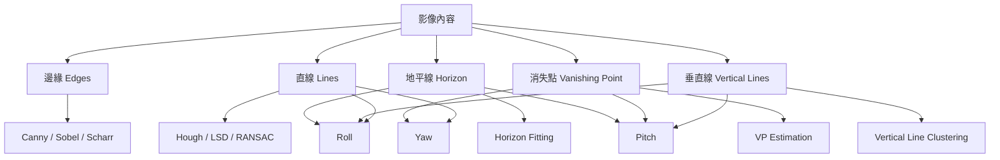

# Geometry Pose Analysis

## 1. 文件目的

本文件用來分析「如何從單張影像內容中的幾何特徵估計 yaw / pitch / roll」。

本文件屬於分析階段，主要回答：

> 為什麼可以用邊緣、直線、地平線、消失點與垂直線來估計相機姿態？  
> 每種幾何特徵可能使用哪些技術？  
> 哪些特徵對 yaw / pitch / roll 有幫助？  
> 這種方法有哪些限制與風險？

本文件不處理：

- 實際程式碼
- 最終模組資料夾設計
- CLI 參數細節
- 測試資料集完整規格

---

## 2. 問題定義

本專案要從一張 2D 影像中估計相機姿態：

- yaw：相機左右轉向
- pitch：相機上下抬頭或低頭
- roll：畫面順逆時針傾斜

由於單張照片只有 2D 投影資訊，缺少完整 3D 場景資訊，因此本問題本質上具有不確定性。

因此，本專案的幾何法不應被定義為「絕對精準的真實姿態恢復」，而應被定義為：

> 根據影像中的可見幾何結構，估計一組合理的相機姿態近似值，並輸出 confidence 表示可信程度。

---

## 3. 幾何特徵與姿態估計關係總覽



---

## 4. 姿態角度分析

### 4.1 Roll

Roll 表示畫面是否順時針或逆時針傾斜。

直覺上：

- 地平線歪掉，通常代表 roll
- 建築物垂直線歪掉，也可能代表 roll
- 大量線段的主方向偏移，也可輔助估計 roll

Roll 是三個角度中最適合優先實作的項目，因為：

1. 可用人工旋轉圖片做合成測試
2. 可用水平線與垂直線直接推估
3. Debug 結果容易視覺檢查

---

### 4.2 Pitch

Pitch 表示相機往上抬或往下壓。

直覺上：

- 地平線越高，通常表示相機越往下拍
- 地平線越低，通常表示相機越往上拍
- 消失點與畫面中心的垂直關係也可支援 pitch estimation

Pitch 的估計通常需要：

- 地平線位置
- 影像中心點
- 相機近似 FOV 或焦距
- 場景具有足夠水平結構

Pitch 比 roll 困難，因為地平線不一定可見，也可能被建築、樹木或物件遮擋。

---

### 4.3 Yaw

Yaw 表示相機向左或向右轉。

直覺上：

- 走廊、道路、鐵軌、建築邊線會形成透視線
- 這些透視線延伸後會交會在消失點
- 消失點相對畫面中心的左右偏移，可用來近似 yaw

Yaw 是三個角度中最困難的項目，因為它依賴：

1. 場景中要有明顯透視結構
2. 線段偵測要穩定
3. 消失點估計不能被錯誤線段干擾
4. 最好有相機內參或近似 FOV

---

## 5. 幾何特徵分析

## 5.1 邊緣 Edges

### 角色

邊緣是幾何特徵偵測的基礎。

它本身通常不直接輸出 yaw / pitch / roll，但會支援：

- 直線偵測
- 輪廓偵測
- 地平線候選
- 主要結構邊界

### 可能技術

- Grayscale Conversion
- Gaussian Blur
- Bilateral Filter
- Sobel Operator
- Scharr Operator
- Canny Edge Detection
- CLAHE + Canny

### 輸入

```text
Frame / GrayscaleFrame
```

### 輸出

```text
EdgeMap
```

### 風險

- 圖片模糊會降低邊緣品質
- 紋理太多會產生過多雜訊邊緣
- 光線不足會導致邊緣斷裂
- 高對比雜物可能產生錯誤邊緣

---

## 5.2 直線 Lines

### 角色

直線是本專案最重要的中間幾何特徵之一。

它可以支援：

- roll estimation
- horizon detection
- vanishing point estimation
- vertical line detection

### 可能技術

- Hough Line Transform
- Probabilistic Hough Transform
- Line Segment Detector, LSD
- EDLines
- RANSAC Line Fitting
- Line Segment Merging
- Orientation Histogram

### 輸入

```text
EdgeMap
```

### 輸出

```text
LineSegment[]
```

### 對姿態估計的幫助

| 姿態 | 關係 |
|---|---|
| roll | 看主要水平線或垂直線是否傾斜 |
| pitch | 透過地平線位置間接估計 |
| yaw | 透過消失點左右偏移間接估計 |

### 風險

- 線段太短導致方向不可靠
- 場景中非結構性線條太多
- Hough 參數不穩會造成漏檢或誤檢
- 曲線、樹枝、雜物可能被誤判為直線

---

## 5.3 地平線 Horizon

### 角色

地平線是估計 roll 與 pitch 的重要特徵。

### 可能技術

- 水平線候選生成
- 近水平線段篩選
- RANSAC Horizon Fitting
- Horizon Line Estimation
- 消失點反推地平線
- Sky-Ground Segmentation，進階可選

### 輸入

```text
LineSegment[]
ImageSize
VanishingPoint optional
```

### 輸出

```text
HorizonLine
```

### 對姿態估計的幫助

| 姿態 | 關係 |
|---|---|
| roll | 地平線傾斜角可直接支援 roll |
| pitch | 地平線相對畫面中心的上下位置可支援 pitch |
| yaw | 通常不是主要依據，但可與消失點共同使用 |

### 風險

- 地平線不可見
- 地平線被建築、車輛、樹木遮住
- 室內場景沒有自然地平線
- 誤把牆線、屋頂線、道路邊界當成地平線

---

## 5.4 消失點 Vanishing Point

### 角色

消失點是估計 yaw 的核心線索，也可輔助 pitch。

在具有透視結構的場景中，例如：

- 道路
- 走廊
- 鐵軌
- 建築物立面
- 室內牆角

平行線在影像中會朝某一點收斂，該點即為消失點。

### 可能技術

- 線段延伸交點
- 投票法
- RANSAC Vanishing Point Estimation
- J-Linkage
- Mean Shift Clustering
- Manhattan World Assumption
- Orthogonal Vanishing Point Estimation

### 輸入

```text
LineSegment[]
ImageSize
CameraModel optional
```

### 輸出

```text
VanishingPoint[]
```

### 對姿態估計的幫助

| 姿態 | 關係 |
|---|---|
| yaw | 消失點左右偏移可支援 yaw |
| pitch | 消失點垂直位置與地平線可支援 pitch |
| roll | 多組消失點方向可輔助 roll |

### 風險

- 線段數量不足
- 多個消失點混在一起
- 錯誤線段影響交點估計
- 場景不符合 Manhattan World
- 廣角鏡頭造成直線彎曲

---

## 5.5 垂直線 Vertical Lines

### 角色

垂直線可視為影像中的重力方向線索。

常見來源包括：

- 建築物邊緣
- 門框
- 牆角
- 電線桿
- 柱子
- 室內家具邊線

### 可能技術

- 垂直線角度篩選
- Orientation Histogram
- Line Direction Clustering
- RANSAC 主方向估計
- Manhattan World 垂直軸估計

### 輸入

```text
LineSegment[]
```

### 輸出

```text
VerticalLineSet
```

### 對姿態估計的幫助

| 姿態 | 關係 |
|---|---|
| roll | 垂直線偏離影像垂直方向可支援 roll |
| pitch | 垂直線投影分布可輔助 pitch |
| yaw | 通常不是主要依據 |

### 風險

- 場景沒有明顯垂直線
- 人造物件不足
- 錯把斜線或透視線當垂直線
- 相機 pitch 過大時垂直線投影可能不穩

---

## 6. 技術選型分析

### 6.1 第一版建議技術組合

第一版不建議一次完成 yaw / pitch / roll。

建議先完成：

```text
image → grayscale → blur → Canny → Hough / LSD → line orientation → roll
```

第一版可使用：

- OpenCV
- NumPy
- Canny Edge Detection
- Probabilistic Hough Transform
- Orientation Histogram

### 6.2 第二版建議技術組合

加入 horizon 與 pitch：

```text
LineSegment[] → horizon candidate → RANSAC fitting → pitch estimation
```

可使用：

- RANSAC
- horizon candidate scoring
- FOV / focal length approximation

### 6.3 第三版建議技術組合

加入 vanishing point 與 yaw：

```text
LineSegment[] → line intersection voting → vanishing point → yaw estimation
```

可使用：

- RANSAC Vanishing Point
- line intersection voting
- line clustering
- Manhattan World assumption

---

## 7. 姿態估計難度排序

| 姿態 | 難度 | 原因 |
|---|---:|---|
| roll | 低 | 可由水平線或垂直線傾斜直接估計 |
| pitch | 中 | 需要可靠地平線或消失點位置 |
| yaw | 高 | 高度依賴透視結構與消失點穩定性 |

因此，實作順序建議為：

```text
roll → pitch → yaw
```

---

## 8. 場景適用性分析

### 8.1 適合場景

幾何法較適合以下場景：

- 道路
- 鐵軌
- 走廊
- 建築物
- 室內空間
- 倉儲空間
- 有明顯直線與透視結構的街景

### 8.2 不適合場景

幾何法較不適合以下場景：

- 森林
- 草地
- 純天空
- 人像近拍
- 模糊照片
- 魚眼鏡頭
- 缺少直線結構的自然景

---

## 9. 風險分析

### 9.1 技術風險

| 風險 | 影響 |
|---|---|
| 線段偵測不穩 | 影響所有後續姿態估計 |
| 地平線誤判 | 造成 roll / pitch 錯誤 |
| 消失點誤判 | 造成 yaw 錯誤 |
| 相機內參未知 | yaw / pitch 只能近似 |
| 廣角變形 | 直線不再保持直線 |

### 9.2 場景風險

| 風險 | 影響 |
|---|---|
| 沒有明顯直線 | 無法估計穩定姿態 |
| 自然紋理太多 | 產生大量錯誤邊緣 |
| 光線不足 | 邊緣斷裂 |
| 動態模糊 | 線段不可靠 |
| 透視結構太複雜 | 消失點群難以分離 |

### 9.3 系統設計風險

| 風險 | 影響 |
|---|---|
| 所有邏輯塞在 main.py | 難以維護與擴充 |
| 特徵偵測與姿態估計混在一起 | 難以測試 |
| 沒有 debug image | 無法判斷錯誤來源 |
| 沒有 confidence | 使用者容易誤信錯誤結果 |
| 沒有統一 Frame / PoseResult | 未來影片與即時鏡頭難擴充 |

---

## 10. Confidence 分析

由於單張影像姿態估計不一定穩定，本專案必須設計 confidence。

### 10.1 Roll Confidence

可參考：

- 水平線或垂直線數量
- 主方向集中程度
- 線段平均長度
- 角度分布是否明顯

### 10.2 Pitch Confidence

可參考：

- 地平線是否偵測成功
- 地平線候選是否一致
- 地平線是否位於合理範圍
- 是否有消失點輔助

### 10.3 Yaw Confidence

可參考：

- 消失點投票是否集中
- 支援消失點的線段數量
- 透視線是否足夠長
- 是否有多組消失點混淆

---

## 11. 與未來影片 / 即時鏡頭的關係

雖然本階段先處理單張圖片，但分析時需要保留未來擴充性。

### 11.1 對影片的影響

影片版本會在每一幀上執行單張影像 pipeline。

因此目前分析出的單幀流程應保持獨立：

```text
Frame → Preprocessing → FeatureSet → PoseResult
```

未來影片只是在外層加入：

- frame sampling
- pose per frame
- temporal smoothing
- pose time series

### 11.2 對即時鏡頭的影響

即時鏡頭版本會要求：

- pipeline 可快速執行
- 模組責任清楚
- 可關閉部分 debug 輸出
- 可做 resize 加速
- 可做 temporal smoothing
- 可即時 overlay

因此本專案不應把單張圖片路徑寫死在 pose estimation 模組中。

---

## 12. 分析結論

本專案採用幾何法估計 yaw / pitch / roll 是合理的，但必須注意以下原則：

1. 單張照片無法保證精準恢復真實 3D 姿態。
2. 系統應輸出 confidence，而不是只輸出角度。
3. Roll 應作為第一個實作目標。
4. Pitch 需要穩定地平線或消失點輔助。
5. Yaw 高度依賴消失點，難度最高。
6. Debug artifacts 是必要需求，不是附加功能。
7. 架構上應保留影片與即時鏡頭擴充能力。
8. 幾何特徵偵測與姿態估計應分開，避免責任混雜。

---

## 13. 下一階段銜接

本文件分析完成後，下一步應進入設計階段：

- `03_design/system_design_breakdown.md`
- `03_design/bounded_context_map.md`

設計階段需要根據本文件的分析結果，定義：

- 系統 pipeline
- 模組責任
- Bounded Context
- Domain Object
- FeatureSet / PoseResult 資料格式
- Debug artifact 輸出規格
