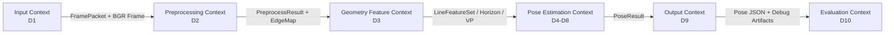

# Geometry Based Pose Bounded Context Map

## 1. 目的

本文件定義 Geometry Based Pose 的 Lightweight DDD / Bounded Context 邊界，並對應 `02_Analysis/README.md` 的 A1 到 A10。

## 2. Context Map



## 3. Context Responsibilities

| Context | 對應 Design | 責任 | 不負責 |
|---|---|---|---|
| Input Context | D1 | 圖片驗證、讀取、建立 frame packet | edge / line / pose |
| Preprocessing Context | D2 | gray、resize、blur、Canny | line detection / pose |
| Geometry Feature Context | D3 | line detection、line classification、feature set | yaw / pitch / roll |
| Pose Estimation Context | D4-D8 | roll、pitch、yaw、pose integration、confidence | 讀圖 / 寫檔 |
| Output Context | D9 | JSON、Rich Table、debug images、overlay | 重新估姿態 |
| Evaluation Context | D10 | metrics、labels、failure cases | 正常推論 |

## 4. Boundary Rules

```text
Input -> FramePacket
Preprocessing -> PreprocessResult / EdgeMap
Geometry Feature -> LineFeatureSet / HorizonLine / VanishingPoint
Pose Estimation -> PoseResult
Output -> JsonReport / DebugArtifacts
Evaluation -> MetricsReport
```

禁止任意跨層傳遞未命名資料，例如讓 Output Context 直接重新跑 Canny 或 Hough。

## 5. Stage 對應

| Stage | Context |
|---|---|
| Stage 0-3 | Input、Preprocessing、Geometry Feature、Pose Estimation、Output |
| Stage 4-7 | Geometry Feature、Pose Estimation、Output |
| Stage 8-10 | Evaluation、Input extension、Output extension |

