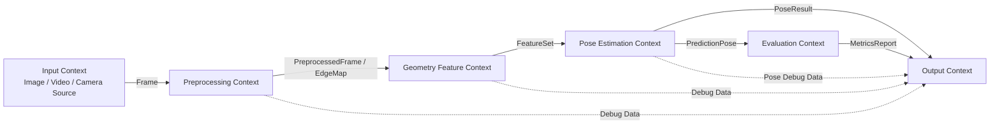

# Bounded Context Map

## 1. 文件目的

本文件定義本專案在 **Lightweight DDD + Bounded Context** 概念下的領域邊界。

本專案的目標是從單張影像內容中的幾何特徵估計相機姿態角度：

- yaw
- pitch
- roll

由於此流程會牽涉影像來源、影像前處理、幾何特徵偵測、姿態估計、輸出與驗證等不同責任區塊，因此需要用 Bounded Context 將系統拆分成清楚的邊界，避免所有邏輯混在同一個主流程或單一檔案中。

---

## 2. Context Map 總覽

本專案目前規劃為六個主要 Bounded Context：

1. **Input Context**
2. **Preprocessing Context**
3. **Geometry Feature Context**
4. **Pose Estimation Context**
5. **Output Context**
6. **Evaluation Context**

其中最核心的領域是：

- Geometry Feature Context
- Pose Estimation Context

因為本專案的核心價值來自於：

> 從影像幾何特徵推估 yaw / pitch / roll。

---

## 3. Context Map Mermaid



---

## 4. Input Context

### 4.1 責任範圍

Input Context 負責處理影像來源，將不同來源統一轉換為系統可使用的影像單位。

目前主要支援：

- 單張照片輸入

未來保留擴充：

- 影片輸入
- 即時鏡頭輸入

---

### 4.2 核心概念

| Domain Object | 說明 |
|---|---|
| `ImageSource` | 單張圖片來源 |
| `VideoSource` | 影片來源，未來擴充使用 |
| `CameraSource` | 即時鏡頭來源，未來擴充使用 |
| `Frame` | 統一後的一幀影像資料 |
| `InputSpec` | 輸入規格，例如路徑、格式、來源類型 |

---

### 4.3 輸入與輸出

#### 輸入

```text
image_path
```

#### 輸出

```text
Frame
```

---

### 4.4 邊界規則

Input Context 只負責影像來源與讀取，不負責：

- edge detection
- line detection
- horizon detection
- vanishing point estimation
- yaw / pitch / roll estimation
- JSON / Rich Table 輸出

---

## 5. Preprocessing Context

### 5.1 責任範圍

Preprocessing Context 負責將原始影像轉換為適合幾何特徵偵測的中間資料。

主要包含：

- resize
- grayscale
- denoise
- contrast enhancement
- edge detection

---

### 5.2 核心概念

| Domain Object | 說明 |
|---|---|
| `PreprocessConfig` | 前處理參數設定 |
| `PreprocessedFrame` | 前處理後的影像 |
| `GrayscaleFrame` | 灰階影像 |
| `EdgeMap` | 邊緣圖 |

---

### 5.3 輸入與輸出

#### 輸入

```text
Frame
PreprocessConfig
```

#### 輸出

```text
PreprocessedFrame
EdgeMap
```

---

### 5.4 可能技術

- Grayscale Conversion
- Gaussian Blur
- Bilateral Filter
- CLAHE
- Sobel Operator
- Scharr Operator
- Canny Edge Detection

---

### 5.5 邊界規則

Preprocessing Context 只負責影像轉換，不直接估計：

- yaw
- pitch
- roll

也不直接輸出最終報告。

---

## 6. Geometry Feature Context

### 6.1 責任範圍

Geometry Feature Context 負責從前處理結果中提取幾何特徵。

本專案關注的幾何特徵包含：

- edges
- lines
- horizon
- vanishing point
- vertical lines

---

### 6.2 核心概念

| Domain Object | 說明 |
|---|---|
| `LineSegment` | 影像中偵測到的線段 |
| `LineSet` | 線段集合 |
| `VerticalLineSet` | 垂直線集合 |
| `HorizonLine` | 地平線候選或最終地平線 |
| `VanishingPoint` | 消失點 |
| `FeatureSet` | 統一的幾何特徵集合 |
| `FeatureQuality` | 特徵品質分數 |

---

### 6.3 輸入與輸出

#### 輸入

```text
PreprocessedFrame
EdgeMap
```

#### 輸出

```text
FeatureSet
```

---

### 6.4 FeatureSet 範例

```json
{
  "lines": [],
  "vertical_lines": [],
  "horizon": null,
  "vanishing_points": [],
  "feature_quality": 0.72
}
```

---

### 6.5 可能技術

- Hough Line Transform
- Probabilistic Hough Transform
- Line Segment Detector
- EDLines
- RANSAC Line Fitting
- RANSAC Horizon Fitting
- Vanishing Point Voting
- Manhattan World Assumption
- Orientation Histogram
- Line Clustering

---

### 6.6 邊界規則

Geometry Feature Context 只負責找特徵，不直接輸出最終姿態角度。

也就是：

```text
可以輸出 HorizonLine，但不直接輸出 pitch。
可以輸出 VanishingPoint，但不直接輸出 yaw。
可以輸出 VerticalLineSet，但不直接輸出 roll。
```

最終角度應由 Pose Estimation Context 負責。

---

## 7. Pose Estimation Context

### 7.1 責任範圍

Pose Estimation Context 負責根據幾何特徵估計相機姿態。

輸出目標包含：

- yaw
- pitch
- roll
- confidence

---

### 7.2 核心概念

| Domain Object | 說明 |
|---|---|
| `CameraModel` | 相機模型，包含 FOV、焦距或近似內參 |
| `RollEstimate` | roll 估計結果 |
| `PitchEstimate` | pitch 估計結果 |
| `YawEstimate` | yaw 估計結果 |
| `ConfidenceScore` | 信心分數 |
| `PoseResult` | 最終姿態估計結果 |

---

### 7.3 輸入與輸出

#### 輸入

```text
FeatureSet
CameraModel
```

#### 輸出

```text
PoseResult
```

---

### 7.4 PoseResult 範例

```json
{
  "yaw": 12.4,
  "pitch": -6.8,
  "roll": 1.9,
  "unit": "degree",
  "confidence": 0.78,
  "method": "geometry_based_estimation",
  "features_used": [
    "lines",
    "horizon",
    "vanishing_point",
    "vertical_lines"
  ]
}
```

---

### 7.5 角度來源

| 姿態角度 | 主要依據 |
|---|---|
| roll | 地平線傾斜角、垂直線偏移角 |
| pitch | 地平線上下位置、消失點與畫面中心關係 |
| yaw | 消失點左右偏移、透視線主方向 |

---

### 7.6 邊界規則

Pose Estimation Context 不負責：

- 讀取圖片
- 執行 Canny
- 偵測線段
- 輸出 Rich Table
- 儲存 debug image

它只負責：

```text
根據 FeatureSet / CameraModel 推估 PoseResult。
```

---

## 8. Output Context

### 8.1 責任範圍

Output Context 負責將系統結果轉換成使用者可閱讀或可儲存的格式。

主要輸出包含：

- JSON
- Rich Table
- debug images
- pose overlay image

---

### 8.2 核心概念

| Domain Object | 說明 |
|---|---|
| `JsonReport` | JSON 報告 |
| `RichTableReport` | 終端機表格輸出 |
| `DebugArtifact` | debug 圖或中間結果 |
| `OverlayImage` | 姿態結果疊圖 |

---

### 8.3 輸入與輸出

#### 輸入

```text
PoseResult
FeatureSet
DebugArtifacts
```

#### 輸出

```text
JSON
Rich Table
Debug Images
Overlay Image
```

---

### 8.4 邊界規則

Output Context 不重新計算任何：

- edge
- line
- horizon
- vanishing point
- yaw / pitch / roll

它只負責：

- 格式化
- 顯示
- 儲存
- 可視化

---

## 9. Evaluation Context

### 9.1 責任範圍

Evaluation Context 負責驗證姿態估計結果是否可靠。

它不屬於正常推論流程的必要環節，而是用來評估模型或演算法版本的效果。

---

### 9.2 核心概念

| Domain Object | 說明 |
|---|---|
| `GroundTruthPose` | 真實姿態標註 |
| `PredictionPose` | 預測姿態結果 |
| `EvaluationCase` | 單筆測試案例 |
| `MetricsReport` | 評估報告 |

---

### 9.3 輸入與輸出

#### 輸入

```text
PoseResult
GroundTruthPose
```

#### 輸出

```text
MetricsReport
```

---

### 9.4 可能指標

- MAE
- RMSE
- Success Rate
- Confidence Calibration
- Failure Case Count

---

### 9.5 邊界規則

Evaluation Context 不應該影響正常推論流程。

它回答的是：

```text
系統估得準不準？
哪些場景容易失敗？
confidence 是否可信？
```

---

## 10. Bounded Context 與 Stage 對應

| Implementation Stage | 主要涉及 Context |
|---|---|
| Stage 0：Project Pivot + Architecture Reset | 全部 Context 骨架 |
| Stage 1：Image Input + Preprocessing | Input、Preprocessing |
| Stage 2：Line Detection | Geometry Feature |
| Stage 3：Roll Estimation | Geometry Feature、Pose Estimation |
| Stage 4：Horizon + Pitch | Geometry Feature、Pose Estimation |
| Stage 5：Vanishing Point + Yaw | Geometry Feature、Pose Estimation |
| Stage 6：PoseResult + Confidence | Pose Estimation |
| Stage 7：Debug Visualization + Output | Output |
| Stage 8：Validation Framework | Evaluation |
| Stage 9：Video Extension | Input、Pose Pipeline |
| Stage 10：Realtime Camera Extension | Input、Pose Pipeline、Output |

---

## 11. 跨 Context 資料流規則

跨 Context 傳遞資料時，應使用明確的 Domain Object。

建議資料流如下：

```text
ImageSource
-> Frame
-> PreprocessedFrame / EdgeMap
-> FeatureSet
-> PoseResult
-> JsonReport / RichTableReport / DebugArtifact
```

避免直接跨層傳遞過於底層或過於模糊的資料。

例如：

```text
不建議：
OpenCV image array 在所有模組之間任意傳遞。

建議：
Input Context 輸出 Frame。
Preprocessing Context 輸出 EdgeMap。
Geometry Feature Context 輸出 FeatureSet。
Pose Estimation Context 輸出 PoseResult。
```

---

## 12. 邊界規則總結

1. Input Context 只負責影像來源，不負責特徵偵測。
2. Preprocessing Context 只負責影像轉換，不直接估計 yaw / pitch / roll。
3. Geometry Feature Context 只輸出 FeatureSet，不直接輸出 PoseResult。
4. Pose Estimation Context 只根據 FeatureSet / CameraModel 估計姿態。
5. Output Context 只負責格式化與可視化，不重新計算特徵或姿態。
6. Evaluation Context 不參與正常推論流程，只負責測試與評估。
7. 跨 Context 傳遞資料時，應使用清楚的 Domain Object。

---

## 13. 本文件與其他 Breakdown 文件的關係

| 文件 | 關係 |
|---|---|
| `breakdown_architecture_principles.md` | 說明為什麼採用 Lightweight DDD + BC |
| `requirements_breakdown.md` | 定義系統需求 |
| `geometry_pose_analysis.md` | 分析幾何特徵與姿態估計關係 |
| `system_design_breakdown.md` | 定義整體系統 pipeline 與模組設計 |
| `stage_0_3_foundation_and_roll.md` | 實作初期 Context 骨架與 roll |
| `verification_plan.md` | 定義 Evaluation Context 的驗證策略 |
