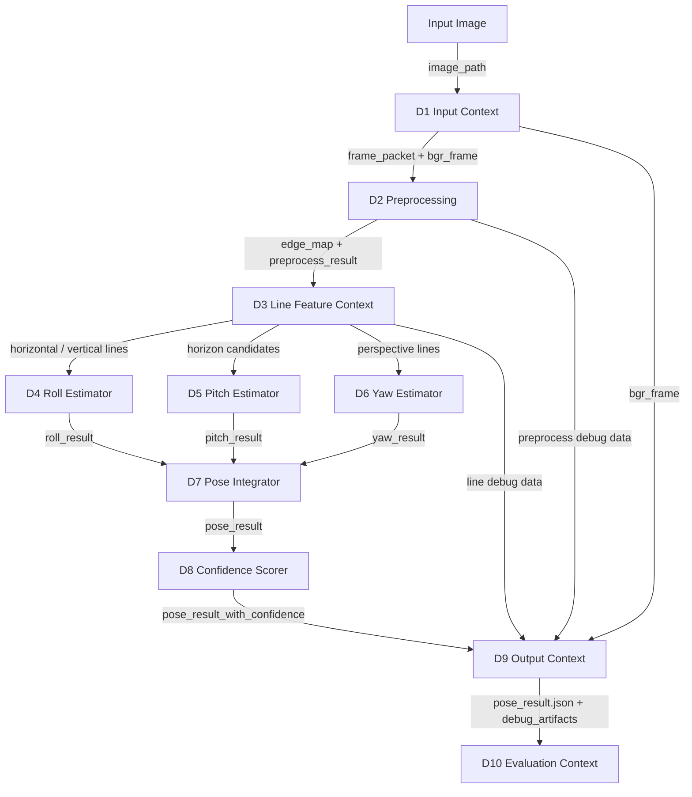

# Geometry Based Pose System Design

## 1. 目的

本文件補充 `03_Design/README.md`，定義 Geometry Based Pose 的系統 pipeline、data contract 與建議 source structure。

## 2. Pipeline Data Contract

| Contract | Producer | Consumer | 格式 | 必要欄位 |
|---|---|---|---|---|
| `frame_packet` | D1 | D2, D9 | JSON-like dict | `image_path`, `width`, `height`, `source_format` |
| `bgr_frame` | D1 | D2, D9 | `ndarray` | shape `(H, W, 3)` |
| `preprocess_result` | D2 | D3, D9 | JSON + arrays | `gray_frame`, `edge_map`, `scale_meta` |
| `line_result` | D3 | D4, D5, D6, D9 | JSON + `LineSegment[]` | `lines`, `horizontal`, `vertical`, `diagonal` |
| `roll_result` | D4 | D7, D9 | JSON | `roll`, `confidence`, `features_used`, `warnings` |
| `pitch_result` | D5 | D7, D9 | JSON | `pitch`, `horizon`, `confidence`, `warnings` |
| `yaw_result` | D6 | D7, D9 | JSON | `yaw`, `vanishing_point`, `confidence`, `warnings` |
| `pose_result` | D7 / D8 | D9, D10 | JSON | `yaw`, `pitch`, `roll`, `confidence`, `features_used` |
| `debug_artifacts` | D9 | D10 | JSON | artifact name to file path mapping |
| `metrics_report` | D10 | user | JSON / Markdown | metrics, failure summary |

## 3. System Pipeline



## 4. Source Structure

```text
src/app/cli.py
src/app/pipeline.py
src/contexts/input/
src/contexts/preprocessing/
src/contexts/geometry_features/
src/contexts/pose_estimation/
src/contexts/output/
src/contexts/evaluation/
src/shared/
```

## 5. Domain Objects

| Domain Object | 說明 |
|---|---|
| `FramePacket` | image path、尺寸、格式與來源 metadata |
| `PreprocessResult` | gray frame、edge map、scale metadata |
| `LineSegment` | 線段端點、長度、角度、分類 |
| `LineFeatureSet` | horizontal / vertical / diagonal lines |
| `HorizonLine` | horizon candidate 或 selected horizon |
| `VanishingPoint` | VP candidate 或 selected VP |
| `PoseResult` | yaw / pitch / roll、confidence、warnings |
| `DebugArtifact` | debug 圖片名稱與路徑 |
| `MetricsReport` | 驗證指標與 failure summary |

## 6. Design Rules

- D1 不做 preprocessing。
- D2 不做 line detection。
- D3 不直接估 yaw / pitch / roll。
- D4-D6 可輸出 partial angle result。
- D7 允許 partial pose，不能因 yaw 或 pitch 失敗而丟棄 roll。
- D9 只輸出與可視化，不重新計算姿態。
- D10 不參與正常推論流程，只做驗證。

