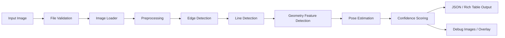
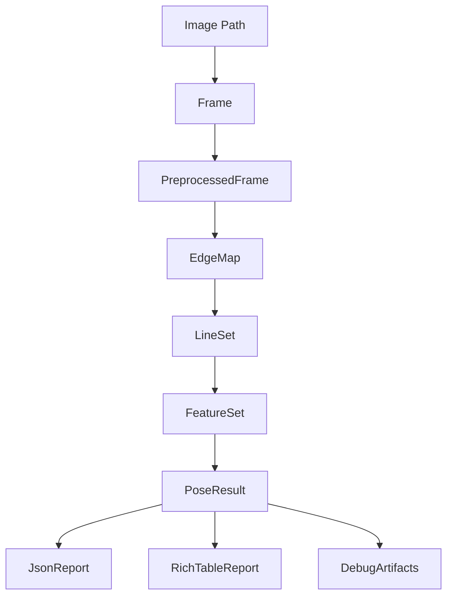

# System Design Breakdown

## 1. 文件目的

本文件定義本專案的系統設計與資料流。

本專案已由原本的 **EXIF / metadata 讀取工具**，轉向為：

> 從單張影像內容中的幾何特徵估計 yaw / pitch / roll 的 Visual Pose Estimation System。

因此系統設計的核心不再只是讀取 metadata，而是要建立一條完整的影像幾何分析 pipeline：

```text
Input Image
-> Validation
-> Image Loading
-> Preprocessing
-> Edge Detection
-> Line Detection
-> Geometry Feature Detection
-> Pose Estimation
-> Confidence Scoring
-> Output
```

---

## 2. 系統設計目標

本系統設計需要滿足以下目標：

1. 支援單張照片輸入。
2. 從影像內容估計 yaw、pitch、roll。
3. 使用幾何特徵法，而不是以深度學習為第一優先。
4. 保留原本專案中的 CLI、檔案驗證、JSON 與 Rich Table 輸出能力。
5. 新增影像前處理、幾何特徵偵測、姿態估計與 debug visualization。
6. 保留未來擴充到影片與即時鏡頭的能力。
7. 架構上結合 Lightweight DDD + Bounded Context，避免模組責任混雜。

---

## 3. 系統 Pipeline 總覽



---

## 4. 舊專案可保留的部分

原專案主要功能是讀取照片 EXIF / metadata，並輸出相機、鏡頭、曝光、GPS 與方向資訊。

雖然主題已經改成幾何姿態估計，但以下部分仍可保留：

| 原有能力 | 是否保留 | 新專案用途 |
|---|---:|---|
| CLI 入口 | 保留 | 作為輸入圖片與輸出格式控制入口 |
| 檔案存在檢查 | 保留 | 驗證輸入 image path |
| 副檔名驗證 | 保留 | 限制 jpg / jpeg / png 等格式 |
| Pillow / pillow-heif 開圖流程 | 部分保留 | 可作為 image loader 的一部分 |
| JSON 輸出 | 保留 | 輸出 PoseResult |
| Rich Table 輸出 | 保留 | 顯示 yaw / pitch / roll 與 confidence |
| FOV 計算基礎 | 保留 | 可輔助 pitch / yaw 幾何估計 |
| EXIF Reader | 降為輔助 | 不再是主流程核心，可輔助取得焦距或方向資訊 |

---

## 5. 需要新增或重構的部分

新主題需要新增以下能力：

| 新能力 | 說明 |
|---|---|
| Preprocessing Pipeline | 將影像轉為適合幾何分析的形式 |
| Edge Detection | 偵測影像邊緣，支援直線偵測 |
| Line Detection | 偵測主要線段與結構線 |
| Vertical Line Detection | 偵測垂直線，用於 roll / pitch 輔助 |
| Horizon Detection | 偵測地平線，用於 roll / pitch |
| Vanishing Point Detection | 偵測消失點，用於 yaw / pitch |
| Pose Estimation | 根據特徵估計 yaw / pitch / roll |
| Confidence Scoring | 評估結果可靠度 |
| Debug Visualization | 輸出 edges、lines、horizon、VP、overlay 等圖 |
| Validation Framework | 建立測試與評估流程 |

---

## 6. 主要模組設計

建議系統拆成以下主要模組：

```text
src/
├── app/
│   ├── cli.py
│   └── pipeline.py
│
├── contexts/
│   ├── input/
│   ├── preprocessing/
│   ├── geometry_features/
│   ├── pose_estimation/
│   ├── output/
│   └── evaluation/
│
└── shared/
    ├── errors.py
    ├── types.py
    └── math_utils.py
```

---

## 7. Application Layer

### 7.1 責任

Application Layer 負責串接整個 pipeline。

它不應該直接實作影像處理演算法，而是負責：

- 讀取 CLI 參數
- 呼叫各 Context service
- 控制 pipeline 執行順序
- 收集結果
- 呼叫輸出層

---

### 7.2 建議檔案

```text
src/app/cli.py
src/app/pipeline.py
```

---

### 7.3 Pipeline Orchestrator 流程

```text
parse CLI arguments
-> load input image as Frame
-> run preprocessing
-> detect geometry features
-> estimate pose
-> calculate confidence
-> export result
```

---

## 8. Input Module Design

### 8.1 目標

Input Module 負責將使用者輸入的圖片路徑轉成標準化的 `Frame`。

---

### 8.2 輸入

```text
image_path
```

---

### 8.3 輸出

```text
Frame
```

---

### 8.4 主要功能

- 檢查檔案是否存在
- 檢查副檔名是否合法
- 讀取圖片
- 取得圖片基本資訊
- 建立 Frame 物件

---

### 8.5 未來擴充

Input Module 不應只綁定單張圖片，未來應可擴充：

- VideoSource
- CameraSource

---

## 9. Preprocessing Module Design

### 9.1 目標

將原始影像轉換為適合幾何特徵偵測的形式。

---

### 9.2 輸入

```text
Frame
PreprocessConfig
```

---

### 9.3 輸出

```text
PreprocessedFrame
EdgeMap
```

---

### 9.4 主要處理

- resize
- grayscale
- denoise
- contrast enhancement
- Canny edge detection

---

### 9.5 Debug 輸出

可輸出：

```text
01_input.png
02_grayscale.png
03_edges.png
```

---

## 10. Geometry Feature Module Design

### 10.1 目標

從前處理結果中偵測可用於姿態估計的幾何特徵。

---

### 10.2 輸入

```text
PreprocessedFrame
EdgeMap
```

---

### 10.3 輸出

```text
FeatureSet
```

---

### 10.4 需要偵測的特徵

| 特徵 | 用途 |
|---|---|
| edges | 支援後續線段偵測 |
| lines | 支援 roll、horizon、VP |
| vertical lines | 支援 roll、pitch |
| horizon | 支援 roll、pitch |
| vanishing point | 支援 yaw、pitch |

---

### 10.5 主要服務

```text
line_detector.py
vertical_line_detector.py
horizon_detector.py
vanishing_point_detector.py
feature_set_builder.py
```

---

### 10.6 Debug 輸出

可輸出：

```text
04_lines.png
05_vertical_lines.png
06_horizon.png
07_vanishing_point.png
```

---

## 11. Pose Estimation Module Design

### 11.1 目標

根據 FeatureSet 估計 yaw / pitch / roll。

---

### 11.2 輸入

```text
FeatureSet
CameraModel
```

---

### 11.3 輸出

```text
PoseResult
```

---

### 11.4 子模組

```text
roll_estimator.py
pitch_estimator.py
yaw_estimator.py
confidence_scorer.py
pose_estimator.py
```

---

### 11.5 姿態估計策略

| 角度 | 初版策略 |
|---|---|
| roll | 根據地平線傾斜角或垂直線偏移角 |
| pitch | 根據地平線相對畫面中心的上下位置 |
| yaw | 根據消失點相對畫面中心的左右偏移 |

---

### 11.6 PoseResult 結構

```json
{
  "yaw": 12.4,
  "pitch": -6.8,
  "roll": 1.9,
  "unit": "degree",
  "confidence": 0.78,
  "method": "geometry_based_estimation",
  "features_used": ["lines", "horizon", "vanishing_point", "vertical_lines"]
}
```

---

## 12. Output Module Design

### 12.1 目標

將 PoseResult 與 debug artifacts 輸出成使用者可讀格式。

---

### 12.2 輸入

```text
PoseResult
FeatureSet
DebugArtifacts
```

---

### 12.3 輸出

```text
JSON
Rich Table
Debug Images
Pose Overlay
```

---

### 12.4 主要服務

```text
json_writer.py
rich_table_writer.py
debug_visualizer.py
overlay_renderer.py
```

---

## 13. Evaluation Module Design

### 13.1 目標

建立可量化驗證系統，確認 yaw / pitch / roll 估計是否合理。

---

### 13.2 輸入

```text
PoseResult
GroundTruthPose
```

---

### 13.3 輸出

```text
MetricsReport
```

---

### 13.4 評估方法

- synthetic rotation test
- manually labeled image test
- batch evaluation
- failure case analysis

---

### 13.5 評估指標

- MAE
- RMSE
- Success Rate
- Confidence Calibration

---

## 14. 資料流設計

### 14.1 標準資料流

```text
Image Path
-> Frame
-> PreprocessedFrame
-> EdgeMap
-> FeatureSet
-> PoseResult
-> JsonReport / RichTableReport / DebugArtifacts
```

---

### 14.2 Mermaid 資料流圖



---

## 15. Future Extension Design

本系統未來會從單張照片擴充到：

1. 影片
2. 即時鏡頭

因此設計上需要避免把 pipeline 寫死成只支援 image path。

---

### 15.1 影片版本

影片版本會將 video 切成 frame，並對每一幀執行單張影像 pipeline。

```text
VideoSource
-> Frame Sequence
-> PoseResult per Frame
-> Temporal Smoothing
-> Pose Timeline
```

可能新增技術：

- frame sampling
- temporal smoothing
- moving average
- Kalman filter
- optical flow

---

### 15.2 即時鏡頭版本

即時鏡頭版本會從 camera stream 持續讀取 frame，並即時輸出姿態結果。

```text
CameraSource
-> Realtime Frame
-> Lightweight Pose Pipeline
-> Realtime Overlay
```

可能新增技術：

- OpenCV VideoCapture
- FPS control
- threading / queue
- realtime overlay
- low-latency processing

---

## 16. 建議專案目錄結構

```text
src/
├── app/
│   ├── cli.py
│   └── pipeline.py
│
├── contexts/
│   ├── input/
│   │   ├── domain/
│   │   │   ├── frame.py
│   │   │   └── source_spec.py
│   │   ├── services/
│   │   │   └── image_loader.py
│   │   └── adapters/
│   │       ├── image_source.py
│   │       ├── video_source.py
│   │       └── camera_source.py
│   │
│   ├── preprocessing/
│   │   ├── domain/
│   │   │   ├── preprocess_config.py
│   │   │   └── edge_map.py
│   │   └── services/
│   │       ├── preprocessor.py
│   │       └── edge_detector.py
│   │
│   ├── geometry_features/
│   │   ├── domain/
│   │   │   ├── line_segment.py
│   │   │   ├── horizon_line.py
│   │   │   ├── vanishing_point.py
│   │   │   └── feature_set.py
│   │   └── services/
│   │       ├── line_detector.py
│   │       ├── vertical_line_detector.py
│   │       ├── horizon_detector.py
│   │       └── vanishing_point_detector.py
│   │
│   ├── pose_estimation/
│   │   ├── domain/
│   │   │   ├── camera_model.py
│   │   │   ├── pose_result.py
│   │   │   └── confidence_score.py
│   │   └── services/
│   │       ├── roll_estimator.py
│   │       ├── pitch_estimator.py
│   │       ├── yaw_estimator.py
│   │       └── pose_estimator.py
│   │
│   ├── output/
│   │   ├── domain/
│   │   │   ├── json_report.py
│   │   │   └── debug_artifact.py
│   │   └── services/
│   │       ├── json_writer.py
│   │       ├── rich_table_writer.py
│   │       └── debug_visualizer.py
│   │
│   └── evaluation/
│       ├── domain/
│       │   ├── ground_truth_pose.py
│       │   └── metrics_report.py
│       └── services/
│           └── evaluator.py
│
└── shared/
    ├── errors.py
    ├── types.py
    └── math_utils.py
```

---

## 17. 分階段實作對應

| 階段文件 | 系統設計重點 |
|---|---|
| `stage_0_3_foundation_and_roll.md` | 建立基礎架構、輸入、前處理、線段偵測、roll |
| `stage_4_7_pose_integration_and_debug.md` | 加入 pitch、yaw、PoseResult、confidence、debug output |
| `stage_8_10_validation_video_realtime.md` | 建立驗證框架，擴充影片與即時鏡頭 |

---

## 18. 設計限制與風險

### 18.1 單張影像限制

單張影像缺少完整 3D 資訊，因此 yaw / pitch / roll 的估計不一定唯一。

系統應允許：

- 輸出低 confidence
- 部分角度輸出 null
- 在 debug report 中說明特徵不足

---

### 18.2 場景限制

以下情況可能導致估計失敗：

- 沒有明顯直線
- 沒有地平線
- 沒有消失點
- 自然場景過多
- 魚眼或廣角變形嚴重
- 場景不符合 Manhattan World assumption

---

### 18.3 架構限制

初版不應過度設計。

本專案目前採用 Lightweight DDD，不強制使用：

- Aggregate
- Repository
- Domain Event
- CQRS
- Event Sourcing

---

## 19. 完成條件

本系統設計完成後，應能清楚回答：

1. 影像如何從 input path 進入系統？
2. 哪個模組負責影像前處理？
3. 哪個模組負責偵測幾何特徵？
4. 哪個模組負責估計 yaw / pitch / roll？
5. 哪個模組負責輸出 JSON / Rich Table / debug image？
6. 舊專案哪些部分可以保留？
7. 未來如何擴充到影片與即時鏡頭？
8. 各 Bounded Context 的責任是否清楚分離？
