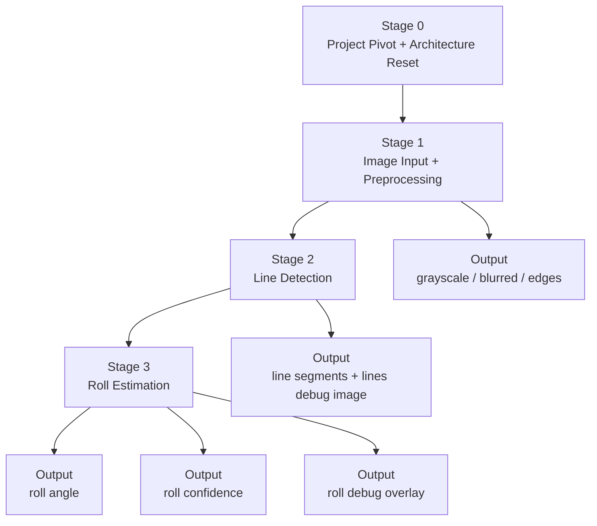

# Stage 0–3：Foundation and Roll Estimation

## 1. 文件目的

本文件定義 Visual Pose Estimation 專案第一階段的實作 breakdown。此階段的重點是把原本以 EXIF / metadata 讀取為主的 Python CLI 工具，正式轉向「從影像內容估計 yaw / pitch / roll」的專案，並先完成第一個可驗證的姿態角度：**roll**。

Stage 0–3 不追求一次完成完整姿態估計，而是先建立穩定的單張影像輸入、前處理、直線偵測與 roll estimation 管線。

---

## 2. 階段總目標

> 建立單張照片的基礎幾何分析管線，從輸入影像取得邊緣與直線特徵，並根據主要水平線或垂直線估計畫面的 roll angle。

---

## 3. 階段範圍

本階段包含：

1. Stage 0：Project Pivot + Architecture Reset
2. Stage 1：Image Input + Preprocessing
3. Stage 2：Line Detection
4. Stage 3：Roll Estimation

主要涉及的 Bounded Context：

- Input Context
- Preprocessing Context
- Geometry Feature Context
- Pose Estimation Context
- Output Context 的初步 debug image 輸出

本階段暫不處理：

- Pitch Estimation
- Yaw Estimation
- Horizon Detection 的完整流程
- Vanishing Point Estimation
- Video Input
- Realtime Camera Input
- 完整 Evaluation Framework

---

## 4. Mermaid 階段流程



---

# Stage 0：Project Pivot + Architecture Reset

## 0.1 目標

將專案主題從：

> EXIF / metadata reader

正式轉換為：

> Geometry-based Visual Pose Estimation from Single Image

也就是從單張照片的影像內容中估計 yaw、pitch、roll。但本階段只先完成 roll。

## 0.2 輸入

- 既有 Python CLI 專案
- 既有 image validation
- 既有 image loading
- 既有 Rich Table / JSON output
- 既有 EXIF / metadata reader
- 既有 FOV 計算基礎與姿態 placeholder

## 0.3 處理內容

### 保留舊功能

- CLI entry point
- 檔案路徑輸入
- 副檔名驗證
- 檔案存在驗證
- Pillow / pillow-heif 讀圖基礎
- JSON output
- Rich Table output
- debug output directory 概念
- FOV 計算基礎

### 降低 EXIF 的核心地位

EXIF 不再是主流程核心，只作為輔助資訊，例如：

- FocalLength
- 35mm equivalent focal length
- ImageWidth
- ImageHeight
- Orientation
- GPSImgDirection

姿態估計主流程應以影像幾何特徵為主。

### 新增核心模組方向

- input
- preprocessing
- geometry_features
- pose_estimation
- output
- evaluation

## 0.4 輸出

- 更新後的專案主題描述
- 新的 module boundary
- 新的 pipeline skeleton
- 初步 CLI command 設計

## 0.5 完成條件

- README 或 breakdown 文件已明確說明新主題為 visual pose estimation
- 主流程不再以 metadata reader 作為唯一核心
- 已建立影像前處理、幾何特徵、姿態估計的模組邊界
- CLI 仍可接受單張圖片路徑作為輸入

---

# Stage 1：Image Input + Preprocessing

## 1.1 目標

建立穩定的單張圖片輸入與基本前處理流程。此階段目標不是估計角度，而是把原始影像轉換成後續幾何特徵偵測可使用的資料。

## 1.2 Related Bounded Contexts

### Input Context

負責：

- 圖片來源
- 檔案驗證
- 讀取影像
- 轉換成 Frame

### Preprocessing Context

負責：

- resize
- grayscale
- denoise
- contrast enhancement
- edge detection

## 1.3 輸入

- 一張照片
- 支援格式：jpg、jpeg、png
- 未來可擴充 heic

## 1.4 處理步驟

1. Validate Image Path：檢查檔案存在、是否為檔案、副檔名是否合法。
2. Load Image：讀取影像並統一為內部格式，例如 RGB / BGR / numpy array / Frame object。
3. Resize：降低運算量並統一 debug output 尺寸，同時保留原始寬高與縮放比例。
4. Grayscale：轉成灰階，供 edge detection 使用。
5. Denoise：初版建議使用 Gaussian Blur。
6. Edge Detection：初版建議使用 Canny Edge Detection。

## 1.5 輸出

- Frame
- PreprocessedFrame
- GrayscaleFrame
- EdgeMap
- Debug images：
  - `01_input.png`
  - `02_grayscale.png`
  - `03_blurred.png`
  - `04_edges.png`

## 1.6 完成條件

- CLI 能讀取單張圖片
- 系統能穩定產生 edge map
- debug 目錄能輸出前處理結果
- 不同尺寸圖片都能被處理
- 錯誤圖片路徑能產生清楚錯誤訊息

---

# Stage 2：Line Detection

## 2.1 目標

從 EdgeMap 中偵測出主要線段，並輸出可供 roll estimation 使用的 LineSegment 集合。

## 2.2 Related Bounded Contexts

### Geometry Feature Context

負責：

- line detection
- line filtering
- line representation
- line debug visualization

## 2.3 輸入

- EdgeMap
- PreprocessedFrame
- image width / height
- line detection config

## 2.4 可使用技術

初版建議：

- Probabilistic Hough Transform

未來可替換或擴充：

- Standard Hough Transform
- Line Segment Detector, LSD
- EDLines
- RANSAC Line Fitting

## 2.5 處理步驟

1. Run Line Detector：從 edge map 偵測候選線段。
2. Filter Short Lines：移除太短線段，避免雜訊影響主方向判斷。
3. Calculate Line Angle：每條線段計算 angle、length、midpoint、orientation type。
4. Classify Line Orientation：初步分為 near-horizontal、near-vertical、diagonal、unknown。
5. Debug Visualization：將偵測到的線段畫回原圖或前處理影像。

## 2.6 LineSegment 建議格式

```json
{
  "x1": 10,
  "y1": 50,
  "x2": 200,
  "y2": 55,
  "length": 190.1,
  "angle_deg": 1.5
}
```

## 2.7 輸出

- LineSegment list
- LineFeatureSet
- Debug images：
  - `05_detected_lines.png`
  - `06_filtered_lines.png`
  - `07_line_orientation_debug.png`

## 2.8 完成條件

- 可在建築、道路、室內場景中偵測出明顯線段
- 可過濾短小雜訊線段
- 每條線段有清楚的角度與長度資訊
- debug image 能看出哪些線被保留、哪些線被忽略

---

# Stage 3：Roll Estimation

## 3.1 目標

根據 Stage 2 偵測到的線段，估計畫面的 roll angle。

Roll 是本專案第一個可交付的姿態角度，因為它最容易透過水平線或垂直線驗證。

## 3.2 Related Bounded Contexts

### Pose Estimation Context

負責：

- 根據 LineFeatureSet 估計 roll
- 計算 roll confidence
- 輸出 RollEstimate

## 3.3 輸入

- LineSegment list
- near-horizontal lines
- near-vertical lines
- image width / height
- optional debug config

## 3.4 核心直覺

Roll 代表畫面是否歪斜。可使用兩種來源估計：

1. 水平線偏離水平的角度
2. 垂直線偏離垂直的角度

## 3.5 處理步驟

1. Select Candidate Lines：篩選 near-horizontal lines 與 near-vertical lines。
2. Weight Lines：根據線段長度、方向穩定性、位置給權重。
3. Estimate Dominant Orientation：可使用 weighted median、weighted mean 或 orientation histogram。
4. Calculate Roll Angle：水平線角度可近似 roll，垂直線需換算成相對垂直方向的偏移。
5. Calculate Confidence：根據候選線段數量、總長度、主方向集中程度、水平線與垂直線一致性計算。
6. Generate Debug Overlay：輸出候選線、主方向、roll angle 與 confidence。

## 3.6 輸出

```json
{
  "roll": 2.4,
  "unit": "degree",
  "confidence": 0.72,
  "method": "line_orientation_based_roll_estimation",
  "features_used": [
    "lines",
    "near_horizontal_lines",
    "near_vertical_lines"
  ]
}
```

Debug images：

- `08_roll_candidate_lines.png`
- `09_roll_orientation_histogram.png`
- `10_roll_overlay.png`

## 3.7 完成條件

- 對人工旋轉過的圖片，roll 估計會有合理變化
- 對沒有明顯直線的圖片，confidence 會下降
- 可輸出 roll value、confidence 與 debug image
- 不會因為偵測不到線段而程式崩潰
- 系統能輸出部分 PoseResult，例如 yaw / pitch 為 null，roll 有值

---

# 5. Stage 0–3 最終輸出格式

```json
{
  "image": "sample.jpg",
  "yaw": null,
  "pitch": null,
  "roll": 2.4,
  "unit": "degree",
  "confidence": 0.72,
  "method": "geometry_based_partial_pose_estimation",
  "stage": "stage_0_3_foundation_and_roll",
  "features_used": [
    "edges",
    "lines"
  ],
  "debug_artifacts": {
    "edges": "debug/04_edges.png",
    "lines": "debug/06_filtered_lines.png",
    "roll_overlay": "debug/10_roll_overlay.png"
  }
}
```

---

# 6. 本階段不處理的事項

- yaw estimation
- pitch estimation
- horizon detection 完整流程
- vanishing point estimation
- video processing
- realtime camera processing
- full benchmark evaluation
- deep learning based pose estimation

---

# 7. 給 LM Coding Agent 的實作提示

```yaml
task_name: implement_stage_0_3_foundation_and_roll
role: Python OpenCV 工程師
goal: >
  將目前的 EXIF / metadata reader 專案轉向 visual pose estimation，
  並完成 Stage 0–3：圖片輸入、前處理、直線偵測與 roll estimation。
scope:
  include:
    - 保留 CLI、檔案驗證、圖片讀取、JSON / Rich Table 輸出能力
    - 新增 preprocessing pipeline
    - 新增 Canny edge detection
    - 新增 line detection
    - 新增 roll estimation
    - 新增 debug image output
  exclude:
    - yaw estimation
    - pitch estimation
    - video input
    - realtime camera input
    - deep learning model
bounded_contexts:
  - Input Context
  - Preprocessing Context
  - Geometry Feature Context
  - Pose Estimation Context
  - Output Context
acceptance_criteria:
  - CLI 可輸入單張圖片
  - 系統可輸出 edge map
  - 系統可輸出 detected lines image
  - 系統可輸出 roll angle 與 confidence
  - 若無法估計 roll，應輸出 null 或低 confidence，而不是崩潰
```

---

# 8. 下一階段銜接

Stage 0–3 完成後，下一階段進入：

> Stage 4–7：Pose Integration and Debug

下一階段會新增：

- Horizon Detection
- Pitch Estimation
- Vanishing Point Detection
- Yaw Estimation
- PoseResult 整合
- Confidence Scoring
- 完整 Debug Visualization
