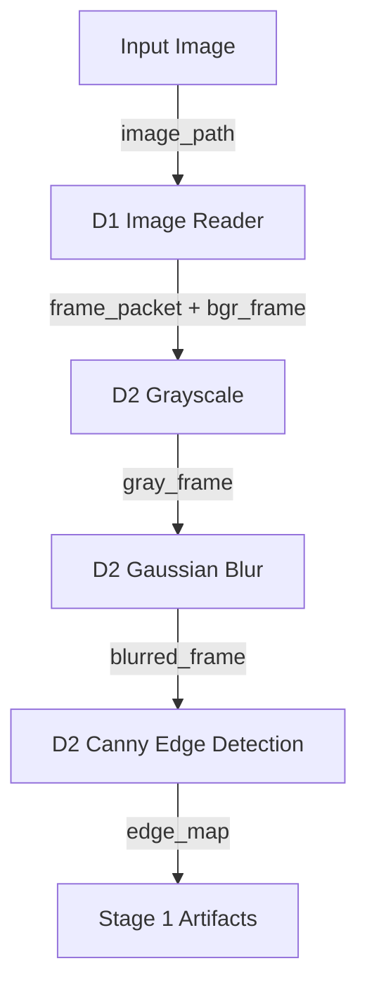
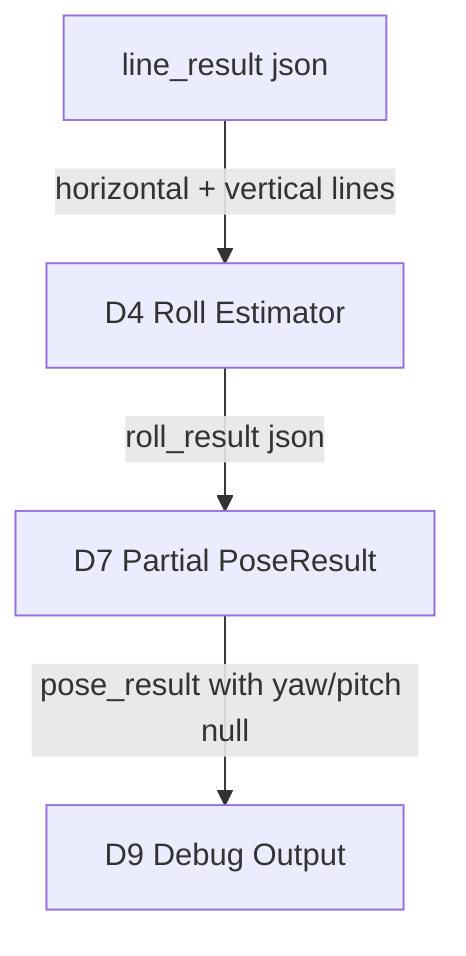

# Stage 0-3: Foundation and Roll Estimation

## 1. 目標

Stage 0-3 建立 Geometry Based Pose 的第一個可交付 baseline：單張圖片輸入、前處理、線段偵測、roll estimation 與 debug artifacts。

此階段只要求 roll 穩定，不處理完整 pitch / yaw。

## 2. Stage / Module 對應

| Stage | 覆蓋模組 | 目標 |
|---|---|---|
| Stage 0 | D1-D10 skeleton | 建立主題、資料合約與模組邊界 |
| Stage 1 | D1, D2 | Image input + preprocessing |
| Stage 2 | D3 | Line detection + orientation classification |
| Stage 3 | D4, D7-D9 | Roll estimation + partial PoseResult + debug output |

## 3. Stage 0: Project Skeleton

輸出：

```text
src/app/pipeline.py
src/contexts/input/
src/contexts/preprocessing/
src/contexts/geometry_features/
src/contexts/pose_estimation/
src/contexts/output/
```

驗收：

- CLI 仍可接受 `image_path`。
- 主流程以 geometry-based pose 為核心。
- EXIF / metadata 降為輔助資訊，不是姿態主流程。

## 4. Stage 1: Image Input + Preprocessing



輸出：

```text
debug/01_input.png
debug/02_grayscale.png
debug/03_blurred.png
debug/04_edges.png
```

驗收：

- 合法圖片可成功讀取。
- 錯誤路徑不造成 crash。
- 可產生 gray / blurred / edge map。

## 5. Stage 2: Line Detection

```mermaid
flowchart TD
    A[edge_map] -->|ndarray| B[D3 HoughLinesP]
    B -->|raw LineSegment[]| C[D3 Line Filtering]
    C -->|filtered LineSegment[]| D[D3 Orientation Classification]
    D -->|line_result json| E[Stage 2 Artifacts]
```

輸出：

```text
debug/05_detected_lines.png
debug/06_filtered_lines.png
debug/07_line_orientation_debug.png
```

驗收：

- 可在道路、建築、室內等場景偵測線段。
- 每條線段包含端點、長度、角度與方向分類。
- 可過濾短小雜訊線段。

## 6. Stage 3: Roll Estimation



輸出：

```text
debug/08_roll_candidate_lines.png
debug/09_roll_orientation_histogram.png
debug/10_roll_overlay.png
pose_result.json
```

Partial result：

```json
{
  "yaw": null,
  "pitch": null,
  "roll": 2.4,
  "unit": "degree",
  "confidence": 0.72,
  "method": "geometry_based_partial_pose_estimation",
  "features_used": ["edges", "lines"],
  "warnings": []
}
```

驗收：

- Synthetic rotation 圖片會產生合理 roll 變化。
- 線段不足時輸出 low confidence 或 null。
- 不處理 yaw / pitch，但 output schema 已支援 partial result。

