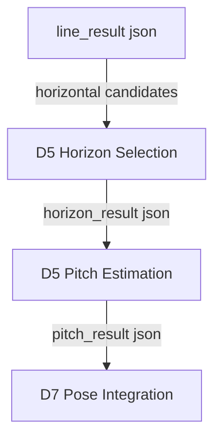
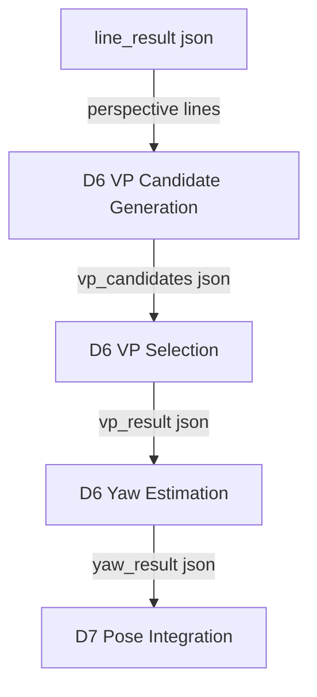

# Stage 4-7: Pose Integration and Debug

## 1. 目標

Stage 4-7 在 Stage 0-3 的 line / roll baseline 上加入 horizon、pitch、vanishing point、yaw、PoseResult、confidence 與完整 debug output。

## 2. Stage / Module 對應

| Stage | 覆蓋模組 | 目標 |
|---|---|---|
| Stage 4 | D5 | Horizon detection + pitch estimation |
| Stage 5 | D6 | Vanishing point detection + yaw estimation |
| Stage 6 | D7, D8 | PoseResult + confidence |
| Stage 7 | D9 | Debug visualization + JSON / Rich Table |

## 3. Stage 4: Horizon + Pitch



初版公式：

```text
pitch = atan((center_y - horizon_y) / focal_length_pixels)
```

輸出：

```text
debug/11_horizon_candidates.png
debug/12_selected_horizon.png
debug/13_pitch_overlay.png
```

驗收：

- 地平線明顯時可輸出 pitch。
- horizon 不可靠時 pitch confidence 下降。
- pitch 失敗不影響 roll。

## 4. Stage 5: Vanishing Point + Yaw



初版公式：

```text
yaw = atan((vp_x - center_x) / focal_length_pixels)
```

輸出：

```text
debug/14_perspective_lines.png
debug/15_vanishing_point_candidates.png
debug/16_selected_vanishing_point.png
debug/17_yaw_overlay.png
```

驗收：

- 透視明顯場景可輸出 yaw。
- VP 候選不足時 yaw 為 null 或 low confidence。
- yaw 失敗不影響 roll / pitch。

## 5. Stage 6: PoseResult + Confidence

輸出 schema：

```json
{
  "image": "sample.jpg",
  "yaw": 10.8,
  "pitch": -5.6,
  "roll": 2.4,
  "unit": "degree",
  "confidence": 0.64,
  "method": "geometry_based_pose_estimation",
  "features_used": ["edges", "lines", "horizon", "vanishing_point"],
  "angle_confidence": {
    "yaw": 0.58,
    "pitch": 0.66,
    "roll": 0.72
  },
  "warnings": []
}
```

Confidence 來源：

- line count / line length。
- horizon support。
- VP support。
- angle sanity check。
- fallback camera model 使用狀態。

## 6. Stage 7: Debug Visualization + Output

輸出：

```text
debug/18_pose_overlay.png
pose_result.json
Rich Table
```

驗收：

- JSON 可序列化 null 與 partial result。
- Rich Table 顯示 yaw / pitch / roll / confidence / warnings。
- Debug artifacts 路徑可追溯。
- Final overlay 可看到估計線索與姿態結果。

