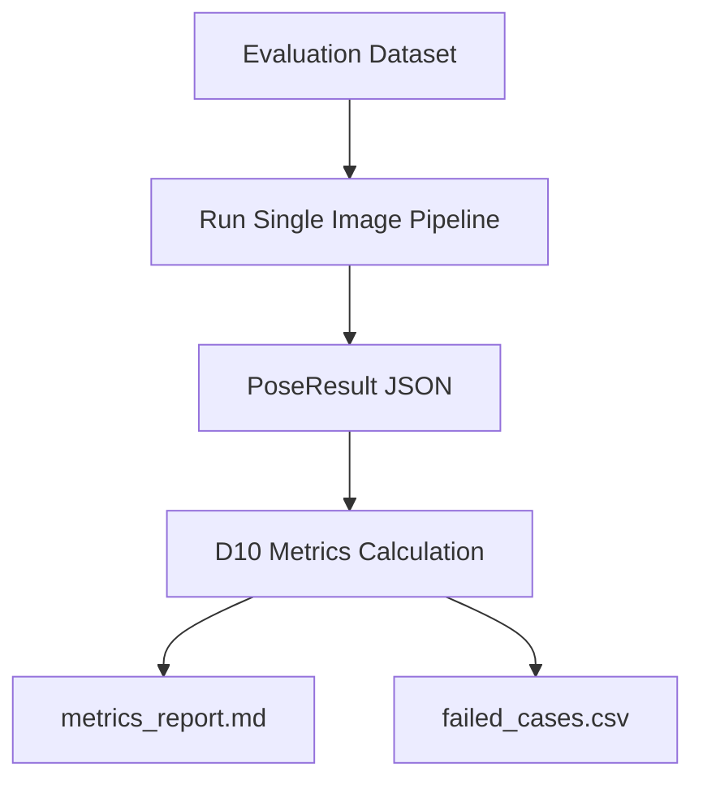
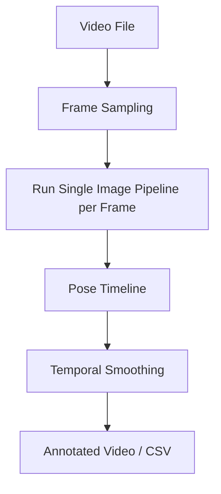
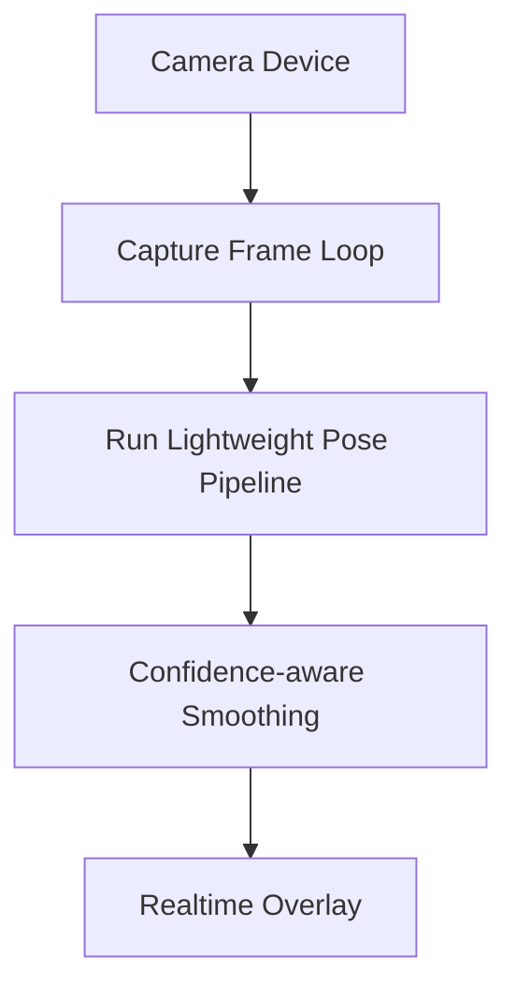

# Stage 8-10: Validation, Video, Realtime Extension

## 1. 目標

Stage 8-10 建立驗證框架，並保留從單張圖片擴充到影片與即時鏡頭的路線。這些 stage 不改變單張圖片核心 pipeline，而是包在外層執行與評估。

## 2. Stage / Module 對應

| Stage | 覆蓋模組 | 目標 |
|---|---|---|
| Stage 8 | D10 | Validation framework |
| Stage 9 | D1 extension, D7-D9 | Video frame sequence + pose timeline |
| Stage 10 | D1 extension, D7-D9 | Realtime camera + overlay |

## 3. Stage 8: Validation Framework



輸出：

```text
outputs/geometry_pose/evaluation/metrics_summary.json
outputs/geometry_pose/evaluation/pose_results.csv
outputs/geometry_pose/evaluation/failed_cases.csv
outputs/geometry_pose/evaluation/metrics_report.md
```

驗收：

- 可批次執行圖片資料集。
- 可讀取 labels.csv。
- 可計算 yaw / pitch / roll 的 MAE / RMSE / success rate。
- 不因單張圖片失敗中斷整批驗證。

## 4. Stage 9: Video Extension



輸出：

```text
outputs/geometry_pose/video/frame_pose_results.json
outputs/geometry_pose/video/pose_timeline.csv
outputs/geometry_pose/video/annotated_video.mp4
```

驗收：

- 可讀取影片並抽幀。
- 單幀失敗不停止整段影片。
- 可輸出 pose timeline。
- 可做基本 smoothing。

## 5. Stage 10: Realtime Camera Extension



輸出：

```text
realtime display window
optional pose_log.csv
optional screenshots
optional recording video
```

驗收：

- 可開啟 webcam。
- 可即時顯示 yaw / pitch / roll。
- 特徵不足時不崩潰。
- 可用鍵盤結束。

