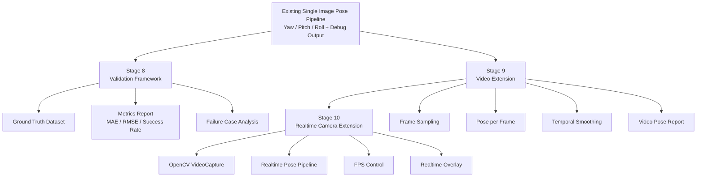
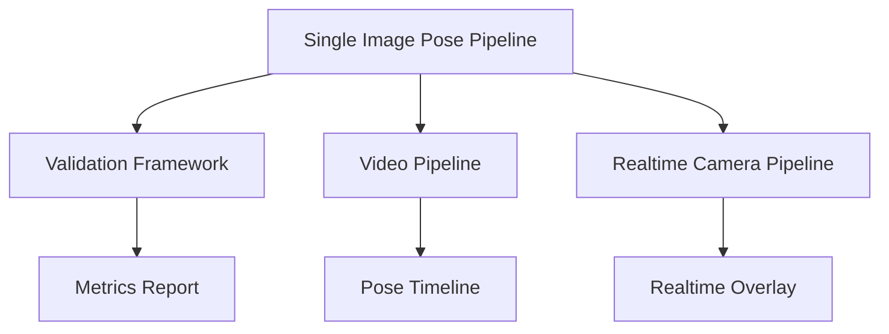

# Stage 8–10：Validation, Video and Realtime Extension

## 1. 文件目的

本文件定義 Visual Pose Estimation 專案第三階段的實作 breakdown。

Stage 0–3 已完成基礎影像管線與 roll estimation。Stage 4–7 已完成 pitch、yaw、PoseResult、confidence scoring 與 debug output。Stage 8–10 的目標是建立系統驗證框架，並將單張圖片的姿態估計流程擴充到 **影片** 與 **即時鏡頭畫面**。

---

## 2. 階段總目標

> 建立可量化驗證機制，確認 yaw / pitch / roll 估計結果的可靠性，並將單張影像 pipeline 擴充到 video 與 realtime camera input。

---

## 3. 階段範圍

本階段包含：

1. Stage 8：Validation Framework
2. Stage 9：Video Extension
3. Stage 10：Realtime Camera Extension

主要涉及的 Bounded Context：

- Evaluation Context
- Input Context
- Output Context
- Pose Estimation Context
- Application Pipeline

本階段暫不處理：

- Deep Learning model training
- 完整 camera calibration 工具
- 多鏡頭同步
- SLAM
- 3D reconstruction
- IMU sensor fusion

---

## 4. Mermaid 階段流程



---

# Stage 8：Validation Framework

## 8.1 目標

建立驗證框架，用來量化 yaw / pitch / roll 的估計效果。

本階段的目的不是新增姿態估計方法，而是回答：

> 系統估得準不準？在哪些場景可靠？在哪些場景容易失敗？confidence 是否可信？

## 8.2 Related Bounded Contexts

### Evaluation Context

負責：

- test case management
- ground truth pose
- prediction collection
- metrics calculation
- failure case report

### Output Context

負責：

- metrics report output
- evaluation table
- failed case debug output

## 8.3 輸入

- 測試圖片集
- ground truth pose 標註
- PoseResult prediction
- debug artifacts
- evaluation config

## 8.4 測試資料類型

### Synthetic Rotation Test

主要驗證 roll。

方法：

- 選擇一張原始圖片
- 人工旋轉 5°、10°、-5°、-10°
- 系統估計 roll
- 比較 prediction 與 synthetic ground truth

優點：ground truth 明確、容易建立、適合測試 roll estimation。

限制：主要驗證 roll，不適合完整驗證 yaw / pitch。

### Manual Label Test

人工標註少量圖片的 yaw / pitch / roll 近似值。

適合：

- pitch
- yaw
- 不同場景的人工檢查

限制：標註主觀、精度有限，適合作為初版 sanity check。

### Scene Category Test

依照場景分類測試：

- road
- corridor
- railway
- building
- indoor
- landscape
- portrait
- cluttered scene

目的：找出哪些場景適合幾何法，以及哪些場景 confidence 應下降。

## 8.5 Metrics

### MAE

```text
MAE = mean(abs(prediction - ground_truth))
```

適合 yaw、pitch、roll。

### RMSE

```text
RMSE = sqrt(mean((prediction - ground_truth)^2))
```

適合觀察大誤差。

### Success Rate

```text
success_rate = 成功輸出角度的案例數 / 全部案例數
```

### Confidence Calibration

檢查：

- 高 confidence 是否真的比較準
- 低 confidence 是否多出現在失敗場景

## 8.6 處理步驟

1. Prepare Evaluation Dataset：建立 images、labels.csv、cases.yaml。
2. Run Batch Pose Estimation：對每張圖片執行既有 pipeline。
3. Compare with Ground Truth：計算 yaw / pitch / roll error。
4. Calculate Metrics：輸出 per-angle MAE、RMSE、success rate、confidence distribution。
5. Generate Failure Case Report：記錄特徵不足、地平線誤判、消失點不穩、場景不符合假設等案例。

## 8.7 建議資料結構

```text
data/
└── evaluation/
    ├── images/
    ├── labels.csv
    └── cases.yaml
```

## 8.8 輸出

- `evaluation_results.json`
- `metrics_report.md`
- `failed_cases.csv`
- `failure_case_debug_images/`
- metrics Rich Table

## 8.9 完成條件

- 可批次執行測試圖片
- 可讀取 ground truth label
- 可計算 yaw / pitch / roll 的 MAE 或 RMSE
- 可輸出 failed case report
- 可觀察 confidence 與實際誤差之間的關係

---

# Stage 9：Video Extension

## 9.1 目標

將單張圖片的 pose estimation pipeline 擴充到影片。

影片版本的核心不是重新設計姿態估計，而是：

> 將 video 拆成 frame，對每個 frame 執行既有單張影像 pipeline，並在時間軸上進行平滑與輸出。

## 9.2 Related Bounded Contexts

### Input Context

負責：

- VideoSource
- video file validation
- frame extraction
- frame sampling

### Pose Estimation Context

負責：

- per-frame PoseResult

### Output Context

負責：

- video pose report
- pose timeline
- annotated video output

## 9.3 輸入

- video file
- 支援格式：mp4、mov、avi
- frame sampling config
- smoothing config

## 9.4 新增概念

- VideoSource：代表影片輸入來源。
- FrameSequence：代表從影片中取出的 frame 序列。
- FramePoseResult：代表單一 frame 的姿態估計結果。
- PoseTimeline：代表影片時間軸上的 yaw / pitch / roll 序列。

## 9.5 處理步驟

1. Open Video：使用 OpenCV VideoCapture 讀取影片，取得 fps、frame count、width、height、duration。
2. Frame Sampling：支援 every frame、every N frames、fixed FPS sampling、time interval sampling。
3. Run Single Image Pipeline per Frame：對每個 frame 執行 preprocessing、geometry feature detection、pose estimation。
4. Temporal Smoothing：使用 moving average、exponential moving average、median filter 或未來的 Kalman filter。
5. Generate Video Pose Report：輸出每幀姿態、平滑後姿態、confidence timeline、failure frames。
6. Optional Annotated Video：將 yaw / pitch / roll overlay 回影片，輸出 annotated video。

## 9.6 輸出

- `frame_pose_results.json`
- `pose_timeline.csv`
- `video_metrics_summary.json`
- `annotated_video.mp4`, optional
- `sampled_frame_debug/`

## 9.7 完成條件

- 可讀取影片
- 可抽取 frame
- 可對 frame 執行既有 pose pipeline
- 可輸出 pose timeline
- 可做基本 temporal smoothing
- 單幀失敗不應中斷整段影片處理

---

# Stage 10：Realtime Camera Extension

## 10.1 目標

將單張圖片與影片 pipeline 擴充到即時鏡頭畫面。

即時版本的重點是：

- 低延遲
- 穩定顯示
- FPS 控制
- 即時 overlay
- 在特徵不足時不讓畫面閃爍或崩潰

## 10.2 Related Bounded Contexts

### Input Context

負責：

- CameraSource
- camera device selection
- frame capture

### Pose Estimation Context

負責：

- realtime per-frame pose estimation
- pose smoothing

### Output Context

負責：

- realtime overlay
- display window
- optional recording

## 10.3 輸入

- webcam index
- camera resolution
- target FPS
- realtime config
- debug display config

## 10.4 新增概念

- CameraSource：代表即時鏡頭來源。
- RealtimeFrame：代表持續輸入的即時影像幀。
- RealtimePoseState：代表目前穩定後的姿態狀態。
- RealtimeOverlay：代表即時顯示在畫面上的資訊。

## 10.5 處理步驟

1. Open Camera：使用 OpenCV VideoCapture 開啟 camera device。
2. Capture Frame Loop：持續讀取 frame、timestamp、frame index。
3. Resize for Performance：即時處理時可使用較低解析度。
4. Run Pose Pipeline：對每幀或每 N 幀執行姿態估計。
5. Realtime Smoothing：使用 exponential moving average、confidence-aware smoothing、hold-last-valid-value。
6. Draw Overlay：顯示 yaw、pitch、roll、confidence、FPS、status、feature availability。
7. Keyboard Control：支援 q quit、s screenshot、d toggle debug、r start / stop recording。

## 10.6 輸出

- realtime display window
- optional screenshots
- optional pose log csv
- optional recording video

## 10.7 完成條件

- 可開啟 webcam
- 可即時顯示畫面
- 可在畫面上 overlay yaw / pitch / roll
- FPS 不應過低
- 特徵不足時不應崩潰
- 可透過 keyboard command 結束程式

---

# 5. Stage 8–10 最終輸出格式

## 5.1 Validation Output

```json
{
  "dataset": "evaluation_set_v1",
  "num_cases": 120,
  "metrics": {
    "yaw_mae": 8.4,
    "pitch_mae": 5.2,
    "roll_mae": 2.1,
    "yaw_success_rate": 0.62,
    "pitch_success_rate": 0.74,
    "roll_success_rate": 0.88
  },
  "failure_summary": {
    "insufficient_lines": 18,
    "unstable_horizon": 10,
    "unstable_vanishing_point": 25
  }
}
```

## 5.2 Video Output

```json
{
  "video": "sample_video.mp4",
  "fps": 30,
  "sampled_frames": 300,
  "pose_timeline": "outputs/pose_timeline.csv",
  "annotated_video": "outputs/annotated_video.mp4"
}
```

## 5.3 Realtime Output

```json
{
  "source": "camera_0",
  "mode": "realtime",
  "current_pose": {
    "yaw": 8.2,
    "pitch": -4.1,
    "roll": 1.5,
    "confidence": 0.61
  },
  "fps": 18.5,
  "status": "running"
}
```

---

# 6. 本階段不處理的事項

- deep learning training
- SLAM
- 3D reconstruction
- IMU sensor fusion
- multi-camera calibration
- production deployment service
- web frontend streaming UI

---

# 7. 給 LM Coding Agent 的實作提示

```yaml
task_name: implement_stage_8_10_validation_video_realtime
role: Python OpenCV 工程師
goal: >
  在既有單張影像 yaw / pitch / roll estimation pipeline 的基礎上，
  建立 validation framework，並擴充到 video 與 realtime camera input。
scope:
  include:
    - batch evaluation
    - ground truth label loading
    - metrics report generation
    - video frame extraction
    - per-frame pose estimation
    - temporal smoothing
    - realtime webcam input
    - realtime overlay
  exclude:
    - deep learning model training
    - SLAM
    - 3D reconstruction
    - IMU fusion
bounded_contexts:
  - Evaluation Context
  - Input Context
  - Pose Estimation Context
  - Output Context
acceptance_criteria:
  - 可批次驗證圖片資料集
  - 可輸出 MAE / RMSE / success rate
  - 可讀取影片並輸出 pose timeline
  - 可對影片結果做 temporal smoothing
  - 可開啟 webcam 並即時顯示 yaw / pitch / roll
  - 單一 frame 失敗時不會中斷整體流程
```

---

# 8. 與整體專案的關係

Stage 8–10 不是用來取代單張影像 pipeline，而是建立在既有 pipeline 之上。



---

# 9. 專案完成後的能力

完成 Stage 8–10 後，系統應具備三種使用模式：

1. Single Image Mode
   - 輸入一張照片
   - 輸出 yaw / pitch / roll

2. Video Mode
   - 輸入一段影片
   - 輸出每幀姿態與時間序列

3. Realtime Camera Mode
   - 開啟 webcam
   - 即時顯示 yaw / pitch / roll

---

# 10. 下一步建議

Stage 8–10 完成後，可考慮進一步發展：

- camera calibration support
- better vanishing point clustering
- horizon segmentation
- machine learning assisted horizon detection
- benchmark dataset construction
- GUI or web-based visualization
