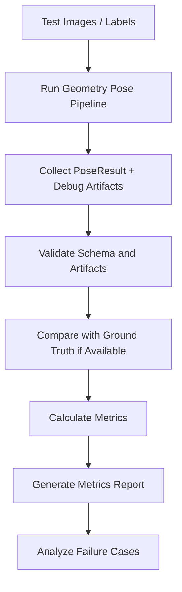

# Geometry Based Pose Verification

## Selected Metric Verification

### Test Dataset

- 單張影像：使用具備同座標定義的姿態標註；Jitter 為 N/A。
- Geometry video：逐幀結果與對齊後的 reference pose 比較。
- 有效樣本：yaw、pitch、roll 三軸都有數值。
- Dropout：不進入 Precision 分母，但保留於 Recall 分母。
- 資料切分以完整 sequence／scene 為單位，避免相鄰幀 leakage。
- OXTS absolute yaw 只有在 calibrated heading 與 `comparison_ready=true` 時才能作正式整體姿態驗證。

### Metric Definitions

| Metric | Definition | Unit |
|---|---|---|
| `Precision@θ` | `correct_valid / valid_prediction_count` | ratio |
| `Recall@θ` | `correct_valid / reference_count` | ratio |
| `Geodesic MAE` | `mean(geodesic_error_deg)` | degree |
| `P95 Error` | `percentile(geodesic_error_deg, 95)` | degree |
| `Jitter` | RMS of consecutive rotation-error changes；single image 為 N/A | degree |

correct 表示 `geodesic_error_deg <= θ`；Geometry 預設 `θ = 3.0°`。

### Evaluation Results

每次驗證從 `summary.json.selected_metrics` 記錄 Precision、Recall、Geodesic MAE、P95 Error、Jitter、有效預測數與 reference 數。同時必須記錄 `strict_pose_comparison_ready`、`diagnostic_only` 與 `comparison_warning`。

### Failure Case Analysis

- Precision 過低：檢查有效輸出中的 VP selection、horizon、sign convention 與 line support。
- Recall 過低：檢查 pose dropout、特徵不足與 confidence gate。
- Geodesic MAE 過高：先確認座標語意，再檢查 calibration、角度 wrapping 與系統性 bias。
- P95 過高：使用 `--save-worst-frames --save-plots` 分析 VP side flip 與極端場景。
- Jitter 過高：檢查相鄰幀 VP cluster 切換、horizon jump 與 smoothing lag。

## 1. 目的

本文件整理 Geometry Based Pose 的驗證入口。Verification 階段需要確認系統不只可以執行，也能在適合的幾何場景中輸出合理、可解釋、可追蹤的 yaw / pitch / roll。

## 2. Verification / Analysis 對應表

| ID | 對應 Analysis | 驗證重點 | 指標 |
|---|---|---|---|
| V1 | A1 Image Input | 合法 / 非法圖片輸入 | load success、error handling |
| V2 | A2 Preprocessing | gray / edge map 是否有效 | artifact exists、nonblank edge map |
| V3 | A3 Line Detection | line segments 是否合理 | line count、filtered line count |
| V4 | A4 Roll | synthetic rotation 是否方向與角度合理 | roll MAE |
| V5 | A5 Pitch | horizon selection 是否合理 | pitch sanity、horizon success |
| V6 | A6 Yaw | VP 是否合理且穩定 | VP support、yaw sanity |
| V7 | A7 PoseResult | partial result 與 null handling | schema validity |
| V8 | A8 Confidence | confidence 是否反映失敗 | confidence vs error |
| V9 | A9 Debug Output | artifacts 是否完整可解釋 | artifact completeness |
| V10 | A10 Evaluation | batch metrics 與 failure cases | MAE、RMSE、success rate |

## 3. 驗證流程



## 4. 必要 Metrics

| Metric | 用途 |
|---|---|
| roll MAE / RMSE | synthetic rotation 驗證 |
| pitch MAE / sanity rate | horizon / pitch 驗證 |
| yaw MAE / sanity rate | VP / yaw 驗證 |
| success rate | 各角度成功輸出比例 |
| confidence bucket error | confidence 是否可信 |
| artifact completeness | debug 圖是否齊全 |
| failure type count | 失敗原因分布 |

## 5. Output Artifacts

```text
outputs/geometry_pose/evaluation/metrics_summary.json
outputs/geometry_pose/evaluation/pose_results.csv
outputs/geometry_pose/evaluation/failed_cases.csv
outputs/geometry_pose/evaluation/metrics_report.md
outputs/geometry_pose/evaluation/failure_case_debug/
```

## 6. 延伸文件

```text
05_Verification/verification_plan.md
```
