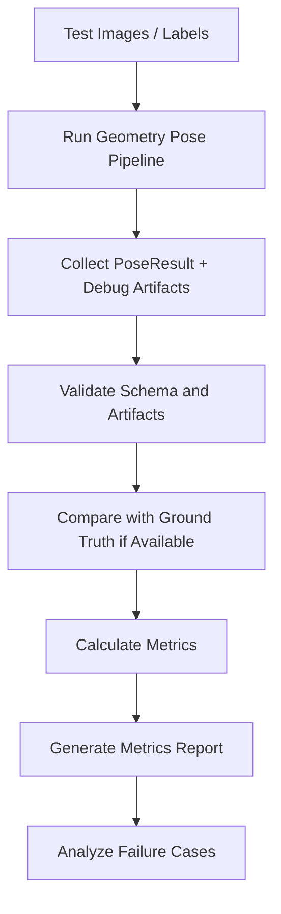

# Geometry Based Pose Verification

## 1. 目的

本文件整理 Geometry Based Pose 的驗證入口。Verification 階段需要確認系統不只可以執行，也能在適合的幾何場景中輸出合理、可解釋、可追蹤的 yaw / pitch / roll。

## 2. Verification / Analysis 對應表

| ID | 對應 Analysis | 驗證重點 | 指標 |
|---|---|---|---|
| V1 | A1 Image Input | 合法 / 非法圖片輸入 | load success、error handling |
| V2 | A2 Preprocessing | gray / edge map 是否有效 | artifact exists、nonblank edge map |
| V3 | A3 Line Detection | line segments 是否合理 | line count、filtered line count |
| V4 | A4 Roll | synthetic rotation 是否方向與角度合理 | roll MAE |
| V5 | A5 Pitch | horizon selection 是否合理 | pitch sanity、horizon success |
| V6 | A6 Yaw | VP 是否合理且穩定 | VP support、yaw sanity |
| V7 | A7 PoseResult | partial result 與 null handling | schema validity |
| V8 | A8 Confidence | confidence 是否反映失敗 | confidence vs error |
| V9 | A9 Debug Output | artifacts 是否完整可解釋 | artifact completeness |
| V10 | A10 Evaluation | batch metrics 與 failure cases | MAE、RMSE、success rate |

## 3. 驗證流程



## 4. 必要 Metrics

| Metric | 用途 |
|---|---|
| roll MAE / RMSE | synthetic rotation 驗證 |
| pitch MAE / sanity rate | horizon / pitch 驗證 |
| yaw MAE / sanity rate | VP / yaw 驗證 |
| success rate | 各角度成功輸出比例 |
| confidence bucket error | confidence 是否可信 |
| artifact completeness | debug 圖是否齊全 |
| failure type count | 失敗原因分布 |

## 5. Output Artifacts

```text
outputs/geometry_pose/evaluation/metrics_summary.json
outputs/geometry_pose/evaluation/pose_results.csv
outputs/geometry_pose/evaluation/failed_cases.csv
outputs/geometry_pose/evaluation/metrics_report.md
outputs/geometry_pose/evaluation/failure_case_debug/
```

## 6. 延伸文件

```text
05_Verification/verification_plan.md
```

