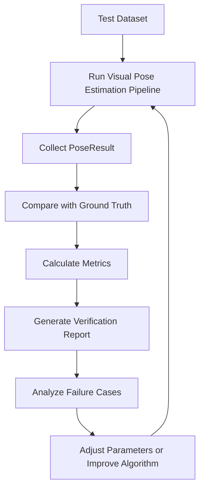

# Verification Plan

## 1. 文件目的

本文件定義 Visual Pose Estimation 專案的驗證計畫。

本專案目標是從單張照片的影像內容中，透過幾何特徵估計相機姿態角度：

- yaw
- pitch
- roll

由於單張影像本身缺少完整 3D 資訊，且不同場景的幾何特徵強弱差異很大，因此本專案不能只檢查程式是否能執行，也需要驗證：

1. 估計結果是否合理
2. 哪些場景適合估計
3. 哪些場景容易失敗
4. confidence 是否能反映結果可靠度
5. debug images 是否足以解釋系統判斷依據

---

## 2. 驗證總目標

本驗證計畫的總目標是：

> 確認系統能從影像幾何特徵中產生可解釋、可追蹤、可量化評估的 yaw / pitch / roll 結果。

驗證重點不是追求所有照片都能精準估計三個角度，而是確認系統具備以下能力：

- 能在幾何特徵明顯的照片中產生合理姿態估計
- 能在幾何特徵不足時降低 confidence 或輸出 null
- 能透過 debug artifacts 說明估計依據
- 能用 metrics 追蹤不同版本的改善程度

---

## 3. 驗證範圍

本文件驗證範圍包含：

1. 單張照片輸入驗證
2. 前處理與幾何特徵驗證
3. roll estimation 驗證
4. pitch estimation 驗證
5. yaw estimation 驗證
6. PoseResult 與 confidence 驗證
7. Debug output 驗證
8. 影片與即時鏡頭擴充的基礎驗證

本文件不包含：

- Deep Learning model training validation
- SLAM 驗證
- 3D reconstruction 驗證
- IMU sensor fusion 驗證
- Production deployment 驗證

---

## 4. Mermaid 驗證流程



---

## 5. 驗證對象

## 5.1 Input Validation

驗證項目：

- 圖片路徑是否存在
- 副檔名是否支援
- 圖片是否能成功讀取
- 圖片尺寸是否正確取得
- 錯誤輸入是否能產生清楚錯誤訊息

通過條件：

- 合法圖片可正常讀取
- 非法路徑不造成程式崩潰
- 不支援格式能回傳清楚錯誤

---

## 5.2 Preprocessing Validation

驗證項目：

- grayscale 是否成功產生
- blur / denoise 是否成功執行
- edge map 是否成功輸出
- resize 後是否保留原圖尺寸資訊
- debug image 是否正確儲存

通過條件：

- 每張合法圖片都能產生 EdgeMap
- debug output 中可看到前處理結果
- 不同尺寸圖片都能穩定處理

---

## 5.3 Geometry Feature Validation

驗證項目：

- line detection 是否能偵測明顯直線
- line filtering 是否能移除短小雜訊
- horizon candidate 是否合理
- vanishing point candidate 是否合理
- vertical lines 是否能被辨識

通過條件：

- 在道路、走廊、建築場景中能偵測出可視化合理的線段
- debug image 能看出保留線段與排除線段
- 幾何特徵不足時能降低 feature quality

---

## 5.4 Roll Estimation Validation

Roll 是第一個優先驗證的角度，因為它最容易透過合成旋轉圖片建立 ground truth。

驗證方法：

1. 選擇原始圖片
2. 人工旋轉固定角度
3. 執行 roll estimation
4. 比較預測 roll 與真實旋轉角度

建議測試角度：

- -15°
- -10°
- -5°
- 0°
- 5°
- 10°
- 15°

驗證資料：

```text
data/evaluation/roll_synthetic/
├── original/
├── rotated/
└── labels.csv
```

labels.csv 建議欄位：

```csv
image,ground_truth_roll,scene_type
sample_001_r-10.jpg,-10,building
sample_001_r0.jpg,0,building
sample_001_r10.jpg,10,building
```

通過條件：

- 在直線明顯的圖片中，roll 預測方向正確
- 旋轉角度增加時，預測 roll 也應有一致變化
- 無明顯直線時，confidence 應下降
- 無法估計時應輸出 null 或低 confidence

---

## 5.5 Pitch Estimation Validation

Pitch 主要依賴地平線或水平結構，因此驗證時應選擇具有明顯水平參考的圖片。

適合場景：

- 道路
- 海平面
- 鐵軌
- 走廊
- 建築水平線

驗證方法：

1. 準備具有明顯地平線或水平結構的照片
2. 人工標註地平線位置與大致 pitch
3. 執行 horizon detection 與 pitch estimation
4. 檢查預測 pitch 是否與地平線位置關係合理

通過條件：

- 地平線偏高時，pitch 結果應符合專案定義
- 地平線偏低時，pitch 結果應符合專案定義
- horizon debug image 能清楚標示地平線
- 地平線不明顯時，pitch confidence 應下降

注意事項：

Pitch 的人工 ground truth 可能不如 roll 精準。初版驗證可先以 sanity check 為主，確認方向與趨勢合理，再逐步建立更準確的標註資料。

---

## 5.6 Yaw Estimation Validation

Yaw 主要依賴消失點，因此是三個角度中最不穩定、最依賴場景的一項。

適合場景：

- 道路
- 走廊
- 鐵軌
- 建築街景
- 室內牆面與天花板線條

不適合場景：

- 自然景
- 人像特寫
- 雜亂物件
- 無明顯透視線的照片

驗證方法：

1. 準備透視明顯的場景圖片
2. 人工判斷相機偏左、正中、偏右
3. 執行 vanishing point detection
4. 檢查消失點位置是否合理
5. 檢查 yaw 正負方向是否符合專案定義

通過條件：

- 消失點接近畫面中心時，yaw 應接近 0
- 消失點偏左或偏右時，yaw 應產生對應偏移
- 透視線不明顯時，yaw confidence 應下降
- yaw 失敗不應影響 roll / pitch 輸出

---

## 6. PoseResult 驗證

PoseResult 是系統最終輸出格式，必須能處理完整結果與部分結果。

## 6.1 完整結果範例

```json
{
  "image": "sample.jpg",
  "yaw": 10.8,
  "pitch": -5.6,
  "roll": 2.4,
  "unit": "degree",
  "confidence": 0.64,
  "method": "geometry_based_pose_estimation",
  "features_used": [
    "edges",
    "lines",
    "horizon",
    "vanishing_point"
  ],
  "angle_confidence": {
    "yaw": 0.58,
    "pitch": 0.66,
    "roll": 0.72
  }
}
```

## 6.2 部分結果範例

```json
{
  "image": "sample.jpg",
  "yaw": null,
  "pitch": null,
  "roll": 2.4,
  "unit": "degree",
  "confidence": 0.72,
  "method": "geometry_based_partial_pose_estimation",
  "features_used": [
    "edges",
    "lines"
  ],
  "angle_confidence": {
    "yaw": 0.0,
    "pitch": 0.0,
    "roll": 0.72
  }
}
```

通過條件：

- yaw / pitch / roll 可獨立成功或失敗
- null 值可正常輸出 JSON
- confidence 不應是固定硬編碼值
- features_used 能反映實際用到的特徵
- failure reason 可被記錄

---

## 7. Confidence 驗證

Confidence 是本專案很重要的輸出，因為幾何法不可能在所有場景中穩定估計姿態。

## 7.1 Confidence 應該考慮的因素

Roll confidence：

- 水平線 / 垂直線數量
- 線段總長度
- 主方向集中程度
- 水平線與垂直線估計是否一致

Pitch confidence：

- 地平線候選數量
- 地平線長度
- horizon fitting error
- 地平線位置是否合理

Yaw confidence：

- 支援消失點的線段數量
- 交點聚集程度
- vanishing point residual error
- 場景是否具有明顯透視

## 7.2 驗證方法

將測試結果依 confidence 分組：

- high confidence
- medium confidence
- low confidence

觀察：

- high confidence 的平均誤差是否較低
- low confidence 是否多出現在失敗場景
- confidence 是否能反映幾何特徵品質

通過條件：

- 高 confidence 案例整體應比低 confidence 案例更準
- 特徵不足時 confidence 應下降
- 系統不應在明顯失敗案例中輸出過高 confidence

---

## 8. Metrics

## 8.1 MAE

Mean Absolute Error：

```text
MAE = mean(abs(prediction - ground_truth))
```

用途：

- 評估 yaw 平均誤差
- 評估 pitch 平均誤差
- 評估 roll 平均誤差

---

## 8.2 RMSE

Root Mean Squared Error：

```text
RMSE = sqrt(mean((prediction - ground_truth)^2))
```

用途：

- 對大誤差更敏感
- 適合觀察是否有少數嚴重失敗案例

---

## 8.3 Success Rate

定義：

```text
success_rate = 成功輸出角度的案例數 / 全部案例數
```

可以分別計算：

- yaw_success_rate
- pitch_success_rate
- roll_success_rate

---

## 8.4 Failure Rate by Scene Type

依場景分類失敗率：

- road
- corridor
- building
- indoor
- landscape
- portrait
- cluttered

目的：

- 找出適合本方法的場景
- 找出需要降低 confidence 的場景

---

## 9. 測試資料集規劃

建議建立：

```text
data/
└── evaluation/
    ├── images/
    │   ├── road/
    │   ├── corridor/
    │   ├── building/
    │   ├── indoor/
    │   ├── landscape/
    │   └── cluttered/
    ├── synthetic_roll/
    ├── labels.csv
    └── cases.yaml
```

## 9.1 labels.csv 建議欄位

```csv
image,scene_type,ground_truth_yaw,ground_truth_pitch,ground_truth_roll,expected_features,notes
road_001.jpg,road,5,-3,1,"lines,horizon,vanishing_point","clear road perspective"
building_001.jpg,building,null,null,0,"vertical_lines,lines","roll only"
```

## 9.2 cases.yaml 建議格式

```yaml
dataset_name: evaluation_set_v1
angle_unit: degree
cases:
  - image: road_001.jpg
    scene_type: road
    expected_features:
      - lines
      - horizon
      - vanishing_point
    expected_behavior:
      yaw: available
      pitch: available
      roll: available
  - image: landscape_001.jpg
    scene_type: landscape
    expected_features:
      - horizon
    expected_behavior:
      yaw: low_confidence
      pitch: available
      roll: available
```

---

## 10. Debug Artifacts 驗證

每次執行 pose estimation 時，建議輸出 debug artifacts。

必要 debug images：

- edges
- detected lines
- filtered lines
- roll candidates
- horizon candidates
- selected horizon
- vanishing point candidates
- selected vanishing point
- final pose overlay

通過條件：

- debug image 能對應到 JSON 中的 debug_artifacts path
- debug image 不應空白或不存在
- pose overlay 應顯示 yaw / pitch / roll 與 confidence
- 失敗案例也應盡可能輸出中間過程

---

## 11. 驗收標準

## 11.1 Stage 0–3 驗收標準

Stage 0–3 完成時，應符合：

- 可輸入單張圖片
- 可輸出 edge map
- 可輸出 detected lines image
- 可輸出 roll value
- 可輸出 roll confidence
- 對 synthetic rotation test 有合理反應
- 無明顯線段時不崩潰

---

## 11.2 Stage 4–7 驗收標準

Stage 4–7 完成時，應符合：

- 可輸出 yaw / pitch / roll
- 可接受部分角度為 null
- 每個角度都有獨立 confidence
- 可輸出完整 PoseResult JSON
- 可輸出 Rich Table
- 可輸出 horizon / vanishing point / pose overlay debug images
- yaw / pitch / roll 失敗時能記錄原因

---

## 11.3 Stage 8–10 驗收標準

Stage 8–10 完成時，應符合：

- 可批次執行 evaluation dataset
- 可讀取 ground truth labels
- 可計算 MAE / RMSE / success rate
- 可輸出 metrics report
- 可讀取影片並產生 pose timeline
- 可執行基本 temporal smoothing
- 可開啟 webcam 並即時顯示姿態資訊

---

## 12. 失敗案例分類

建議將失敗案例分類為：

| Failure Type | 說明 |
|---|---|
| insufficient_lines | 可用線段不足 |
| unstable_horizon | 地平線候選不穩 |
| unstable_vanishing_point | 消失點估計不穩 |
| low_texture_scene | 場景紋理太少 |
| cluttered_scene | 場景過度雜亂 |
| wide_angle_distortion | 廣角或魚眼變形影響 |
| wrong_angle_sign | 角度正負方向定義錯誤 |
| over_confident_failure | 錯誤結果卻給高 confidence |

---

## 13. Verification Report 格式

建議輸出 `metrics_report.md`：

```md
# Metrics Report

## Dataset Summary

- Dataset: evaluation_set_v1
- Total cases: 120
- Valid yaw cases: 74
- Valid pitch cases: 88
- Valid roll cases: 106

## Metrics

| Angle | MAE | RMSE | Success Rate |
|---|---:|---:|---:|
| Yaw | 8.4 | 11.2 | 0.62 |
| Pitch | 5.2 | 7.1 | 0.74 |
| Roll | 2.1 | 3.4 | 0.88 |

## Failure Summary

| Failure Type | Count |
|---|---:|
| insufficient_lines | 18 |
| unstable_horizon | 10 |
| unstable_vanishing_point | 25 |
```

---

## 14. 給 LM Coding Agent 的驗證 Prompt

```yaml
task_name: implement_verification_plan
role: Python 測試工程師與電腦視覺驗證工程師
goal: >
  為 Visual Pose Estimation 專案建立 verification framework，
  用於批次測試 yaw / pitch / roll estimation 結果，並輸出 metrics report。
context:
  project_goal: 從單張照片的幾何特徵估計 yaw / pitch / roll
  existing_outputs:
    - PoseResult
    - angle_confidence
    - features_used
    - debug_artifacts
requirements:
  - 支援讀取 evaluation dataset
  - 支援讀取 labels.csv
  - 可批次執行 pose estimation
  - 可計算 yaw / pitch / roll 的 MAE
  - 可計算 yaw / pitch / roll 的 RMSE
  - 可計算 success rate
  - 可輸出 failed_cases.csv
  - 可輸出 metrics_report.md
  - 可將失敗案例依 failure type 分類
exclude:
  - deep learning training
  - SLAM
  - IMU fusion
  - production deployment
acceptance_criteria:
  - 可以對資料夾中的圖片批次執行驗證
  - 若某角度 ground truth 為 null，該角度不納入 MAE / RMSE 計算
  - 若某角度 prediction 為 null，需計入 success rate
  - metrics_report.md 需包含 dataset summary、metrics table、failure summary
  - 不應因單張圖片失敗而中斷整個驗證流程
```

---

## 15. 最終結論

本驗證計畫的核心精神是：

> 不只驗證程式能不能跑，也要驗證系統在不同場景下是否能產生合理、可解釋、可信任的 yaw / pitch / roll 結果。

對本專案而言，最佳驗證順序是：

1. 先驗證 roll，因為 synthetic rotation 最容易建立 ground truth
2. 再驗證 pitch，重點放在 horizon detection 是否合理
3. 最後驗證 yaw，重點放在 vanishing point 是否可靠
4. 建立 metrics report 追蹤版本改善
5. 用 failure case analysis 反推下一輪演算法與參數優化方向
