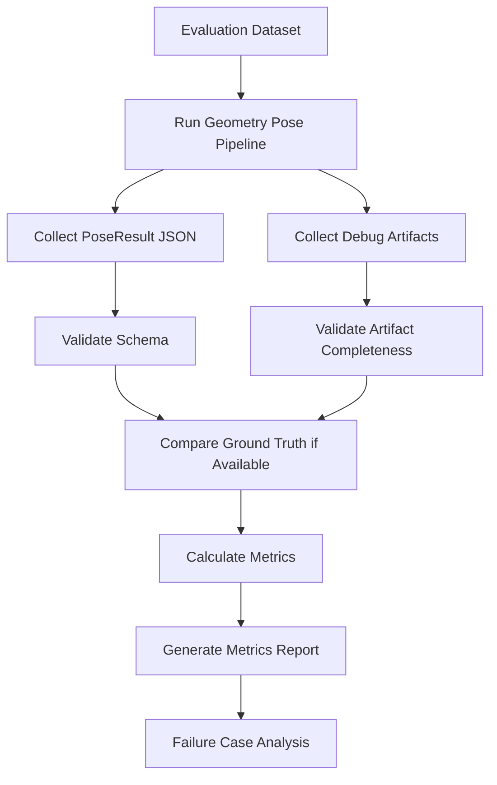

# Geometry Based Pose Verification Plan

## 1. 目的

本文件補充 `05_Verification/README.md`，定義 Geometry Based Pose 的驗證資料、metrics、artifact 檢查與驗收條件。

## 2. Verification Flow



## 3. Dataset Plan

```text
data/evaluation/
├── images/
│   ├── road/
│   ├── corridor/
│   ├── building/
│   ├── indoor/
│   ├── landscape/
│   └── cluttered/
├── synthetic_roll/
├── labels.csv
└── cases.yaml
```

`labels.csv`:

```csv
image,scene_type,ground_truth_yaw,ground_truth_pitch,ground_truth_roll,expected_features,notes
road_001.jpg,road,5,-3,1,"lines,horizon,vanishing_point","clear perspective"
building_001.jpg,building,null,null,0,"vertical_lines,lines","roll only"
```

## 4. Metrics

| Metric | 目標 |
|---|---|
| yaw MAE / RMSE | 驗證 VP / yaw 結果 |
| pitch MAE / RMSE | 驗證 horizon / pitch 結果 |
| roll MAE / RMSE | 驗證 line orientation / roll 結果 |
| per-angle success rate | 驗證 partial result 行為 |
| confidence bucket error | 驗證 confidence 是否反映可靠度 |
| artifact completeness | 驗證 debug artifacts 是否完整 |
| failure type count | 分析主要失敗原因 |

## 5. Acceptance Criteria

- 合法圖片可產生 `PoseResult`。
- 無明顯線段時不崩潰，並輸出 low confidence / warning。
- yaw / pitch / roll 可獨立成功或失敗。
- Debug artifacts 路徑存在且非空白。
- Synthetic roll 測試可反映旋轉方向與幅度。
- Metrics report 包含 dataset summary、per-angle metrics、failure summary。

## 6. Failure Taxonomy

| Failure Type | 說明 |
|---|---|
| `insufficient_lines` | 可用線段不足 |
| `unstable_horizon` | 地平線候選不穩 |
| `unstable_vanishing_point` | 消失點估計不穩 |
| `low_texture_scene` | 場景紋理太少 |
| `cluttered_scene` | 場景過度雜亂 |
| `wide_angle_distortion` | 廣角或魚眼變形 |
| `wrong_angle_sign` | 角度正負方向定義錯誤 |
| `over_confident_failure` | 錯誤結果卻給高 confidence |

## 7. Report Output

```text
outputs/geometry_pose/evaluation/metrics_summary.json
outputs/geometry_pose/evaluation/pose_results.csv
outputs/geometry_pose/evaluation/failed_cases.csv
outputs/geometry_pose/evaluation/metrics_report.md
```

