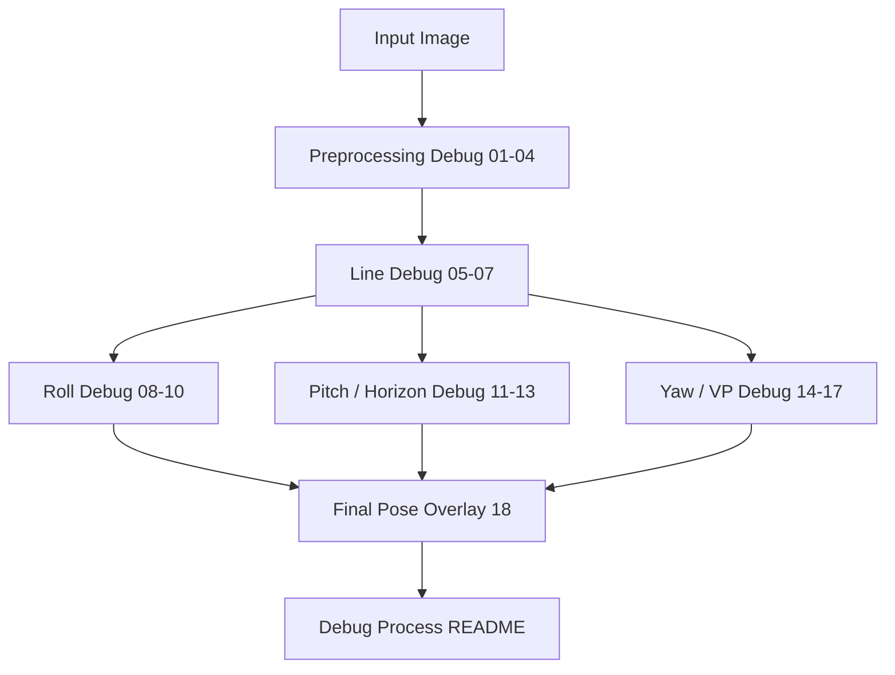

# Geometry Based Pose Debug

## 1. 目的

本資料夾保存 Geometry Based Pose 的 debug process、案例紀錄與 debug artifacts。Debug 階段的目標是讓每個 yaw / pitch / roll 結果都能追溯到中間幾何特徵。

## 2. Debug Artifact 順序

| 編號 | Artifact | 對應階段 | 用途 |
|---|---|---|---|
| 01 | `01_input.png` | A1 | 檢查原始輸入 |
| 02 | `02_grayscale.png` | A2 | 檢查灰階轉換 |
| 03 | `03_blurred.png` | A2 | 檢查降噪 |
| 04 | `04_edges.png` | A2 | 檢查 Canny edge map |
| 05 | `05_detected_lines.png` | A3 | 檢查原始線段 |
| 06 | `06_filtered_lines.png` | A3 | 檢查保留線段 |
| 07 | `07_line_orientation_debug.png` | A3 | 檢查線段方向分類 |
| 08 | `08_roll_candidate_lines.png` | A4 | 檢查 roll 候選線 |
| 09 | `09_roll_orientation_histogram.png` | A4 | 檢查 roll 方向分布 |
| 10 | `10_roll_overlay.png` | A4 | 檢查 roll 輸出 |
| 11 | `11_horizon_candidates.png` | A5 | 檢查 horizon candidates |
| 12 | `12_selected_horizon.png` | A5 | 檢查 selected horizon |
| 13 | `13_pitch_overlay.png` | A5 | 檢查 pitch 輸出 |
| 14 | `14_perspective_lines.png` | A6 | 檢查 perspective lines |
| 15 | `15_vanishing_point_candidates.png` | A6 | 檢查 VP candidates |
| 16 | `16_selected_vanishing_point.png` | A6 | 檢查 selected VP |
| 17 | `17_yaw_overlay.png` | A6 | 檢查 yaw 輸出 |
| 18 | `18_pose_overlay.png` | A7-A9 | 檢查 final pose |

## 3. Debug 資料流

## 4. 目前案例

| 案例 | 文件 | Artifacts |
|---|---|---|
| `examples/0.png` | `examples_0_pose_debug_process.md` | `examples_0_artifacts/` |

