# examples/0.png Debug Artifacts

這個資料夾保存 `python main.py --path examples/0.png` 產生的 Stage 4-7 debug 圖片，用來對照 `breakdown/01_Geometry_Based_Pose/06_Debug/examples_0_pose_debug_process.md` 中的分析過程。

Artifacts 對應 `02_Analysis/README.md` 的 A1-A10 小階段：

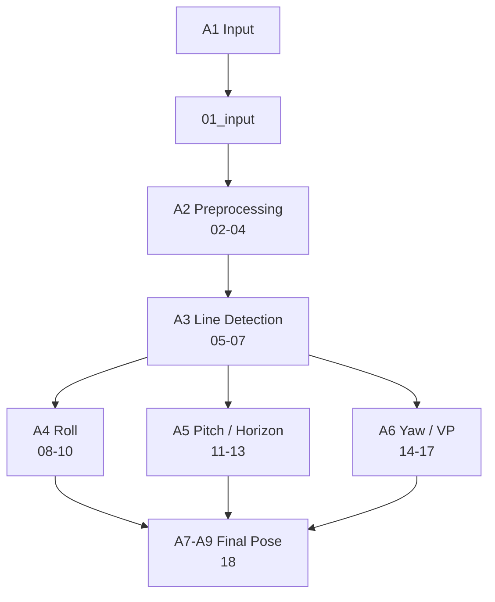

## 圖片預覽

### 1. Input And Preprocessing

#### 01 Input

#### 02 Grayscale

#### 03 Blurred

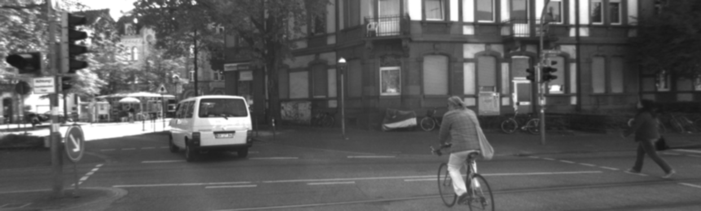

#### 04 Edges

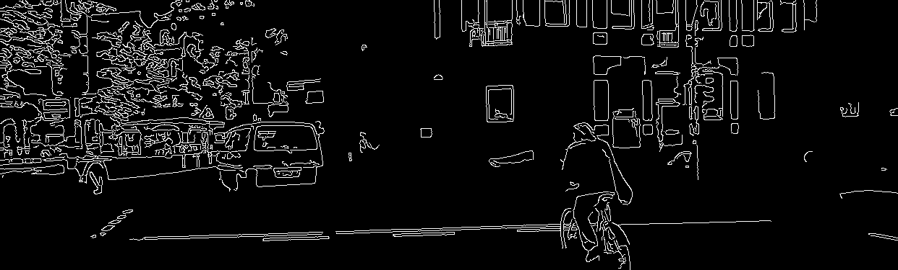

### 2. Line Detection

#### 05 Detected Lines

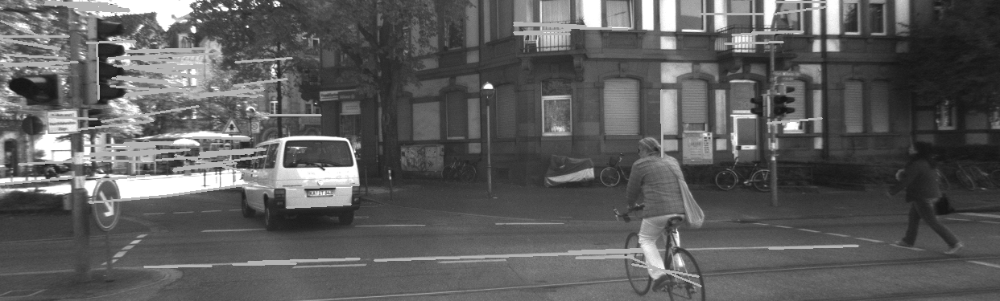

#### 06 Filtered Lines

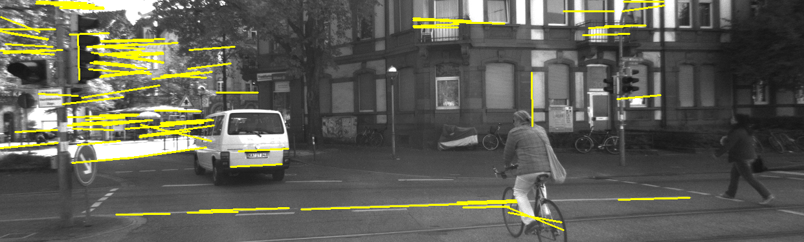

#### 07 Line Orientation Debug

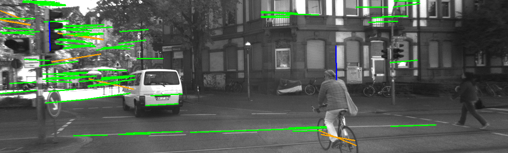

### 3. Roll Debug

#### 08 Roll Candidate Lines

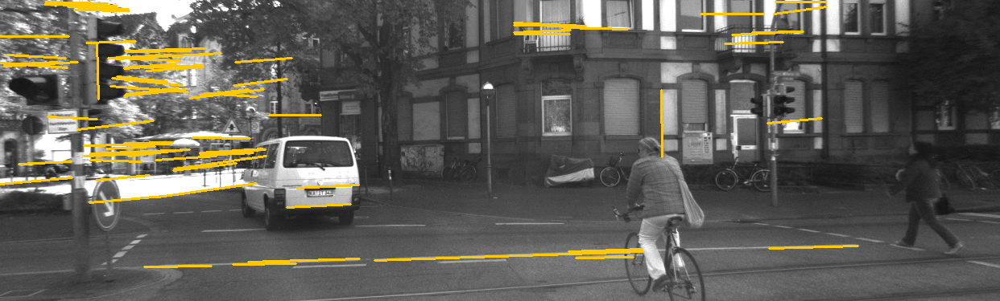

#### 09 Roll Orientation Histogram

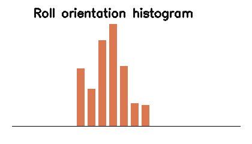

#### 10 Roll Overlay

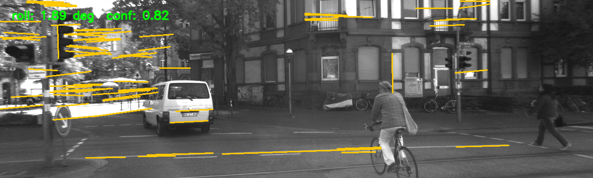

### 4. Pitch / Horizon Debug

#### 11 Horizon Candidates

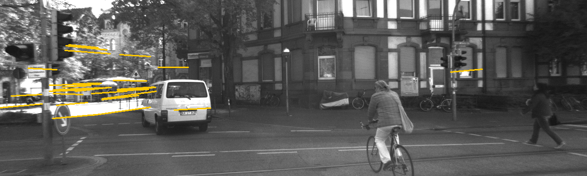

#### 12 Selected Horizon

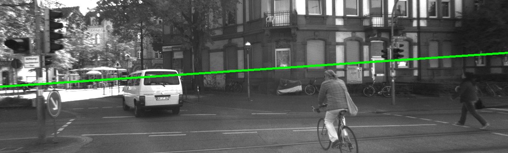

#### 13 Pitch Overlay

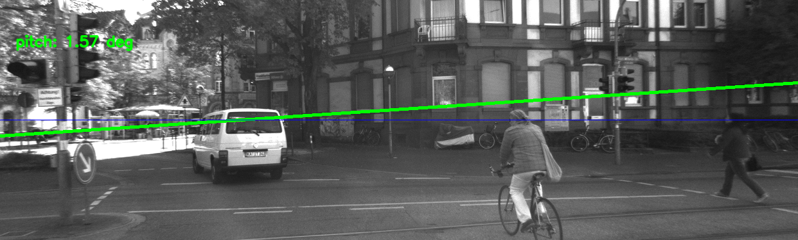

### 5. Yaw / Vanishing Point Debug

#### 14 Perspective Lines

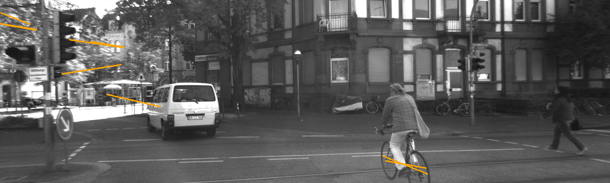

#### 15 Vanishing Point Candidates

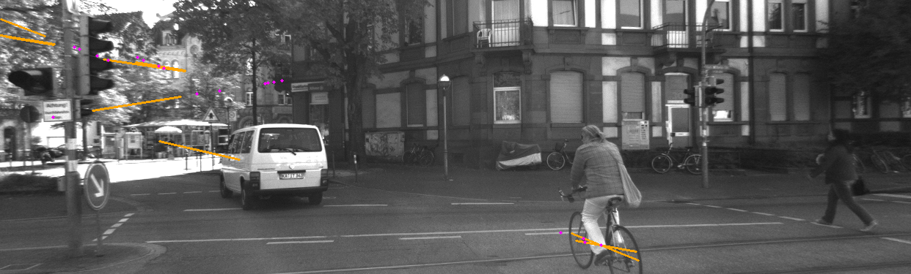

#### 16 Selected Vanishing Point

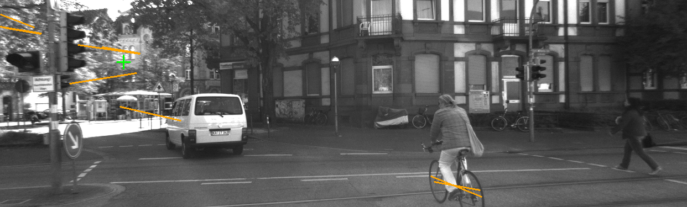

#### 17 Yaw Overlay

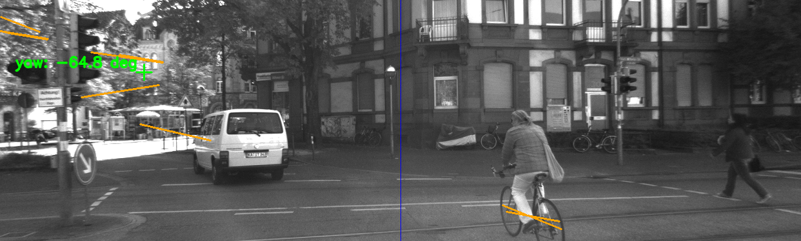

### 6. Final Pose

#### 18 Pose Overlay

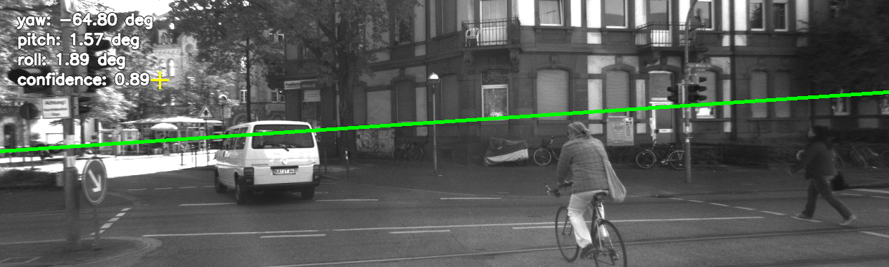

## Artifact Index

| 檔案 | 用途 |
| --- | --- |
| `01_input.png` | 原始輸入圖片 |
| `02_grayscale.png` | 灰階轉換結果 |
| `03_blurred.png` | Gaussian blur 降噪結果 |
| `04_edges.png` | Canny edge detection 結果 |
| `05_detected_lines.png` | HoughLinesP 偵測到的原始線段 |
| `06_filtered_lines.png` | 過濾後線段 |
| `07_line_orientation_debug.png` | 線段方向分類結果 |
| `08_roll_candidate_lines.png` | roll estimator 使用的候選線段 |
| `09_roll_orientation_histogram.png` | roll 候選角度分布 |
| `10_roll_overlay.png` | roll 估計結果疊圖 |
| `11_horizon_candidates.png` | horizon candidates |
| `12_selected_horizon.png` | selected horizon 疊圖 |
| `13_pitch_overlay.png` | pitch 估計結果疊圖 |
| `14_perspective_lines.png` | yaw / vanishing point 使用的 perspective lines |
| `15_vanishing_point_candidates.png` | vanishing point candidate intersections |
| `16_selected_vanishing_point.png` | selected vanishing point 疊圖 |
| `17_yaw_overlay.png` | yaw 估計結果疊圖 |
| `18_pose_overlay.png` | yaw / pitch / roll 最終姿態疊圖 |

## 使用方式

- `01` 到 `04`：確認輸入與前處理是否合理。
- `05` 到 `07`：確認線段偵測與方向分類是否合理。
- `08` 到 `10`：確認 roll 候選線與 sign convention。
- `11` 到 `13`：確認 horizon candidate filtering 與 pitch estimate。
- `14` 到 `17`：確認 perspective lines、vanishing point 與 yaw estimate。
- `18`：確認最終 yaw / pitch / roll overlay。
