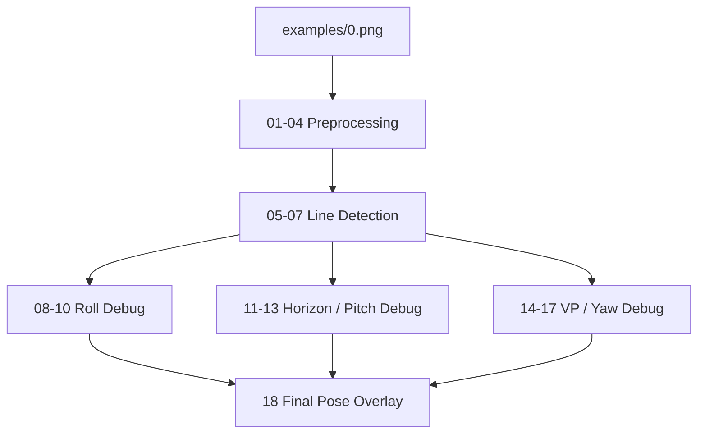

# examples/0.png Geometry Pose Debug Process

## 1. 目的

本文件記錄 `examples/0.png` 的 geometry-based pose debug 過程。此案例用來檢查 A1-A10 pipeline 是否能從單張影像輸出可解釋的 yaw / pitch / roll。

執行：

```bash
python main.py --path examples/0.png
```

參考值：

```yaml
yaw_deg: -70.010
pitch_deg: 0.000573
roll_deg: 1.286
```

## 2. Debug Data Flow



## 3. Baseline Problem

最初輸出：

```yaml
yaw: N/A
pitch: 4.1
roll: -1.89
```

主要問題：

| 角度 | 問題 | 主要診斷方向 |
|---|---|---|
| yaw | 無法估計 | perspective lines / VP candidates 不足 |
| pitch | 與參考值差約 4 deg | horizon candidate 選擇偏高 |
| roll | 正負方向相反 | camera roll convention 與 image tilt sign |

## 4. 調整摘要

| 調整 | 目的 | 結果 |
|---|---|---|
| `horizontal_threshold_deg: 20 -> 8` | 讓更多斜線保留為 perspective lines | yaw 從 N/A 變成可估 |
| horizon center band filtering | 排除過高 / 過低水平線 | pitch error 下降 |
| `camera_roll = -dominant_image_angle` | 修正 roll sign convention | roll error 下降 |
| focal fallback 改用 `min(width, height) / 2` | 避免超寬影像 focal 過大 | yaw error 下降 |

## 5. 最終結果

目前輸出：

```yaml
yaw: -64.8
pitch: 1.57
roll: 1.89
confidence: 0.89
```

Absolute error：

```yaml
yaw_error_deg: 5.21
pitch_error_deg: 1.569427
roll_error_deg: 0.604
```

## 6. 驗證

```bash
pytest -q
```

結果：

```text
19 passed
```

測試重點：

- `examples/0.png` 可輸出 yaw / pitch / roll。
- yaw error 小於 `10 deg`。
- blank image 維持 partial result。
- synthetic corridor-like case 可通過。

## 7. Artifact Package

Debug 圖位於：

```text
breakdown/01_Geometry_Based_Pose/06_Debug/examples_0_artifacts/
```

索引：

```text
breakdown/01_Geometry_Based_Pose/06_Debug/examples_0_artifacts/README.md
```
