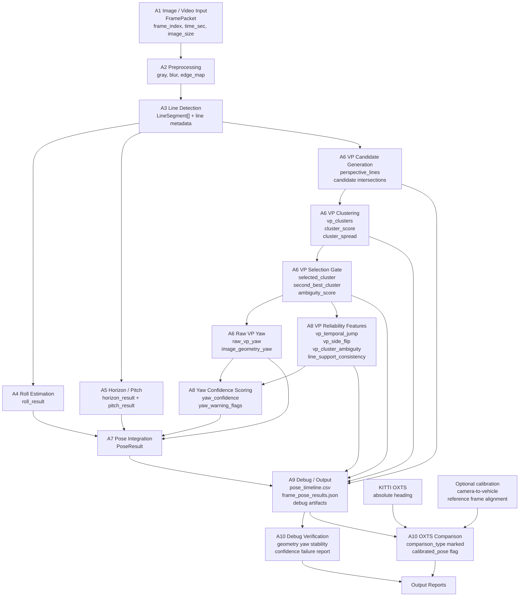

# 議題 002 - 幾何式 Yaw 與 OXTS 比對除錯

## 目的

本文件用來追蹤 GitHub issue #2：目前使用「幾何式姿態估計」時，預測出的 yaw 與 KITTI OXTS 提供的 yaw 誤差很大，尤其集中在第 91 幀到第 100 幀。

這份文件目前不是要立刻修改程式，而是要先釐清問題到底出在哪一層：

1. 姿態估計方法本身有問題。
2. 姿態輸出或比較方式的語意有問題。
3. 姿態輸出與比較方式正確，但單張影像幾何法本身存在限制。

## 目前相關輸出

| 路徑 | 內容說明 | 姿態類型 |
|---|---|---|
| `tools/output/kitti_pose_overlay.mp4` | KITTI 影像上疊加 OXTS 數值 | OXTS 絕對姿態 / 參考姿態 |
| `tools/output/kitti_no_overlay.mp4` | 沒有姿態文字的乾淨影片 | 各流程的輸入影片 |
| `outputs/video_pose/predicted_pose_overlay.mp4` | 幾何式姿態估計流程的輸出影片 | 單張影像近似幾何姿態 |
| `outputs/video_pose/evaluation/pose_vs_oxts.csv` | 幾何式姿態結果與 OXTS 的比較表 | 單張影像預測姿態 vs OXTS 絕對姿態 |
| `outputs/optical_flow_pose/pose_overlay_uncalibrated/output_pose_overlay.mp4` | 光流姿態估計流程的輸出影片 | 前後幀相對旋轉 |

## 推測的錯誤

| 假設 | 可疑層級 | 懷疑原因 | 優先度 |
|---|---|---|---|
| H1：幾何式 yaw 與 OXTS yaw 不是同一種語意的角度 | 輸出 / 比較 | 幾何式 yaw 是由影像消失點推估；OXTS yaw 是車體 / 世界座標中的 heading | 高 |
| H2：部分場景中的 yaw 正負號定義不一致 | 輸出 / 公式定義 | 第 91-100 幀的預測 yaw 是正值，但 OXTS yaw 是負值 | 高 |
| H3：消失點選到錯誤群集 | 姿態估計 | yaw 直接依賴 `selected_vanishing_point.x`；消失點選錯會造成巨大 yaw 誤差 | 高 |
| H4：yaw 信心分數過度樂觀 | 信心分數 / 輸出 | yaw 最差的幀，信心分數仍約 0.86-0.91 | 高 |
| H5：影像與 OXTS 的幀序號對齊有偏移 | 評估設定 | 局部幀區間嚴重失敗；對齊錯誤可能看起來像姿態錯誤 | 中 |
| H6：焦距 fallback 太粗略 | 相機模型 | yaw 使用近似焦距，消失點到角度的轉換可能產生偏差 | 中 |
| H7：單張影像幾何 yaw 不適合直接當作 KITTI 絕對 heading | 方法限制 | 單張影像幾何法缺少完整 calibration 與座標轉換時，無法完整恢復全域 heading | 中 |

## 目前實驗步驟

目前幾何式姿態估計流程遵循 `breakdown/01_Geometry_Based_Pose/02_Analysis` 中的分析流程：

```text
A1 影像輸入
-> A2 前處理
-> A3 線段偵測
-> A4 方向 / Roll 分析
-> A5 地平線 / Pitch 分析
-> A6 消失點 / Yaw 分析
-> A7 姿態整合
-> A8 信心分數分析
-> A9 除錯 / 輸出分析
-> A10 驗證分析
```

目前 yaw 的計算路徑：

```text
影像
-> 邊緣圖
-> Hough 線段
-> 篩選透視線
-> 成對線段交會，產生消失點候選
-> 選出主要消失點
-> yaw = atan((vp_x - center_x) / focal_length_pixels)
```

目前評估流程的路徑：

```text
outputs/video_pose/pose_timeline.csv
vs
tools/input/oxts
-> outputs/video_pose/evaluation/pose_vs_oxts.csv
-> outputs/video_pose/evaluation/pose_vs_oxts_summary.json
-> outputs/video_pose/evaluation/worst_frames.csv
```

## 目前實驗數據

資料來源：

```text
outputs/video_pose/evaluation/pose_vs_oxts_summary.json
outputs/video_pose/evaluation/worst_frames.csv
outputs/video_pose/evaluation/pose_vs_oxts.csv
```

摘要：

| 指標 | Yaw | Pitch | Roll |
|---|---:|---:|---:|
| 平均絕對誤差 | 49.2858 deg | 1.3891 deg | 1.5228 deg |
| 中位數絕對誤差 | 52.0403 deg | 1.0531 deg | 1.1684 deg |
| 最大絕對誤差 | 115.0878 deg | 5.2549 deg | 5.2153 deg |
| 均方根誤差 | 61.5331 deg | 1.8433 deg | 1.9023 deg |

異常數據：

| 幀範圍 | 觀察結果 | 為什麼異常 |
|---|---|---|
| 第 91-100 幀 | yaw error 約 111-115 deg | 遠大於 pitch / roll，且集中在同一段幀 |
| 第 91-100 幀 | 預測 yaw 是正值，OXTS yaw 是負值 | 暗示可能有正負號、語意或消失點群集不一致 |
| 第 91-100 幀 | yaw 信心分數仍然很高，約 0.86-0.91 | 信心分數沒有反映實際 yaw 失敗 |
| 全部幀 | mean yaw error 是 49.2858 deg | 與 pitch / roll 相比，yaw 整體不可靠 |
| Pitch / Roll | 平均誤差約 1-2 deg | pitch / roll 明顯穩定很多，因此不是整條流程全面失效 |

最差的 yaw 幀：

| 幀 | 預測 Yaw | OXTS Yaw | 絕對誤差 | 信心分數 |
|---:|---:|---:|---:|---:|
| 96 | 57.64 | -57.4478 | 115.0878 | 0.89 |
| 97 | 55.78 | -58.8603 | 114.6403 | 0.87 |
| 100 | 50.52 | -63.3176 | 113.8376 | 0.91 |
| 99 | 51.55 | -61.8571 | 113.4071 | 0.89 |
| 94 | 58.78 | -54.5283 | 113.3083 | 0.86 |
| 95 | 56.97 | -56.0353 | 113.0053 | 0.88 |
| 91 | 62.01 | -50.3090 | 112.3190 | 0.87 |
| 98 | 51.64 | -60.2854 | 111.9254 | 0.88 |
| 93 | 58.35 | -53.1736 | 111.5236 | 0.89 |
| 92 | 59.20 | -51.8312 | 111.0312 | 0.86 |

Yaw 反號診斷：

| 範圍 | 目前 mean abs yaw error | 若將 `pred_yaw` 反號後的 mean abs yaw error |
|---|---:|---:|
| 全部幀 | 49.2858 deg | 72.9165 deg |
| 第 91-100 幀 | 113.0086 deg | 6.4455 deg |

解讀：

直接把 yaw 全域反號不是正確修法，因為它會讓全部幀的平均誤差變得更差。不過，反號後第 91-100 幀的誤差會大幅改善。這表示目前的失敗比較像是局部消失點群集選擇問題，或是特定場景下的 yaw 定義不穩定，而不是單純的全域正負號錯誤。

## 用來確認異常數據的實驗設計

### E1. 確認比較語意

問題：

```text
我們現在比較的是同一種姿態嗎？
```

步驟：

1. 確認 `outputs/video_pose/predicted_pose_overlay.mp4` 使用的是單張影像幾何姿態。
2. 確認 `tools/output/kitti_pose_overlay.mp4` 使用的是 KITTI OXTS 絕對姿態。
3. 將目前比較方式標記為 `geometry_single_frame_vs_oxts_absolute`。
4. 除非加入相機校正與座標轉換，否則不要把目前 yaw 結果稱為已校正的絕對 heading。

預期結果：

```text
目前 yaw 比較可以作為除錯訊號，但不是嚴格同語意、同座標系的已校正姿態評估。
```

### E2. 檢查第 91-100 幀的消失點除錯圖

問題：

```text
selected vanishing point 是否跳到錯誤方向或錯誤群集？
```

步驟：

1. 匯出或重新產生第 90-101 幀的 debug artifacts。
2. 檢查：
   - `14_perspective_lines.png`
   - `15_vanishing_point_candidates.png`
   - `16_selected_vanishing_point.png`
   - `17_yaw_overlay.png`
3. 記錄每一幀的 `selected_vanishing_point.x`、`center_x`、`focal_length_pixels` 與最後 yaw。
4. 將視覺上的消失點位置與道路、車道線、建築物的透視方向比對。

預期異常確認：

```text
如果 selected VP 跳到相反群集或錯誤方向，而畫面中的主要透視方向沒有對應改變，則 H3 成立。
```

### E3. 不修改正式程式，先評估不同 yaw 定義

問題：

```text
錯誤是來自公式正負號 / 角度定義，還是 selected VP 本身？
```

測試變體：

```text
yaw_current = atan((vp_x - center_x) / focal)
yaw_inverted = -yaw_current
yaw_centered_delta = angle_delta(yaw_current, first_frame_yaw)
oxts_relative = angle_delta(oxts_yaw[t], oxts_yaw[t-1])
```

步驟：

1. 產生一份實驗用 CSV，包含 current yaw、inverted yaw、first-frame-relative yaw 與 OXTS relative delta。
2. 分別比較下列範圍：
   - 全部幀
   - 第 91-100 幀
   - 第 91-100 幀以外的幀
3. 在某個變體能穩定改善正確比較目標以前，不要更新正式公式。

預期異常確認：

```text
如果只有第 91-100 幀在 yaw 反號後改善，代表問題較可能是局部 VP / convention instability，而不是全域 sign bug。
```

### E4. 檢查影像幀與 OXTS 對齊

問題：

```text
影像 frame 與 OXTS record 是否對齊？
```

步驟：

1. 將 OXTS 往前與往後平移 -3 到 +3 幀，重新計算 yaw error。
2. 追蹤每個平移量的 MAE。
3. 檢查第 91-100 幀在平移後是否仍然是最嚴重的區段。

預期異常確認：

```text
如果小幅平移可以同時大幅降低 yaw / pitch / roll error，代表 frame alignment 錯誤。
如果只有 yaw 仍然異常，alignment 很可能不是主因。
```

### E5. 信心分數失效測試

問題：

```text
yaw confidence 是否能偵測不穩定的 VP？
```

步驟：

1. 繪製 yaw confidence vs absolute yaw error。
2. 加入候選指標：
   - VP candidate spread
   - VP cluster 數量
   - selected VP 的 temporal jump
   - VP 與影像中心距離
   - perspective line support ratio
3. 標記 high confidence 但 high yaw error 的幀。

預期異常確認：

```text
如果高信心分數但 yaw 失敗的情況集中在第 91-100 幀，信心分數必須加入 VP 穩定性 / 歧義檢查。
```

## 錯誤確認標準

| 錯誤類型 | 什麼情況代表確認 | 下一步 |
|---|---|---|
| 比較語意錯誤 | 單張影像幾何 yaw 被當成已校正的 OXTS heading 使用 | 更新文件與報告標籤；不要宣稱 absolute heading |
| 消失點選擇錯誤 | debug artifacts 顯示 selected VP 位於錯誤群集或錯誤方向 | 改善 VP clustering / selection，並在 ambiguity 時降低 confidence |
| 正負號定義錯誤 | 某一種 yaw sign convention 能穩定改善全部幀的指標 | 修改公式 / sign convention，並更新測試 |
| 幀對齊錯誤 | 平移 OXTS 幀序號能同時降低所有角度誤差 | 修正評估時的幀配對 |
| 方法限制 | 比較與實作都正確，但 yaw 仍然不穩 | 文件化限制，並將 heading 評估導向已校正或相對姿態流程 |

## 修正後的實驗步驟

當具體錯誤被確認並修正後：

```text
1. 重新產生 geometry video pose output。
2. 重新執行 geometry vs OXTS 評估。
3. 比較修正前後的 summary：
   - mean_abs_yaw_error
   - median_abs_yaw_error
   - max_abs_yaw_error
   - top_10_yaw_error_frames
   - confidence_vs_abs_error
4. 確認 pitch / roll 沒有 regression。
5. 更新本 README：
   - confirmed root cause
   - code change summary
   - before/after metrics
   - remaining caveats
6. 如果 pose meaning 有改變，同步更新父層 debug README 與 verification docs。
```

修正後要執行的指令：

```bash
python main.py --video tools/output/kitti_no_overlay.mp4 --sample-every 1 --output-dir outputs/video_pose --write-overlay
python tools/evaluation/evaluate_video_pose_against_oxts.py --pose-csv outputs/video_pose/pose_timeline.csv --oxts-dir tools/input/oxts --output-dir outputs/video_pose/evaluation
```

通過標準：

```text
- yaw 比較類型已明確記錄。
- 如果確認 bug 在實作或評估流程，yaw MAE 應該改善。
- 如果 yaw MAE 沒有改善，剩餘誤差必須被記錄為單張影像幾何法限制。
- pitch / roll 指標維持在相同範圍或改善。
- 高信心分數但 yaw 失敗的情況被減少，或被明確標記出來。
```

## E1-E4 驗證結果總整理

本輪實驗輸出位於：

```text
breakdown/01_Geometry_Based_Pose/06_Debug/issue_002_yaw_oxts_debug/experiment_results/
```

| 實驗 | 主題 | 結論 | 主要證據 | 輸出 |
|---|---|---|---|---|
| E1 | 比較語意 | H1 成立：`pred_yaw` 與 `oxts_yaw` 不是同語意 yaw | `pred_yaw` 是單張影像 vanishing point yaw；`oxts_yaw` 是 KITTI OXTS absolute heading；evaluation 直接相減，沒有座標轉換 | `E1_outputs/E1_results.md` |
| E2 | yaw sign variant | 不支持全域 sign bug；支持局部 sign flip | 全部 frame 反號 MAE 從 49.2858 變差到 72.9165；第 91-100 幀反號 MAE 從 113.0086 降到 6.4455 | `E2_E3_outputs/E2_E3_results.md` |
| E3 | VP failure review | VP selection error 視覺層未確認；資料層支持 VP side/sign flip 疑點 | frame 88-103 的 selected VP 在右側，且反號後改善；但 `debug_frames` 不存在，無法確認是否選錯 cluster | `E2_E3_outputs/vp_failure_frame_review.md` |
| E4 | confidence 可靠度 | yaw confidence failure 成立 | 154 幀中 101 幀同時 `yaw_confidence >= 0.85` 且 `abs_yaw_error >= 30`；第 91-100 幀 10/10 都是 failure | `E4_outputs/E4_results.md` |

### E1：比較語意結論

目前 `pose_vs_oxts.csv` 的 yaw comparison 不是嚴格 calibrated heading evaluation。

```yaml
H1 confirmed: true
same_semantics: false
comparison_type: geometry_single_frame_yaw_vs_oxts_absolute_heading
calibrated_pose: false
```

原因：

- `pred_yaw` 來自 `estimate_yaw`，使用 `atan((vp_x - center_x) / focal_length_pixels)`。
- `oxts_yaw` 來自 KITTI raw OXTS `values[5]`，是 reference / absolute heading。
- evaluation 做的是 `row["yaw"] - pose.yaw_deg`，沒有 camera-to-vehicle、vehicle-to-world 或 Euler convention 對齊。

因此目前 yaw error 只能當 debug signal，不應解讀成「geometry pipeline 預測 absolute heading 錯了幾度」。

### E2 + E3：yaw 錯誤來源結論

E2 顯示不是全域 sign bug：

| 範圍 | original MAE | inverted MAE | 判讀 |
|---|---:|---:|---|
| 全部 frame | 49.2858 | 72.9165 | 反號後整體變差，不支持全域 sign bug |
| 第 91-100 幀 | 113.0086 | 6.4455 | 反號後大幅改善，支持局部 sign / VP side flip |
| 第 91-100 幀以外 | 44.8606 | 77.5326 | 反號後明顯變差 |
| top 10 yaw error frames | 113.0086 | 6.4455 | top 10 全部是 frame 91-100 |

E3 顯示 frame 88-103 資料層可疑，但視覺層尚未確認：

- frame 91-100 的 `pred_yaw` 為正，`oxts_yaw` 為負。
- 這 10 幀全部 `inversion_improves_error=true`。
- selected VP x 多在 image center 右側，與正 yaw 一致。
- 但目前沒有 `outputs/video_pose/debug_frames`，無法檢查 `15_vanishing_point_candidates.png` 與 `16_selected_vanishing_point.png`，所以不能正式判定「選錯 VP cluster」。

結論：

```yaml
global_sign_bug_confirmed: false
local_sign_flip_suspected: true
vp_selection_error_confirmed: null
vp_selection_error_reason: debug artifacts missing; data-level VP side/sign flip suspected
```

### E4：confidence 可靠度結論

E4 顯示 yaw confidence failure 成立。

| 指標 | 數值 | 判讀 |
|---|---:|---|
| 全部 frame | 154 | evaluation 總筆數 |
| `yaw_confidence >= 0.85` | 154 | 每一幀 yaw confidence 都很高 |
| `abs_yaw_error >= 30` | 101 | 多數 frame 的 yaw error 達 high error |
| `yaw_confidence_failure` | 101 | 高 yaw confidence 且 high yaw error，大量存在 |
| 第 91-100 幀 failure | 10 / 10 | 最嚴重區段全部 confidence failure |
| top 10 最嚴重 yaw error | 全部 frame 91-100 | 最嚴重錯誤集中在 91-100 |

目前 confidence 的問題是：`YawEstimate.confidence` 直接承接 `selected_vanishing_point.confidence`；而 VP confidence 主要依賴 support count、perspective line count、candidate spread，沒有檢查 VP 是否選對方向、是否有 temporal jump、是否有 cluster ambiguity。

## 目前結論

目前數據最強烈指向「yaw 專屬失敗」，而不是「整條流程全面失敗」。

pitch 與 roll 的誤差約 1-2 度，表現相對穩定；但 yaw 平均誤差約 49 度，而且第 91-100 幀出現超過 110 度的誤差。因此問題主要集中在 yaw 的比較語意、消失點選擇、局部 sign / side flip，以及信心分數，而不是整個前處理、線段偵測、姿態整合都壞掉。

已確認的 root cause / contributing factors：

1. **比較語意不嚴格**：幾何式 single-frame yaw 被直接拿去與 OXTS absolute heading 比較。
2. **不是全域 sign bug**：全域反號會讓整體 MAE 更差。
3. **局部 sign / VP side flip 可疑**：第 91-100 幀反號後誤差大幅下降，top 10 yaw error 全部落在這段。
4. **VP selection error 尚未視覺確認**：缺少 frame 88-103 的 debug artifacts，因此只能判定資料層可疑。
5. **yaw confidence failure 成立**：大量 high yaw confidence frame 同時有 high yaw error，第 91-100 幀全部未被 confidence 捕捉。

目前不要直接做全域 yaw 正負號更改。全幀診斷顯示，雖然全域反號會改善第 91-100 幀，但會讓整體 mean yaw error 變更差。

## issue #2 可改善項目

下表把改善項目整理成「做法 -> 預期解決問題 -> 對應 `02_Analysis`」。建議先做低風險的報告語意修正與 artifacts 補齊，再動 VP selection / confidence 演算法。

| 優先度 | 改善項目 | 可以怎麼做 | 預期解決哪邊的問題 | 對應 `02_Analysis` | 注意事項 |
|---|---|---|---|---|---|
| P0 | 修正 evaluation / report 語意標籤 | 在 summary/report 加入 `comparison_type=geometry_single_frame_yaw_vs_oxts_absolute_heading`、`calibrated_pose=false`、`comparison_warning=not_same_coordinate_semantics` | 解決 E1 發現的誤讀問題：目前 yaw error 不是 calibrated absolute heading error | A9 Debug / Output Analysis、A10 Verification Analysis | 不改演算法，低風險，應優先做 |
| P0 | 補齊 frame 88-103 debug artifacts | 重跑 `python main.py --video tools/output/kitti_no_overlay.mp4 --sample-every 1 --output-dir outputs/video_pose --write-overlay --debug-sampled-frames` | 解決 E3 缺少視覺證據的問題；確認 selected VP 是否真的選錯方向或 cluster | A6 Vanishing Point / Yaw Analysis、A9 Debug / Output Analysis | 必看 `15_vanishing_point_candidates.png`、`16_selected_vanishing_point.png`、`17_yaw_overlay.png` |
| P1 | 改善 VP selection | 對 VP candidates 做 clustering；計算 best cluster / second cluster 分數；用 selected cluster support 取代單純 median candidate | 解決第 91-100 幀疑似 VP side / cluster failure；避免非主要透視線主導 yaw | A3 Line Detection Analysis、A6 Vanishing Point / Yaw Analysis | 不建議直接全域反號，E2 已排除全域 sign bug |
| P1 | 改善 yaw confidence | 新增 `vp_temporal_jump`、`vp_side_flip`、`vp_cluster_ambiguity`、`line_support_consistency` 等特徵 | 解決 E4 發現的 high confidence + high yaw error；讓錯誤 VP 或不穩 VP 降低 confidence | A6 Vanishing Point / Yaw Analysis、A8 Confidence Analysis、A9 Debug / Output Analysis | confidence 不應只代表 candidate/support 數量 |
| P1 | 明確分離 yaw 欄位語意 | 將輸出欄位分成 `image_geometry_yaw`、`raw_vp_yaw`、`calibrated_heading_yaw`、`oxts_absolute_yaw` | 解決 `yaw` 欄位語意混淆；避免 single-frame VP yaw 被誤當 absolute heading | A7 Pose Integration Analysis、A9 Debug / Output Analysis、A10 Verification Analysis | 若沒有 calibration，`calibrated_heading_yaw` 應為 null 或不輸出 |
| P2 | 建立嚴格 OXTS 對齊流程 | 加入 camera-to-vehicle transform、reference frame alignment、Euler convention 對齊、angle wrapping | 若真的要和 OXTS yaw 做嚴格比較，這能把 pose semantic 對齊 | A7 Pose Integration Analysis、A10 Verification Analysis | 這是較大工程；未完成前 yaw metrics 只能當 debug comparison |
| P2 | 建立局部 failure regression set | 固定 frame 88-103 / 91-100 做 regression，追蹤 yaw、VP side、confidence、cluster ambiguity | 防止未來修 VP / confidence 時讓第 91-100 類似場景再次失敗 | A8 Confidence Analysis、A9 Debug / Output Analysis、A10 Verification Analysis | 可用 E2/E3/E4 的 CSV 當 baseline |

### 改善項目與已驗證問題的對照

| 已驗證問題 | 證據 | 對應改善 |
|---|---|---|
| E1：比較語意不一致 | `pred_yaw` 是 single-frame VP yaw，`oxts_yaw` 是 OXTS absolute heading | 修正 evaluation/report 標籤；分離 yaw 欄位語意；若要嚴格比較則新增座標系對齊 |
| E2：不是全域 sign bug | 全域反號讓全部 frame MAE 從 49.2858 變成 72.9165 | 避免全域 `-yaw`；改查局部 VP side / cluster failure |
| E2：第 91-100 幀局部反號改善 | 第 91-100 幀反號 MAE 從 113.0086 降到 6.4455 | 補齊 frame 88-103 artifacts；改善 VP selection |
| E3：VP selection error 視覺層未確認 | 缺少 `outputs/video_pose/debug_frames` | 重跑並保留 debug artifacts |
| E4：confidence failure 成立 | 101 幀同時 `yaw_confidence >= 0.85` 且 `abs_yaw_error >= 30` | 改善 yaw confidence，加入 VP stability / ambiguity / temporal 特徵 |

### yaw confidence 建議新增特徵

| 特徵 | 可以怎麼算 | 預期解決問題 | 對應 `02_Analysis` |
|---|---|---|---|
| `vp_temporal_jump` | 計算 `selected_vp[t]` 與 `selected_vp[t-1]` 的距離 | VP 突然跳動時降低 confidence | A6、A8 |
| `vp_side_flip` | 檢查 `selected_vp_x - center_x` 的符號是否突然翻轉 | 捕捉 E2/E3 類似的局部 side flip | A6、A8 |
| `vp_cluster_ambiguity` | 比較 best cluster 與 second-best cluster 分數差距 | 多 cluster 接近時降低 confidence | A6、A8 |
| `vp_spread_by_cluster` | 對 selected cluster 單獨計算 spread | 避免整體 spread 掩蓋錯誤 cluster | A6、A8 |
| `line_support_consistency` | 計算支撐 selected VP 的線段比例與方向一致性 | 避免非道路 / 次要結構主導 VP | A3、A6、A8 |
| `yaw_temporal_consistency` | 計算 yaw 與前後 frame 的差異 | yaw 突然跳變時降低 confidence | A8、A9 |

### 建議實作順序

| 順序 | 動作 | 原因 |
|---:|---|---|
| 1 | 先更新 evaluation/report 標籤 | 立刻降低誤讀風險，不影響 production behavior |
| 2 | 重跑 frame 88-103 debug artifacts | 補上 E3 缺少的視覺證據，確認是否真的選錯 VP cluster |
| 3 | 先改 confidence，不先改 yaw sign | E4 已確認 confidence failure；E2 已排除全域 sign bug |
| 4 | 加入 VP clustering / ambiguity 後再評估 yaw | 針對第 91-100 幀局部 failure 的可能主因 |
| 5 | 若目標是 OXTS absolute heading，再做 calibration / coordinate transform | 這是嚴格比較 OXTS 的必要條件，但範圍較大 |

## 重新設計後的新 pipeline

這個新流程是根據 E1-E4 結論，對原本 `02_Analysis` 第 4 節「模組溝通與資料交換流程」的修正版設計。核心改動不是全域反轉 yaw，而是讓 pipeline 明確分離 yaw 語意、改善 VP selection、補上 confidence failure 偵測，並讓 verification 不再誤讀為 calibrated OXTS heading comparison。

### 新流程設計原則

| 原則 | 目的 | 對應 E1-E4 結論 |
|---|---|---|
| yaw 語意分層 | 區分 `image_geometry_yaw`、`raw_vp_yaw`、`calibrated_heading_yaw` | E1：目前 `pred_yaw` 不等於 OXTS absolute heading |
| VP clustering 優先於 median candidate | 避免 selected VP 被錯誤方向或次要群集主導 | E2/E3：第 91-100 幀疑似局部 VP side / cluster failure |
| confidence 要看穩定性與歧義 | 不只看 support count / spread，也要看 temporal jump、side flip、cluster ambiguity | E4：高 yaw error 時 confidence 仍過高 |
| verification 必須標記比較類型 | yaw metrics 要標成 debug comparison，除非完成座標系對齊 | E1：現有 comparison_type 不明確 |
| debug artifacts 必須可追 | 對 failure frames 必須能回看 candidates、selected VP、yaw overlay | E3：缺少 artifacts 導致 VP selection error 無法視覺確認 |

### 新 pipeline Mermaid



### 新資料交換表

| 階段 | 模組 | 輸入 | 輸出 | 新增 / 改變的資料欄位 | 解決的問題 |
|---|---|---|---|---|---|
| A1 | Image / Video Input | image 或 video frame | `FramePacket` | `frame_index`, `time_sec`, `image_width`, `image_height`, `source_type` | 保留 frame 對齊資訊，支援後續 temporal 檢查 |
| A2 | Preprocessing | `FramePacket` | `PreprocessResult` | `gray_frame`, `edge_map`, preprocessing metadata | 維持原流程 |
| A3 | Line Detection | `edge_map` | `LineFeatureSet` | `line_id`, `angle_deg`, `length`, `orientation`, `source_region` | 支援後續 line support consistency |
| A6.1 | VP Candidate Generation | perspective lines | `VPCandidateSet` | `candidate_points`, `line_pair_ids`, `candidate_count` | 保留 VP candidates 可追溯性 |
| A6.2 | VP Clustering | `VPCandidateSet` | `VPClusterSet` | `cluster_id`, `cluster_center`, `cluster_support_count`, `cluster_spread`, `cluster_score` | 避免只用 median candidate，能處理多群集 |
| A6.3 | VP Selection Gate | `VPClusterSet` | `SelectedVPResult` | `selected_cluster_id`, `second_best_cluster_id`, `ambiguity_score`, `selection_warning` | 偵測選錯群集風險 |
| A6.4 | Raw VP Yaw | `SelectedVPResult`, image size | `YawGeometryResult` | `raw_vp_yaw`, `image_geometry_yaw`, `yaw_method=single_frame_vp`, `calibrated_heading_yaw=null` | 明確標記這不是 OXTS absolute heading |
| A8.1 | VP Reliability Features | current + previous `SelectedVPResult` | `VPReliabilityFeatures` | `vp_temporal_jump`, `vp_side_flip`, `vp_cluster_ambiguity`, `line_support_consistency` | 捕捉 E2/E3 類型的局部 failure |
| A8.2 | Yaw Confidence Scoring | `YawGeometryResult`, `VPReliabilityFeatures` | `YawConfidenceResult` | `yaw_confidence`, `yaw_confidence_reason`, `yaw_warning_flags` | 解決 E4 high confidence + high error |
| A7 | Pose Integration | roll, pitch, yaw, confidence | `PoseResult` | `image_geometry_yaw`, `raw_vp_yaw`, `calibrated_heading_yaw`, `pose_semantics`, `confidence_by_angle` | 分離 yaw 語意，避免欄位誤解 |
| A9 | Debug / Output | `PoseResult`, VP candidates/clusters | CSV / JSON / PNG | `comparison_ready=false`, `debug_artifact_paths`, `vp_cluster_summary`, `yaw_warning_flags` | failure frame 可追溯 |
| A10.1 | Debug Verification | `pose_timeline.csv` | debug metrics | `yaw_stability_metrics`, `confidence_failure_count`, `vp_side_flip_frames` | 驗證 geometry yaw 自身穩定性 |
| A10.2 | OXTS Comparison | geometry output + OXTS + optional calibration | comparison report | `comparison_type`, `calibrated_pose`, `comparison_warning`, `oxts_absolute_yaw` | 避免 E1 的語意混淆 |

### 新版 `pose_timeline.csv` 建議欄位

| 欄位 | 說明 |
|---|---|
| `frame_index`, `time_sec` | 原本 frame 索引與時間 |
| `image_geometry_yaw` | 單張影像 VP 推得的 yaw |
| `raw_vp_yaw` | 未經 temporal / confidence gate 修飾的 VP yaw |
| `calibrated_heading_yaw` | 若未完成 calibration，填 null |
| `yaw_confidence` | 經 VP reliability features 修正後的 yaw confidence |
| `yaw_confidence_reason` | 說明 confidence 高低原因 |
| `yaw_warning_flags` | 例如 `vp_side_flip`, `high_cluster_ambiguity`, `large_temporal_jump` |
| `selected_vp_x`, `selected_vp_y` | selected VP 位置 |
| `selected_cluster_id` | selected VP cluster |
| `second_best_cluster_id` | 第二候選 cluster |
| `vp_cluster_ambiguity` | cluster 歧義分數 |
| `vp_temporal_jump` | selected VP 時序跳動量 |
| `vp_side_flip` | 是否相對前一幀左右翻轉 |
| `line_support_consistency` | 支撐線一致性 |
| `comparison_ready` | 是否可進入嚴格 OXTS comparison |

### 新版 verification 輸出建議

| 報告 | 內容 | 對應問題 |
|---|---|---|
| `geometry_yaw_stability_report.json` | yaw temporal jump、VP side flip、cluster ambiguity 統計 | 檢查 geometry yaw 自身是否穩定 |
| `confidence_failure_report.json` | high confidence + high error frames、warning flags 分布 | 驗證 E4 confidence failure 是否改善 |
| `pose_vs_oxts_debug_comparison.csv` | 保留與 OXTS 的 debug comparison，但明確標 `calibrated_pose=false` | 避免 E1 語意誤讀 |
| `pose_vs_oxts_calibrated.csv` | 只有完成 calibration / coordinate alignment 時才輸出 | 嚴格 OXTS heading evaluation |

### 新 pipeline 的實作切分建議

| 階段 | 可先做的最小改動 | 驗證方式 |
|---|---|---|
| Phase 1 | 只新增 output 欄位與 comparison 標籤，不改 yaw 數值 | 確認 report 不再把 debug comparison 誤稱 calibrated heading |
| Phase 2 | 保留 `debug_frames`，補上 VP candidates / cluster artifacts | 重新檢查 frame 88-103 |
| Phase 3 | 新增 VP clustering 與 ambiguity score，但先不改 yaw formula | 比較第 91-100 幀 selected VP 是否更穩 |
| Phase 4 | 新增 yaw confidence gate | E4 的 confidence failure count 應下降，或至少 warning flags 能標出 failure frames |
| Phase 5 | 若需要 OXTS strict comparison，再加入 calibration / coordinate transform | 才能產生 `pose_vs_oxts_calibrated.csv` |

### 新流程不建議做的事

| 不建議項目 | 原因 |
|---|---|
| 全域改成 `yaw = -yaw` | E2 顯示全域反號會讓全部 frame MAE 變差 |
| 只調高/調低 confidence 常數 | E4 顯示問題是缺少特徵，不是單純分數尺度 |
| 繼續把 `yaw` 當成唯一欄位 | E1 顯示欄位語意混淆是主要問題之一 |
| 沒有 artifacts 就判定 VP cluster 錯誤 | E3 目前只能說資料層可疑，仍需視覺確認 |
