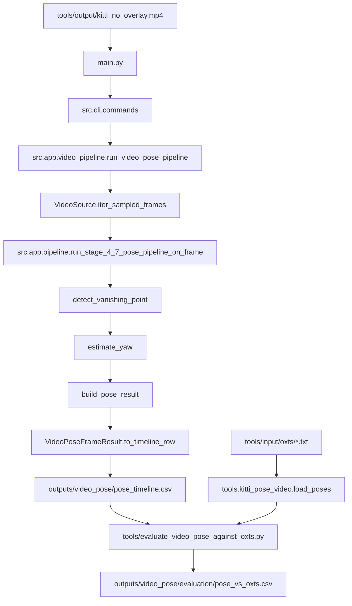
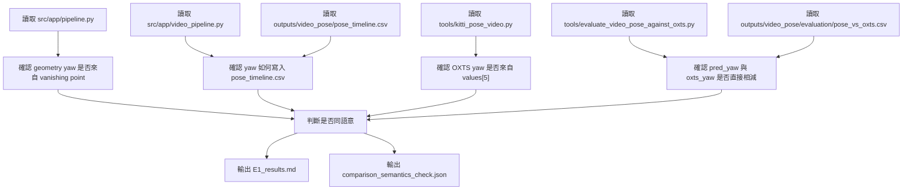

# E1 實驗設計：驗證 yaw 是否拿錯語意去比 OXTS

## 實驗問題

目前 `outputs/video_pose/evaluation/pose_vs_oxts.csv` 內有：

- `pred_yaw`
- `oxts_yaw`
- `yaw_error`

E1 要確認這三個欄位是不是可以被解讀為：

```text
geometry pipeline 預測的 yaw
vs
KITTI OXTS 真值 yaw
```

也就是要檢查 `pred_yaw` 和 `oxts_yaw` 是否是同語意、同座標系、同姿態類型的比較。

## 對應假說

```yaml
H1: geometry yaw 與 OXTS yaw 不是同一種語意的角度
```

判定方式：

- 如果 `pred_yaw` 來自單張影像 vanishing point，而 `oxts_yaw` 來自 KITTI OXTS absolute heading，H1 成立。
- 如果 evaluation 直接做 `pred_yaw - oxts_yaw`，沒有座標轉換，H1 成立。
- 如果 `pred_yaw` 已經經過 camera-to-vehicle / world transform 且與 OXTS 對齊，H1 不成立。

## 實驗範圍

E1 對應 `02_Analysis` 的 A10 Verification Analysis，同時回頭檢查：

| 對應分析 | E1 檢查重點 |
|---|---|
| A6 Vanishing Point / Yaw Analysis | geometry yaw 是怎麼算出來的 |
| A9 Debug / Output Analysis | `pose_timeline.csv` 的 `yaw` 欄位來源 |
| A10 Verification Analysis | evaluation 是否正確比對 `pred_yaw` 與 `oxts_yaw` |

限制：

- 不修改 production code。
- 不重新定義 yaw estimator。
- 不修 evaluation。
- 只新增實驗輸出到 `experiment_results/E1_outputs/`。

## 原始資料流



## 資料傳遞表

| 階段 | 程式 / 函式 | 輸入 | 輸出 | 傳遞欄位 |
|---|---|---|---|---|
| 影片輸入 | `tools/output/kitti_no_overlay.mp4` | KITTI frame video | video stream | frame image |
| CLI 入口 | `main.py` | CLI args | `src.cli.commands.main()` | `--video`, `--sample-every`, `--output-dir` |
| CLI 分派 | `src.cli.commands` | video path | `run_video_pose_pipeline(...)` | `video_path`, sampling config |
| 逐幀讀取 | `VideoSource.iter_sampled_frames` | video stream | sampled frames | `frame_index`, `time_sec`, `Frame` |
| 單幀 pipeline | `run_stage_4_7_pose_pipeline_on_frame` | `Frame` | `PoseIntegrationPipelineResult` | line / horizon / vanishing point features |
| yaw 估計 | `estimate_yaw` | selected vanishing point | `YawEstimate` | `yaw`, `confidence`, `method` |
| timeline 輸出 | `VideoPoseFrameResult.to_timeline_row` | `PoseResult` | timeline row | `yaw`, `raw_yaw`, `yaw_confidence`, `selected_vanishing_point_x/y` |
| CSV 輸出 | `write_pose_timeline_csv` | timeline rows | `pose_timeline.csv` | geometry pose 欄位 |
| OXTS 讀取 | `tools.kitti_pose_video.load_poses` | `tools/input/oxts/*.txt` | `PoseAngles[]` | `yaw_deg`, `pitch_deg`, `roll_deg` |
| evaluation | `tools/evaluate_video_pose_against_oxts.py` | `pose_timeline.csv`, OXTS poses | `pose_vs_oxts.csv` | `pred_yaw`, `oxts_yaw`, `yaw_error` |

## 驗證流程



## 必查檔案

| 類型 | 檔案 |
|---|---|
| CLI / pipeline entry | `main.py`, `src/cli/commands.py` |
| video pipeline | `src/app/video_pipeline.py` |
| geometry pipeline | `src/app/pipeline.py` |
| yaw estimator | `src/contexts/pose_estimation/services/yaw_estimator.py` |
| OXTS parser | `tools/kitti_pose_video.py` |
| evaluation | `tools/evaluate_video_pose_against_oxts.py` |
| geometry output | `outputs/video_pose/pose_timeline.csv` |
| comparison output | `outputs/video_pose/evaluation/pose_vs_oxts.csv` |
| summary output | `outputs/video_pose/evaluation/pose_vs_oxts_summary.json` |

## 預期輸出

E1 產生兩類輸出：

| 輸出 | 用途 |
|---|---|
| `E1_experiment_design.md` | 說明實驗要驗證什麼、怎麼驗證 |
| `E1_results.md` | 說明結果、證據與結論 |
| `comparison_semantics_check.json` | 機器可讀的結論摘要 |

