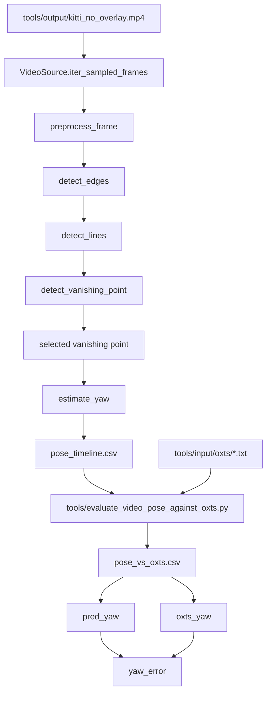
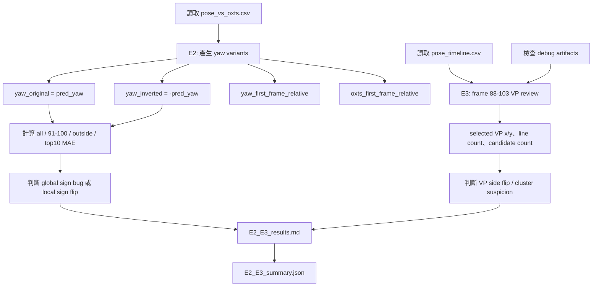

# E2 + E3 實驗設計：yaw 錯誤來源

## 實驗目標

E2 + E3 接在 E1 之後。E1 已確認目前 `pred_yaw` 與 `oxts_yaw` 不是嚴格同語意比較；本段實驗進一步檢查 yaw error 特別大的來源比較像哪一種：

1. yaw 正負號在某些 frame 反了。
2. vanishing point 選到錯誤方向或錯誤群集。
3. 兩者同時發生。
4. 兩者都不是主因。

## 原本流程

## 對應 `02_Analysis`

| Analysis | 在本流程中的角色 |
|---|---|
| A3 Line Detection Analysis | `detect_lines` 產生 line segments，是 VP 與 yaw 的基礎。 |
| A6 Vanishing Point / Yaw Analysis | `detect_vanishing_point` 選出 selected VP，再由 `estimate_yaw` 轉成 yaw。 |
| A7 Pose Integration Analysis | 將 yaw、pitch、roll 整合成 pose result，後續寫入 timeline。 |
| A8 Confidence Analysis | 提供 yaw confidence 與 overall confidence，協助判讀高信心錯誤。 |
| A9 Debug / Output Analysis | 寫出 `pose_timeline.csv` 與 per-frame debug artifacts。 |
| A10 Verification Analysis | 產生 `pose_vs_oxts.csv`，包含 `pred_yaw`、`oxts_yaw`、`yaw_error`。 |

## 新增 E2 + E3 驗證流程

## E2：yaw sign variant 分析

E2 讀取 `outputs/video_pose/evaluation/pose_vs_oxts.csv`，建立下列欄位：

| 欄位 | 定義 |
|---|---|
| `yaw_original` | `pred_yaw` |
| `yaw_inverted` | `-pred_yaw` |
| `yaw_first_frame_relative` | `angle_delta(pred_yaw[t], pred_yaw[0])` |
| `oxts_first_frame_relative` | `angle_delta(oxts_yaw[t], oxts_yaw[0])` |

接著計算四個範圍的 MAE：全部 frame、第 91-100 幀、第 91-100 幀以外、top 10 yaw error frames。

### E2 小階段驗證條件

| 檢查 | 條件 |
|---|---|
| S1 | CSV row count 大於 0。 |
| S2 | 必要欄位存在：`frame_index`, `pred_yaw`, `oxts_yaw`, `abs_yaw_error`。 |
| S3 | 有計算 all frame MAE。 |
| S4 | 有計算第 91-100 幀 MAE。 |
| S5 | 有計算反號後 MAE。 |
| S6 | 結論不能只用局部 frame 做全域 sign bug 判斷，必須同時看 all frame 與 outside 91-100。 |

## E3：vanishing point failure review

E3 鎖定 frame 88-103，包含異常區間第 91-100 幀與前後 frame。每個 frame 整理：

- `frame_index`
- `pred_yaw`
- `oxts_yaw`
- `abs_yaw_error`
- `selected_vanishing_point_x`
- `selected_vanishing_point_y`
- `perspective_line_count`
- `vanishing_point_candidate_count`
- VP 狀態：`correct`, `suspicious`, `wrong`, `missing`

本次執行時 `outputs/video_pose/debug_frames` 不存在，因此 `14_perspective_lines.png`、`15_vanishing_point_candidates.png`、`16_selected_vanishing_point.png`、`17_yaw_overlay.png` 無法做視覺人工確認。E3 結論會區分「資料層 side/sign flip」與「視覺層 VP selection error」。

### E3 小階段驗證條件

| 檢查 | 條件 |
|---|---|
| S1 | frame 88-103 的資料存在。 |
| S2 | 第 91-100 幀都被納入。 |
| S3 | 每個 frame 有 selected VP x/y；若沒有則明確標記 `missing`。 |
| S4 | 每個 frame 有 `perspective_line_count` 與 `vanishing_point_candidate_count`。 |
| S5 | 每個 frame 的人工/資料檢查結果是 `correct`, `suspicious`, `wrong`, `missing` 之一。 |
| S6 | E3 結論必須連回 E2 sign variant 結果。 |

## 輸出檔案

| 檔案 | 用途 |
|---|---|
| `E2_E3_experiment_design.md` | 本實驗設計與驗證條件。 |
| `yaw_sign_variant_analysis.csv` | 每幀 yaw sign variant 與反號改善標記。 |
| `vp_failure_frame_review.md` | frame 88-103 的 VP review。 |
| `E2_E3_results.md` | E2/E3 結果與結論。 |
| `E2_E3_summary.json` | 機器可讀摘要。 |
