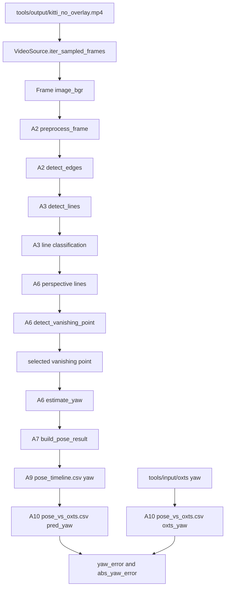
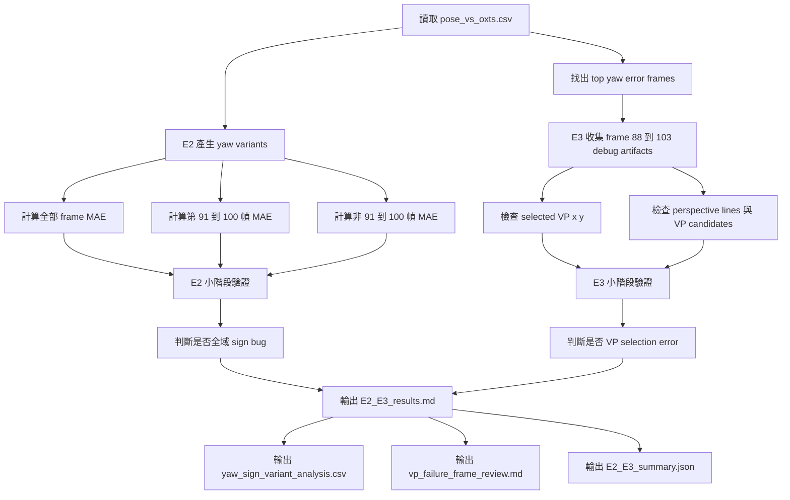

# E2 + E3 實驗設計 Prompt - 驗證 yaw 錯誤來源

## 1. 原本實驗步驟是什麼？

E2 + E3 是第二段實驗：「yaw 錯誤來源」。這一段接在 E1 之後，目的不是再確認比較語意，而是要判斷：

```text
如果 yaw 數值真的異常，錯誤比較像是正負號問題，還是 vanishing point 選錯？
```

這一段對應 `02_Analysis` 的下列部分：

| Analysis ID | 名稱 | 在原本流程中的角色 |
|---|---|---|
| A3 | Line Detection Analysis | 產生 line segments，後續 VP 與 yaw 都依賴這些線 |
| A6 | Vanishing Point / Yaw Analysis | 從 perspective lines 找 VP，再用 VP x 位置估 yaw |
| A7 | Pose Integration Analysis | 將 yaw 與 pitch / roll 整合成 `PoseResult` |
| A8 | Confidence Analysis | 提供 yaw confidence，但 E2 + E3 主要先看 yaw 錯誤來源 |
| A9 | Debug / Output Analysis | 提供 `pose_timeline.csv` 與 frame debug artifacts |
| A10 | Verification Analysis | 提供 `pose_vs_oxts.csv`、`worst_frames.csv` 與 yaw error |

原本 yaw 的產生方式：

```text
影像 frame
-> edge map
-> line segments
-> perspective lines
-> vanishing point candidates
-> selected vanishing point
-> yaw = atan((vp_x - center_x) / focal_length_pixels)
-> pose_timeline.csv 的 yaw
-> evaluation 的 pred_yaw
```

### 原始 yaw 資料流 Mermaid



### 原始資料傳遞表

| 階段 | 程式 / 函式 | 輸入 | 輸出 | 傳遞項目 |
|---|---|---|---|---|
| 影片逐幀讀取 | `VideoSource.iter_sampled_frames` | `kitti_no_overlay.mp4` | sampled frame | `frame_index`, `time_sec`, `Frame.image_bgr` |
| 前處理 | `preprocess_frame`, `detect_edges` | `Frame` | `EdgeMap` | grayscale, blur, edge map |
| 線段偵測 | `detect_lines` | `EdgeMap` | `LineFeatureSet` | detected lines, filtered lines, line angle, line length |
| VP 偵測 | `detect_vanishing_point` | `LineFeatureSet`, image size | `VanishingPointFeatureSet` | perspective lines, VP candidates, selected VP |
| yaw 估計 | `estimate_yaw` | selected VP, image size, focal fallback | `YawEstimate` | `yaw`, `yaw_confidence`, method |
| pose 輸出 | `VideoPoseFrameResult.to_timeline_row` | `PoseResult`, feature metadata | `pose_timeline.csv` | `yaw`, `selected_vanishing_point_x`, `selected_vanishing_point_y` |
| 評估 | `tools/evaluate_video_pose_against_oxts.py` | `pose_timeline.csv`, OXTS poses | `pose_vs_oxts.csv` | `pred_yaw`, `oxts_yaw`, `yaw_error`, `abs_yaw_error` |

## 2. E2 + E3 的實驗設計是什麼？

E2 + E3 共同驗證「yaw 錯誤來源」。

| 實驗 | 問題 | 對應分析 | 驗證重點 |
|---|---|---|---|
| E2 | yaw 的正負號是不是在某些 frame 反了？ | A6 + A10 | 全域反號、局部反號、異常 frame 區間 |
| E3 | vanishing point 是否選錯？ | A3 + A6 + A9 | selected VP 是否跳到錯誤方向或錯誤群集 |

E2 不修改 production code，只產生不同 yaw variant 的分析。

E3 不修改 production code，只針對異常區間 frame 產生 / 檢查 debug artifacts 與 VP 數值。

### 新增 E2 + E3 驗證流程 Mermaid



### 每個小階段完成後必跑驗證

| 小階段 | 完成條件 | 驗證方式 |
|---|---|---|
| S1 讀取資料 | 成功讀取 `pose_vs_oxts.csv` | 驗證 row count 大於 0，且包含 `pred_yaw`, `oxts_yaw`, `abs_yaw_error` |
| S2 E2 yaw variant | 產出原始 yaw、反號 yaw、局部區間統計 | 驗證全域反號 MAE、91-100 反號 MAE 都有輸出 |
| S3 E2 判斷 | 判斷是否全域 sign bug | 驗證不能只看局部改善，必須同時看全域 MAE |
| S4 E3 frame 範圍 | 鎖定 frame 88-103 | 驗證包含異常前、異常段、異常後 |
| S5 E3 VP 檢查 | 整理 selected VP 與 debug artifacts | 驗證每個 frame 都有 VP x/y 或明確標記缺失 |
| S6 E2+E3 結論 | 產出結果文件與 JSON | 驗證假說成立 / 不成立都有證據 |

## 3. 可整段複製使用的 Prompt

下面這段可以整段複製給 agent 執行 E2 + E3。

```text
你是本專案的 geometry pose debug agent。請用繁體中文完成第二段實驗：E2 + E3，主題是「yaw 錯誤來源」。

任務目標：
驗證目前 yaw error 特別大的原因，比較像：
1. yaw 正負號在某些 frame 反了；
2. vanishing point 選到錯誤方向或錯誤群集；
3. 兩者同時發生；
4. 或兩者都不是主因。

請先說明原本實驗步驟，並畫出 Mermaid 圖。

原本流程必須包含：
- `tools/output/kitti_no_overlay.mp4`
- `VideoSource.iter_sampled_frames`
- `preprocess_frame`
- `detect_edges`
- `detect_lines`
- `detect_vanishing_point`
- `selected vanishing point`
- `estimate_yaw`
- `pose_timeline.csv`
- `pose_vs_oxts.csv`
- `pred_yaw`
- `oxts_yaw`
- `yaw_error`

請說明這段流程屬於 `02_Analysis` 的哪些部分：
- A3 Line Detection Analysis
- A6 Vanishing Point / Yaw Analysis
- A7 Pose Integration Analysis
- A8 Confidence Analysis
- A9 Debug / Output Analysis
- A10 Verification Analysis

接著說明本次 E2 + E3 新增的實驗步驟，並畫出第二張 Mermaid 圖。

E2：驗證 yaw 的正負號是不是在某些 frame 反了。

E2 必須做：
1. 讀取 `outputs/video_pose/evaluation/pose_vs_oxts.csv`。
2. 產生 yaw variants：
   - `yaw_original = pred_yaw`
   - `yaw_inverted = -pred_yaw`
   - `yaw_first_frame_relative = angle_delta(pred_yaw[t], pred_yaw[0])`
   - `oxts_first_frame_relative = angle_delta(oxts_yaw[t], oxts_yaw[0])`
3. 計算下列範圍的 MAE：
   - 全部 frame。
   - 第 91-100 幀。
   - 第 91-100 幀以外。
   - top 10 yaw error frames。
4. 判斷：
   - 如果全域反號改善全部 frame，代表可能是全域 sign bug。
   - 如果只有第 91-100 幀改善，代表不是全域 sign bug，較可能是局部 VP / 場景問題。

E2 每個小階段完成後都要跑驗證：
- S1：確認 CSV row count 大於 0。
- S2：確認必要欄位存在：`frame_index`, `pred_yaw`, `oxts_yaw`, `abs_yaw_error`。
- S3：確認有計算 all frame MAE。
- S4：確認有計算第 91-100 幀 MAE。
- S5：確認有計算反號後 MAE。
- S6：確認結論沒有只用局部 frame 做全域判斷。

E3：驗證 vanishing point 是否選錯。

E3 必須做：
1. 鎖定 frame 88-103。
2. 檢查第 91-100 幀，以及異常前後 frame。
3. 收集或檢查 debug artifacts：
   - `14_perspective_lines.png`
   - `15_vanishing_point_candidates.png`
   - `16_selected_vanishing_point.png`
   - `17_yaw_overlay.png`
4. 從 `pose_timeline.csv` 或 `frame_pose_results.json` 整理：
   - `frame_index`
   - `pred_yaw`
   - `oxts_yaw`
   - `abs_yaw_error`
   - `selected_vanishing_point_x`
   - `selected_vanishing_point_y`
   - `perspective_line_count`
   - `vanishing_point_candidate_count`
5. 判斷 selected VP 是否：
   - 在第 91 幀附近突然跳邊；
   - 落在視覺上不合理的方向；
   - 有多個 VP cluster，但選到錯誤 cluster；
   - 被非道路 / 非主要透視線主導。

E3 每個小階段完成後都要跑驗證：
- S1：確認 frame 88-103 的資料存在。
- S2：確認第 91-100 幀都被納入。
- S3：確認每個 frame 有 selected VP x/y，若沒有要明確標記缺失。
- S4：確認每個 frame 有 perspective_line_count 與 vanishing_point_candidate_count。
- S5：確認人工檢查結果有 `correct`, `suspicious`, `wrong`, `missing` 四種狀態之一。
- S6：確認 E3 結論有連回 E2 的 sign variant 結果。

請輸出下列檔案：

1. `breakdown/01_Geometry_Based_Pose/06_Debug/issue_002_yaw_oxts_debug/experiment_results/E2_E3_outputs/E2_E3_experiment_design.md`
   - 說明原本流程 Mermaid。
   - 說明新增 E2 + E3 驗證流程 Mermaid。
   - 說明每個小階段的驗證條件。

2. `breakdown/01_Geometry_Based_Pose/06_Debug/issue_002_yaw_oxts_debug/experiment_results/E2_E3_outputs/yaw_sign_variant_analysis.csv`
   - 欄位至少包含：
     `frame_index`, `pred_yaw`, `oxts_yaw`, `abs_yaw_error`, `yaw_inverted`, `abs_yaw_error_inverted`, `is_91_100`, `inversion_improves_error`

3. `breakdown/01_Geometry_Based_Pose/06_Debug/issue_002_yaw_oxts_debug/experiment_results/E2_E3_outputs/vp_failure_frame_review.md`
   - 每個 frame 88-103 都要有一列。
   - 每列要包含 VP 狀態：`correct`, `suspicious`, `wrong`, 或 `missing`。

4. `breakdown/01_Geometry_Based_Pose/06_Debug/issue_002_yaw_oxts_debug/experiment_results/E2_E3_outputs/E2_E3_results.md`
   - 說明 E2 結論。
   - 說明 E3 結論。
   - 說明是否支持「局部 VP / 正負號 / 群集失敗」。

5. `breakdown/01_Geometry_Based_Pose/06_Debug/issue_002_yaw_oxts_debug/experiment_results/E2_E3_outputs/E2_E3_summary.json`
   JSON 建議格式：
   {
     "experiment": "E2_E3_yaw_error_source",
     "e2_global_sign_bug_confirmed": false,
     "e2_local_sign_flip_suspected": true,
     "e3_vp_selection_error_confirmed": null,
     "frames_reviewed": [],
     "production_code_modified": false,
     "validation_checks": []
   }

判定標準：
1. 如果 yaw 反號改善全部 frame，E2 判定全域 sign bug 成立。
2. 如果 yaw 反號只改善第 91-100 幀，但傷害全部 frame，E2 判定不是全域 sign bug，而是局部錯誤。
3. 如果第 91-100 幀 selected VP 明顯跳到錯誤方向，E3 判定 VP selection error 成立。
4. 如果 selected VP 視覺合理，但仍與 OXTS yaw 差很多，則比較語意或座標系問題仍是主因。
5. 如果 E2 顯示局部反號改善，且 E3 顯示 VP 選錯，則支持「第 91-100 幀局部 VP / 正負號 / 群集失敗」。

最終回覆格式：
E2 + E3 驗證完成。

結論：
- global sign bug confirmed: true / false
- local sign flip suspected: true / false
- VP selection error confirmed: true / false / inconclusive

主要證據：
1. ...
2. ...
3. ...

每個小階段驗證：
- S1: pass / fail
- S2: pass / fail
- S3: pass / fail
- S4: pass / fail
- S5: pass / fail
- S6: pass / fail

本次修改：
- production code modified: false
- written files:
  - ...

後續建議：
1. ...
2. ...
```
