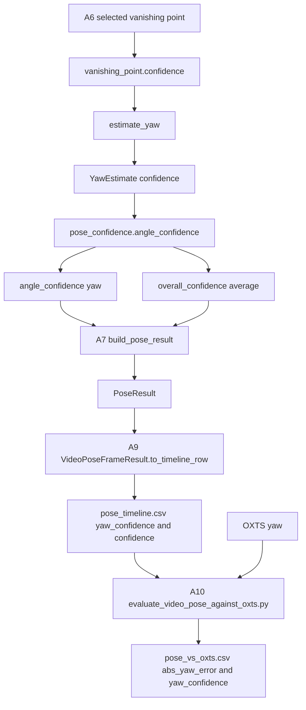
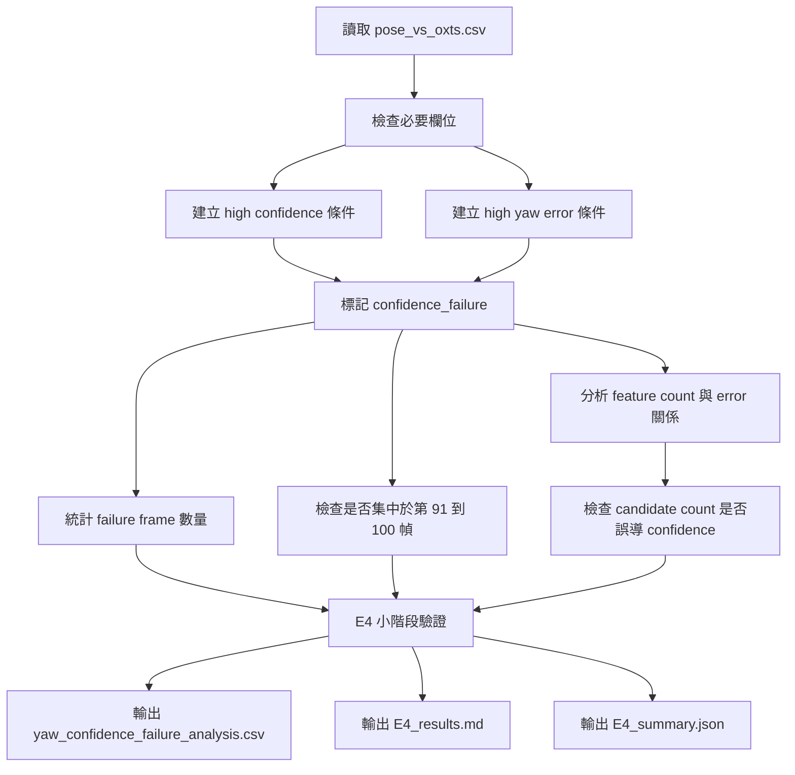

# E4 實驗設計 Prompt - 驗證 confidence 可靠度

## 1. 原本實驗步驟是什麼？

E4 是第三段實驗：「confidence 可靠度」。這一段接在 E1、E2+E3 之後，目的不是再找 yaw 為什麼錯，而是要驗證：

```text
當 yaw 明顯錯誤時，系統的 confidence 是否有跟著降低？
如果沒有，為什麼 confidence 錯了還很高？
```

這一段對應 `02_Analysis` 的下列部分：

| Analysis ID | 名稱 | 在原本流程中的角色 |
|---|---|---|
| A6 | Vanishing Point / Yaw Analysis | 產生 `YawEstimate`，其中 `yaw.confidence` 來自 selected VP confidence |
| A7 | Pose Integration Analysis | 將 `YawEstimate` 整合進 `PoseResult` |
| A8 | Confidence Analysis | 將 yaw / pitch / roll confidence 整合成 per-angle 與 overall confidence |
| A9 | Debug / Output Analysis | 將 `yaw_confidence` 與 `confidence` 寫入 `pose_timeline.csv` |
| A10 | Verification Analysis | 產生 `abs_yaw_error`，讓 confidence 可以和實際錯誤比對 |

原本 confidence 的產生方式：

```text
selected vanishing point
-> vanishing_point.confidence
-> YawEstimate.confidence
-> angle_confidence["yaw"]
-> PoseResult.confidence = average(valid angle confidence)
-> pose_timeline.csv 的 yaw_confidence / confidence
-> pose_vs_oxts.csv 的 yaw_confidence / confidence / abs_yaw_error
```

### 原始 confidence 資料流 Mermaid



### 原始資料傳遞表

| 階段 | 程式 / 函式 | 輸入 | 輸出 | 傳遞項目 |
|---|---|---|---|---|
| VP 偵測 | `detect_vanishing_point` | `LineFeatureSet`, image size | `VanishingPointFeatureSet` | `selected_vanishing_point`, `confidence`, `candidate_count`, `perspective_line_count` |
| yaw 估計 | `estimate_yaw` | `VanishingPointFeatureSet` | `YawEstimate` | `yaw`, `confidence`, `method` |
| confidence 整合 | `angle_confidence` | `YawEstimate`, `PitchEstimate`, `RollEstimate` | dict | `angle_confidence["yaw"]`, `angle_confidence["pitch"]`, `angle_confidence["roll"]` |
| overall confidence | `overall_confidence` | per-angle confidence | float | `confidence` |
| pose 整合 | `build_pose_result` | angle estimates | `PoseResult` | `yaw`, `confidence`, `angle_confidence` |
| timeline 輸出 | `VideoPoseFrameResult.to_timeline_row` | `PoseResult` | `pose_timeline.csv` | `yaw_confidence`, `confidence`, feature counts |
| 評估比對 | `tools/evaluate_video_pose_against_oxts.py` | `pose_timeline.csv`, OXTS poses | `pose_vs_oxts.csv` | `abs_yaw_error`, `yaw_confidence`, `confidence` |

## 2. E4 的實驗設計是什麼？

E4 要驗證「confidence 是否可靠」。具體來說，要找出：

```text
high confidence + high yaw error
```

這類 frame 代表系統「錯了但仍然很有信心」。E4 不修改 production code，只建立分析輸出，確認目前 confidence 是否能反映 yaw failure。

### 新增 E4 驗證流程 Mermaid



### 每個小階段完成後必跑驗證

| 小階段 | 完成條件 | 驗證方式 |
|---|---|---|
| S1 讀取資料 | 成功讀取 `pose_vs_oxts.csv` | 驗證 row count 大於 0 |
| S2 欄位檢查 | 必要欄位存在 | 驗證包含 `frame_index`, `abs_yaw_error`, `yaw_confidence`, `confidence` |
| S3 failure 標記 | 建立 `high_confidence`, `high_error`, `confidence_failure` | 驗證三個欄位皆非空 |
| S4 區間檢查 | 檢查 failure 是否集中第 91-100 幀 | 驗證有輸出全域與 91-100 統計 |
| S5 特徵關聯 | 檢查 feature counts 與 yaw error | 驗證有分析 `perspective_line_count`, `vanishing_point_candidate_count` |
| S6 結論輸出 | 產生結果文件與 JSON | 驗證有明確結論與後續建議 |

## 3. 可整段複製使用的 Prompt

下面這段可以整段複製給 agent 執行 E4。

```text
你是本專案的 geometry pose debug agent。請用繁體中文完成第三段實驗：E4，主題是「confidence 可靠度」。

任務目標：
驗證當 yaw 明顯錯誤時，系統的 yaw confidence / overall confidence 是否有反映不可靠。如果 yaw 錯很大但 confidence 仍然很高，請確認 confidence failure 是否成立。

對應問題：
E4：yaw confidence 為什麼錯了還很高？

請先說明原本實驗步驟，並畫出 Mermaid 圖。

原本流程必須包含：
- `detect_vanishing_point`
- `selected_vanishing_point.confidence`
- `estimate_yaw`
- `YawEstimate.confidence`
- `angle_confidence`
- `overall_confidence`
- `build_pose_result`
- `pose_timeline.csv`
- `pose_vs_oxts.csv`
- `yaw_confidence`
- `confidence`
- `abs_yaw_error`

請說明這段流程屬於 `02_Analysis` 的哪些部分：
- A6 Vanishing Point / Yaw Analysis
- A7 Pose Integration Analysis
- A8 Confidence Analysis
- A9 Debug / Output Analysis
- A10 Verification Analysis

接著說明本次 E4 新增的實驗步驟，並畫出第二張 Mermaid 圖。

E4 必須做：
1. 讀取 `outputs/video_pose/evaluation/pose_vs_oxts.csv`。
2. 檢查必要欄位：
   - `frame_index`
   - `pred_yaw`
   - `oxts_yaw`
   - `abs_yaw_error`
   - `yaw_confidence`
   - `confidence`
   - `detected_line_count`
   - `perspective_line_count`
   - `vanishing_point_candidate_count`
   - `horizon_candidate_count`
3. 建立 high confidence 條件：
   - `high_yaw_confidence = yaw_confidence >= 0.85`
   - `high_overall_confidence = confidence >= 0.85`
4. 建立 high error 條件：
   - `high_yaw_error = abs_yaw_error >= 30`
5. 建立 confidence failure 條件：
   - `yaw_confidence_failure = high_yaw_confidence and high_yaw_error`
   - `overall_confidence_failure = high_overall_confidence and high_yaw_error`
6. 分析下列統計：
   - 全部 frame 的 confidence failure 數量。
   - 第 91-100 幀的 confidence failure 數量。
   - confidence failure 是否集中在第 91-100 幀。
   - `vanishing_point_candidate_count` 高時，yaw error 是否仍然高。
   - `perspective_line_count` 高時，yaw error 是否仍然高。
7. 判斷目前 confidence 是否過度依賴 candidate/support 數量，而缺少 VP 正確性、VP 穩定性或 VP ambiguity 指標。

E4 每個小階段完成後都要跑驗證：
- S1：確認 CSV row count 大於 0。
- S2：確認必要欄位存在。
- S3：確認 `high_yaw_confidence`, `high_yaw_error`, `yaw_confidence_failure` 都已產生。
- S4：確認有輸出全域 confidence failure 統計。
- S5：確認有輸出第 91-100 幀 confidence failure 統計。
- S6：確認有分析 `perspective_line_count` 與 `vanishing_point_candidate_count`。
- S7：確認結論有說明 confidence 是否可靠，以及為什麼不可靠。

請輸出下列檔案：

1. `breakdown/01_Geometry_Based_Pose/06_Debug/issue_002_yaw_oxts_debug/experiment_results/E4_outputs/E4_experiment_design.md`
   - 說明原本 confidence 流程 Mermaid。
   - 說明新增 E4 驗證流程 Mermaid。
   - 說明每個小階段的驗證條件。

2. `breakdown/01_Geometry_Based_Pose/06_Debug/issue_002_yaw_oxts_debug/experiment_results/E4_outputs/yaw_confidence_failure_analysis.csv`
   - 欄位至少包含：
     `frame_index`, `pred_yaw`, `oxts_yaw`, `abs_yaw_error`, `yaw_confidence`, `confidence`, `high_yaw_confidence`, `high_yaw_error`, `yaw_confidence_failure`, `perspective_line_count`, `vanishing_point_candidate_count`, `is_91_100`

3. `breakdown/01_Geometry_Based_Pose/06_Debug/issue_002_yaw_oxts_debug/experiment_results/E4_outputs/E4_results.md`
   - 說明 confidence failure 是否成立。
   - 說明 failure 是否集中在第 91-100 幀。
   - 說明目前 confidence 為什麼錯了還很高。
   - 說明後續應新增哪些 confidence 特徵。

4. `breakdown/01_Geometry_Based_Pose/06_Debug/issue_002_yaw_oxts_debug/experiment_results/E4_outputs/E4_summary.json`
   JSON 建議格式：
   {
     "experiment": "E4_confidence_reliability",
     "yaw_confidence_failure_confirmed": true,
     "failure_thresholds": {
       "high_yaw_confidence": 0.85,
       "high_yaw_error_deg": 30
     },
     "failure_count_all_frames": 0,
     "failure_count_91_100": 0,
     "production_code_modified": false,
     "validation_checks": []
   }

判定標準：
1. 如果 `abs_yaw_error >= 30` 且 `yaw_confidence >= 0.85` 的 frame 大量存在，E4 判定 yaw confidence failure 成立。
2. 如果 confidence failure 集中在第 91-100 幀，代表 confidence 沒抓到該段局部 yaw failure。
3. 如果 `vanishing_point_candidate_count` 很高但 yaw error 也很高，代表 candidate 數量不能直接代表 yaw 正確性。
4. 如果 confidence failure 不明顯，代表目前 confidence 至少能反映 yaw error，E4 不成立。
5. 如果 E2+E3 已經指出局部 VP / 正負號 / 群集失敗，而 E4 又顯示高 confidence，則結論應是：confidence 缺少 VP stability / ambiguity / temporal jump 檢查。

最終回覆格式：
E4 驗證完成。

結論：
- yaw confidence failure confirmed: true / false
- failure concentrated in frames 91-100: true / false
- confidence reliable for yaw failure: true / false

主要證據：
1. ...
2. ...
3. ...

每個小階段驗證：
- S1: pass / fail
- S2: pass / fail
- S3: pass / fail
- S4: pass / fail
- S5: pass / fail
- S6: pass / fail
- S7: pass / fail

本次修改：
- production code modified: false
- written files:
  - ...

後續建議：
1. ...
2. ...
```
