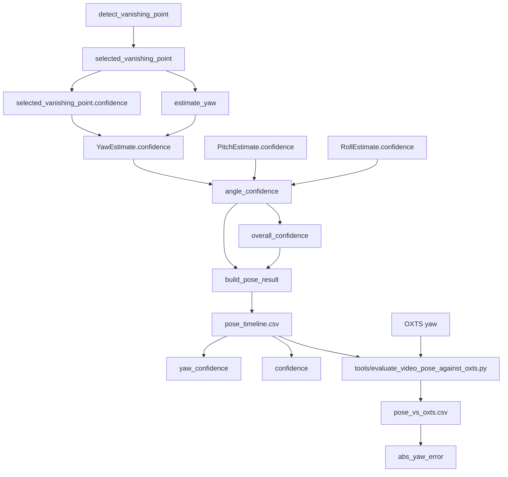
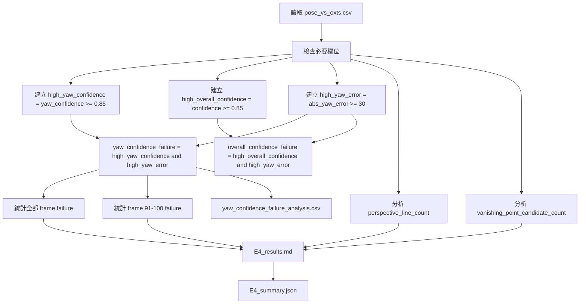

# E4 實驗設計：confidence 可靠度

## 實驗目標

E4 要驗證：當 yaw 明顯錯誤時，系統的 `yaw_confidence` 與 overall `confidence` 是否會反映不可靠。

如果 `abs_yaw_error` 很大，但 `yaw_confidence` 或 `confidence` 仍然很高，則判定 confidence failure 成立。

## 原本 confidence 流程

## 對應 `02_Analysis`

| Analysis | 在本流程中的角色 |
|---|---|
| A6 Vanishing Point / Yaw Analysis | `detect_vanishing_point` 產生 selected VP 與 VP confidence，`estimate_yaw` 將 VP 轉成 yaw。 |
| A7 Pose Integration Analysis | `build_pose_result` 將 yaw、pitch、roll 與 confidence 整合成 pose result。 |
| A8 Confidence Analysis | `angle_confidence` 保存各角度 confidence，`overall_confidence` 計算平均 confidence。 |
| A9 Debug / Output Analysis | `pose_timeline.csv` 寫出 `yaw_confidence` 與 `confidence`。 |
| A10 Verification Analysis | `pose_vs_oxts.csv` 提供 `abs_yaw_error`，用於檢查 confidence 是否可靠。 |

## 新增 E4 驗證流程

## E4 判定條件

| 條件 | 定義 |
|---|---|
| high yaw confidence | `yaw_confidence >= 0.85` |
| high overall confidence | `confidence >= 0.85` |
| high yaw error | `abs_yaw_error >= 30` |
| yaw confidence failure | `high_yaw_confidence and high_yaw_error` |
| overall confidence failure | `high_overall_confidence and high_yaw_error` |

## 小階段驗證條件

| 檢查 | 條件 |
|---|---|
| S1 | CSV row count 大於 0。 |
| S2 | 必要欄位存在：`frame_index`, `pred_yaw`, `oxts_yaw`, `abs_yaw_error`, `yaw_confidence`, `confidence`, `detected_line_count`, `perspective_line_count`, `vanishing_point_candidate_count`, `horizon_candidate_count`。 |
| S3 | `high_yaw_confidence`, `high_yaw_error`, `yaw_confidence_failure` 都已產生。 |
| S4 | 有輸出全域 confidence failure 統計。 |
| S5 | 有輸出第 91-100 幀 confidence failure 統計。 |
| S6 | 有分析 `perspective_line_count` 與 `vanishing_point_candidate_count`。 |
| S7 | 結論有說明 confidence 是否可靠，以及為什麼不可靠。 |

## 輸出檔案

| 檔案 | 用途 |
|---|---|
| `E4_experiment_design.md` | 本實驗設計與驗證條件。 |
| `yaw_confidence_failure_analysis.csv` | 每幀 high confidence / high error / confidence failure 標記。 |
| `E4_results.md` | E4 結果與結論。 |
| `E4_summary.json` | 機器可讀摘要。 |

