# Requirements Breakdown

```mermaid
flowchart TD
    %% =========================
    %% Requirement Layer
    %% =========================
    R["Photo Metadata Geometry Analyzer<br/>需求分解"] --> R1["核心功能需求"]
    R --> R2["輸入需求"]
    R --> R3["Metadata / EXIF 需求"]
    R --> R4["輸出需求"]
    R --> R5["幾何分析需求"]
    R --> R6["開發與驗證需求"]

    %% =========================
    %% Core Requirement
    %% =========================
    R1 --> R1A["讀取照片 Metadata / EXIF"]
    R1 --> R1B["解析常用攝影參數"]
    R1 --> R1C["建立標準化資料模型"]
    R1 --> R1D["保留未來幾何推估擴充空間"]

    %% =========================
    %% Input Requirement
    %% =========================
    R2 --> R2A["支援 CLI 輸入"]
    R2 --> R2B["支援檔案路徑參數"]
    R2 --> R2C["支援 JPEG / JPG"]
    R2 --> R2D["支援 HEIC / HEIF"]
    R2 --> R2E["檢查檔案是否存在與格式是否可讀"]

    R2A --> T1["argparse / click"]
    R2C --> T2["Pillow"]
    R2D --> T3["pillow-heif"]

    %% =========================
    %% Metadata Requirement
    %% =========================
    R3 --> R3A["解析 EXIF 標籤"]
    R3 --> R3B["讀取 Focal Length"]
    R3 --> R3C["讀取 Exposure Time"]
    R3 --> R3D["讀取 F-Number"]
    R3 --> R3E["讀取 ISO / White Balance"]
    R3 --> R3F["讀取相機 Make / Model / Orientation"]
    R3 --> R3G["讀取 GPS / GPSImgDirection"]

    R3A --> T4["ExifRead / Pillow EXIF"]
    R3A --> T5["EXIF Tag Mapping"]
    R3A --> T6["JEITA / CIPA EXIF Standard"]

    %% =========================
    %% Output Requirement
    %% =========================
    R4 --> R4A["輸出 Rich Table"]
    R4 --> R4B["輸出 JSON"]
    R4 --> R4C["顯示 Warning"]
    R4 --> R4D["缺少欄位顯示 N/A"]

    R4A --> T7["rich"]
    R4B --> T8["json"]
    R4C --> T9["error handling"]

    %% =========================
    %% Geometry Requirement
    %% =========================
    R5 --> R5A["以焦距與感光元件估算 FOV"]
    R5 --> R5B["以 GPSImgDirection 取得拍攝方向"]
    R5 --> R5C["保留 Pose Estimation 介面"]
    R5 --> R5D["保留 Depth Estimation 介面"]
    R5 --> R5E["輸出 Derived Geometry 欄位"]

    R5A --> T10["Camera Calibration Profile"]
    R5A --> T11["FOV Formula"]
    R5C --> T12["Pose Estimation Placeholder"]
    R5D --> T13["Depth Estimation Placeholder"]

    %% =========================
    %% Development Requirement
    %% =========================
    R6 --> R6A["建立 Python src/ 結構"]
    R6 --> R6B["加入 pytest 測試"]
    R6 --> R6C["補 README 使用說明"]
    R6 --> R6D["定義資料 schema"]
    R6 --> R6E["支援 Python 3.10+"]

    R6A --> T14["src/ layout"]
    R6B --> T15["pytest"]
    R6C --> T16["Markdown"]
    R6D --> T17["dataclass / dict schema"]
    R6E --> T18["Python 3.10+"]

    %% =========================
    %% Style
    %% =========================
    style R fill:#e3f2fd,stroke:#1565c0,stroke-width:2px
    style R1 fill:#f1f8e9,stroke:#33691e
    style R2 fill:#fff3e0,stroke:#ef6c00
    style R3 fill:#fce4ec,stroke:#ad1457
    style R4 fill:#ede7f6,stroke:#4527a0
    style R5 fill:#e0f2f1,stroke:#00695c
    style R6 fill:#f5f5f5,stroke:#424242
```

## Requirement Summary

| Area | Requirement | Notes |
| --- | --- | --- |
| Core | 讀取照片 Metadata / EXIF | 作為 MVP 的主要功能 |
| Input | CLI 接收圖片路徑 | 需支援 `--path`、格式檢查與錯誤提示 |
| Metadata | 解析焦距、曝光、光圈、ISO、相機資訊、GPS | 缺少欄位時以 `N/A` 呈現 |
| Output | Rich Table 與 JSON | 需支援 `--json` 與 `--output` |
| Geometry | FOV、方向、Pose / Depth placeholder | Phase 6 擴充層，不要求完整 3D 重建 |
| Development | Python 專案結構、測試、README | 建議使用 Python 3.10+ |
