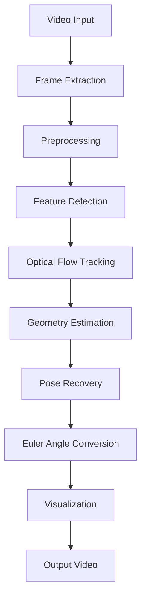

# Optical Camera-Pose Estimation Overview

## 1. 專案目標

本專案目標是從影片中的 2D optical flow 變化估計攝影機的 3D 姿態變化，並將 yaw、pitch、roll、tracked feature points、optical flow vectors、inlier count、confidence 等資訊疊加回輸出影片。

第一版目標是建立可運作、可 debug、可驗證的 pipeline，不追求最高精度，也不直接引入 deep learning optical flow 或 SLAM。

## 2. 核心問題

Optical flow 本身只提供影像平面上的 2D pixel displacement：

```text
flow = (u, v) = (x_{t+1} - x_t, y_{t+1} - y_t)
```

它不等同於 camera pose。要從 optical flow 推估姿態，還需要：

- 相機內參矩陣 `K`
- 2D pixel coordinate 到 normalized camera coordinate 的轉換
- feature matching / tracking quality control
- Essential Matrix 或 Homography 等幾何模型
- RANSAC outlier rejection
- pose recovery 得到相對旋轉 `R` 與平移方向 `t`
- rotation matrix 轉 yaw / pitch / roll

## 3. Input / Output

| 類別 | 說明 |
|---|---|
| Input | 影片檔案，例如 `.mp4`、`.avi`、`.mov` |
| Output Video | 疊加 optical flow vectors、tracked points、yaw、pitch、roll、inlier count、confidence 的影片 |
| Output Logs | 每幀 pose、tracking statistics、inlier ratio、warnings 的 CSV / JSON |
| Debug Artifacts | frame overlay、flow track image、RANSAC inlier mask、pose timeline |

## 4. High-Level Pipeline



## 5. 預期成果

第一版完成後應具備：

- 可讀取影片並逐幀處理。
- 可用 Shi-Tomasi 偵測角點。
- 可用 Pyramidal Lucas-Kanade sparse optical flow 追蹤特徵點。
- 可透過 calibration video，也就是棋盤格或 Charuco board，使用 `cv2.calibrateCamera` 建立 camera intrinsic matrix `K`。
- 可使用 Essential Matrix + RANSAC 過濾 outliers。
- 可使用 `recoverPose` 或等價方法取得相對旋轉矩陣 `R`。
- 可將 `R` 轉成 yaw / pitch / roll。
- 可將 pose 與 tracking debug 資訊疊加回影片。

## 6. 章節索引

| 章節 | 目的 |
|---|---|
| `00_Overview/README.md` | 專案目標、輸入輸出、核心流程 |
| `01_Requirements/README.md` | 功能需求、非功能需求、限制 |
| `02_Analysis/README.md` | 技術方法、數學模型、工具比較 |
| `03_Design/README.md` | 第一版技術選型與 pipeline 設計 |
| `04_Implementation/README.md` | 實作階段與完成條件 |
| `05_Verification/README.md` | 驗證指標、測試案例、結果判讀 |
| `06_Debug/README.md` | 未來 debug 類別與排查方向 |
