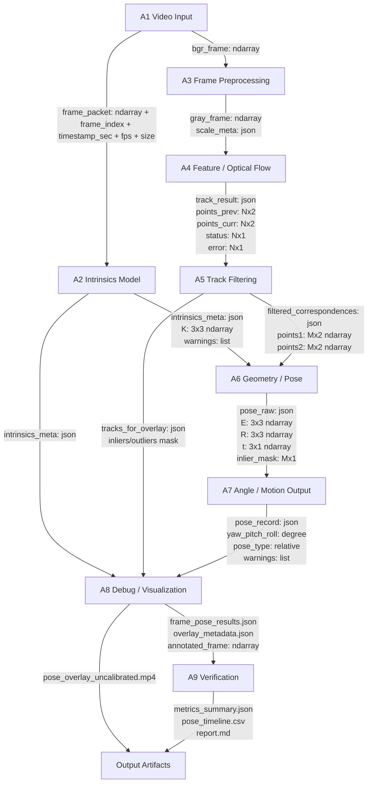
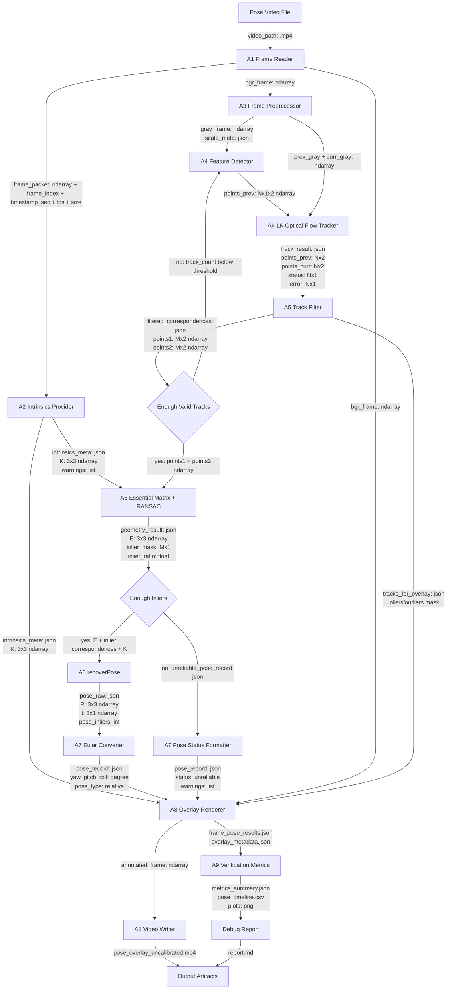

# Optical Flow Pose Analysis

## 1. 目的

本文件負責整理「若要完成 Optical Flow Pose 這個主題，需要拆成哪些分析架構與模組」。Analysis 階段不直接決定程式檔案怎麼切，而是先定義問題邊界、資料流、可用工具與最後流程。

目前主決策與上層 `breakdown/02_Optical_Flow_Pose/README.md` 對齊：

- 第一版不假設一定有 chessboard / Charuco calibration video。
- 主流程使用 approximate camera intrinsics。
- 所有姿態結果都必須標示為 debug / relative pose，不宣稱 calibrated absolute pose。
- 若未來取得可靠 calibration result，Design 可以把 `A2 Intrinsics Model` 升級為 calibrated K，但不改動其他主架構。

第一版 approximate K：

```text
f = max(width, height)
cx = width / 2
cy = height / 2
K =
| f   0  cx |
| 0   f  cy |
| 0   0   1 |
```

輸出必須包含：

```text
intrinsics_not_calibrated
approximate_K_used
pose_for_debug_only
```

## 2. Analysis 架構總覽

| ID | 分析架構 | 分析重點 | Design 對應 |
|---|---|---|---|
| A1 | Video Input Analysis | 定義影片讀取、抽幀策略與時間資訊保存方式 | D1 Video IO |
| A2 | Intrinsics Model Analysis | 定義沒有 calibration 時 approximate K 的建立方式與可信度標記 | D2 Intrinsics Provider |
| A3 | Frame Preprocessing Analysis | 定義 frame 灰階化、縮放與影像穩定化處理 | D3 Preprocessor |
| A4 | Feature / Optical Flow Analysis | 定義可追蹤特徵點選擇與 sparse optical flow 估計方式 | D4 Tracker |
| A5 | Track Filtering Analysis | 定義 tracks 保留條件、outlier 移除與動態物體污染處理 | D5 Track Filter |
| A6 | Geometry / Pose Analysis | 定義由 2D correspondences 估計 frame-to-frame relative pose 的方法 | D6 Geometry Solver |
| A7 | Angle / Motion Output Analysis | 定義 yaw / pitch / roll 與 frame-to-frame motion 的輸出格式 | D7 Pose Formatter |
| A8 | Debug / Visualization Analysis | 定義結果檢查、參數調整與 overlay 回放方式 | D8 Debug Renderer |
| A9 | Verification Analysis | 定義 debug pose 穩定性判斷與可信度限制 | D9 Verification |

## 3. 模組分析

### A1. Video Input Analysis

目標是把 pose video 轉成穩定的 frame sequence，並保留 `frame_index`、`timestamp_sec`、`fps`、`width`、`height`。

需要確認：

- 是否逐幀處理，或每 N 幀取樣。
- 是否限制最大分析幀數，避免 debug 階段輸出過多。
- 輸出 overlay video 時是否保持原始 fps。

### A2. Intrinsics Model Analysis

第一版使用 approximate K，因為目前不假設會有 calibration video。

需要確認：

- `K` 是否根據實際處理解析度建立。
- 若 frame resize，`cx`、`cy`、`f` 必須跟著處理後解析度走。
- 所有 pose JSON、evaluation report、overlay 都要輸出 warning。

未來可升級路線：

| 模式 | 來源 | 信任等級 | 備註 |
|---|---|---:|---|
| approximate K | `f=max(width,height)` | 低 | 第一版 debug 主流程 |
| FOV-derived K | 使用者或資料集提供 FOV | 中低 | 只能當 fallback |
| calibrated K | calibration video / camera intrinsics file | 高 | 後續正式 pose pipeline |

### A3. Frame Preprocessing Analysis

目標是提供穩定的 tracking input。

建議處理：

- BGR frame 轉 grayscale。
- 可選擇 resize 到固定寬度，加速 optical flow。
- 可選擇 histogram equalization 或 CLAHE，但第一版先保持簡單。
- 若有 calibrated intrinsics 才做 undistort；approximate K 不做 lens correction。

### A4. Feature / Optical Flow Analysis

第一版建議使用 sparse optical flow：

```text
Shi-Tomasi features
-> Pyramidal Lucas-Kanade optical flow
```

原因：

- OpenCV 內建，工程風險低。
- 可以追蹤 feature ID 與路徑，方便 debug。
- 比 dense flow 更容易接 Essential Matrix / recoverPose。

核心公式：

```text
dx = x_t+1 - x_t
dy = y_t+1 - y_t
speed_px_per_frame = sqrt(dx^2 + dy^2)
direction_rad = atan2(dy, dx)
```

### A5. Track Filtering Analysis

需要過濾掉不可靠 tracks，否則 pose 會被污染。

主要條件：

- LK status failed。
- LK error 過高。
- track 位移過大或過小。
- track 離開畫面。
- RANSAC 判定為 outlier。
- 有大量 moving object 時，inlier ratio 下降並標記 warning。

### A6. Geometry / Pose Analysis

第一版仍可用 Essential Matrix + RANSAC 估計 frame-to-frame relative pose，但因為 `K` 是 approximate，所以結果只能當 debug。

```text
E = [t]_x R
x_2^T E x_1 = 0
```

建議方法：

```text
cv2.findEssentialMat(points1, points2, K, method=cv2.RANSAC)
cv2.recoverPose(E, points1, points2, K)
```

限制：

- 單眼 translation 沒有真實尺度。
- approximate K 會讓 yaw / pitch / roll 有系統性誤差。
- 純旋轉、低紋理、動態物體多的場景都會讓 pose 不穩。

### A7. Angle / Motion Output Analysis

輸出應聚焦在 relative motion：

- frame-to-frame yaw / pitch / roll。
- accumulated yaw / pitch / roll 可作 debug，但要標明會累積誤差。
- `t` 只輸出 direction，不輸出真實距離。

固定 rotation order：

```text
R = Rz(yaw) * Ry(pitch) * Rx(roll)
```

### A8. Debug / Visualization Analysis

第一版必須讓使用者能看懂結果是否可信。

建議輸出：

| Artifact | 說明 |
|---|---|
| flow overlay | 畫出 tracked points 與 arrows |
| inlier overlay | 區分 RANSAC inliers / outliers |
| pose overlay video | 每幀顯示 relative yaw / pitch / roll |
| frame pose JSON | 保存每幀 pose、inlier ratio、warnings |
| parameter debug report | 比較不同 LK / RANSAC 參數 |

### A9. Verification Analysis

Verification 的重點不是證明它是絕對正確，而是判斷 debug pose 是否穩定。

建議指標：

- valid track count。
- inlier count。
- inlier ratio。
- median flow speed。
- pose jitter。
- consecutive failure count。
- warning distribution。

若要與 OXTS 或其他 ground truth 比較，只能比較變化趨勢，不直接宣稱 absolute yaw / pitch / roll 對齊。

## 4. 模組溝通與資料交換流程

這一節先整理 A1 到 A9 模組之間的溝通方式。圖中的線代表上一個模組傳給下一個模組的資料型態，包含 runtime 變數、matrix、mask、JSON 與影片輸出。



## 5. 模組可用技術與工具比較

### A1. Video Input / Output 技術

| 技術 / 工具 | 特性 | 優點 | 缺點 | 第一版建議 |
|---|---|---|---|---|
| OpenCV `VideoCapture` / `VideoWriter` | 直接處理常見影片格式 | 簡單、與 OpenCV tracking pipeline 整合最好 | codec 支援依環境而異 | 採用 |
| FFmpeg CLI | 影片轉檔、抽幀、壓縮能力強 | 格式支援完整，適合批次前處理 | 需要額外指令與檔案中介 | 作為輔助工具 |
| MoviePy | Python 影片剪輯與輸出 | API 直覺，適合簡單剪輯 | 對逐幀高效 vision pipeline 不如 OpenCV | 不作主流程 |

### A2. Intrinsics Model 技術

| 技術 / 工具 | 特性 | 優點 | 缺點 | 第一版建議 |
|---|---|---|---|---|
| Approximate K + NumPy | 用解析度估 `f`、`cx`、`cy` | 不需要 calibration video，能快速建立 debug pipeline | 不可靠，無 lens distortion，pose 只能 debug | 採用 |
| FOV-derived K | 用 FOV 公式估 focal length | 若資料集提供 FOV，可比 approximate K 更有依據 | 使用者常不知道 FOV，錯誤輸入會污染 pose | fallback |
| Calibration video + `cv2.calibrateCamera` | 由棋盤格 / Charuco 取得 calibrated K | 可估 distortion，可輸出 reprojection error | 需要拍 calibration video，與目前主決策不一致 | 後續升級 |
| Existing intrinsics JSON | 讀取外部已知相機內參 | 最穩定，可直接進正式 calibrated pose | 需要確定解析度、焦段、鏡頭設定一致 | 可選升級 |

### A3. Frame Preprocessing 技術

| 技術 / 工具 | 特性 | 優點 | 缺點 | 第一版建議 |
|---|---|---|---|---|
| `cv2.cvtColor` grayscale | BGR 轉單通道灰階 | LK 與 corner detection 標準輸入 | 失去顏色資訊 | 採用 |
| `cv2.resize` | 固定處理解析度 | 提升速度，讓 debug 輸出穩定 | 需要同步更新 approximate K | 採用 |
| Gaussian blur | 平滑雜訊 | 可減少細碎 noise 對 corner 的影響 | 過度 blur 會降低角點品質 | 視情況 |
| CLAHE | 局部對比增強 | 低光或對比不足時可增加 feature | 可能放大 noise | 後續評估 |
| Undistort | 使用 `K` 與 `dist_coeffs` 修正鏡頭變形 | calibrated pipeline 需要 | approximate K 無法可靠 undistort | 只在 calibrated K 時使用 |

### A4. Feature / Optical Flow 技術

| 技術 / 工具 | 特性 | 優點 | 缺點 | 第一版建議 |
|---|---|---|---|---|
| Shi-Tomasi + LK | sparse corner tracking | 快、可追蹤 ID、容易畫 path debug | 大位移、低紋理、模糊時容易失敗 | 採用 |
| ORB matching | keypoint + binary descriptor | 可做重新初始化與大位移 matching | matching outliers 較多，需要額外 ratio / RANSAC 過濾 | fallback |
| SIFT matching | keypoint + descriptor | 尺度與旋轉穩定性較好 | 較慢，對第一版 debug 成本偏高 | 後續評估 |
| Farneback dense flow | 全畫面 dense optical flow | 可做 heatmap 與整體 motion visualization | 不容易直接管理 correspondences 給 pose | debug 輔助 |
| DIS dense flow | 快速 dense flow | dense flow 速度較好 | 仍需額外抽樣 / 過濾才能接 pose | 後續評估 |
| RAFT / learned flow | 深度學習 dense flow | flow 精度高 | 需要模型、GPU、依賴複雜 | 不作第一版 |

### A5. Track Filtering 技術

| 技術 / 工具 | 特性 | 優點 | 缺點 | 第一版建議 |
|---|---|---|---|---|
| LK status / error mask | 使用 LK 內建追蹤品質 | 實作簡單，直接移除明顯失敗 tracks | 無法處理所有幾何 outliers | 採用 |
| Displacement threshold | 根據位移大小過濾 | 可移除過大跳動與幾乎不動的 tracks | threshold 需要依影片調整 | 採用 |
| Border filtering | 移除離開畫面的 points | 避免 invalid coordinates | 無法判斷動態物體 | 採用 |
| RANSAC inlier mask | 使用幾何一致性過濾 | 對誤追蹤與動態物體較有效 | 需要足夠 correspondences | 採用 |
| Forward-backward check | 前向與反向 tracking 一致性檢查 | 可提升 track 品質 | 運算量增加 | 後續評估 |

### A6. Geometry / Pose 技術

| 技術 / 工具 | 特性 | 優點 | 缺點 | 第一版建議 |
|---|---|---|---|---|
| Essential Matrix + RANSAC | calibrated / approximate-K epipolar geometry | 可接 `recoverPose` 得 relative `R`, `t` | approximate K 會降低可信度，translation 無尺度 | 採用 |
| Fundamental Matrix | uncalibrated epipolar geometry | 不需要 `K` | 不能直接取得 calibrated relative pose | 分析輔助 |
| Homography | 平面或純旋轉模型 | 對平面場景、純旋轉可穩定 | 一般 3D translation 不完整 | model comparison |
| PnP | 3D-2D pose estimation | 可估 absolute pose | 需要已知 3D points | 不適合第一版 |
| Bundle Adjustment | 多幀最佳化 | 可提升長序列穩定性 | 實作複雜，需要初始值與更多資料 | 後續研究 |

### A7. Angle / Motion Output 技術

| 技術 / 工具 | 特性 | 優點 | 缺點 | 第一版建議 |
|---|---|---|---|---|
| Rotation matrix to Euler | 將 `R` 轉 yaw / pitch / roll | 易讀，適合 overlay | 有 rotation order 與 gimbal lock 問題 | 採用，固定 ZYX |
| Quaternion | 適合累積旋轉與平滑 | 數值穩定，避免部分 Euler 問題 | 使用者較不直覺 | 後續內部表示 |
| Rodrigues vector | OpenCV 常用旋轉表示 | 與 OpenCV API 相容 | 不如 Euler 易讀 | 可作內部輔助 |
| Accumulated relative pose | 累積 frame-to-frame rotation | 可觀察長時間趨勢 | 誤差會漂移 | debug-only |

### A8. Debug / Visualization 技術

| 技術 / 工具 | 特性 | 優點 | 缺點 | 第一版建議 |
|---|---|---|---|---|
| OpenCV drawing APIs | 畫點、線、箭頭、文字 | 與 frame pipeline 直接整合 | 複雜圖表能力有限 | 採用 |
| Matplotlib | 畫統計圖、histogram、曲線 | 適合 report 與參數比較 | 不適合逐幀 overlay | report 輔助 |
| JSON / CSV log | 保存每幀資料 | 可追溯、可後續分析 | 需要定義 schema | 採用 |
| Markdown report | 整理 debug 結論 | 易讀，適合 breakdown 文件 | 需要額外產生流程 | 後續評估 |

### A9. Verification 技術

| 技術 / 工具 | 特性 | 優點 | 缺點 | 第一版建議 |
|---|---|---|---|---|
| Inlier ratio | RANSAC inliers / valid tracks | 直接反映幾何一致性 | 高 inlier 不代表 pose 絕對正確 | 採用 |
| Track count | 有效追蹤點數 | 可快速判斷 tracking 是否失敗 | 點數多仍可能被動態物體污染 | 採用 |
| Pose jitter | 連續幀角度波動 | 可判斷穩定性 | 真實快速運動可能被誤判為 jitter | 採用 |
| Warning distribution | 統計 warning 出現頻率 | 可看出失敗型態 | 需要清楚 warning taxonomy | 採用 |
| OXTS trend comparison | 與 ground truth 趨勢比較 | 可作外部參考 | approximate K 不可宣稱 absolute pose 對齊 | 僅作 debug reference |

## 6. 小階段工具使用整理

在列出每個模組可使用的技術之後，再整理每個小階段的 what / why / how。這一段用來說明「要做什麼、為什麼要做、如何做」，後續的最終 Mermaid 流程會以這些小階段作為節點。

| ID | 小階段 | What 使用工具 | Why 使用原因 | How 使用方式 | How-to 實作重點 |
|---|---|---|---|---|---|
| A1 | Video Input | OpenCV `cv2.VideoCapture` | OpenCV 可直接取得 frame、fps、width、height，適合逐幀分析 | 開啟 pose video 後逐幀讀取，保存 `frame_index` 與 `timestamp_sec` | 用 `CAP_PROP_FPS` 取得 fps，用 `frame_index / fps` 計算時間 |
| A1 | Video Output | OpenCV `cv2.VideoWriter` | overlay debug 需要回放，影片輸出比單張圖更容易檢查 pose 變化 | 使用原始 fps 或設定 fps 寫出 annotated frames | 確認 codec、frame size、色彩格式與輸入一致 |
| A2 | Approximate Intrinsics | NumPy matrix | 第一版沒有 calibration video 時仍需要 `K` 提供給 Essential Matrix / recoverPose | 依照處理後解析度建立 `f=max(width,height)`、`cx=width/2`、`cy=height/2` | 把 `source`、`confidence`、warnings 一起寫入 pose JSON |
| A3 | Grayscale Conversion | OpenCV `cv2.cvtColor` | LK optical flow 與 corner detection 通常使用單通道灰階影像 | 將 BGR frame 轉為 grayscale frame | 保留原始 BGR frame 給 overlay，gray frame 給 tracking |
| A3 | Resize | OpenCV `cv2.resize` | 降低運算量並讓 debug 速度穩定 | 將 frame resize 到固定寬度或固定比例 | resize 後 approximate K 必須用處理後解析度重建 |
| A4 | Feature Detection | `cv2.goodFeaturesToTrack` | Shi-Tomasi corner 適合 LK sparse tracking，速度快且容易 debug | 在第一幀或 tracks 不足時重新偵測角點 | 設定 `maxCorners`、`qualityLevel`、`minDistance` |
| A4 | Optical Flow Tracking | `cv2.calcOpticalFlowPyrLK` | Pyramidal LK 適合追蹤連續 frame 中的小到中等位移 | 用 previous gray、current gray 與 previous points 取得 current points | 保存 status、error、prev/current point pairs |
| A5 | Track Filtering | NumPy boolean mask | LK 會產生失敗 tracks，必須先過濾再估幾何 | 根據 status、error、位移範圍、畫面邊界建立 mask | 過濾後點數低於門檻時重新偵測 features |
| A6 | Robust Geometry | `cv2.findEssentialMat` + RANSAC | 動態物體、誤追蹤與低紋理會造成 outliers，RANSAC 可保留幾何一致點 | 將 filtered correspondences 與 `K` 傳入，取得 `E` 與 inlier mask | 記錄 inlier count、inlier ratio、RANSAC threshold |
| A6 | Pose Recovery | `cv2.recoverPose` | Essential Matrix 可拆出 frame-to-frame relative rotation 與 translation direction | 使用 `E`、point correspondences、`K` 取得 `R`、`t` | `t` 只代表方向，不能當真實距離 |
| A7 | Euler Conversion | NumPy `atan2`, `sqrt` | overlay 與 report 需要可讀的 yaw / pitch / roll | 固定 ZYX rotation order 將 `R` 轉成角度 | 輸出 degree、rotation order、relative / accumulated 標記 |
| A8 | Debug Overlay | OpenCV drawing APIs | 使用者需要看到 flow、inliers、pose warning 才能判斷結果是否可信 | 在 BGR frame 上畫 points、arrows、文字與狀態 | overlay 不應遮住關鍵畫面，warning 必須可見 |
| A9 | Verification Report | JSON / CSV / Matplotlib | debug pose 需要用數據判斷穩定性，不只看影片感覺 | 將每幀 metrics 存成 JSON / CSV，再產生 summary plots | 指標包含 valid tracks、inlier ratio、pose jitter、warnings |

## 7. 最終步驟與資料傳遞流程

此流程圖以第 6 節「小階段工具使用整理」為節點來源，重點放在每個小階段傳遞給下一個小階段的資料格式。



## 8. Analysis 到 Design 的對應原則

Design 文件必須遵守下列對應規則：

- Analysis 的 A1 到 A9 必須在 Design 中有 D1 到 D9 對應模組。
- Design 可以拆出更多 implementation files，但不能讓核心責任消失。
- 若 Design 新增模組，必須標明它支援哪一個 Analysis ID。
- 若未來從 approximate K 升級為 calibrated K，只能替換 D2，不應重寫整條 pipeline。
