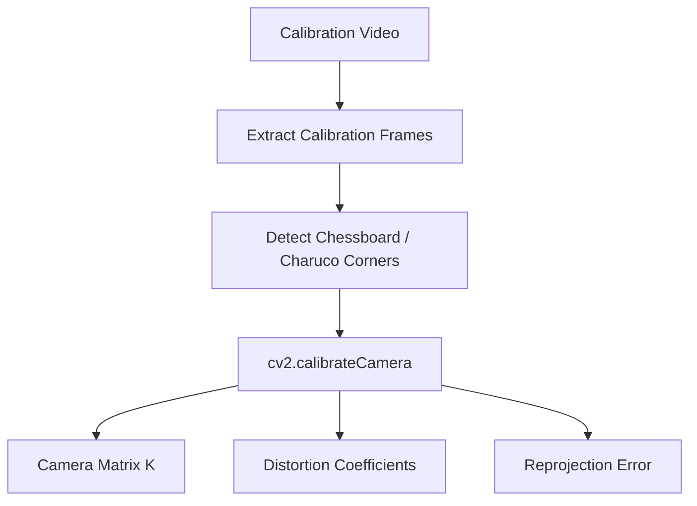

# Optical Flow Pose Analysis

## 1. 目的

本文件分析 optical flow camera-pose estimation 可能使用的工具、技術方法、數學模型與取捨，並根據新需求改為 calibration-video-first。

第一版不要求一般使用者輸入 FOV、`f_x` 或 `f_y`。使用者只需要提供：

1. 一支 calibration video，拍攝棋盤格或 Charuco board。
2. 一支 pose video，也就是要估計攝影機姿態的影片。

## 2. Optical Flow 基本模型

Optical flow 是 2D pixel displacement：

```text
u = x_{t+1} - x_t
v = y_{t+1} - y_t
```

Optical flow constraint：

```text
I_x u + I_y v + I_t = 0
```

注意：optical flow 不等於 camera pose。它還需要 camera intrinsics、幾何模型、RANSAC 與 pose recovery 才能轉成相對姿態。

## 3. Camera Calibration 與 K

第一版使用 calibration video 取得相機內參：



Camera intrinsic matrix：

```text
K =
| f_x   0   c_x |
|  0   f_y  c_y |
|  0    0    1  |
```

Normalized coordinate：

```text
x_normalized = K^{-1} x_pixel
```

或展開：

```text
x_n = (u - c_x) / f_x
y_n = (v - c_y) / f_y
```

## 4. 為什麼不用手動 FOV / fx / fy 作第一版

| 方案 | 優點 | 缺點 | 第一版決策 |
|---|---|---|---|
| 使用者手動輸入 FOV | 實作簡單 | 一般使用者不知道 FOV，容易輸入錯 | 不作主要流程 |
| 使用者手動輸入 `f_x`, `f_y` | 可直接建立 `K` | 參數專業且不直覺 | 不作主要流程 |
| 從一般影片 self-calibration | 不需 calibration pattern | 不穩定，受場景與運動影響大 | 後續研究 |
| Calibration video + `cv2.calibrateCamera` | 可靠、可驗證、使用者只需拍板子 | 需要準備棋盤格或 Charuco board | 第一版採用 |

FOV 公式仍可作 debug sanity check：

```text
f_x = W / (2 tan(FOV_x / 2))
f_y = H / (2 tan(FOV_y / 2))
```

但輸出若來自 fallback，必須標記低可信度。

## 5. Optical Flow 方法比較表

| 方法 | 代表工具 | 優點 | 缺點 | 是否適合作為第一版 |
|---|---|---|---|---|
| Sparse Lucas-Kanade | `cv2.calcOpticalFlowPyrLK` | 快、容易 debug、可追蹤 feature ID | 依賴角點品質，低紋理容易失敗 | 是 |
| Dense Farneback | `cv2.calcOpticalFlowFarneback` | 可取得全畫面 flow field | 計算量較高，outlier 難整理 | 否，作為 debug / 後續比較 |
| DIS Optical Flow | `cv2.DISOpticalFlow_create` | dense flow 較快 | 仍不直接等於 pose | 否，第二階段可評估 |
| Deep Optical Flow | RAFT / FlowNet | 精度高 | 依賴模型與 GPU，工程複雜 | 否 |

## 6. Feature Detection / Matching 方法比較表

| 方法 | 用途 | 優點 | 缺點 | 適用情境 |
|---|---|---|---|---|
| Shi-Tomasi | corner detection for LK | OpenCV 內建、快、穩定 | 不是 descriptor，跨大位移能力有限 | 第一版 sparse flow |
| ORB | keypoint + descriptor matching | 快、免費、可做重新初始化 | 對模糊與光照仍有限 | 大位移 fallback |
| SIFT | keypoint + descriptor matching | 尺度與旋轉穩定性佳 | 較慢 | 高品質 matching |
| SuperPoint | learned keypoint | 特徵穩定 | 需要模型推論 | 後續升級 |
| LoFTR | detector-free matching | 寬基線與低紋理較強 | 計算量大 | 後續高精度版本 |

## 7. 幾何模型比較表

| 模型 | 使用條件 | 輸出 | 優點 | 限制 |
|---|---|---|---|---|
| Essential Matrix `E` | 已知 `K`，一般 3D 場景 | relative `R`, `t` direction | 適合 calibrated monocular pose | translation scale 不可觀測 |
| Fundamental Matrix `F` | 未校正相機 | epipolar geometry | 不需 `K` | 無法直接 recover calibrated pose |
| Homography `H` | 平面場景或純旋轉 | plane transform / rotation candidate | 對平面與純旋轉穩 | 一般 3D translation 不完整 |
| PnP | 已知 3D-2D 對應 | absolute pose | 可得較完整 pose | 需要 3D points |

Essential Matrix：

```text
E = [t]_x R
x_2^T E x_1 = 0
```

Homogeneous transform：

```text
T =
| R  t |
| 0  1 |
```

## 8. 姿態估計相關矩陣表

| 矩陣 / 參數 | 符號 | 尺寸 | 用途 | 備註 |
|---|---|---:|---|---|
| Camera Intrinsics | `K` | `3x3` | pixel 到 normalized camera coordinate | 第一版由 calibration video 建立 |
| Distortion Coefficients | `dist_coeffs` | `1xN` | undistort frame / points | 由 calibration 得到 |
| Rotation Matrix | `R` | `3x3` | frame-to-frame 相對旋轉 | 轉 Euler angles |
| Translation Vector | `t` | `3x1` | frame-to-frame 平移方向 | 單眼無真實尺度 |
| Essential Matrix | `E` | `3x3` | calibrated epipolar geometry | `E = [t]_x R` |
| Homography | `H` | `3x3` | 平面或純旋轉模型 | 可作 model comparison |
| Inlier Mask | `M` | `Nx1` | 標記 RANSAC inliers | 用於 confidence |

## 9. RANSAC 的必要性

RANSAC 必須存在，原因：

- LK tracking 會產生錯誤追蹤點。
- 動態物體的 flow 不代表 camera motion。
- motion blur、遮擋、低紋理會產生 outliers。
- Essential Matrix 對錯誤 correspondences 很敏感。

建議：

```text
cv2.findEssentialMat(points1, points2, K, method=cv2.RANSAC, prob=0.999, threshold=1.0)
```

## 10. 第一版建議方案

| 類別 | 選擇 |
|---|---|
| Camera calibration | Calibration video + `cv2.calibrateCamera` |
| Feature detection | Shi-Tomasi corner detection |
| Optical flow | Pyramidal Lucas-Kanade sparse optical flow |
| Geometry | Essential Matrix + RANSAC |
| Pose recovery | `cv2.recoverPose` |
| Euler conversion | Rotation matrix to yaw / pitch / roll |
| Visualization | OpenCV drawing functions |

選擇理由：

- 使用者只需拍 calibration video，不需理解 FOV、`f_x`、`f_y`。
- OpenCV 支援完整，工程風險低。
- sparse tracks 可視化清楚，適合 debug。
- Essential Matrix 可從 calibrated correspondences 推相對姿態。
- inlier mask 可作為 confidence 的核心來源。

