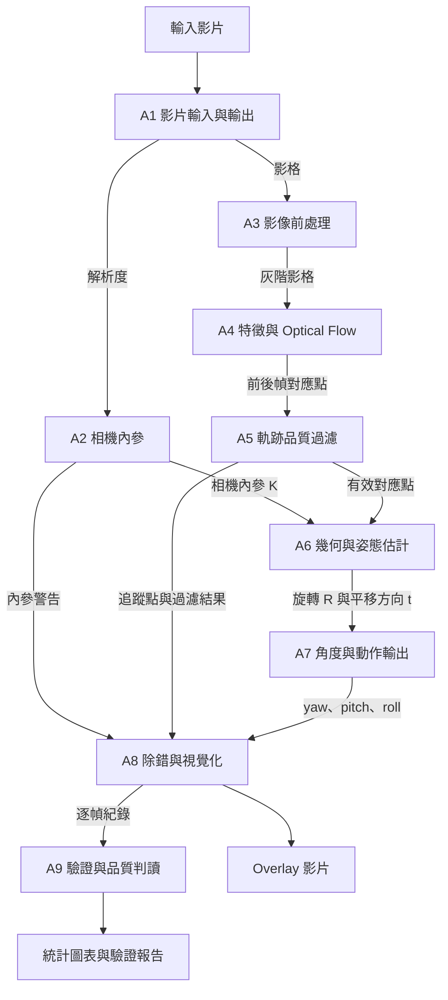
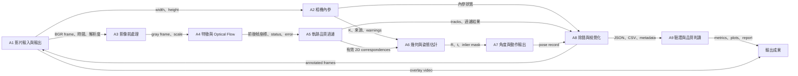
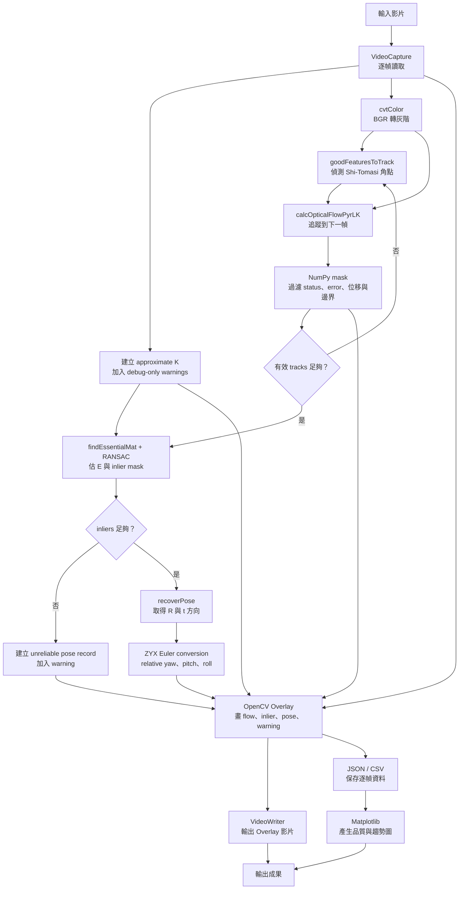

# Optical Flow Pose Analysis

## Evaluation Metric Analysis

`Precision@θ` 與 `Recall@θ` 以角度門檻定義連續姿態的正確預測。Precision 回答有效輸出有多少可信；Recall 把 pose dropout 納入，避免只輸出少數容易幀而得到虛高分數。Optical Flow 預設 `θ = 1.0°`。

`Geodesic MAE` 使用整體旋轉而非只看三個 Euler 軸：

```text
R_error = R_pred * transpose(R_gt)
e_geo = acos(clamp((trace(R_error) - 1) / 2, -1, 1))
Geodesic MAE = mean(e_geo)
```

`P95 Error` 呈現尾端風險，可發現 MAE 掩蓋的 Essential Matrix 退化、錯誤 tracks 或 `recoverPose` outliers。

影片本身含真實運動，因此 `Jitter` 不直接對 predicted pose 求標準差。本專案先形成每幀 rotation error，再計算連續 error rotations 的 Geodesic change，最後取 RMS，以衡量扣除 OXTS 真實運動後的時間不穩定性。

## 1. 文件目的

這份文件回答四個問題：

1. 要從影片估計攝影機姿態，系統需要哪些模組？
2. 每個模組有哪些技術可以選？
3. 第一版建議使用哪些工具？為什麼？怎麼用？
4. 這些模組如何串成一條完整流程？

Analysis 階段先整理「需要解決哪些問題」與「有哪些做法」，不在這裡決定程式檔案要怎麼切。真正的類別、介面與檔案配置，留到 Design 階段定義。

> **重要說明：** 本專案目前不假設一定有棋盤格或 Charuco 校正影片。第一版使用 approximate camera intrinsics，因此結果只能視為 **frame-to-frame relative pose 的除錯參考**，不能宣稱是經過校正的絕對姿態。

第一版使用的近似相機內參：

```text
f  = max(width, height)
cx = width / 2
cy = height / 2

K = | f  0  cx |
    | 0  f  cy |
    | 0  0   1 |
```

所有姿態輸出都必須帶上以下警告：

```text
intrinsics_not_calibrated
approximate_K_used
pose_for_debug_only
```

---

## 2. 完成目標所需的系統模組

整個系統可拆成九個模組。前六個模組負責「從影片算出姿態」，後三個模組負責「把結果說清楚並確認是否可信」。

| ID | 系統模組 | 要解決的問題 | 主要輸出 |
|---|---|---|---|
| A1 | 影片輸入與輸出 | 如何穩定讀取影片、保存時間資訊，並寫出結果影片？ | 影格、影格編號、時間戳、輸出影片 |
| A2 | 相機內參 | 如何提供幾何計算需要的 `K`？內參不準時如何標記風險？ | `K`、內參來源、可信度、警告 |
| A3 | 影像前處理 | 如何把每張影格整理成適合追蹤的影像？ | 灰階影像、縮放資訊 |
| A4 | 特徵與 Optical Flow | 如何找到可追蹤的點，並知道它們在下一幀移到哪裡？ | 前後幀對應點、LK 狀態與誤差 |
| A5 | 軌跡品質過濾 | 如何排除追蹤失敗、跳動過大或不合理的點？ | 過濾後的 2D 對應點 |
| A6 | 幾何與姿態估計 | 如何從 2D 對應點求出相機的相對旋轉與平移方向？ | `E`、`R`、`t`、inlier mask |
| A7 | 角度與動作輸出 | 如何把旋轉矩陣轉成容易閱讀的 yaw、pitch、roll？ | 每幀 pose record |
| A8 | 除錯與視覺化 | 如何讓人一眼看出追蹤點、內外點與姿態是否合理？ | Overlay 影片、除錯影格、JSON / CSV |
| A9 | 驗證與品質判讀 | 如何用數據判斷結果穩不穩，而不是只靠肉眼？ | 統計指標、圖表、驗證報告 |

### 2.1 模組之間交換的資料

| 從哪個模組 | 傳到哪個模組 | 交換內容 | 白話說明 |
|---|---|---|---|
| A1 | A2、A3 | 影格、解析度、時間資訊 | 先知道影像多大、目前是哪一幀 |
| A2 | A6、A8 | `K`、來源、警告 | 幾何計算要用 `K`，畫面也要顯示其可信度 |
| A3 | A4 | 灰階影像、縮放比例 | 提供較適合追蹤的影像 |
| A4 | A5 | 前後幀座標、狀態、誤差 | 告訴過濾器哪些點追到了哪裡 |
| A5 | A6、A8 | 有效對應點、過濾結果 | 只把較可信的點送去估姿態，並保留資料供畫圖 |
| A6 | A7、A8 | `R`、`t`、inlier mask | 轉成角度，同時標出哪些點符合幾何模型 |
| A7 | A8、A9 | yaw、pitch、roll、狀態與警告 | 顯示在影片上，也交給驗證模組分析 |
| A8 | A9 | Overlay metadata、逐幀紀錄 | 讓驗證結果能回頭找到對應影格 |

### 2.2 系統模組流程圖

下圖用模組層級呈現完整方向：先從影片取得影格與相機內參，再追蹤特徵點、過濾不可靠的軌跡、估計姿態，最後產生容易閱讀與驗證的成果。



---

## 3. 各模組可使用的技術

這一節列出每個模組的候選技術。表中的「第一版定位」是目前建議，不代表其他技術已經實作。

### A1. 影片輸入與輸出

| 技術 | 適合情境 | 優點 | 注意事項 | 第一版定位 |
|---|---|---|---|---|
| OpenCV `VideoCapture` / `VideoWriter` | Python 逐幀影像處理 | API 簡單，能直接接 OpenCV pipeline | Codec 支援會受執行環境影響 | **主方案** |
| FFmpeg CLI | 轉檔、抽幀、修復或壓縮影片 | 格式支援完整、批次處理能力強 | 需要額外安裝，並管理命令與中介檔案 | 輔助方案 |
| MoviePy | 簡單剪輯、加音訊或組合片段 | Python API 容易理解 | 不適合當高效逐幀 vision 主流程 | 非主方案 |

### A2. 相機內參

| 技術 | 適合情境 | 優點 | 注意事項 | 第一版定位 |
|---|---|---|---|---|
| Approximate `K` | 沒有校正資料，只需快速建立 prototype | 不需要額外輸入，能先跑通流程 | 誤差不可控，不能當正式 calibrated pose | **主方案** |
| FOV-derived `K` | 已知可靠的水平或垂直 FOV | 比單純用解析度猜焦距更有依據 | FOV 填錯、裁切或縮放都會影響結果 | Fallback |
| `cv2.calibrateCamera` | 有棋盤格校正影像 | 可得到 `K`、畸變係數與重投影誤差 | 需要品質良好且同鏡頭設定的校正資料 | 後續升級 |
| Charuco calibration | 場景容易遮住部分校正板 | 對部分遮擋通常比純棋盤格有彈性 | 設定與偵測流程較多 | 後續升級 |
| 已知 intrinsics JSON | 相機已完成校正 | 可直接使用可靠內參 | 解析度、焦段、對焦與裁切設定必須一致 | 優先升級方案 |

> **注意：** 如果影像有 resize，`fx`、`fy`、`cx`、`cy` 也必須用相同比例縮放；不能直接沿用原解析度的 `K`。

### A3. 影像前處理

| 技術 | 適合情境 | 優點 | 注意事項 | 第一版定位 |
|---|---|---|---|---|
| 灰階化 `cv2.cvtColor` | Corner detection 與 LK tracking | 計算量較低，也是 LK 的標準輸入 | 顏色資訊不再參與追蹤 | **主方案** |
| `cv2.resize` | 原始解析度太大、處理速度不足 | 可明顯降低計算量 | 必須同步更新 `K` | 可選 |
| Gaussian blur | 影像有細碎雜訊 | 能減少部分雜訊干擾 | 模糊太強會把好角點一起抹掉 | 視場景啟用 |
| CLAHE | 低光、局部對比不足 | 可讓暗部出現更多可追蹤紋理 | 也可能放大雜訊 | 視場景評估 |
| Undistort | 已有可靠 `K` 與畸變係數 | 可修正鏡頭變形，提升幾何一致性 | Approximate `K` 無法可靠完成這一步 | 僅 calibrated 模式 |

### A4. 特徵與 Optical Flow

| 技術 | 做法 | 優點 | 注意事項 | 第一版定位 |
|---|---|---|---|---|
| Shi-Tomasi + Pyramidal LK | 找角點，再逐幀追蹤 | 快、可保留點的 ID 與路徑，容易除錯 | 大位移、低紋理、模糊時容易追丟 | **主方案** |
| ORB matching | 偵測 keypoint 並比對二進位 descriptor | 可處理重新偵測與較大位移 | 誤配較多，需要額外 ratio test / RANSAC | Fallback |
| SIFT matching | 使用尺度與旋轉較穩定的 descriptor | 面對尺度變化通常比 ORB 穩 | 計算較慢 | 後續評估 |
| Farneback dense flow | 計算幾乎每個 pixel 的 flow | 適合全畫面 motion heatmap | 不容易直接管理乾淨的姿態對應點 | 視覺化輔助 |
| DIS dense flow | 較快速的 dense flow | 速度通常比傳統 dense 方法實用 | 接 pose 前仍要抽樣與過濾 | 後續評估 |
| RAFT 等 learned flow | 用深度學習模型估 dense flow | 困難場景可能有更好 flow 品質 | 依賴模型與 GPU，系統複雜度高 | 不納入第一版 |

### A5. 軌跡品質過濾

| 技術 | 過濾什麼 | 優點 | 注意事項 | 第一版定位 |
|---|---|---|---|---|
| LK status + finite check | LK 已判定失敗或座標不是有限值的點 | 成本低，能先排除明顯錯誤 | 不能抓出所有誤追蹤 | **必要基線** |
| LK error threshold | 誤差過高的點 | 可再移除不穩的 tracks | 門檻需依資料調整 | 建議加入 |
| 位移上下限 | 跳太遠或幾乎不動的點 | 規則直觀、容易實作 | 快速運動時固定門檻可能誤殺好點 | 建議加入 |
| 邊界過濾 | 太靠近或離開畫面的點 | 避免無效座標與邊緣不穩定 | 無法處理動態物體 | 建議加入 |
| Forward-backward check | 前向追蹤後再反向追蹤，檢查是否回到原點 | 對誤追蹤很有效 | LK 計算量約增加一輪 | 品質升級 |
| RANSAC inlier mask | 不符合整體相機幾何的點 | 能處理不少誤追蹤與動態物體 | 需要足夠且分布良好的對應點 | **必要基線** |

### A6. 幾何與姿態估計

| 技術 | 適合情境 | 優點 | 注意事項 | 第一版定位 |
|---|---|---|---|---|
| Essential Matrix + RANSAC | 有 `K`，估相鄰兩幀相對姿態 | 可直接接 `recoverPose` 得到 `R` 與 `t` 方向 | `K` 不準會影響結果；單眼 `t` 沒有真實尺度 | **主方案** |
| Fundamental Matrix | 沒有可信 `K`，只分析 epipolar geometry | 不需要內參 | 不能直接得到經校正的相對 pose | 分析輔助 |
| Homography | 平面場景或接近純旋轉 | 在適用場景可能比 Essential Matrix 穩 | 一般 3D 平移場景會失真 | 模型退化檢查 |
| PnP | 已知 3D 點與其 2D 投影 | 能估相機相對於 3D 地圖的姿態 | 本專案第一版沒有已知 3D 點 | 不適合第一版 |
| Bundle Adjustment | 多幀共同最佳化 | 可降低長序列誤差 | 實作與計算成本高，也需要良好初始值 | 後續研究 |

幾何主線可簡化成：

```text
2D correspondences + K
        ↓
Essential Matrix: E = [t]x R
        ↓
recoverPose
        ↓
relative rotation R + translation direction t
```

### A7. 角度與動作輸出

| 技術 | 適合情境 | 優點 | 注意事項 | 第一版定位 |
|---|---|---|---|---|
| ZYX Euler angles | 顯示 yaw、pitch、roll | 人容易閱讀，適合 Overlay | 必須固定旋轉順序，且有 gimbal lock 問題 | **輸出主方案** |
| Quaternion | 內部累積、內插與平滑 | 數值較穩定 | 不適合直接給一般使用者閱讀 | 後續內部表示 |
| Rodrigues vector | 與 OpenCV 旋轉 API 交換資料 | 三個參數即可表示旋轉 | 物理意義不如 yaw / pitch / roll 直覺 | 內部輔助 |
| 累積相對旋轉 | 觀察一段時間的轉向趨勢 | 比逐幀角度更容易看出方向 | 每幀誤差會一路累積而漂移 | Debug-only |

第一版固定採用：

```text
R = Rz(yaw) × Ry(pitch) × Rx(roll)
```

`t` 只表示平移方向，不輸出公尺、速度或真實距離。

### A8. 除錯與視覺化

| 技術 / 工具 | 用途 | 優點 | 注意事項 | 第一版定位 |
|---|---|---|---|---|
| OpenCV drawing APIs | 畫點、箭頭、inlier / outlier 與文字 | 能直接畫回影片影格 | 不適合複雜統計圖 | **Overlay 主方案** |
| JSON | 保存完整逐幀欄位與警告 | 結構清楚、可擴充 | 檔案較大，不適合直接用試算表看 | **採用** |
| CSV | 保存 pose timeline 與主要指標 | 容易用 Excel、Python 或 BI 工具分析 | 不適合巢狀資料 | **採用** |
| Matplotlib | 畫 pose、inlier ratio 與 jitter 曲線 | 很適合報告與參數比較 | 不用來做即時影片 Overlay | 報告輔助 |
| Markdown report | 整理設定、圖表與結論 | 方便版本控制與閱讀 | 需要額外產生報告的步驟 | 建議加入 |

### A9. 驗證與品質判讀

| 指標 / 技術 | 回答的問題 | 注意事項 | 第一版定位 |
|---|---|---|---|
| Valid track count | 還有多少點可用？ | 點多不代表點一定正確 | **採用** |
| Inlier count / ratio | 有多少點符合目前的相機幾何？ | 比例高仍不保證姿態絕對正確 | **採用** |
| Median flow speed | 當前畫面移動量是否異常？ | 單位是 pixel/frame，不是真實速度 | **採用** |
| Pose jitter | 靜止或平順片段是否出現不合理抖動？ | 真實快速轉動不能直接算成 jitter | **採用** |
| Consecutive failures | Pipeline 是否連續多幀失敗？ | 需先定義何謂 failure | **採用** |
| Warning distribution | 最常出現哪一類問題？ | Warning 名稱與觸發條件要固定 | **採用** |
| OXTS 趨勢比較 | 估計轉動方向是否與外部參考一致？ | Approximate `K` 只能比較相對變化趨勢 | Debug reference |

---

## 4. 第一版工具的 What / Why / How

這一節把候選技術收斂成第一版建議工具。`What` 說要用什麼，`Why` 說選它的原因，`How` 說它在流程中怎麼使用。

| ID | 小階段 | What：使用什麼？ | Why：為什麼使用？ | How：如何使用？ |
|---|---|---|---|---|
| A1.1 | 讀取影片 | OpenCV `cv2.VideoCapture` | 能直接逐幀讀取，並取得 fps、寬高等資訊 | 開啟影片後逐幀讀取；保存 `frame_index`，以 `frame_index / fps` 算時間戳 |
| A1.2 | 寫出結果 | OpenCV `cv2.VideoWriter` | 可以把每張已標記的影格重新組成可回放影片 | 使用固定 codec、fps 與 frame size，逐幀寫入 annotated frame |
| A2.1 | 建立近似內參 | NumPy 3×3 matrix | 即使沒有校正資料，也能先提供幾何估計所需的 `K` | 依處理後解析度建立 `f`、`cx`、`cy`，並一起輸出來源、可信度與警告 |
| A3.1 | 灰階化 | `cv2.cvtColor` | Shi-Tomasi 與 LK 通常以單通道影像工作，速度較快 | 原始 BGR 留給 Overlay；轉出的 gray frame 交給偵測與追蹤 |
| A3.2 | 選擇性縮放 | `cv2.resize` | 高解析影片可用較低成本快速驗證 pipeline | 使用固定比例縮放，並用相同比例更新或重建 `K` |
| A4.1 | 偵測特徵點 | `cv2.goodFeaturesToTrack` | Shi-Tomasi 角點適合 LK 追蹤，參數少也容易除錯 | 第一幀或有效點不足時執行；調整 `maxCorners`、`qualityLevel`、`minDistance` |
| A4.2 | 追蹤特徵點 | `cv2.calcOpticalFlowPyrLK` | Pyramidal LK 適合連續影片中的小到中等位移 | 輸入前後兩張灰階圖與上一幀的點，取得新座標、`status` 與 `error` |
| A5.1 | 基本軌跡過濾 | NumPy boolean mask | 可以一次組合多個條件，快速移除壞點 | 合併 status、finite、LK error、位移與邊界條件；點太少就重新偵測 |
| A6.1 | 穩健幾何估計 | `cv2.findEssentialMat` + RANSAC | 能在誤追蹤與動態物體存在時找出較一致的幾何模型 | 傳入過濾後的兩組點與 `K`，保存 `E`、inlier mask、數量與比例 |
| A6.2 | 恢復相對姿態 | `cv2.recoverPose` | 能從 `E` 拆出 frame-to-frame 的 `R` 與 `t` 方向 | 只在有效點與 inlier 足夠時執行；不足時輸出 unreliable 狀態，不硬算角度 |
| A7.1 | 轉成 Euler angles | NumPy `atan2`、`sqrt` | Overlay 與報告需要人容易閱讀的 yaw、pitch、roll | 固定 ZYX 順序，將 `R` 轉成 degree，並標明是 relative 或 accumulated |
| A8.1 | 畫除錯 Overlay | `cv2.circle`、`arrowedLine`、`putText` | 能把 flow、內外點、pose 與 warning 直接畫回原畫面 | 使用固定顏色圖例；警告與 intrinsics 狀態要保持可見 |
| A8.2 | 保存逐幀資料 | Python JSON / CSV | 影片適合觀看，結構化資料才適合搜尋與後續分析 | JSON 保存完整紀錄；CSV 保存時間、角度、點數、inlier ratio 等主要欄位 |
| A9.1 | 產生驗證圖表 | Matplotlib | 能快速比較 pose、追蹤品質與失敗時段 | 從 JSON / CSV 讀取時間序列，畫角度、track count、inlier ratio 與 warning 統計 |

### 4.1 第一版成功與失敗的處理原則

| 狀況 | 系統行為 |
|---|---|
| 有效 tracks 太少 | 不估 pose；重新偵測特徵點；輸出 `too_few_tracks` |
| RANSAC inliers 太少 | 不呼叫或不採信 `recoverPose`；輸出 `too_few_inliers` |
| `recoverPose` 失敗 | 保留上一筆顯示狀態，但本幀 pose 標為 invalid，不假造數值 |
| 使用 approximate `K` | 每一筆 pose 與 Overlay 都保留 uncalibrated / debug-only 警告 |
| 只得到單眼 `t` | 標示為 translation direction，不換算真實距離 |
| 累積角度 | 額外標示 drift 風險，不把它稱為 absolute pose |

---

## 5. Mermaid：模組與資料交換

這張圖先從模組層級說明 A1 到 A9 如何合作，以及彼此交換什麼資料。



## 6. Mermaid：第一版完整處理流程

這張圖把第 4 節的工具放進實際執行順序，並補上 tracks 或 inliers 不足時的分支。



## 7. 預期輸出成果

| 成果 | 內容 | 用途 |
|---|---|---|
| Overlay video | Flow arrows、tracked points、inlier / outlier、pose、warning | 人工回放與快速檢查 |
| Frame pose JSON | 完整逐幀 pose、品質數據、內參來源與警告 | 程式分析與問題追查 |
| Pose timeline CSV | 時間、yaw、pitch、roll、點數、inlier ratio、狀態 | 試算表與時間序列分析 |
| Debug frames | 指定幀的原圖與 Overlay | 定位單幀失敗原因 |
| Verification plots | Pose、track count、inlier ratio、jitter、warning 統計 | 比較參數與判斷穩定性 |
| Analysis report | 設定、限制、圖表與結論 | 保存實驗脈絡，交接到 Design / Verification |

建議的主要輸出位置：

```text
outputs/optical_flow_pose/pose_overlay_uncalibrated/
├── pose_overlay.mp4
├── frame_pose_results.json
├── pose_timeline.csv
├── debug_frames/
└── evaluation/
```

---

## 8. 重要限制與風險

| 限制或風險 | 可能造成的結果 | 應對方式 |
|---|---|---|
| Approximate `K` 不準 | yaw、pitch、roll 出現系統性誤差 | 明確標示 debug-only；未來以 calibrated `K` 替換 A2 |
| 單眼影片沒有尺度 | `t` 無法代表真實公尺或速度 | 只輸出方向，不輸出 metric translation |
| 動態物體太多 | RANSAC 可能選到錯誤運動模型 | 監控 inlier 分布；增加 motion mask 或語意過濾 |
| 低紋理、低光或 motion blur | 特徵點少、LK 容易追丟 | 調整特徵參數；視場景加入 CLAHE 或其他 tracker |
| 點集中在小區域 | Inlier ratio 看似很高，但幾何仍不穩 | 增加空間分布指標或網格化選點 |
| 純旋轉或近似平面場景 | Essential Matrix 可能退化 | 同時比較 Homography，輸出 model warning |
| Euler angles 定義不同 | 相同 `R` 可能得到不同角度說法 | 固定 ZYX、座標系與正負方向，輸出到 metadata |
| 累積相對旋轉 | 誤差隨時間漂移 | 同時保留 frame-to-frame 值；累積值只作趨勢參考 |

## 9. Analysis 到 Design 的交接原則

- A1 到 A9 都必須在 Design 中找到對應責任，不能在實作時悄悄消失。
- Design 可以把一個 Analysis 模組拆成多個 class 或 service，但要標明它們服務哪個 Analysis ID。
- 候選技術不等於已實作技術；Design 必須記錄最後選擇與放棄原因。
- 從 approximate `K` 升級為 calibrated `K` 時，應優先替換 A2，不重寫整條 pipeline。
- 每個 pose record 都必須能追溯到輸入影格、設定、內參來源、演算法狀態與 warnings。

## 10. 延伸分析文件

| 文件 | 補充內容 |
|---|---|
| `optical_flow_motion_path_analysis.md` | Sparse flow、track path、flow speed 與路徑視覺化 |
| `fov_intrinsics_analysis.md` | Approximate `K`、FOV-derived `K` 與 calibrated `K` 的差異 |
| `coordinate_transform_matrix_analysis.md` | Pixel、normalized camera coordinate 與相機座標轉換 |
| `../03_Design/optical_flow_pose_pipeline_design.md` | 第一版模組、介面與資料流設計 |
| `../04_Implementation/stage_11_13_optical_flow_pose_pipeline.md` | 實作階段、工具入口與完成條件 |
