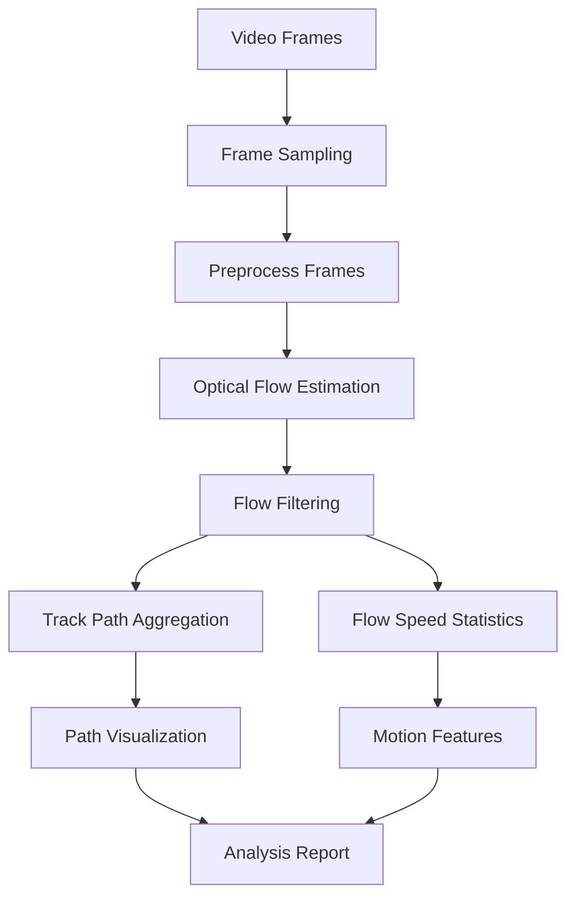

# Optical Flow Motion Path Analysis

## 1. 目的

本文件定義新一輪使用 optical flow 估計影片姿態的分析方向。

舊 pipeline 主要從單張影像的線段、地平線、消失點估 yaw / pitch / roll。新 pipeline 則使用連續 frame 之間的像素位移，分析 camera motion 與 flow speed，並畫出可檢查的 movement path。

## 2. 核心問題

1. 從影片 frame pair 計算 optical flow。
2. 將 flow vector 轉成速度場。
3. 過濾不可靠 flow。
4. 畫出特徵點路徑與平均運動方向。
5. 比較 camera pose 變化與 optical flow speed 的關係。

## 3. Pipeline 草案



## 4. Optical Flow 方法選擇

建議分成兩種模式：

| 模式 | 方法 | 用途 |
|---|---|---|
| sparse flow | Lucas-Kanade + good features | 畫軌跡、追蹤穩定角點 |
| dense flow | Farneback 或 DIS | 看整體速度場、熱區、方向分布 |

第一輪工具建議先做 sparse flow，因為比較容易輸出可讀的 path debug image。

## 5. Flow Speed 定義

frame `t` 到 `t+1`：

```text
dx = u[t+1] - u[t]
dy = v[t+1] - v[t]
speed_px_per_frame = sqrt(dx^2 + dy^2)
speed_px_per_sec = speed_px_per_frame * fps
direction_rad = atan2(dy, dx)
```

若後續要進 normalized camera coordinate：

```text
dx_norm = dx / f_x
dy_norm = dy / f_y
```

## 6. 要畫出的 debug 圖

| artifact | 說明 |
|---|---|
| `01_sampled_frame.png` | 被分析的原始 frame |
| `02_flow_vectors.png` | flow arrow overlay |
| `03_tracked_paths.png` | feature tracks 路徑 |
| `04_speed_heatmap.png` | flow speed heatmap |
| `05_direction_histogram.png` | flow direction histogram |
| `06_motion_summary_overlay.png` | 平均速度、方向、有效點數 |

## 7. Camera Pose vs Flow Speed

光流速度與 camera motion 的關係需要分開看：

- camera rotation 會造成全畫面方向一致或繞中心旋轉的 flow。
- camera forward motion 會造成由 focus of expansion 往外擴散的 flow。
- scene depth 不同會讓近物速度較快、遠物速度較慢。
- moving object 會污染 camera motion，需要 outlier rejection。

因此第一輪不要直接把 flow speed 等同 camera speed，而是先輸出：

```text
median_speed
mean_speed
dominant_direction
valid_track_count
radial_expansion_score
rotation_flow_score
outlier_ratio
```

## 8. 建議輸出資料結構

```json
{
  "frame_index": 12,
  "timestamp_sec": 0.4,
  "valid_track_count": 138,
  "median_speed_px_per_frame": 2.8,
  "mean_speed_px_per_frame": 3.4,
  "dominant_direction_deg": -4.5,
  "radial_expansion_score": 0.62,
  "rotation_flow_score": 0.18,
  "warnings": []
}
```

## 9. 後續工具切入點

建議新增：

```text
tools/optical_flow/analyze_optical_flow_paths.py
```

第一版只需要做到：

- 讀取影片
- 每 N frame 做 sparse optical flow
- 輸出 CSV/JSON
- 輸出 path overlay debug images

