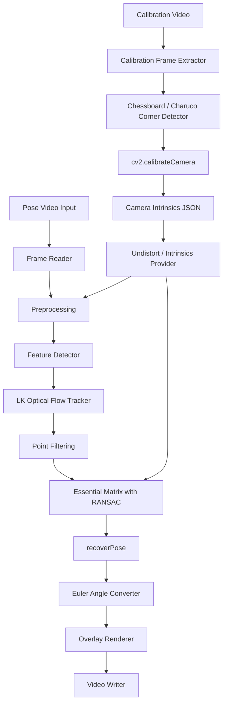

# Optical Flow Pose Design

## 1. 目的

本文件設計第一版可實作的 optical flow camera-pose pipeline。

第一版選擇：

```text
Calibration Video + cv2.calibrateCamera
+ Shi-Tomasi
+ Pyramidal Lucas-Kanade
+ Essential Matrix + RANSAC
+ cv2.recoverPose
```

此設計的重點是：一般使用者不需要輸入 FOV、`f_x` 或 `f_y`。使用者只需要拍攝 calibration video，系統負責估出 `K`。

## 2. System Pipeline



## 3. Module Architecture

```mermaid
flowchart TD
    A[main.py] --> B[config.py]
    A --> C[video_io/reader.py]
    A --> D[video_io/writer.py]
    A --> E[calibration/calibration_video_reader.py]
    A --> F[calibration/board_detector.py]
    A --> G[calibration/camera_calibrator.py]
    A --> H[geometry/camera_intrinsics.py]
    A --> I[preprocessing/frame_preprocessor.py]
    A --> J[tracking/feature_detector.py]
    A --> K[tracking/lk_tracker.py]
    A --> L[geometry/essential_matrix.py]
    A --> M[pose/pose_recovery.py]
    A --> N[pose/euler_angles.py]
    A --> O[visualization/draw_flow.py]
    A --> P[visualization/draw_pose.py]
    A --> Q[verification/metrics.py]
    A --> R[debug/debug_logger.py]
```



## 4. 建議模組結構

```text
main.py
config.py
video_io/reader.py
video_io/writer.py
calibration/calibration_video_reader.py
calibration/board_detector.py
calibration/camera_calibrator.py
geometry/camera_intrinsics.py
geometry/essential_matrix.py
preprocessing/frame_preprocessor.py
tracking/feature_detector.py
tracking/lk_tracker.py
pose/pose_recovery.py
pose/euler_angles.py
visualization/draw_flow.py
visualization/draw_pose.py
visualization/draw_trajectory.py
verification/metrics.py
debug/debug_logger.py
```

## 5. 模組輸入與輸出

| 模組 | 輸入 | 輸出 |
|---|---|---|
| Calibration Video Reader | `calibration_video_path` | calibration frames |
| Board Detector | calibration frames、board config | object points、image points |
| Camera Calibrator | object points、image points、frame size | `K`、`dist_coeffs`、reprojection error |
| Frame Reader | `video_path` | frames、fps、width、height |
| Intrinsics Provider | `camera_intrinsics.json` | `K`、`dist_coeffs`、resize-adjusted `K` |
| Preprocessing | BGR frame、`K`、`dist_coeffs` | undistorted gray frame |
| Feature Detector | grayscale frame | `points_prev` |
| LK Tracker | prev gray、curr gray、points_prev | `points_prev_valid`、`points_curr_valid`、status、error |
| Point Filtering | tracked points、status、error | filtered correspondences |
| Essential Matrix | point correspondences、`K` | `E`、inlier mask |
| Pose Recovery | `E`、points、`K` | `R`、`t`、pose inliers |
| Euler Converter | `R` | yaw、pitch、roll |
| Overlay Renderer | frame、flow、pose、stats | annotated frame |
| Video Writer | annotated frame | output video |

## 6. Camera Calibration Design

第一版使用 `cv2.calibrateCamera`。

Calibration input：

```text
calibration_video_path
calibration_pattern = chessboard | charuco
board_rows
board_cols
square_size
```

Calibration output：

```json
{
  "camera_matrix": [[fx, 0, cx], [0, fy, cy], [0, 0, 1]],
  "dist_coeffs": [k1, k2, p1, p2, k3],
  "image_width": 1920,
  "image_height": 1080,
  "reprojection_error": 0.42,
  "source": "calibration_video"
}
```

若 pose video resize，必須同步調整 `K`：

```text
fx_resized = fx_original * scale_x
fy_resized = fy_original * scale_y
cx_resized = cx_original * scale_x
cy_resized = cy_original * scale_y
```

## 7. FOV / fx / fy Policy

第一版 UI / CLI 不要求一般使用者輸入 FOV、`f_x`、`f_y`。

允許的例外：

| 例外 | 用途 | 要求 |
|---|---|---|
| 已有 `camera_intrinsics.json` | 跳過 calibration | 必須包含 `source` 與 resolution |
| FOV fallback | debug / 無 calibration video 時低可信度估計 | 必須標記 `intrinsics_not_calibrated` |
| 手動 `fx/fy` | 工程測試 | 不作一般使用者入口 |

## 8. Tracking Failure 處理

| 條件 | 處理 |
|---|---|
| tracked points 少於門檻 | 重新偵測 Shi-Tomasi features |
| LK error 過高 | 移除該 track |
| points 大量離開畫面 | 重新初始化 tracks |
| 連續失敗幀過多 | pose 標記為 unreliable |
| motion blur | 降低 confidence，保留 warning |

## 9. Outlier 處理

```text
E, mask = findEssentialMat(points1, points2, K, RANSAC)
```

confidence：

```text
inlier_ratio = inlier_count / tracked_point_count
confidence = clamp(inlier_ratio * tracking_quality * calibration_quality * pose_stability, 0, 1)
```

其中 `calibration_quality` 可由 reprojection error 與 calibration frame count 估計。

## 10. Rotation Matrix 到 Yaw / Pitch / Roll

第一版固定 ZYX rotation order：

```text
R = Rz(yaw) * Ry(pitch) * Rx(roll)
```

```text
yaw   = atan2(R[1,0], R[0,0])
pitch = atan2(-R[2,0], sqrt(R[2,1]^2 + R[2,2]^2))
roll  = atan2(R[2,1], R[2,2])
```

輸出必須註明：

- angle unit: degree
- rotation order: ZYX
- pose type: frame-to-frame relative 或 accumulated

## 11. Overlay Video 內容

輸出影片每幀建議顯示：

- tracked feature points
- optical flow arrows
- RANSAC inliers / outliers
- yaw / pitch / roll
- tracked point count
- inlier count
- inlier ratio
- confidence
- calibration reprojection error
- warnings

