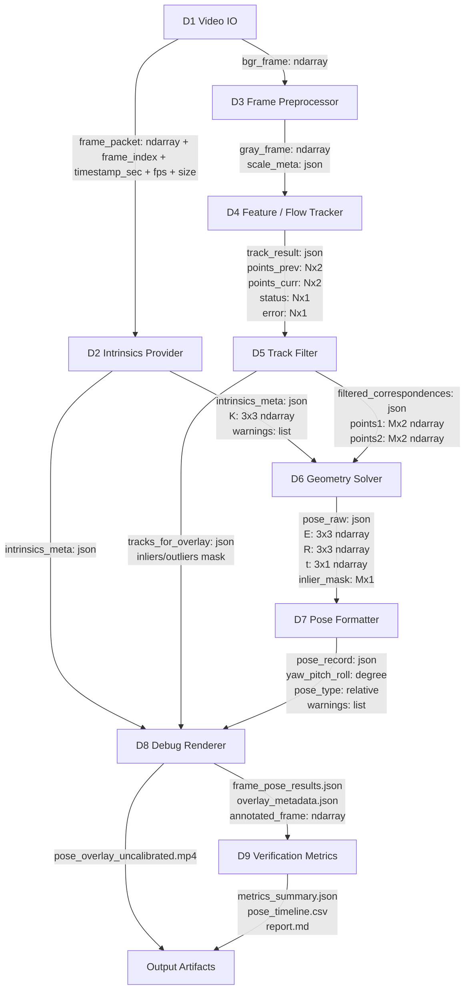
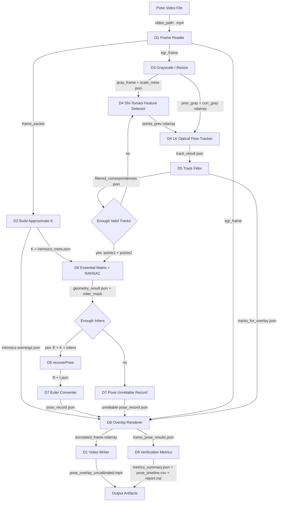

# Optical Flow Pose Design

## 1. 目的

本文件根據 `02_Analysis/README.md` 的 A1 到 A9 架構，整理第一版可實作的 Optical Flow Pose 設計。Design 階段的重點是把 Analysis 的模組、資料交換方式、可用技術與小階段流程轉成清楚的 D1 到 D9 設計模組。

第一版設計主線：

```text
Pose Video
+ Approximate K
+ Shi-Tomasi feature detection
+ Pyramidal Lucas-Kanade optical flow
+ Track filtering
+ Essential Matrix + RANSAC
+ recoverPose
+ Relative yaw / pitch / roll
+ Debug overlay + verification report
```

所有輸出必須標示：

```text
intrinsics_not_calibrated
approximate_K_used
pose_for_debug_only
```

## 2. Analysis / Design 對應表

| Analysis ID | Analysis 架構 | Design ID | Design 模組 | 主要責任 |
|---|---|---|---|---|
| A1 | Video Input Analysis | D1 | Video IO | 讀取影片、保存 frame metadata、寫出 overlay video |
| A2 | Intrinsics Model Analysis | D2 | Intrinsics Provider | 建立 approximate K 與 intrinsics metadata |
| A3 | Frame Preprocessing Analysis | D3 | Frame Preprocessor | 灰階化、resize、輸出 scale metadata |
| A4 | Feature / Optical Flow Analysis | D4 | Feature / Flow Tracker | 偵測 Shi-Tomasi points 並使用 LK tracking |
| A5 | Track Filtering Analysis | D5 | Track Filter | 根據 status、error、位移、邊界與 RANSAC mask 過濾 tracks |
| A6 | Geometry / Pose Analysis | D6 | Geometry Solver | 使用 Essential Matrix + RANSAC 與 recoverPose 取得 relative pose |
| A7 | Angle / Motion Output Analysis | D7 | Pose Formatter | 將 `R` 轉 yaw / pitch / roll 並整理 pose record |
| A8 | Debug / Visualization Analysis | D8 | Debug Renderer | 畫 flow、inliers/outliers、pose status 與 warning |
| A9 | Verification Analysis | D9 | Verification Metrics | 產生 inlier ratio、track count、pose jitter、warning summary |

## 3. 模組溝通與資料交換設計

此圖對應 Analysis 第 4 節，Design 必須讓每個模組明確傳遞資料型態，避免實作階段只剩隱含狀態。



## 4. 建議模組結構

```text
main.py
config.py
video_io/reader.py
video_io/writer.py
geometry/intrinsics_provider.py
geometry/essential_matrix.py
preprocessing/frame_preprocessor.py
tracking/feature_detector.py
tracking/lk_tracker.py
tracking/track_filter.py
pose/pose_recovery.py
pose/euler_angles.py
pose/pose_log.py
visualization/draw_flow.py
visualization/draw_pose.py
verification/metrics.py
debug/debug_logger.py
```

## 5. 模組輸入與輸出

| Design ID | 模組 | 輸入 | 輸出 |
|---|---|---|---|
| D1 | Frame Reader | `video_path`, `frame_step`, `max_frames` | `frame_packet`, `bgr_frame` |
| D1 | Video Writer | `annotated_frame`, fps, frame size | `pose_overlay_uncalibrated.mp4` |
| D2 | Intrinsics Provider | frame width, frame height, optional intrinsics file | `K`, `intrinsics_meta`, warnings |
| D3 | Frame Preprocessor | `bgr_frame`, resize config | `gray_frame`, `scale_meta` |
| D4 | Feature Detector | `gray_frame` | `points_prev` |
| D4 | LK Tracker | `prev_gray`, `curr_gray`, `points_prev` | `track_result` |
| D5 | Track Filter | `track_result`, thresholds | `filtered_correspondences`, `tracks_for_overlay` |
| D6 | Essential Matrix Solver | `filtered_correspondences`, `K` | `E`, `inlier_mask`, `inlier_ratio` |
| D6 | Pose Recovery | `E`, inlier correspondences, `K` | `R`, `t`, pose inliers |
| D7 | Euler Converter | `R` | yaw, pitch, roll |
| D7 | Pose Log | pose, metrics, warnings | `pose_record` |
| D8 | Overlay Renderer | `bgr_frame`, tracks, pose, warnings | `annotated_frame`, frame pose JSON record |
| D9 | Verification Metrics | `frame_pose_results.json`, optional reference | `metrics_summary.json`, `pose_timeline.csv`, report |

## 6. 小階段流程設計

此圖對應 Analysis 第 7 節，節點採用小階段工具使用整理，而不是只看粗略模組。



## 7. 設計決策

| 項目 | 第一版選擇 | 原因 |
|---|---|---|
| Intrinsics | Approximate K | 與目前資料條件一致，不要求 calibration video |
| Feature | Shi-Tomasi | OpenCV 內建，適合 LK sparse tracking |
| Optical flow | Pyramidal Lucas-Kanade | 可追蹤 feature ID，容易 debug |
| Filtering | LK status / error + displacement + RANSAC mask | 先移除 tracking failure，再用幾何一致性過濾 |
| Geometry | Essential Matrix + RANSAC | 可從 2D correspondences 估 relative pose |
| Pose | `recoverPose` + ZYX Euler | 可輸出可讀的 relative yaw / pitch / roll |
| Debug | OpenCV overlay + JSON / CSV logs | 同時保留可視化與可分析資料 |
| Verification | inlier ratio、track count、pose jitter、warnings | 判斷穩定性，不宣稱 absolute correctness |

## 8. Intrinsics Provider Design

第一版預設：

```text
f = max(width, height)
cx = width / 2
cy = height / 2
K =
| f   0  cx |
| 0   f  cy |
| 0   0   1 |
```

輸出 metadata：

```json
{
  "source": "approximate_from_image_size",
  "camera_matrix": [[f, 0, cx], [0, f, cy], [0, 0, 1]],
  "image_width": 1920,
  "image_height": 1080,
  "confidence": 0.3,
  "warnings": [
    "intrinsics_not_calibrated",
    "approximate_K_used",
    "pose_for_debug_only"
  ]
}
```

若未來有可靠 `camera_intrinsics.json`，只替換 D2，不重寫 D3 到 D9。

## 9. Failure / Confidence Policy

| 條件 | 設計行為 |
|---|---|
| tracked points 少於門檻 | 回到 D4 重新偵測 Shi-Tomasi features |
| LK error 過高 | D5 移除該 track |
| points 離開畫面 | D5 移除 out-of-bound tracks |
| RANSAC inlier ratio 過低 | D7 產生 unreliable pose record |
| 使用 approximate K | confidence 上限偏低，保留 debug-only warnings |
| 連續失敗幀過多 | 暫停 accumulated pose，等待 tracks 重建 |

建議 confidence：

```text
tracking_quality = valid_track_count / detected_track_count
geometry_quality = inlier_count / valid_track_count
intrinsics_quality = 0.3 when approximate K is used
pose_stability = clamp(1 - normalized_pose_jitter, 0, 1)
confidence = clamp(tracking_quality * geometry_quality * intrinsics_quality * pose_stability, 0, 1)
```

## 10. Design 維護規則

- Design 的 D1 到 D9 必須維持與 Analysis 的 A1 到 A9 對應。
- 若 Analysis 的模組溝通資料型態調整，Design 第 3 節與第 5 節必須同步。
- Implementation 可以先維持 tools 型態，但輸入輸出資料格式必須符合本文件。
- 第一版所有輸出必須保留 approximate K warning，避免被誤用為 calibrated pose。
