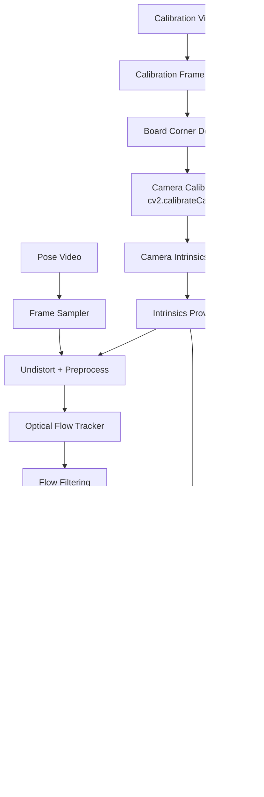

# Optical Flow Pose Pipeline Design

## 1. 目的

本文件補充 `03_Design/README.md` 的 pipeline 設計細節。

新的設計原則：

- 不要求一般使用者輸入 FOV、`f_x`、`f_y`。
- 第一版使用 calibration video 取得 camera intrinsics。
- Optical flow pose pipeline 必須讀取可靠的 `camera_intrinsics.json`。
- 如果沒有 calibration result，pipeline 可以拒絕執行或以低可信度 fallback 執行，但不能假裝結果可靠。

## 2. 建議檔案路徑

Breakdown：

```text
breakdown/02_Optical_Flow_Pose/02_Analysis/fov_intrinsics_analysis.md
breakdown/02_Optical_Flow_Pose/02_Analysis/optical_flow_motion_path_analysis.md
breakdown/02_Optical_Flow_Pose/02_Analysis/coordinate_transform_matrix_analysis.md
breakdown/02_Optical_Flow_Pose/03_Design/README.md
breakdown/02_Optical_Flow_Pose/04_Implementation/README.md
```

未來 source：

```text
src/contexts/camera_model/
src/contexts/motion_analysis/
src/contexts/coordinate_transform/
src/app/optical_flow_pose_pipeline.py
tools/calibrate_camera_from_video.py
tools/analyze_optical_flow_paths.py
tools/analyze_coordinate_transforms.py
```

## 3. Pipeline



## 4. 模組責任

| 模組 | 責任 |
|---|---|
| Calibration Frame Sampler | 從 calibration video 抽取清楚且分布足夠的 frames |
| Board Corner Detector | 偵測 chessboard 或 Charuco corners |
| Camera Calibrator | 使用 `cv2.calibrateCamera` 取得 `K`、`dist_coeffs`、reprojection error |
| Intrinsics Provider | 讀取 `camera_intrinsics.json`，並處理 resize 後的 `K` |
| Optical Flow Tracker | 計算 frame pair / track 的 optical flow |
| Flow Filtering | 去除低品質 tracks、moving object outlier |
| Coordinate Normalizer | pixel coordinate 轉 normalized camera coordinate |
| Essential Matrix Estimator | 使用 calibrated points 與 RANSAC 估 `E` |
| Pose Recovery | 使用 `recoverPose` 取得 `R`、`t` |
| Debug Visualizer | 畫 vector、path、inliers/outliers、summary overlay |

## 5. 第一輪建議範圍

先做 tools，不直接改主 CLI：

1. `calibrate_camera_from_video.py`
2. `analyze_optical_flow_paths.py`
3. `analyze_coordinate_transforms.py`

等 analysis outputs 穩定後，再接進：

```text
src/app/optical_flow_pose_pipeline.py
```

## 6. Calibration Result Policy

| 狀態 | Pipeline 行為 |
|---|---|
| 有可靠 `camera_intrinsics.json` | 正常執行 |
| 沒有 calibration result | 建議拒絕執行並提示先跑 calibration |
| 使用 FOV fallback | 允許 debug，但輸出 `intrinsics_not_calibrated` warning |
| calibration reprojection error 過高 | 降低 confidence，輸出 `intrinsics_unreliable` warning |

## 7. 與既有 pipeline 的關係

| 既有 pipeline | 新 pipeline |
|---|---|
| single image | video frame sequence |
| line/horizon/VP | optical flow tracks |
| yaw/pitch/roll from image geometry | relative pose from calibrated optical flow |
| optional FOV approximation | calibration video intrinsics |
| debug images per image | debug images per calibration / frame pair |

後續可融合：

```text
single image geometry pose
+ calibrated optical flow temporal motion
+ camera intrinsics from calibration video
= more stable video pose estimation
```

