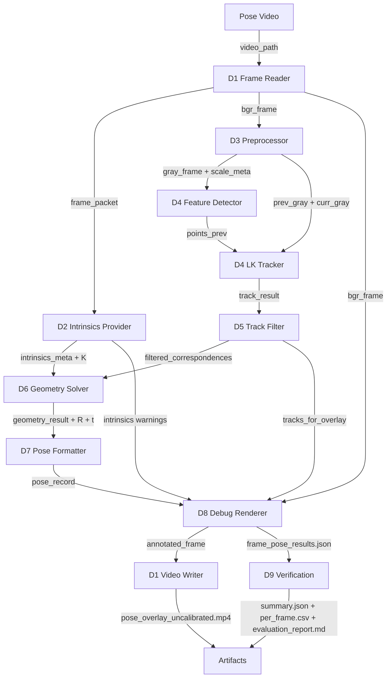

# Optical Flow Pose Pipeline Design

## 1. 目的

本文件補充 `03_Design/README.md` 的 pipeline 設計細節，重點放在從 Analysis 小階段落到實際 pipeline 的資料流與 artifact。

設計原則：

- 不要求 calibration video。
- 不要求一般使用者輸入 FOV、`f_x`、`f_y`。
- 使用 approximate K 做 debug-only relative pose。
- 所有輸出標記 `intrinsics_not_calibrated`、`approximate_K_used`、`pose_for_debug_only`。

## 2. Pipeline Data Contract

| Contract | Producer | Consumer | 格式 | 必要欄位 |
|---|---|---|---|---|
| `frame_packet` | D1 | D2 | runtime object / json-like dict | `frame_index`, `timestamp_sec`, `fps`, `width`, `height` |
| `bgr_frame` | D1 | D3, D8 | `ndarray` | shape `(H, W, 3)` |
| `intrinsics_meta` | D2 | D6, D8, D9 | JSON | `source`, `camera_matrix`, `confidence`, `warnings` |
| `gray_frame` | D3 | D4 | `ndarray` | shape `(H, W)` |
| `scale_meta` | D3 | D2, D8 | JSON | `scale_x`, `scale_y`, `processed_width`, `processed_height` |
| `track_result` | D4 | D5 | JSON + arrays | `points_prev`, `points_curr`, `status`, `error` |
| `filtered_correspondences` | D5 | D6 | JSON + arrays | `points1`, `points2`, `valid_track_count` |
| `geometry_result` | D6 | D7, D8, D9 | JSON + arrays | `E`, `inlier_mask`, `inlier_count`, `inlier_ratio` |
| `pose_record` | D7 | D8, D9 | JSON | `yaw`, `pitch`, `roll`, `pose_type`, `confidence`, `warnings` |
| `frame_pose_results` | D8 | D9 | JSON file | per-frame pose and metrics records |
| `verification_report` | D9 | user / debug | JSON / CSV / Markdown | summary metrics and warnings |

## 3. Pipeline



## 4. 建議檔案路徑

目前 tools：

```text
tools/optical_flow/analyze_optical_flow_paths.py
tools/optical_flow/write_uncalibrated_pose_overlay.py
tools/evaluation/evaluate_uncalibrated_pose_overlay_against_oxts.py
tools/optical_flow/debug_optical_flow_pose_parameters.py
```

未來 source：

```text
src/app/optical_flow_pose_pipeline.py
src/contexts/video_io/
src/contexts/coordinate_transform/
src/contexts/motion_analysis/
src/contexts/pose/
src/contexts/pose_debug/
```

## 5. 第一輪建議範圍

第一輪仍以 tools 為主，避免過早抽象：

1. `analyze_optical_flow_paths.py`
2. `write_uncalibrated_pose_overlay.py`
3. `evaluate_uncalibrated_pose_overlay_against_oxts.py`
4. `debug_optical_flow_pose_parameters.py`

當資料合約穩定後，再整理成 `src/app/optical_flow_pose_pipeline.py` 與 contexts。

## 6. 與既有 Pipeline 的關係

| 既有 geometry-based pipeline | Optical-flow pose pipeline |
|---|---|
| single image | video frame sequence |
| line / horizon / vanishing point | optical flow tracks |
| yaw / pitch / roll from image geometry | relative pose from tracked correspondences |
| optional FOV approximation | approximate K debug policy |
| debug images per image | debug frames, overlay video, pose JSON |

後續可融合：

```text
single image geometry cues
+ optical flow temporal motion
+ calibrated K when available
= more stable video pose estimation
```
