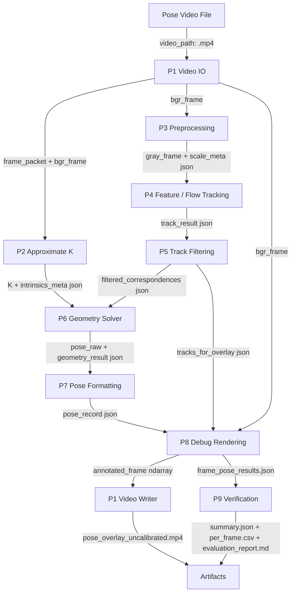

# Optical Flow Pose Implementation Plan

## Evaluation Metrics Implementation

實作位置：`tools/evaluation/evaluate_uncalibrated_pose_overlay_against_oxts.py`。

| Function | Responsibility |
|---|---|
| `compute_precision_at_theta()` | 正確有效預測數除以有效預測數 |
| `compute_recall_at_theta()` | 正確有效預測數除以全部 reference rows |
| `compute_geodesic_mae()` | 有效 Geodesic Error 的平均值 |
| `compute_p95_error()` | 計算 Geodesic Error 第 95 百分位 |
| `compute_jitter()` | 計算連續 rotation-error change 的 RMS |

```bash
python tools/evaluation/evaluate_uncalibrated_pose_overlay_against_oxts.py \
  --pose-json outputs/optical_flow_pose/pose_overlay_uncalibrated/frame_pose_results.json \
  --oxts-dir data/samples/kitti/references/oxts \

  --theta-deg 1.0
```

需要診斷檔時加入 `--save-plots --save-worst-frames`。

## 1. 目的

本文件根據 `02_Analysis/README.md` 與 `03_Design/README.md`，規劃 Optical Flow Pose 第一版實作。Implementation 階段的重點是把 D1 到 D9 設計模組落成可執行 tools，並維持 Analysis 定義的資料傳遞格式。

第一版不要求 calibration video，也不要求使用者輸入 FOV、`f_x`、`f_y`。主流程使用 approximate K 做 debug-only relative pose。

所有輸出必須標示：

```text
intrinsics_not_calibrated
approximate_K_used
pose_for_debug_only
```

## 2. Implementation / Design 對應表

| Phase | 對應 Design | 實作重點 | 主要工具 |
|---|---|---|---|
| P1 | D1 Video IO | 讀取 pose video、保存 frame metadata、寫 overlay video | `cv2.VideoCapture`, `cv2.VideoWriter` |
| P2 | D2 Intrinsics Provider | 建立 approximate K 與 intrinsics metadata | NumPy |
| P3 | D3 Frame Preprocessor | 灰階化、resize、輸出 scale metadata | `cv2.cvtColor`, `cv2.resize` |
| P4 | D4 Feature / Flow Tracker | Shi-Tomasi feature detection 與 LK tracking | `cv2.goodFeaturesToTrack`, `cv2.calcOpticalFlowPyrLK` |
| P5 | D5 Track Filter | 過濾 status、error、位移、邊界與低品質 tracks | NumPy mask |
| P6 | D6 Geometry Solver | Essential Matrix + RANSAC 與 recoverPose | `cv2.findEssentialMat`, `cv2.recoverPose` |
| P7 | D7 Pose Formatter | Rotation matrix 轉 yaw / pitch / roll，整理 pose record | NumPy trigonometry |
| P8 | D8 Debug Renderer | 畫 flow、inliers/outliers、pose warning，輸出 overlay / JSON | OpenCV drawing APIs, JSON |
| P9 | D9 Verification Metrics | 產生 metrics summary、CSV timeline、Markdown report | JSON, CSV, Matplotlib |

## 3. 實作資料流



## 4. Data Contract

| 名稱 | 格式 | Producer | Consumer | 必要欄位 |
|---|---|---|---|---|
| `frame_packet` | dict / JSON-like | P1 | P2 | `frame_index`, `timestamp_sec`, `fps`, `width`, `height` |
| `bgr_frame` | `ndarray` | P1 | P3, P8 | shape `(H, W, 3)` |
| `intrinsics_meta` | JSON | P2 | P6, P8, P9 | `source`, `camera_matrix`, `confidence`, `warnings` |
| `gray_frame` | `ndarray` | P3 | P4 | shape `(H, W)` |
| `scale_meta` | JSON | P3 | P2, P8 | `scale_x`, `scale_y`, `processed_width`, `processed_height` |
| `track_result` | JSON + arrays | P4 | P5 | `points_prev`, `points_curr`, `status`, `error` |
| `filtered_correspondences` | JSON + arrays | P5 | P6 | `points1`, `points2`, `valid_track_count` |
| `geometry_result` | JSON + arrays | P6 | P7, P8, P9 | `E`, `inlier_mask`, `inlier_count`, `inlier_ratio` |
| `pose_record` | JSON | P7 | P8, P9 | `yaw`, `pitch`, `roll`, `pose_type`, `confidence`, `warnings` |
| `frame_pose_results.json` | JSON file | P8 | P9 | per-frame pose, tracking metrics, geometry metrics, warnings |

## 5. Phase Details

| Phase | 輸入 | 輸出 | 完成條件 | 風險 |
|---|---|---|---|---|
| P1 Video IO | `video_path` | `frame_packet`, `bgr_frame`, overlay writer | 可讀取 fps / size / frames，可輸出同尺寸 overlay video | codec 不支援 |
| P2 Approximate K | width, height | `K`, `intrinsics_meta` | `camera_matrix` 與 warnings 正確寫入 JSON | 被誤用為 calibrated pose |
| P3 Preprocessing | `bgr_frame` | `gray_frame`, `scale_meta` | grayscale / resize 後尺寸一致 | resize 後 K 未同步 |
| P4 Feature / Flow | `gray_frame`, prev points | `track_result` | 可產生足夠 tracks 並保存 status / error | 低紋理、motion blur |
| P5 Track Filter | `track_result` | `filtered_correspondences` | 低品質 tracks 被移除，點數不足時觸發重新偵測 | threshold 過強 |
| P6 Geometry / Pose | correspondences, `K` | `geometry_result`, `R`, `t` | inlier ratio 可計算，pose failure 可標記 | 動態物體污染 |
| P7 Pose Format | `R`, `t`, metrics | `pose_record` | ZYX Euler 角度、pose type、warnings 完整 | Euler convention mismatch |
| P8 Debug Render | frame, tracks, pose | overlay frame, pose JSON | overlay 可讀，JSON 可追溯 | overlay 資訊過多 |
| P9 Verification | frame pose JSON | summary, CSV, report | 可輸出穩定性與 warning 分布 | 無 ground truth 時只能做 debug reference |

## 6. 建議 Config

```yaml
video:
  pose_video_path: null
  frame_step: 1
  max_frames: null
  resize_width: 960
  output_codec: mp4v

intrinsics:
  mode: approximate
  confidence: 0.3
  warning_flags:
    - intrinsics_not_calibrated
    - approximate_K_used
    - pose_for_debug_only

features:
  max_corners: 1000
  quality_level: 0.01
  min_distance: 8

lk:
  win_size: [21, 21]
  max_level: 3
  criteria_count: 30
  criteria_eps: 0.01

filtering:
  min_valid_tracks: 30
  max_lk_error: 30.0
  min_displacement_px: 0.1
  max_displacement_px: 120.0

ransac:
  threshold: 1.0
  probability: 0.999
  min_inlier_ratio: 0.25

pose:
  rotation_order: ZYX
  output_unit: degree
  accumulated_pose: debug_only
```

## 7. Output Artifacts

```text
outputs/optical_flow_pose/sparse_flow/
outputs/optical_flow_pose/pose_overlay_uncalibrated/pose_overlay.mp4
outputs/optical_flow_pose/pose_overlay_uncalibrated/frame_pose_results.json
outputs/optical_flow_pose/pose_overlay_uncalibrated/overlay_metadata.json
outputs/<run_id>/eval/optical/summary.json
outputs/<run_id>/eval/optical/per_frame.csv
outputs/<run_id>/eval/optical/evaluation_report.md
outputs/optical_flow_pose/parameter_debug/
debug/experiments/optical_flow_pose/
```

## 8. CLI 草案

第一版 tools：

```bash
python tools/optical_flow/analyze_optical_flow_paths.py --video data/samples/kitti/videos/kitti_no_overlay.mp4 --debug-dir outputs/optical_flow_pose/sparse_flow
python tools/optical_flow/write_uncalibrated_pose_overlay.py --video data/samples/kitti/videos/kitti_no_overlay.mp4 --debug-dir outputs/optical_flow_pose/pose_overlay_uncalibrated
python tools/evaluation/evaluate_uncalibrated_pose_overlay_against_oxts.py --pose-json outputs/optical_flow_pose/pose_overlay_uncalibrated/frame_pose_results.json --oxts-dir data/samples/kitti/references/oxts
python tools/optical_flow/debug_optical_flow_pose_parameters.py --video data/samples/kitti/videos/kitti_no_overlay.mp4 --oxts-dir data/samples/kitti/references/oxts --output-root outputs/optical_flow_pose/parameter_debug --debug-root debug/experiments/optical_flow_pose
```

整合 pipeline：

```bash
python main.py --path pose_video.mp4 --optical-flow-pose --intrinsics-mode approximate
```

## 9. 實作順序建議

1. 完成 P1 到 P4，先得到可視化 sparse optical flow。
2. 完成 P5，讓 tracks 過濾與重新偵測穩定。
3. 完成 P2 與 P6，建立 approximate K + Essential Matrix + RANSAC。
4. 完成 P7，輸出 frame-to-frame yaw / pitch / roll。
5. 完成 P8，產生 overlay video 與 `frame_pose_results.json`。
6. 完成 P9，輸出 metrics summary、CSV timeline、report。
7. 整理 tools 的共用邏輯到未來 `src/app/optical_flow_pose_pipeline.py`。

## 10. 驗收條件

- 所有 artifact 都包含 debug-only warning。
- `frame_pose_results.json` 每幀都有 frame metadata、tracking metrics、geometry metrics、pose record、warnings。
- track count 低於門檻時會重新偵測 features。
- RANSAC inlier ratio 低於門檻時會輸出 unreliable pose record。
- overlay video 可看見 tracks、inliers/outliers、yaw / pitch / roll、confidence、warnings。
- verification report 不宣稱 absolute pose 對齊，只描述 relative pose debug stability。
# Evaluation core migration

Optical reference-based evaluation now runs through `src/app/evaluation/optical_flow_service.py`. Alignment uses explicit previous/current source-frame identities to construct the OXTS delta, with legacy `frame_index` and `frame_index - 1` fallback. Approximate-intrinsics warnings and the 1-degree threshold are unchanged.

## 2026-06 Stability contract

- 正式執行預設不寫 debug PNG；`--write-debug-frames`、間隔與最大張數皆為 opt-in，且 `max_debug_frames` 不限制處理 frame 數。
- 可用 `--camera-intrinsics camera_intrinsics.json` 載入既有 calibration；尺寸同比例縮放時同步縮放 `fx/fy/cx/cy`，不同長寬比直接拒絕。
- KITTI sample 已整合 `2011_09_26` calibration；目前影像串流經雜湊確認為 `image_03`，可用 `--kitti-calibration-dir ... --kitti-camera-index 03` 直接讀取 `P_rect_03`。
- KITTI OXTS camera-motion comparison 使用 `R_current.T @ R_previous`，以符合 OpenCV `recoverPose` 從前一相機座標到目前相機座標的旋轉方向。
- LK tracks 經 forward-backward consistency 過濾並檢查 image-grid coverage。
- `findEssentialMat` 回傳多組 3x3 candidates 時逐組執行 `recoverPose`，記錄 candidate count 與選中索引。
- 每列同時保留 raw rotation 與 accepted/filtered rotation；低視差或超過 geodesic temporal threshold 的結果標成 `rejected`，不做 Euler clamp。
