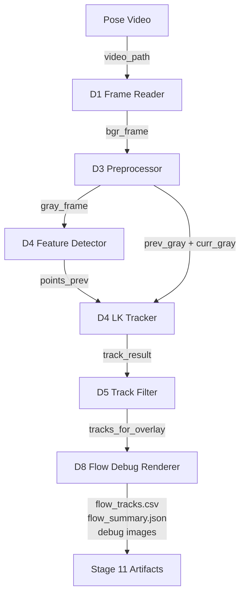
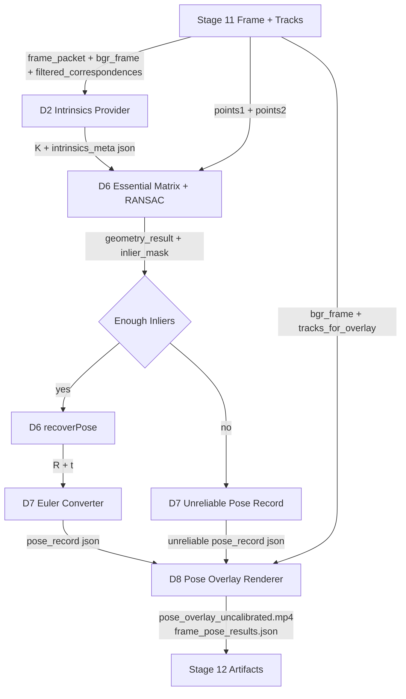
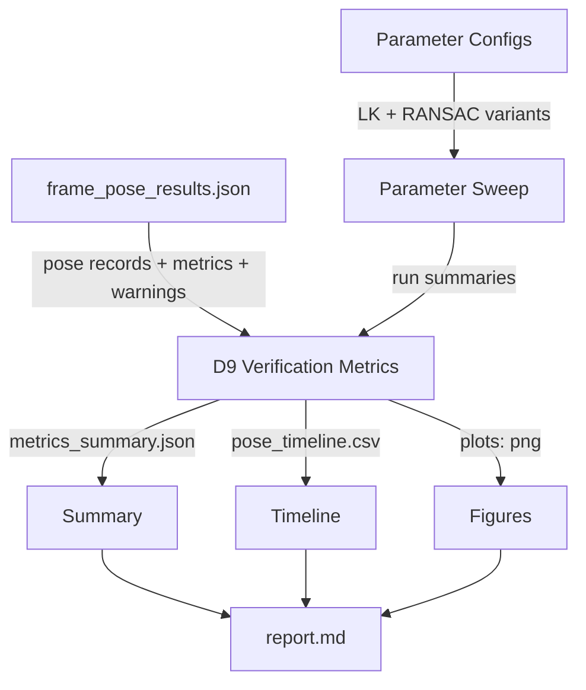

# Stage 11-13: Optical Flow Pose Pipeline

## 1. 目標

Stage 11-13 用來把 Analysis / Design 的 D1 到 D9 流程落地成 tools。這三個 stage 不是新的架構，而是實作順序：

- Stage 11 先完成 optical flow tracking 與 path debug。
- Stage 12 加上 approximate K、geometry solver、recoverPose 與 overlay。
- Stage 13 加上 verification、parameter debug 與 report。

所有輸出必須標示：

```text
intrinsics_not_calibrated
approximate_K_used
pose_for_debug_only
```

## 2. Stage / Module 對應

| Stage | 覆蓋模組 | 目標 |
|---|---|---|
| Stage 11 | D1, D3, D4, D5, D8 | 讀影片、前處理、feature detection、LK tracking、track filtering、flow debug |
| Stage 12 | D2, D6, D7, D8 | 建立 approximate K、估 Essential Matrix、recoverPose、輸出 pose overlay |
| Stage 13 | D9 | 產生 metrics summary、CSV timeline、report、parameter debug |

## 3. Stage 11: Optical Flow Path Analyzer

目前工具：

```text
tools/optical_flow/analyze_optical_flow_paths.py
```

對應資料流：



建議整理出的模組：

```text
src/contexts/video_io/services/frame_reader.py
src/contexts/motion_analysis/domain/flow_track.py
src/contexts/motion_analysis/services/frame_preprocessor.py
src/contexts/motion_analysis/services/feature_detector.py
src/contexts/motion_analysis/services/lk_tracker.py
src/contexts/motion_analysis/services/track_filter.py
src/contexts/output/services/motion_debug_visualizer.py
tests/test_sparse_flow_tracker.py
```

輸出：

```text
outputs/optical_flow_pose/sparse_flow/flow_tracks.csv
outputs/optical_flow_pose/sparse_flow/flow_summary.json
outputs/optical_flow_pose/sparse_flow/debug/flow_vectors.png
outputs/optical_flow_pose/sparse_flow/debug/tracked_paths.png
```

驗收：

- 可讀取影片並產生 sparse optical flow tracks。
- 可輸出 `track_result` 與 filtered tracks。
- 可畫出 flow vectors 與 tracked paths。
- tracks 不足時可重新偵測 features。

## 4. Stage 12: Uncalibrated Pose Overlay

目前工具：

```text
tools/optical_flow/write_uncalibrated_pose_overlay.py
```

對應資料流：



建議整理出的模組：

```text
src/contexts/coordinate_transform/domain/approximate_intrinsics.py
src/contexts/coordinate_transform/services/intrinsics_provider.py
src/contexts/pose/services/essential_matrix_solver.py
src/contexts/pose/services/pose_recovery.py
src/contexts/pose/services/euler_angle_converter.py
src/contexts/pose/services/pose_record_writer.py
src/contexts/output/services/pose_overlay_renderer.py
tests/test_uncalibrated_pose_overlay.py
```

輸出：

```text
outputs/optical_flow_pose/pose_overlay_uncalibrated/pose_overlay.mp4
outputs/optical_flow_pose/pose_overlay_uncalibrated/frame_pose_results.json
outputs/optical_flow_pose/pose_overlay_uncalibrated/overlay_metadata.json
outputs/optical_flow_pose/pose_overlay_uncalibrated/debug/
```

驗收：

- 可建立 approximate K。
- `intrinsics_meta` 包含 debug-only warnings。
- 可使用 Essential Matrix + RANSAC 估計 relative pose。
- inlier ratio 不足時輸出 unreliable pose record。
- overlay 顯示 tracks、inliers/outliers、yaw / pitch / roll、confidence、warnings。

## 5. Stage 13: Verification and Parameter Debug

目前工具：

```text
tools/evaluation/evaluate_uncalibrated_pose_overlay_against_oxts.py
tools/optical_flow/debug_optical_flow_pose_parameters.py
```

對應資料流：



建議整理出的模組：

```text
src/contexts/pose_debug/services/parameter_sweep.py
src/contexts/pose_debug/services/pose_quality_metrics.py
src/contexts/pose_debug/services/debug_report_writer.py
tests/test_pose_quality_metrics.py
```

輸出：

```text
outputs/optical_flow_pose/pose_overlay_uncalibrated/evaluation/metrics_summary.json
outputs/optical_flow_pose/pose_overlay_uncalibrated/evaluation/pose_timeline.csv
outputs/optical_flow_pose/pose_overlay_uncalibrated/evaluation/report.md
outputs/optical_flow_pose/parameter_debug/
debug/experiments/optical_flow_pose/
```

驗收：

- 可輸出 valid track count、inlier ratio、pose jitter、warning distribution。
- 可比較不同 LK / RANSAC 參數。
- 若與 OXTS 比較，只描述趨勢與 debug reference。
- report 不宣稱 absolute yaw / pitch / roll 對齊。

## 6. CLI 暫定

```bash
python tools/optical_flow/analyze_optical_flow_paths.py --video tools/output/kitti_no_overlay.mp4 --debug-dir outputs/optical_flow_pose/sparse_flow
python tools/optical_flow/write_uncalibrated_pose_overlay.py --video tools/output/kitti_no_overlay.mp4 --debug-dir outputs/optical_flow_pose/pose_overlay_uncalibrated
python tools/evaluation/evaluate_uncalibrated_pose_overlay_against_oxts.py --pose-json outputs/optical_flow_pose/pose_overlay_uncalibrated/frame_pose_results.json --oxts-dir tools/input/oxts --output-dir outputs/optical_flow_pose/pose_overlay_uncalibrated/evaluation
python tools/optical_flow/debug_optical_flow_pose_parameters.py --video tools/output/kitti_no_overlay.mp4 --oxts-dir tools/input/oxts --output-root outputs/optical_flow_pose/parameter_debug --debug-root debug/experiments/optical_flow_pose
```

整合 pipeline：

```bash
python main.py --path examples/video.mp4 --optical-flow-pose --intrinsics-mode approximate
```

## 7. 下一步

先把 Stage 11 與 Stage 12 的 data contract 穩定下來，尤其是 `track_result`、`filtered_correspondences`、`frame_pose_results.json`。等 artifact 穩定後，再把 tools 中重複的邏輯整理進 source contexts。
