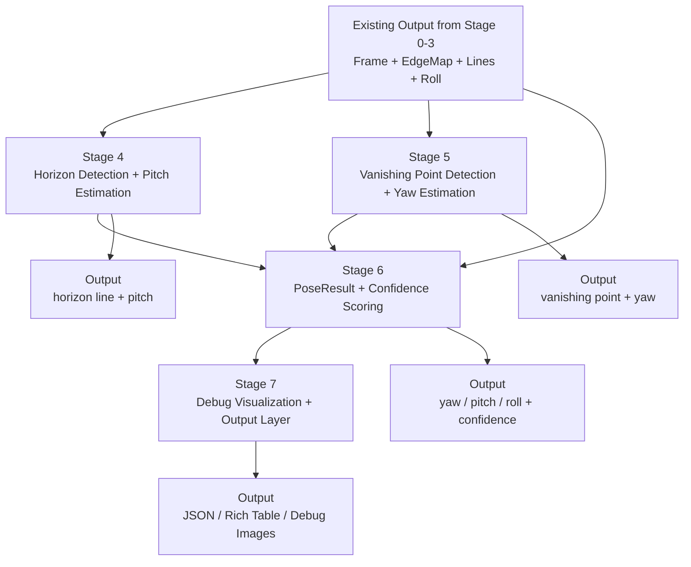

# Stage 4–7：Pose Integration and Debug

## 1. 文件目的

本文件定義 Visual Pose Estimation 專案第二階段的實作 breakdown。

Stage 0–3 已完成基礎影像輸入、前處理、直線偵測與初版 roll estimation。本階段的目標是在 roll 的基礎上，加入 **pitch** 與 **yaw**，並建立完整的 **PoseResult、Confidence Scoring、Debug Visualization 與 Output Layer**。

---

## 2. 階段總目標

> 從幾何特徵中進一步偵測地平線與消失點，估計 pitch 與 yaw，並將 yaw / pitch / roll 整合成可輸出的完整姿態結果。

---

## 3. 階段範圍

本階段包含：

1. Stage 4：Horizon Detection + Pitch Estimation
2. Stage 5：Vanishing Point Detection + Yaw Estimation
3. Stage 6：PoseResult + Confidence Scoring
4. Stage 7：Debug Visualization + Output Layer

主要涉及的 Bounded Context：

- Geometry Feature Context
- Pose Estimation Context
- Output Context
- Preprocessing Context 的既有輸出
- Input Context 的既有 Frame 資料

本階段暫不處理：

- Video Input
- Realtime Camera Input
- 大規模 benchmark
- Deep Learning-based pose estimation
- 完整 Camera Calibration 流程

---

## 4. Mermaid 階段流程



---

# Stage 4：Horizon Detection + Pitch Estimation

## 4.1 目標

根據影像中的水平結構或地平線候選，估計相機的 pitch。

Pitch 代表相機往上抬或往下壓的角度。在單張影像中，pitch 常透過地平線相對畫面中心的位置進行近似估計。

## 4.2 Related Bounded Contexts

### Geometry Feature Context

負責：

- horizon candidate generation
- horizon line fitting
- horizon quality scoring

### Pose Estimation Context

負責：

- 根據 horizon line 估計 pitch
- 計算 pitch confidence

## 4.3 輸入

- LineSegment list
- near-horizontal lines
- image width / height
- optional CameraModel
- optional FOV / focal length approximation

## 4.4 可使用技術

初版可使用：

- near-horizontal line filtering
- weighted line fitting
- RANSAC horizon fitting

未來可擴充：

- vanishing point based horizon recovery
- sky-ground segmentation
- semantic horizon estimation
- camera calibration based pitch estimation

## 4.5 核心直覺

地平線與 pitch 的關係：

- 地平線接近畫面中心：相機接近水平
- 地平線偏高：相機可能往下拍
- 地平線偏低：相機可能往上拍

Roll 需要先被校正或納入考慮，否則地平線傾斜會影響 pitch 的判斷。

## 4.6 處理步驟

1. Collect Horizon Candidates：選出可能屬於地平線的 near-horizontal lines。
2. Fit Horizon Line：使用 weighted average、dominant horizontal line selection 或 RANSAC fitting。
3. Reject Invalid Horizon：當候選線太少、方向分散、地平線位置不合理時降低 confidence。
4. Estimate Pitch：根據 horizon y-position 與畫面中心偏移估計 pitch。
5. Calculate Pitch Confidence：根據線段數量、總長度、fitting error、與 roll 一致性計算。
6. Generate Debug Image：標示候選地平線、選定地平線、畫面中心線與 pitch value。

## 4.7 初版 pitch 近似模型

```text
pitch ≈ atan((center_y - horizon_y) / focal_length_pixels)
```

若沒有 focal length，可先使用：

```text
focal_length_pixels ≈ image_width / 2
```

## 4.8 輸出

```json
{
  "pitch": -5.6,
  "unit": "degree",
  "confidence": 0.66,
  "method": "horizon_based_pitch_estimation",
  "features_used": [
    "lines",
    "horizon"
  ]
}
```

Debug images：

- `11_horizon_candidates.png`
- `12_selected_horizon.png`
- `13_pitch_overlay.png`

## 4.9 完成條件

- 對具有明顯地平線或水平結構的照片能輸出 pitch
- 對不適合估計 pitch 的照片能降低 confidence
- pitch debug image 能清楚標示地平線與畫面中心
- pitch estimation 不影響 Stage 3 已完成的 roll output

---

# Stage 5：Vanishing Point Detection + Yaw Estimation

## 5.1 目標

根據影像中的透視線與消失點估計 yaw。

Yaw 代表相機左右轉向，是三個角度中最依賴場景透視結構的一個。

## 5.2 Related Bounded Contexts

### Geometry Feature Context

負責：

- vanishing point candidate generation
- line intersection analysis
- vanishing point scoring

### Pose Estimation Context

負責：

- 根據 vanishing point 估計 yaw
- 計算 yaw confidence

## 5.3 輸入

- LineSegment list
- diagonal / perspective lines
- image width / height
- optional CameraModel
- optional pitch / roll correction

## 5.4 可使用技術

初版可使用：

- line extension
- pairwise intersection
- vanishing point voting
- RANSAC vanishing point estimation

未來可擴充：

- J-Linkage
- Mean Shift clustering
- Manhattan World assumption
- multiple vanishing point detection
- camera calibration based orientation recovery

## 5.5 核心直覺

消失點與 yaw 的關係：

- 消失點接近畫面中心：相機大致正對前方
- 消失點偏左或偏右：相機相對場景方向產生左右偏轉
- 透視線越清楚，yaw 估計越可信

適合場景：道路、走廊、鐵軌、建築街景、室內牆面與天花板線條。

不適合場景：自然景、人像特寫、雜亂物件、無明顯透視線的照片。

## 5.6 處理步驟

1. Select Perspective Lines：排除過短線段、幾乎垂直線與雜訊線段。
2. Generate Vanishing Point Candidates：延伸線段、計算線對交點、進行投票或聚類。
3. Select Dominant Vanishing Point：根據支持線段數量、總長度、交點集中程度選出主消失點。
4. Estimate Yaw：根據消失點 x 座標相對畫面中心的偏移估計 yaw。
5. Calculate Yaw Confidence：根據支持線段數量、交點聚集程度、residual error、場景透視程度計算。
6. Generate Debug Image：標示透視線、延伸線、消失點、畫面中心與 yaw value。

## 5.7 初版 yaw 近似模型

```text
yaw ≈ atan((vp_x - center_x) / focal_length_pixels)
```

若沒有 focal length，可先使用：

```text
focal_length_pixels ≈ image_width / 2
```

建議正負方向：

- yaw > 0：相機朝右轉
- yaw < 0：相機朝左轉

## 5.8 輸出

```json
{
  "yaw": 10.8,
  "unit": "degree",
  "confidence": 0.58,
  "method": "vanishing_point_based_yaw_estimation",
  "features_used": [
    "lines",
    "vanishing_point"
  ]
}
```

Debug images：

- `14_perspective_lines.png`
- `15_vanishing_point_candidates.png`
- `16_selected_vanishing_point.png`
- `17_yaw_overlay.png`

## 5.9 完成條件

- 透視明顯場景可輸出 yaw
- 無明顯透視場景時 confidence 應下降
- debug image 能清楚顯示消失點與支持線段
- yaw estimation 失敗時不影響 roll / pitch 輸出

---

# Stage 6：PoseResult + Confidence Scoring

## 6.1 目標

將 yaw、pitch、roll 整合成統一的 PoseResult，並建立完整的 confidence scoring 機制。

## 6.2 Related Bounded Contexts

### Pose Estimation Context

負責：

- 整合 YawEstimate
- 整合 PitchEstimate
- 整合 RollEstimate
- 計算整體 confidence
- 標示 features_used

## 6.3 輸入

- RollEstimate
- PitchEstimate
- YawEstimate
- FeatureSet
- CameraModel
- estimation config

## 6.4 PoseResult 資料結構

```json
{
  "image": "sample.jpg",
  "yaw": 10.8,
  "pitch": -5.6,
  "roll": 2.4,
  "unit": "degree",
  "confidence": 0.64,
  "method": "geometry_based_pose_estimation",
  "features_used": [
    "lines",
    "horizon",
    "vanishing_point",
    "vertical_lines"
  ],
  "angle_confidence": {
    "yaw": 0.58,
    "pitch": 0.66,
    "roll": 0.72
  }
}
```

## 6.5 處理步驟

1. Normalize Angle Definitions：統一 yaw / pitch / roll 的正負方向。
2. Handle Partial Results：允許 yaw、pitch、roll 各自獨立成功或失敗。
3. Calculate Per-angle Confidence：每個角度各自計算 confidence。
4. Calculate Overall Confidence：以有效角度的平均或加權平均作為整體 confidence。
5. Record Features Used：記錄各角度實際使用的特徵。

## 6.6 建議角度定義

- yaw > 0：相機朝右轉
- yaw < 0：相機朝左轉
- pitch > 0：相機往上抬
- pitch < 0：相機往下壓
- roll > 0：畫面順時針旋轉
- roll < 0：畫面逆時針旋轉

## 6.7 完成條件

- 系統能輸出統一 PoseResult
- yaw / pitch / roll 可獨立成功或失敗
- confidence 不只是單一硬編碼值
- features_used 能反映實際使用到的幾何特徵
- null result 不造成 output layer 錯誤

---

# Stage 7：Debug Visualization + Output Layer

## 7.1 目標

建立完整輸出層，讓使用者不只看到數值，也能理解系統是如何判斷 yaw / pitch / roll。

## 7.2 Related Bounded Contexts

### Output Context

負責：

- JSON formatting
- Rich Table output
- debug image writing
- pose overlay visualization

## 7.3 輸入

- PoseResult
- FeatureSet
- EdgeMap
- LineSegment list
- HorizonLine
- VanishingPoint
- debug config

## 7.4 輸出格式

### JSON Output

```json
{
  "image": "sample.jpg",
  "yaw": 10.8,
  "pitch": -5.6,
  "roll": 2.4,
  "unit": "degree",
  "confidence": 0.64,
  "method": "geometry_based_pose_estimation",
  "features_used": [
    "lines",
    "horizon",
    "vanishing_point"
  ],
  "angle_confidence": {
    "yaw": 0.58,
    "pitch": 0.66,
    "roll": 0.72
  },
  "debug_artifacts": {
    "edges": "debug/04_edges.png",
    "lines": "debug/06_filtered_lines.png",
    "horizon": "debug/12_selected_horizon.png",
    "vanishing_point": "debug/16_selected_vanishing_point.png",
    "pose_overlay": "debug/18_pose_overlay.png"
  }
}
```

### Rich Table Output

建議欄位：

- Image
- Yaw
- Pitch
- Roll
- Confidence
- Method
- Features Used
- Debug Directory

### Debug Images

建議輸出：

- edges
- detected lines
- filtered lines
- roll candidates
- horizon candidates
- selected horizon
- vanishing point candidates
- selected vanishing point
- final pose overlay

## 7.5 處理步驟

1. Format PoseResult to JSON：確保 null、confidence、debug paths 可正常序列化。
2. Format Rich Table：清楚顯示成功估計與無法估計的角度。
3. Generate Debug Images：根據 config 決定是否輸出 debug artifacts。
4. Generate Final Pose Overlay：在原圖上標示 yaw、pitch、roll、horizon、vanishing point、dominant line orientation。
5. Handle Failure Output：部分或全部估計失敗時不崩潰，並輸出 failure reason。

## 7.6 完成條件

- JSON output 穩定
- Rich Table output 可讀
- debug images 可追蹤每個判斷步驟
- 使用者能從 overlay 理解姿態估計依據
- 部分角度失敗時仍可輸出完整報告

---

# 8. Stage 4–7 最終輸出格式

```json
{
  "image": "sample.jpg",
  "yaw": 10.8,
  "pitch": -5.6,
  "roll": 2.4,
  "unit": "degree",
  "confidence": 0.64,
  "method": "geometry_based_pose_estimation",
  "stage": "stage_4_7_pose_integration_and_debug",
  "features_used": [
    "edges",
    "lines",
    "horizon",
    "vanishing_point",
    "vertical_lines"
  ],
  "angle_confidence": {
    "yaw": 0.58,
    "pitch": 0.66,
    "roll": 0.72
  },
  "debug_artifacts": {
    "edges": "debug/04_edges.png",
    "lines": "debug/06_filtered_lines.png",
    "horizon": "debug/12_selected_horizon.png",
    "vanishing_point": "debug/16_selected_vanishing_point.png",
    "pose_overlay": "debug/18_pose_overlay.png"
  }
}
```

---

# 9. 本階段不處理的事項

- video input
- realtime camera input
- temporal smoothing
- full benchmark evaluation
- automatic camera calibration
- deep learning based pose estimation

---

# 10. 給 LM Coding Agent 的實作提示

```yaml
task_name: implement_stage_4_7_pose_integration_and_debug
role: Python OpenCV 工程師
goal: >
  在 Stage 0–3 的基礎上，新增 horizon detection、pitch estimation、
  vanishing point detection、yaw estimation，並整合 PoseResult、confidence scoring
  與 debug output。
scope:
  include:
    - horizon candidate generation
    - pitch estimation
    - vanishing point candidate generation
    - yaw estimation
    - PoseResult 統一資料結構
    - per-angle confidence scoring
    - JSON / Rich Table output
    - debug visualization
  exclude:
    - video input
    - realtime camera input
    - deep learning model
    - full benchmark evaluation
bounded_contexts:
  - Geometry Feature Context
  - Pose Estimation Context
  - Output Context
acceptance_criteria:
  - 系統可輸出 yaw / pitch / roll
  - 每個角度都有獨立 confidence
  - 部分角度估計失敗時，其他角度仍可輸出
  - debug images 能顯示 horizon、vanishing point、pose overlay
  - JSON 與 Rich Table 輸出格式穩定
```

---

# 11. 下一階段銜接

Stage 4–7 完成後，下一階段進入：

> Stage 8–10：Validation, Video and Realtime Extension

下一階段會新增：

- validation framework
- ground truth dataset
- metrics report
- video input
- frame-by-frame pose estimation
- temporal smoothing
- realtime camera overlay
