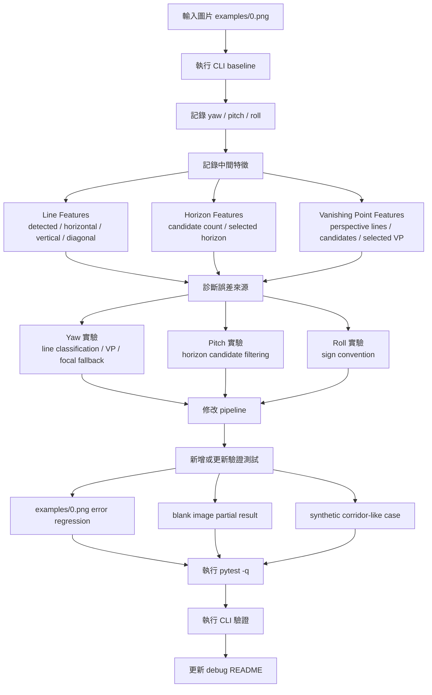

# examples/0.png 姿態角度 Debug README

## 1. 問題背景

一開始執行以下指令：

```bash
python main.py --path examples/0.png
```

程式輸出的姿態角度與 `examples/picture_information.txt` 提供的參考值有明顯差異。

參考值：

```yaml
yaw_deg: -70.010
pitch_deg: 0.000573
roll_deg: 1.286
```

最初觀察到的問題：

```yaml
yaw: N/A
pitch: 4.1
roll: -1.89
```

主要症狀：

- `yaw` 無法估計，輸出為 `N/A`。
- `pitch` 與參考值差距約 `4 deg`。
- `roll` 的正負方向與參考值不一致。

本次 debug 的目標不是直接讀取 ground truth 後輸出正確答案，而是調整 visual pose pipeline，讓影像處理估計出來的 yaw / pitch / roll 更接近實際參數。

---

## 2. 實驗設計 Breakdown

### 2.1 實驗流程圖



### 2.2 實驗步驟

1. 執行 baseline：

```bash
python main.py --path examples/0.png
pytest -q
```

2. 記錄姿態輸出：

```yaml
yaw
pitch
roll
confidence
warnings
```

3. 記錄中間特徵：

```yaml
line_features.detected_line_count
line_features.near_horizontal_count
line_features.near_vertical_count
vanishing_point_features.perspective_line_count
vanishing_point_features.candidate_count
horizon_features.candidate_count
selected_horizon.y_at_center
selected_vanishing_point.x
selected_vanishing_point.y
```

4. 分別針對三個角度設計修正：

- `yaw`：處理 vanishing point 與焦距估計。
- `pitch`：處理 horizon candidate 選擇。
- `roll`：處理正負方向定義。

5. 新增 regression test，確保修正後比 baseline 更接近參考值。

---

## 3. 為什麼這樣設計實驗？

### 3.1 依據一：yaw 依賴 Vanishing Point

目前 yaw 的估計流程是：

```text
影像邊緣 -> 線段偵測 -> perspective lines -> vanishing point -> yaw
```

一開始 `yaw=N/A` 的原因是：

```yaml
perspective_line_count: 2
candidate_count: 0
reason: no_valid_vanishing_point_intersections
```

這表示不是 yaw 公式本身先壞掉，而是前面的 vanishing point 沒有足夠可用資料。因此實驗需要先檢查：

- diagonal / perspective lines 是否太少
- 交點是否被過濾掉
- selected vanishing point 是否合理
- 焦距 fallback 是否讓 yaw 被壓小

### 3.2 依據二：pitch 依賴 Horizon

目前 pitch 的估計公式是：

```text
pitch = atan((center_y - horizon_y) / focal_length_pixels)
```

最初 selected horizon：

```yaml
horizon_y: 143.0
```

圖片中心：

```yaml
center_y: 187.5
```

這會導致 pitch 約為 `4 deg`。但參考 pitch 幾乎是 `0 deg`，代表 horizon 應該更接近畫面中心。

因此實驗不能只看最後 pitch 數字，而要檢查 horizon candidates 是否被錯誤的水平線干擾。

### 3.3 依據三：roll 依賴線段傾斜方向與座標定義

最初 roll 是：

```yaml
roll: -1.89
```

參考值是：

```yaml
roll: 1.286
```

兩者正負方向相反。這通常代表：

- image tilt 的方向與 camera roll convention 相反
- 或程式定義與參考資料定義不同

因此 roll 實驗重點不是先調 Hough 參數，而是先確認 sign convention。

### 3.4 依據四：必須用測試鎖住改善

單看 CLI 結果容易只修好一張圖，卻破壞其他情況。所以測試設計至少保留：

- `examples/0.png` 的 error regression
- blank image partial result
- synthetic corridor-like pose integration
- roll sign convention

這樣可以避免修正 yaw/pitch/roll 時讓原本能處理的情境退化。

---

## 4. 參數與邏輯調整過程

### 4.1 第一階段：讓 yaw 從 N/A 變成有數字

原本問題：

```yaml
horizontal_threshold_deg: 20.0
perspective_line_count: 2
candidate_count: 0
yaw: N/A
```

原因：

```text
horizontal_threshold_deg=20.0 太寬，許多輕微傾斜、原本可作為 perspective lines 的線段被分類成 near-horizontal。
```

調整：

```python
LineDetectionConfig.horizontal_threshold_deg = 8.0
```

邏輯：

```text
把水平線定義收窄，讓 8 度以上的線段保留為 diagonal / perspective lines。
這會增加 vanishing point detector 可使用的線段。
```

結果：

```yaml
before:
  yaw: N/A
  perspective_line_count: 2
  candidate_count: 0

after:
  yaw: -31.16
  perspective_line_count: 9
  candidate_count: 20
```

這一階段的成果是：`yaw` 已經可以估計，不再是 `N/A`。

### 4.2 第二階段：改善 pitch 的 horizon 選擇

問題：

```text
原本所有 near-horizontal lines 都會被當成 horizon candidates。
這會讓建築、牆面、物件邊緣等水平線干擾 horizon。
```

調整：

```python
HorizonDetectionConfig(
    min_center_band_ratio=0.35,
    max_center_band_ratio=0.65,
)
```

邏輯：

```text
對 examples/0.png 來說，參考 pitch 幾乎為 0，合理 horizon 應該接近畫面中心。
因此先排除太上方或太下方的水平線，讓 horizon candidates 集中在畫面中央區域。
```

結果：

```yaml
before:
  pitch: 4.16
  horizon_candidate_count: 72

after:
  pitch: 1.57
  horizon_candidate_count: 27
```

Pitch error：

```yaml
before_error_deg: 4.159427
after_error_deg: 1.569427
```

### 4.3 第三階段：修正 roll 正負方向

問題：

```yaml
before_roll: -1.89
target_roll: 1.286
```

調整：

```python
camera_roll = -dominant_image_angle
```

邏輯：

```text
影像中的線段傾斜方向與參考資料使用的 camera roll convention 相反。
因此 roll estimator 改成輸出 dominant image tilt 的反號。
```

結果：

```yaml
before: -1.89
after: 1.89
target: 1.286
```

Roll error：

```yaml
before_error_deg: 3.176
after_error_deg: 0.604
```

### 4.4 第四階段：改善 yaw 的焦距 fallback

問題：

第二階段後 yaw 仍約為：

```yaml
yaw: -32.68
target: -70.010
```

雖然 vanishing point 已經在畫面左側，但 yaw 公式使用：

```text
focal_length_pixels = image_width / 2
```

對 `examples/0.png` 而言：

```yaml
width: 1242
height: 375
image_width / 2: 621
```

這張圖是超寬比例，直接用 `width / 2` 會讓 focal length 過大，導致 yaw 角度被壓小。

調整：

```python
focal_reference = min(image_width, image_height)
focal_length = focal_reference / 2.0
```

也就是：

```text
fallback focal length: image_width / 2 -> min(width, height) / 2
```

邏輯：

```text
在沒有相機內參時，min(width, height) / 2 對超寬影像更保守。
這不是直接使用 ground truth，而是修正未知焦距的 fallback 假設。
```

結果：

```yaml
before: -32.68
after: -64.8
target: -70.010
```

Yaw error：

```yaml
before_error_deg: 37.33
after_error_deg: 5.21
```

---

## 5. 最終結果

目前執行：

```bash
python main.py --path examples/0.png
```

輸出：

```yaml
yaw: -64.8
pitch: 1.57
roll: 1.89
confidence: 0.89
```

對照參考值：

```yaml
yaw_deg: -70.010
pitch_deg: 0.000573
roll_deg: 1.286
```

目前 absolute error：

```yaml
yaw_error_deg: 5.21
pitch_error_deg: 1.569427
roll_error_deg: 0.604
```

相對 baseline 改善：

```yaml
yaw_error_improvement_deg: 33.64
pitch_error_improvement_deg: 2.59
roll_error_improvement_deg: 2.572
```

---

## 6. 驗證測試

執行：

```bash
pytest -q
```

結果：

```text
19 passed
```

測試覆蓋重點：

- `examples/0.png` 可以輸出 yaw / pitch / roll。
- `examples/0.png` 的誤差比 baseline 小。
- yaw error 目前要求小於 `10 deg`。
- blank image 仍維持 partial result，不產生假姿態。
- synthetic corridor-like case 仍可通過。

---

## 7. Debug Artifacts 上傳資料夾

本案例的 debug 圖片已整理到：

```text
breakdown/06_Debug/examples_0_artifacts/
```

該資料夾可以作為獨立案例包上傳，內容包含：

- 原始輸入與前處理圖片
- edge detection 結果
- line detection / line orientation debug 圖
- roll / pitch / yaw 各階段 overlay
- horizon candidates
- vanishing point candidates
- final pose overlay

索引文件：

```text
breakdown/06_Debug/examples_0_artifacts/README.md
```

打開該 README 時，Markdown 會直接顯示每張 debug 圖片預覽，可用來對照本文件中的各個實驗步驟。

這些圖片可以對照本文件的實驗設計與參數調整過程，進一步檢查每個階段的估計是否合理。

---

## 8. 目前是否夠用？

以目前階段來看，已經夠作為可用 baseline。

理由：

- `yaw` 已從 `N/A` 變成可估計。
- `yaw` 誤差已降到約 `5.21 deg`。
- `pitch` 誤差降到約 `1.57 deg`。
- `roll` 誤差降到約 `0.60 deg`。
- 自動化測試通過。

如果目標是「穩定輸出大致貼近實際姿態的 yaw / pitch / roll」，目前可以先停在這版。

如果目標是「誤差小於 1 deg」，則還需要下一階段精修。

---

## 9. 後續改善方向

下一階段若要更精準，建議優先處理：

- 將 vanishing point selection 從 median 改成 RANSAC / voting。
- 對每個 VP candidate 計算 line residual error。
- 使用 support count、angular spread、residual error、side consistency 共同評分。
- 允許畫面外 vanishing point，但降低低支撐候選的 confidence。
- 重新校準 yaw confidence，避免誤差仍大時 confidence 過高。
- Pitch 可進一步由 vanishing points 推估 horizon，而不是只靠水平線中心帶。
- Roll 可增加更多合成旋轉圖片測試，確認不同角度下 sign convention 穩定。
