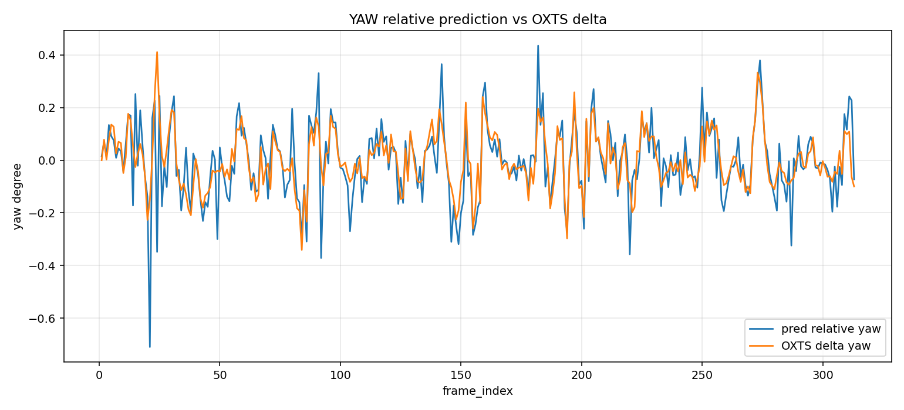
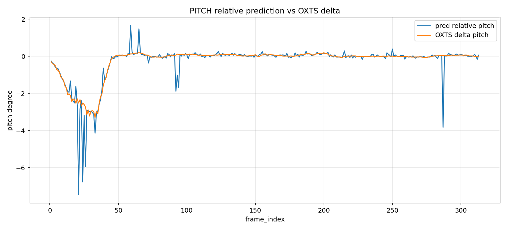
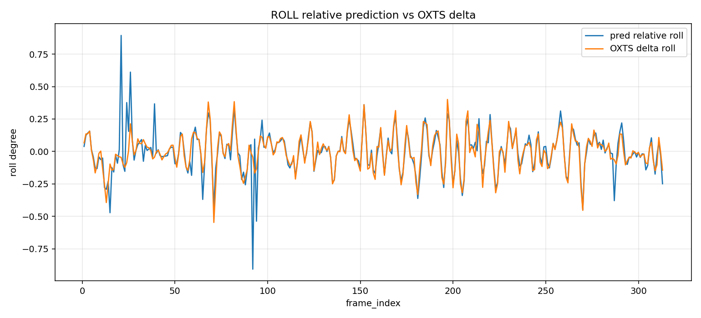
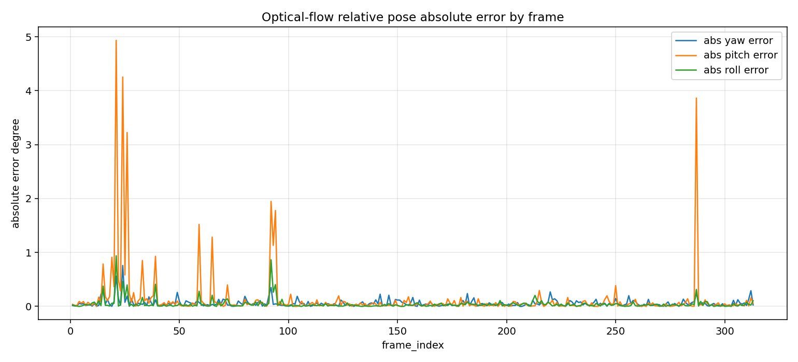
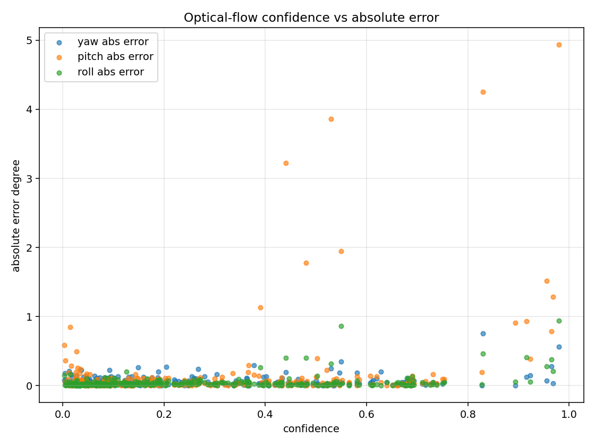

# Optical Flow Calibrated Pose vs KITTI OXTS Evaluation

This report compares the optical-flow prototype's frame-to-frame relative yaw/pitch/roll against KITTI OXTS frame-to-frame angle deltas.

KITTI camera intrinsics and camera-to-vehicle rotation were applied; both rotations are compared in the rectified camera frame.

## Summary

- Precision@1.0000 deg: 0.9681
- Recall@1.0000 deg: 0.9681
- 正確預測：303
- 有效預測：313
- 參考影格：313
- Geodesic MAE: 0.1823 deg
- P95 geodesic error: 0.4189 deg
- Error jitter: 0.7218 deg

## Plots

## 分析說明

- OXTS 相機運動使用 `R_current.T @ R_previous` 計算，以符合 OpenCV `recoverPose` 從前一幀相機座標轉換到目前幀相機座標的旋轉定義。
- 已套用相機與車體之間的外參，將 OXTS 相對旋轉轉換到校正後的相機座標系。
- Essential Matrix 估計已使用校正後的相機內參。
- 若出現較大的角度誤差，常見原因包括前進運動視差不足、動態物體干擾、場景深度差異，或特徵點分布不佳。
- 本報告的 yaw、pitch、roll 都是相鄰影格之間的相對旋轉，不是車輛在世界座標中的絕對姿態。

## Worst Frames

### Yaw
- frame 24: pred=-0.3483, oxts_delta=0.4110, abs_error=0.7593, confidence=0.8300
- frame 21: pred=-0.7096, oxts_delta=-0.1485, abs_error=0.5611, confidence=0.9800
- frame 92: pred=-0.3715, oxts_delta=-0.0212, abs_error=0.3504, confidence=0.5500
- frame 312: pred=0.2272, oxts_delta=-0.0637, abs_error=0.2909, confidence=0.3779
- frame 15: pred=0.2516, oxts_delta=-0.0262, abs_error=0.2778, confidence=0.9649

### Pitch
- frame 21: pred=-7.4575, oxts_delta=-2.5231, abs_error=4.9345, confidence=0.9800
- frame 24: pred=-6.7763, oxts_delta=-2.5216, abs_error=4.2547, confidence=0.8300
- frame 287: pred=-3.8296, oxts_delta=0.0341, abs_error=3.8638, confidence=0.5300
- frame 26: pred=-5.9555, oxts_delta=-2.7305, abs_error=3.2250, confidence=0.4400
- frame 92: pred=-1.8854, oxts_delta=0.0621, abs_error=1.9476, confidence=0.5500

### Roll
- frame 21: pred=0.8944, oxts_delta=-0.0452, abs_error=0.9396, confidence=0.9800
- frame 92: pred=-0.9075, oxts_delta=-0.0435, abs_error=0.8640, confidence=0.5500
- frame 24: pred=0.3770, oxts_delta=-0.0870, abs_error=0.4640, confidence=0.8300
- frame 39: pred=0.3672, oxts_delta=-0.0442, abs_error=0.4114, confidence=0.9154
- frame 94: pred=-0.5379, oxts_delta=-0.1335, abs_error=0.4044, confidence=0.4800
