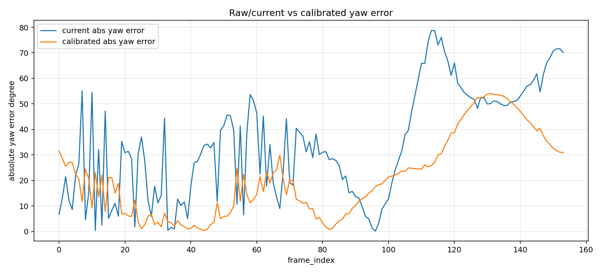
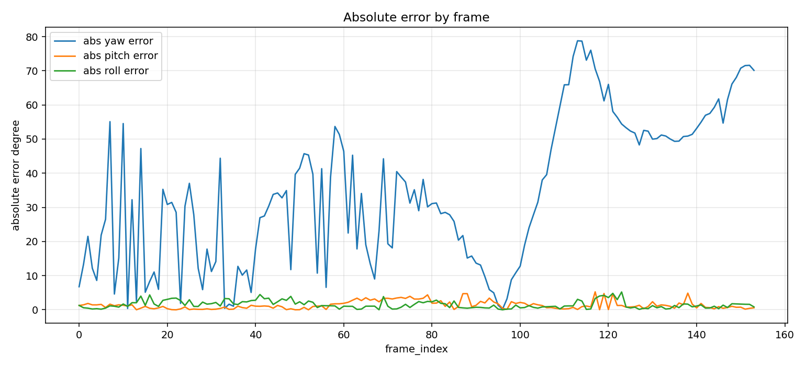

# Geometry Pose Calibration vs KITTI OXTS 評估報告

本報告整合 geometry-based pose pipeline 的 `pitch`、`yaw`、`roll` 評估結果，並說明 yaw 從影像幾何訊號到 calibrated heading 的完整流程。

為了讓 Markdown preview 可以直接顯示圖片，本報告引用的圖表集中放在：

```text
outputs/geometry_yaw_oxts_experiment/evaluation/assets/
```

原始完整實驗輸出仍保存在：

```text
outputs/geometry_yaw_oxts_experiment/pose_overlay_calibrated/evaluation/
```

目前 `outputs/geometry_yaw_oxts_experiment/evaluation/` 只保留一份主要報告與 `assets/` 圖片資料夾，避免 evaluation 根目錄太雜。

## 評估流程

本次 yaw 的完整流程是：

```text
VP / geometry yaw
-> image_geometry_yaw
-> reliability gate
-> calibration transform
-> calibrated_heading_yaw
-> OXTS comparison
```

各階段用途：

| 階段 | 用途 |
|---|---|
| `VP / geometry yaw` | 從影像線段找 vanishing point，取得畫面中的道路/方向幾何訊號。 |
| `image_geometry_yaw` | 由 vanishing point 相對畫面中心的位置推估 yaw。這還不是 OXTS absolute heading。 |
| `reliability gate` | 檢查 VP 是否跳動、是否 side flip、cluster 是否模糊、line support 是否不足，避免錯誤 yaw 仍有高 confidence。 |
| `calibration transform` | 用 calibration segment 學出 `image_geometry_yaw/reliability yaw` 到 OXTS heading 的轉換關係。 |
| `calibrated_heading_yaw` | 套用 calibration transform 後的 yaw，用來和 OXTS absolute heading 比較。 |
| `OXTS comparison` | 將預測值與 KITTI OXTS ground truth 比較，計算誤差。 |

Pitch 與 roll 目前沒有套用 calibration transform，仍使用 geometry pipeline 的 pitch / roll 輸出與 OXTS pitch / roll 比較。

## 參數說明

| 參數 | 意義 | 用途 |
|---|---|---|
| `MAE` | Mean Absolute Error，平均絕對誤差。 | 看整體平均差多少度，越低越好。 |
| `RMSE` | Root Mean Squared Error，均方根誤差。 | 對大錯誤更敏感；若 RMSE 明顯高於 MAE，代表有 outlier。 |
| `Calibration MAE` | 在 calibration segment 上的 MAE。 | 檢查模型是否能擬合用來學參數的資料。 |
| `Validation MAE` | 在 validation segment 上的 MAE。 | 檢查模型是否能泛化到沒有參與校準的資料，這比 Calibration MAE 更重要。 |
| `All MAE` | 全部 frame 的 MAE。 | 看整支影片的整體表現。 |
| `confidence` | pipeline 對結果的信心分數，通常介於 0 到 1。 | 越高代表越相信這個估測，但高 confidence 不一定代表真的準。 |
| `confidence failure` | `confidence >= 0.85` 且 `abs_error >= 30 deg`。 | 找出「很有信心但其實錯很大」的危險案例。 |
| `abs_error` | 絕對誤差，`abs(pred - oxts)`。 | 看某個 frame 差多少度。 |
| `current yaw` | reliability gate 後、但尚未 calibration transform 的 yaw。 | 用來和 calibrated yaw 比較改善幅度。 |
| `calibrated yaw` | 經過 calibration transform 後的 yaw。 | 目前用來和 OXTS yaw 比較的主要 yaw 結果。 |

簡單判讀：

```text
MAE 越低 = 平均越準
RMSE 越低 = 大錯誤越少
Validation MAE 下降 = calibration 不是只記住 calibration segment
confidence failure 下降 = 高信心但高錯誤的問題有改善
```

## 資料來源

```text
Pose timeline:
outputs/geometry_yaw_oxts_experiment/pose_overlay_calibrated/pose_timeline.csv

Frame result JSON:
outputs/geometry_yaw_oxts_experiment/pose_overlay_calibrated/frame_pose_results.json

Overlay video:
outputs/geometry_yaw_oxts_experiment/pose_overlay_calibrated/output_pose_overlay.mp4

Integrated comparison:
outputs/geometry_yaw_oxts_experiment/pose_overlay_calibrated/evaluation/integrated_pose_vs_oxts.csv

Integrated summary:
outputs/geometry_yaw_oxts_experiment/pose_overlay_calibrated/evaluation/integrated_pose_summary.json
```

## 整體數據

```text
Rows compared: 154
Calibration segment: frame 0-80
Validation segment: frame 81-153
```

平均絕對誤差，也就是 MAE：

```text
Yaw MAE current:     34.3517 deg
Yaw MAE calibrated:  20.9250 deg
Pitch MAE:           1.3891 deg
Roll MAE:            1.5228 deg
```

RMSE：

```text
Yaw RMSE current:     40.3713 deg
Yaw RMSE calibrated:  26.2045 deg
Pitch RMSE:           1.8433 deg
Roll RMSE:            1.9023 deg
```

解讀：

- yaw calibration 後，Yaw MAE 從 `34.3517 deg` 降到 `20.9250 deg`。
- yaw RMSE 也從 `40.3713 deg` 降到 `26.2045 deg`，代表大誤差 outlier 有下降。
- pitch / roll 目前維持原 geometry pipeline 結果，沒有做 calibration。

## Calibration Model

本次 yaw calibration 使用 linear model：

```text
calibrated_heading_yaw = scale * current_yaw + yaw_offset
```

模型參數：

```text
scale = -0.2705094869167766
yaw_offset = -55.56446532378772 deg
calibration segment = frame 0-80
validation segment = frame 81-153
```

候選模型比較：

| Model | Calibration MAE | Validation MAE | All MAE |
|---|---:|---:|---:|
| offset-only | 23.8186 deg | 51.3747 deg | 36.8809 deg |
| linear | 11.9392 deg | 30.8956 deg | 20.9250 deg |

解讀：

- `offset-only` 只加一個固定偏移量，在 validation 上反而變差。
- `linear` 同時使用 scale 與 offset，validation MAE 較低，因此選用 linear。
- 最重要的是 Validation MAE，因為 validation frame 沒有參與模型參數學習。

## Segment 指標

| Segment | Yaw Current MAE | Yaw Calibrated MAE | Pitch MAE | Roll MAE | Failure Before | Failure After |
|---|---:|---:|---:|---:|---:|---:|
| Calibration 0-80 | 24.8485 | 11.9392 | 1.3665 | 1.7627 | 0 | 0 |
| Validation 81-153 | 44.8963 | 30.8956 | 1.4142 | 1.2566 | 17 | 0 |
| Frame 91-100 | 7.0835 | 16.5434 | 1.8869 | 0.5729 | 0 | 0 |
| Frame 112-117 | 75.2228 | 28.7129 | 1.4904 | 1.7415 | 3 | 0 |
| Frame 150-153 | 70.9991 | 31.5733 | 0.4884 | 1.4362 | 2 | 0 |

解讀：

- `frame 91-100`：reliability gate 已經修得很好；calibration 後從 `7.0835` 變成 `16.5434`，這是 trade-off，但仍低於 `30 deg` high-error threshold。
- `frame 112-117`：calibration 後從 `75.2228` 降到 `28.7129`，改善明顯。
- `frame 150-153`：calibration 後從 `70.9991` 降到 `31.5733`，仍略高，後續可針對這段再分析。
- confidence failure 從 `17` 降到 `0`，表示高 confidence 高 error 的 yaw case 已被壓下。

## 圖表

### Calibrated Yaw vs OXTS


這張圖比較 `calibrated_heading_yaw` 與 OXTS yaw。用途是看 calibration 後的 yaw 曲線是否更接近 OXTS heading。

### Current / Raw vs Calibrated Yaw Error



這張圖比較 calibration 前後的 yaw absolute error。若 calibrated error 曲線低於 current error，代表 calibration 有改善。

### Calibrated Confidence vs Absolute Error


這張圖檢查 calibration 後是否還有「高 confidence 但高 error」的點。理想狀況是右上角的點變少。

### Pitch Prediction vs OXTS


這張圖比較 pitch 預測值與 OXTS pitch。Pitch MAE 為 `1.3891 deg`。

### Roll Prediction vs OXTS


這張圖比較 roll 預測值與 OXTS roll。Roll MAE 為 `1.5228 deg`。

### Absolute Error By Frame



這張圖顯示每個 frame 的 yaw / pitch / roll absolute error。用途是找出錯誤集中在哪些 frame。

### Confidence vs Absolute Error


這張圖顯示 current confidence 與 absolute error 的關係。用途是檢查 confidence 是否可靠。

## Worst Frames

### Calibrated Yaw

```text
frame 131: pred=-42.9127, oxts=-96.9192, abs_error=54.0065, confidence=0.84
frame 130: pred=-42.9073, oxts=-96.7621, abs_error=53.8548, confidence=0.83
frame 132: pred=-43.1968, oxts=-96.9032, abs_error=53.7064, confidence=0.81
frame 133: pred=-43.1616, oxts=-96.7375, abs_error=53.5759, confidence=0.83
frame 134: pred=-43.0182, oxts=-96.4058, abs_error=53.3876, confidence=0.83
```

Yaw calibration 後，最大的 yaw outlier 轉移到 frame 130-136 附近。這表示單一 linear transform 仍不是最終解，後續可能需要分段 calibration 或外參標定。

### Pitch

```text
frame 117: pred=-4.6800, oxts=0.5749, abs_error=5.2549, confidence=0.88
frame 138: pred=-3.5800, oxts=1.2984, abs_error=4.8784, confidence=0.86
frame 119: pred=-4.2800, oxts=0.4827, abs_error=4.7627, confidence=0.86
frame 121: pred=-4.2700, oxts=0.4633, abs_error=4.7333, confidence=0.78
frame 88: pred=4.7700, oxts=0.0455, abs_error=4.7245, confidence=0.69
```

### Roll

```text
frame 123: pred=4.1800, oxts=-1.0353, abs_error=5.2153, confidence=0.90
frame 121: pred=3.6800, oxts=-1.1342, abs_error=4.8142, confidence=0.78
frame 41: pred=-2.4900, oxts=1.9747, abs_error=4.4647, confidence=0.64
frame 16: pred=-3.2400, oxts=1.1163, abs_error=4.3563, confidence=0.61
frame 119: pred=3.1300, oxts=-1.0964, abs_error=4.2264, confidence=0.86
```

## 結論

本次 evaluation 已整合 pitch、yaw、roll，並保留完整 yaw 流程：

```text
VP / geometry yaw
-> image_geometry_yaw
-> reliability gate
-> calibration transform
-> calibrated_heading_yaw
-> OXTS comparison
```

主要結論：

1. Yaw calibration 有效降低整體 yaw error：
   ```text
   34.3517 deg -> 20.9250 deg
   ```

2. Validation segment 也改善：
   ```text
   44.8963 deg -> 30.8956 deg
   ```

3. Confidence failure 降為 0：
   ```text
   17 -> 0
   ```

4. Pitch / roll 數據已納入同一份 evaluation：
   ```text
   pitch MAE = 1.3891 deg
   roll MAE = 1.5228 deg
   ```

## 下一步

1. 針對 frame 130-136 做 yaw outlier deep dive。
2. 嘗試分段 yaw calibration model，避免單一 linear model 對所有區段造成 trade-off。
3. 針對 frame 117-123 同時檢查 pitch / roll outlier。
4. 建立 camera intrinsics / extrinsics calibration，讓 `calibrated_heading_yaw` 從資料驅動校正推進到物理座標轉換。
