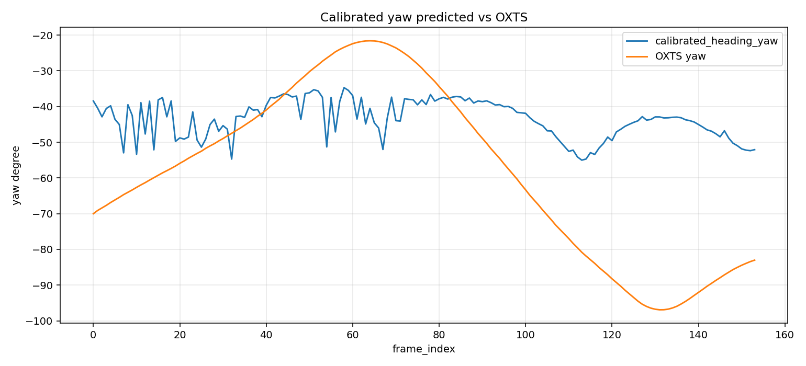
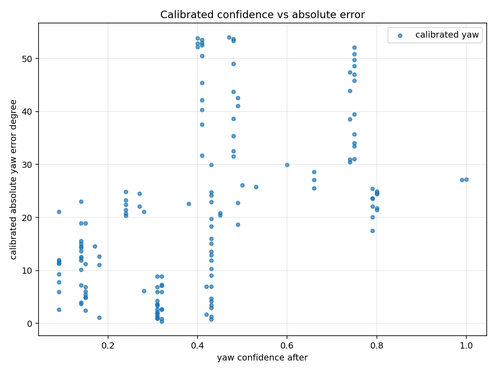
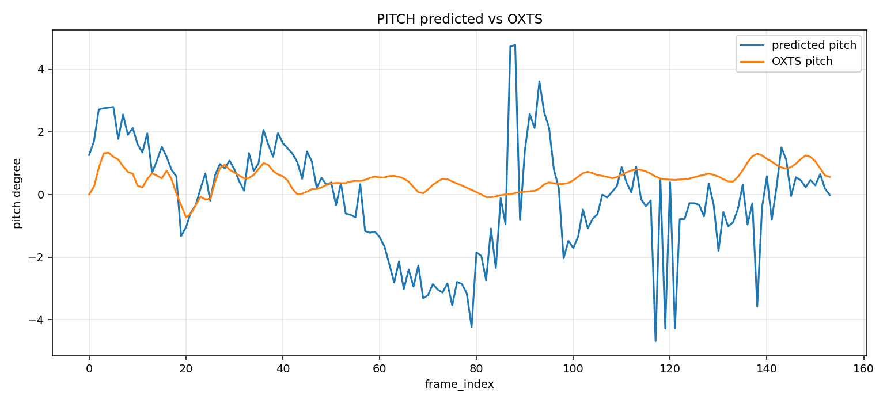
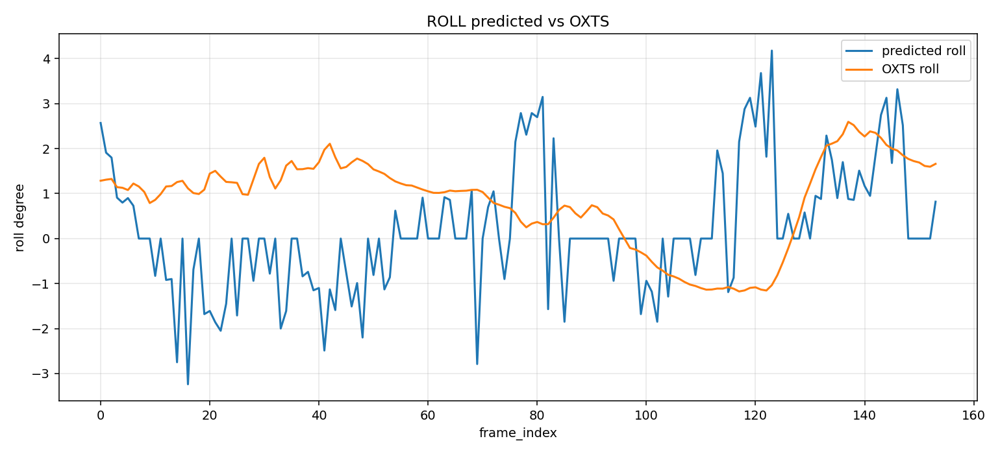
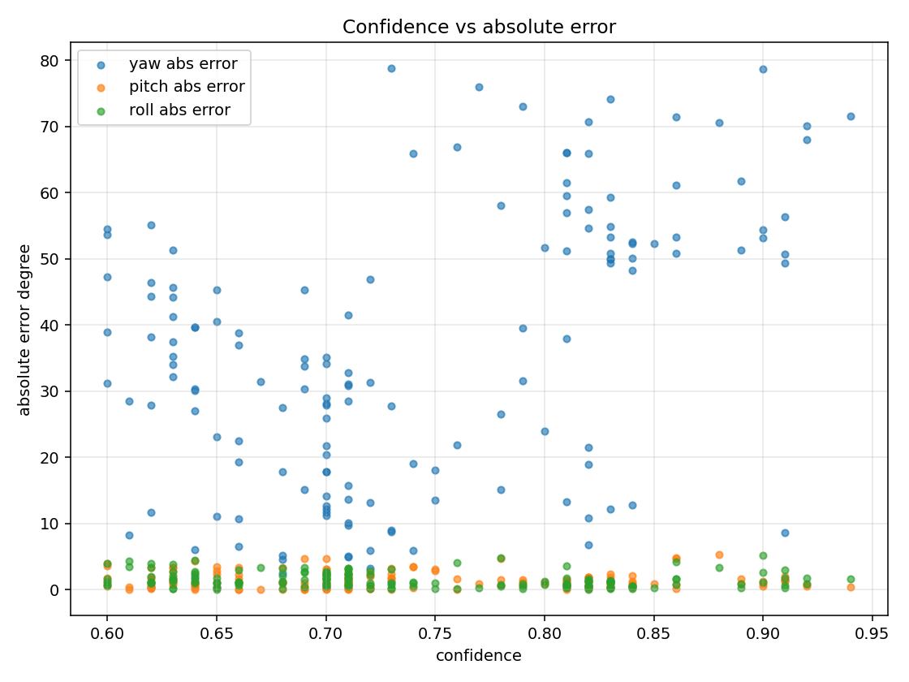

# Geometry Pose Calibration vs KITTI OXTS 評估報告

本報告整理 geometry-based pose pipeline 的 pitch、yaw、roll 評估資料，並將 yaw reliability gate 與 yaw calibration transform 的結果整合在同一個 evaluation 目錄中。

這份報告的目標是對齊 `outputs/optical_flow_pose/pose_overlay_uncalibrated/evaluation/evaluation_report.md` 的閱讀方式：先說明評估語意，再列出整體數據、圖表解讀、worst frames、結論與下一步。

## 評估語意

本次 geometry yaw 的完整流程是：

```text
VP / geometry yaw
-> image_geometry_yaw
-> reliability gate
-> calibration transform
-> calibrated_heading_yaw
-> OXTS comparison
```

各階段含義如下：

```text
image_geometry_yaw:
由 vanishing point 與畫面中心關係推得的原始影像幾何 yaw。

reliability gate:
根據 VP temporal jump、VP side flip、cluster ambiguity、line support consistency 等訊號，修正或降低不可靠 yaw 的 confidence。

calibration transform:
使用 frame 0-80 作為 calibration segment，學出 image/reliability yaw 到 OXTS heading 的線性轉換。

calibrated_heading_yaw:
套用 calibration transform 後的 yaw，用於和 KITTI OXTS absolute heading 比較。
```

Pitch 與 roll 目前沒有套用 calibration transform，仍使用 geometry pipeline 的原始 pitch / roll 輸出與 OXTS pitch / roll 比較。

```text
Current pose source:
outputs/geometry_yaw_oxts_experiment/pose_overlay_calibrated/pose_timeline.csv

Frame result JSON:
outputs/geometry_yaw_oxts_experiment/pose_overlay_calibrated/frame_pose_results.json

Overlay video:
outputs/geometry_yaw_oxts_experiment/pose_overlay_calibrated/output_pose_overlay.mp4

Integrated comparison CSV:
outputs/geometry_yaw_oxts_experiment/pose_overlay_calibrated/evaluation/integrated_pose_vs_oxts.csv

Integrated summary:
outputs/geometry_yaw_oxts_experiment/pose_overlay_calibrated/evaluation/integrated_pose_summary.json
```

## 整體數據

```text
Rows compared: 154
Calibration segment: frame 0-80
Validation segment: frame 81-153
```

平均絕對誤差：

```text
Yaw MAE current:     34.3517 deg
Yaw MAE calibrated:  20.9250 deg
Pitch MAE:           1.3891 deg
Roll MAE:            1.5228 deg
```

RMSE：

```text
Yaw RMSE current:     40.3713 deg
Yaw RMSE calibrated:  26.2045 deg
Pitch RMSE:           1.8433 deg
Roll RMSE:            1.9023 deg
```

Confidence failure：

```text
Before calibration: 17
After calibration:  0
```

confidence failure 定義為：

```text
yaw_confidence >= 0.85
and
abs_yaw_error >= 30 deg
```

## Calibration Model

本次選用的 yaw calibration model：

```text
model type: linear
scale: -0.2705094869167766
yaw_offset: -55.56446532378772 deg
calibration segment: frame 0-80
validation segment: frame 81-153
```

候選模型比較：

| Model | Calibration MAE | Validation MAE | All MAE |
|---|---:|---:|---:|
| offset-only | 23.8186 deg | 51.3747 deg | 36.8809 deg |
| linear | 11.9392 deg | 30.8956 deg | 20.9250 deg |

Offset-only 在 validation segment 變差，因此目前不適合作為 yaw calibration。Linear model 對 calibration 與 validation 都有明顯改善。

## Segment 指標

| Segment | Yaw Current MAE | Yaw Calibrated MAE | Pitch MAE | Roll MAE | Failure Before | Failure After |
|---|---:|---:|---:|---:|---:|---:|
| Calibration 0-80 | 24.8485 | 11.9392 | 1.3665 | 1.7627 | 0 | 0 |
| Validation 81-153 | 44.8963 | 30.8956 | 1.4142 | 1.2566 | 17 | 0 |
| Frame 91-100 | 7.0835 | 16.5434 | 1.8869 | 0.5729 | 0 | 0 |
| Frame 112-117 | 75.2228 | 28.7129 | 1.4904 | 1.7415 | 3 | 0 |
| Frame 150-153 | 70.9991 | 31.5733 | 0.4884 | 1.4362 | 2 | 0 |

Frame 91-100 是 reliability gate 已修正的區段；套用全域 linear calibration 後 yaw MAE 從 `7.0835 deg` 上升到 `16.5434 deg`，這是 trade-off，但仍低於 `30 deg` high-error threshold。

Frame 112-117 與 150-153 是 calibration transform 的主要改善區段。

## 圖表

### Calibrated Yaw vs OXTS



此圖顯示 `calibrated_heading_yaw` 與 OXTS yaw 的時間序列。相較 current yaw，calibrated yaw 明顯降低 frame 112-117 與 150-153 的大偏差。

### Current / Raw vs Calibrated Yaw Error


此圖比較 calibration 前後的 yaw absolute error。主要觀察：

- all yaw MAE 從 `34.3517 deg` 降到 `20.9250 deg`。
- validation yaw MAE 從 `44.8963 deg` 降到 `30.8956 deg`。
- frame 112-117 從 `75.2228 deg` 降到 `28.7129 deg`。
- frame 150-153 從 `70.9991 deg` 降到 `31.5733 deg`。

### Calibrated Confidence vs Absolute Error



這張圖檢查 calibration 後是否仍有「高 confidence 但高 error」的點。本次結果 confidence failure 從 `17` 降到 `0`。

### Pitch Prediction vs OXTS



Pitch MAE 為 `1.3891 deg`，RMSE 為 `1.8433 deg`。主要 outlier 出現在 frame 117、138、119、121、88。

### Roll Prediction vs OXTS



Roll MAE 為 `1.5228 deg`，RMSE 為 `1.9023 deg`。主要 outlier 出現在 frame 123、121、41、16、119。

### Absolute Error By Frame


這張圖用來比較 yaw、pitch、roll 在不同 frame 的 error 分布。Yaw 經 calibration 後整體下降，但 pitch / roll 的局部 outlier 仍需要個別 debug。

### Confidence vs Absolute Error



這張圖是 current pose evaluation 的 confidence/error 散點圖，可用來和 `calibrated_confidence_vs_abs_error.png` 對照。兩者差異顯示 calibration 後高 confidence 高 yaw error 問題已明顯下降。

## Worst Frames

### Calibrated Yaw

```text
frame 131: pred=-42.9127, oxts=-96.9192, abs_error=54.0065, confidence=0.84
frame 130: pred=-42.9073, oxts=-96.7621, abs_error=53.8548, confidence=0.83
frame 132: pred=-43.1968, oxts=-96.9032, abs_error=53.7064, confidence=0.81
frame 133: pred=-43.1616, oxts=-96.7375, abs_error=53.5759, confidence=0.83
frame 134: pred=-43.0182, oxts=-96.4058, abs_error=53.3876, confidence=0.83
```

Yaw calibration 後，原本 frame 112-117 與 150-153 的大錯誤下降，但新的最大錯誤集中在 frame 130-136 附近。這表示 linear calibration 仍不是最終解，後續可能需要分段 calibration 或 camera extrinsic calibration。

### Pitch

```text
frame 117: pred=-4.6800, oxts=0.5749, abs_error=5.2549, confidence=0.88
frame 138: pred=-3.5800, oxts=1.2984, abs_error=4.8784, confidence=0.86
frame 119: pred=-4.2800, oxts=0.4827, abs_error=4.7627, confidence=0.86
frame 121: pred=-4.2700, oxts=0.4633, abs_error=4.7333, confidence=0.78
frame 88: pred=4.7700, oxts=0.0455, abs_error=4.7245, confidence=0.69
```

Pitch 的主要 outlier 與 yaw / roll 在 frame 117-121 附近部分重疊，建議搭配 debug frames 檢查 horizon candidates。

### Roll

```text
frame 123: pred=4.1800, oxts=-1.0353, abs_error=5.2153, confidence=0.90
frame 121: pred=3.6800, oxts=-1.1342, abs_error=4.8142, confidence=0.78
frame 41: pred=-2.4900, oxts=1.9747, abs_error=4.4647, confidence=0.64
frame 16: pred=-3.2400, oxts=1.1163, abs_error=4.3563, confidence=0.61
frame 119: pred=3.1300, oxts=-1.0964, abs_error=4.2264, confidence=0.86
```

Roll 平均表現尚可，但 frame 119-123 仍是值得檢查的 outlier cluster。

## 結論

本次 geometry evaluation 已整理成與 optical-flow pose 類似的結構，並同時包含 pitch、yaw、roll。

主要結論：

1. Yaw calibration transform 有效降低整體 yaw error：
   ```text
   34.3517 deg -> 20.9250 deg
   ```

2. Validation segment 也改善：
   ```text
   44.8963 deg -> 30.8956 deg
   ```

3. Confidence failure 消失：
   ```text
   17 -> 0
   ```

4. Pitch / roll 已整合進同一份 CSV、summary、report：
   ```text
   pitch MAE = 1.3891 deg
   roll MAE = 1.5228 deg
   ```

5. 目前仍不是最終 calibrated pose pipeline，因為 yaw 仍是資料驅動 linear transform，而非完整 camera-to-vehicle/world-frame extrinsic calibration。

## 下一步

1. 對 frame 130-136 做 yaw outlier deep dive。
2. 嘗試分段 yaw calibration model，而不是單一全域 linear model。
3. 針對 frame 117-123 同時檢查 pitch / roll outlier。
4. 建立 camera intrinsics / extrinsics calibration，讓 `calibrated_heading_yaw` 從資料驅動校正推進到物理座標轉換。
