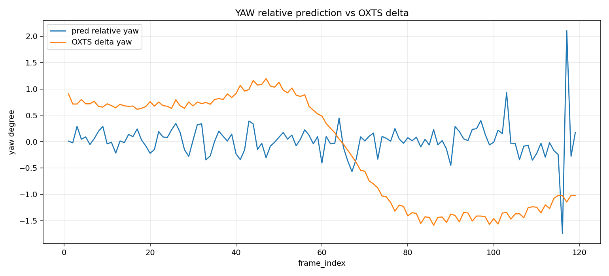
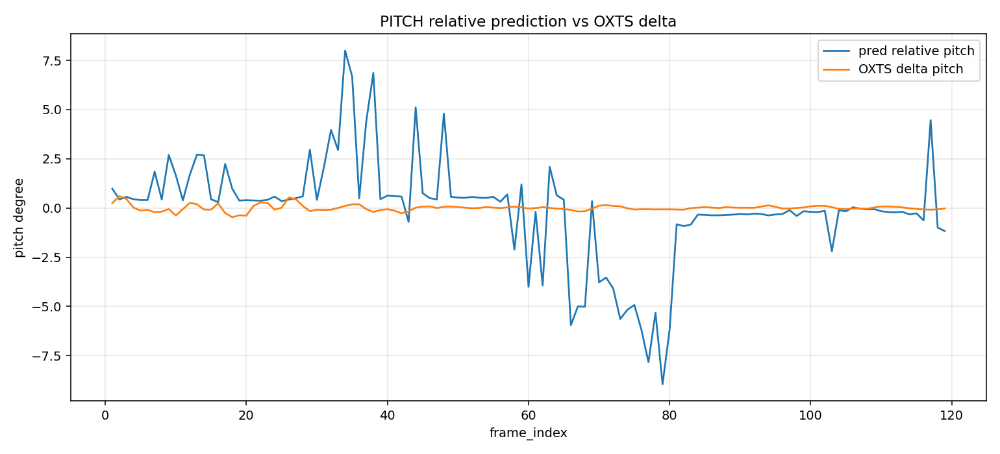
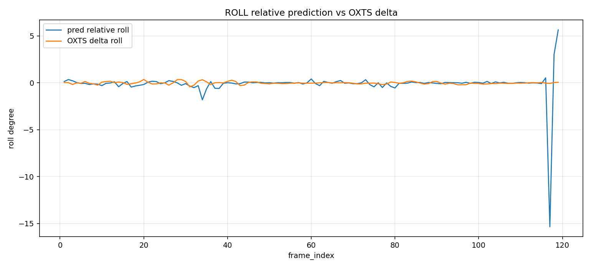
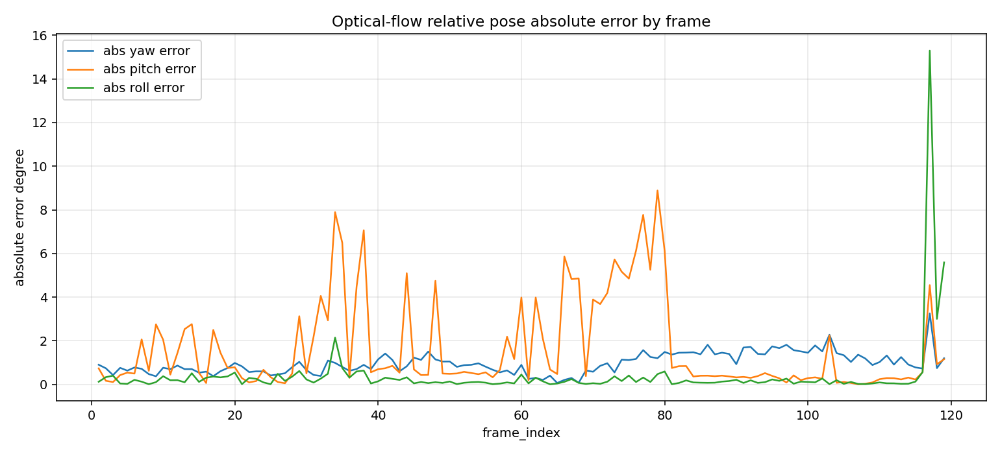
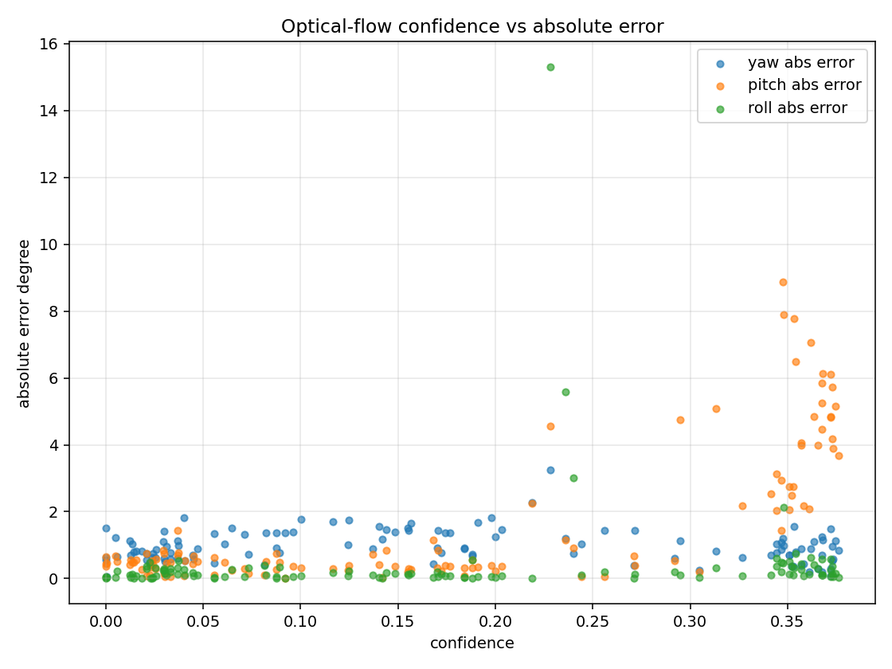

# Optical-Flow 未校正姿態 vs KITTI OXTS 評估報告

本報告評估 optical-flow pose prototype 的逐幀相對姿態結果，並與 KITTI OXTS 的逐幀角度變化量進行比較。

重要提醒：

這不是正式的 calibrated pose result。目前 overlay 使用的是 approximate camera matrix K，因此每一筆 pose row 都會標示：

```text
intrinsics_not_calibrated
approximate_K_used
pose_for_debug_only
```

因此本報告只能用來評估 debug prototype 的趨勢、穩定性與參數調整方向，不能宣稱為正式相機姿態估計結果。

## 評估方式

Optical-flow pipeline 使用 tracked feature correspondences，透過 Essential Matrix + RANSAC + recoverPose 得到 frame-to-frame relative rotation。

因此公平的比較方式是：

```text
predicted frame-to-frame relative yaw / pitch / roll
vs
KITTI OXTS frame-to-frame yaw / pitch / roll delta
```

不是拿 predicted relative pose 去比較 OXTS absolute global yaw / pitch / roll。

輸入與輸出：

```text
預測結果:
outputs/optical_flow_pose/pose_overlay_uncalibrated/frame_pose_results.json

Ground truth:
tools/input/oxts

逐幀比較 CSV:
outputs/optical_flow_pose/pose_overlay_uncalibrated/evaluation/relative_pose_vs_oxts.csv

統計摘要:
outputs/optical_flow_pose/pose_overlay_uncalibrated/evaluation/relative_pose_vs_oxts_summary.json
```

## 整體摘要

```text
Rows compared: 119
Mean inlier ratio: 0.5472
Mean confidence: 0.1769
```

角度誤差：

```text
Mean abs yaw error:   0.9668 deg
Mean abs pitch error: 1.6467 deg
Mean abs roll error:  0.3920 deg
```

RMSE：

```text
Yaw RMSE:   1.0794 deg
Pitch RMSE: 2.6577 deg
Roll RMSE:  1.5497 deg
```

最大誤差：

```text
Max abs yaw error:   3.2510 deg
Max abs pitch error: 8.8864 deg
Max abs roll error:  15.3001 deg
```

## 圖表

### Relative Yaw 預測 vs OXTS Delta



Yaw 的平均誤差約 `0.97 deg`，是目前 optical-flow prototype 中相對穩定的角度。這表示以 frame-to-frame relative rotation 來看，yaw 方向具有一定參考價值。

不過仍有幾個誤差較大的 frame，例如 frame 117、103、86、97、101。這些 frame 需要搭配 inlier / outlier overlay 檢查是否有 forward-motion degeneracy、動態物體干擾或 approximate K 導致的 Essential Matrix 解不穩。

### Relative Pitch 預測 vs OXTS Delta



Pitch 是目前主要痛點之一。平均誤差約 `1.65 deg`，但最大誤差達 `8.89 deg`。

Pitch outlier 多集中在：

```text
frame 34, 35, 38, 76, 77, 79, 80
```

這些 frame 的 inlier ratio 反而不低，代表問題不一定是「追蹤點太少」，也可能是：

- approximate K 對 pitch 特別敏感
- recoverPose 在該場景下選到不穩定解
- 特徵點分布過度集中於某些深度或區域
- forward motion / scene depth variation 讓 Essential Matrix 的姿態解產生偏移

### Relative Roll 預測 vs OXTS Delta



Roll 的平均誤差約 `0.39 deg`，整體表現比 pitch 穩定。不過 frame 117 到 119 附近有明顯 outlier，尤其 frame 117：

```text
pred_roll: -15.3613 deg
oxts_delta_roll: -0.0612 deg
abs_error: 15.3001 deg
confidence: 0.2280
inlier_ratio: 0.95
```

這是一個重要訊號：高 inlier ratio 不保證 roll 正確。該 frame 需要優先檢查 RANSAC inlier 分布、flow vector 方向、recoverPose ambiguity，以及 approximate K sensitivity。

### 每幀絕對誤差



從每幀絕對誤差可看出：

- yaw 多數維持在小誤差範圍。
- pitch 有多段 outlier，需要優先 debug。
- roll 大部分穩定，但 frame 117 到 119 是明顯異常區。

### Confidence vs 絕對誤差



目前 confidence 平均只有 `0.1769`，主要是因為 approximate K 的 `intrinsics_quality` 被刻意設成較低值。

這個設計是合理的，因為目前沒有 calibration video。但從 outlier 來看，confidence 還不夠精準：

- 有些 pitch / roll 高誤差 frame 仍有中等 inlier ratio。
- 高 inlier ratio 主要表示 correspondences 幾何一致，不代表姿態角度一定正確。
- confidence 應加入 angle jump、pose stability、inlier spatial distribution 等因素。

## 最差幀摘要

### Yaw

```text
frame 117: pred=2.1040, oxts_delta=-1.1470, abs_error=3.2510, confidence=0.2280
frame 103: pred=0.9283, oxts_delta=-1.3455, abs_error=2.2737, confidence=0.2188
frame 86:  pred=0.2275, oxts_delta=-1.5865, abs_error=1.8139, confidence=0.1981
frame 97:  pred=0.3996, oxts_delta=-1.4125, abs_error=1.8121, confidence=0.0400
frame 101: pred=0.2173, oxts_delta=-1.5651, abs_error=1.7824, confidence=0.1004
```

Yaw 的 outlier 幅度相對 pitch / roll 較小，目前不是第一優先調整目標。

### Pitch

```text
frame 79: pred=-8.9539, oxts_delta=-0.0675, abs_error=8.8864, confidence=0.3475
frame 34: pred=7.9977,  oxts_delta=0.1045,  abs_error=7.8932, confidence=0.3478
frame 77: pred=-7.8328, oxts_delta=-0.0649, abs_error=7.7680, confidence=0.3534
frame 38: pred=6.8637,  oxts_delta=-0.1993, abs_error=7.0630, confidence=0.3619
frame 35: pred=6.6764,  oxts_delta=0.1872,  abs_error=6.4892, confidence=0.3540
```

Pitch 是目前最需要調參與診斷的方向。

### Roll

```text
frame 117: pred=-15.3613, oxts_delta=-0.0612, abs_error=15.3001, confidence=0.2280
frame 119: pred=5.6441,   oxts_delta=0.0564,  abs_error=5.5878,  confidence=0.2360
frame 118: pred=3.0233,   oxts_delta=0.0230,  abs_error=3.0003,  confidence=0.2400
frame 34:  pred=-1.8142,  oxts_delta=0.3251,  abs_error=2.1393,  confidence=0.3478
frame 35:  pred=-0.6453,  oxts_delta=0.1023,  abs_error=0.7476,  confidence=0.3540
```

Roll 的平均表現很好，但 frame 117 到 119 需要特別 debug。

## 分析

目前 optical-flow prototype 比較適合用來觀察 frame-to-frame relative pose，而不是 absolute camera pose。

目前結果顯示：

1. **Relative yaw 可作為短期 debug signal。**
   平均誤差低於 1 度，表示 optical-flow + Essential Matrix 在 yaw delta 上有一定穩定性。

2. **Pitch outlier 是主要問題。**
   多個 frame 出現 6 到 9 度誤差，而且部分 frame inlier ratio 很高。這表示問題可能不是 tracking failure，而是 approximate K、特徵點空間分布或 recoverPose 解的穩定性。

3. **Roll 有單點重大 outlier。**
   Frame 117 的 roll error 達 15 度，但 inlier ratio 高達 0.95。這個案例應列為第一優先 debug frame。

4. **Confidence 需要重新校準。**
   現在 confidence 被 approximate K 壓低是合理的，但還需要加入 outlier detection，避免高 inlier ratio 被誤解為高姿態可信度。

## 是否需要調整參數

需要，但不建議盲目 sweep。

建議優先順序：

1. **先做 outlier frame deep dive。**
   優先檢查 frame `34, 38, 76, 77, 79, 80, 117, 118, 119` 的 flow vectors、RANSAC inliers / outliers、recoverPose 結果。

2. **再調 LK / Shi-Tomasi。**
   調整 `max_corners`、`quality_level`、`min_distance`、`lk_win_size`、`lk_max_level`，觀察 pitch outlier 是否下降。

3. **接著調 RANSAC threshold。**
   測試 `0.5, 0.75, 1.0, 1.5, 2.0`，看高 inlier ratio 但姿態錯誤的 frame 是否改善。

4. **最後做 approximate K sensitivity。**
   測試 focal scale 與 principal point offset，確認 pitch / roll 是否受未校正內參主導。

5. **Confidence calibration 放最後。**
   等姿態估計較穩後，再加入 angle jump、pose stability、inlier spatial distribution 等懲罰項。

## 結論

目前 optical-flow prototype 已能產生可用的 relative yaw debug signal，但 pitch 與 roll 還有 outlier。正式實作前，應先針對 outlier frame 做深入診斷，再進行 LK / RANSAC / approximate K sensitivity 參數實驗。

最終仍需要 calibration video 產生真實 camera intrinsics，才能把此 prototype 升級成 calibrated optical-flow pose pipeline。
