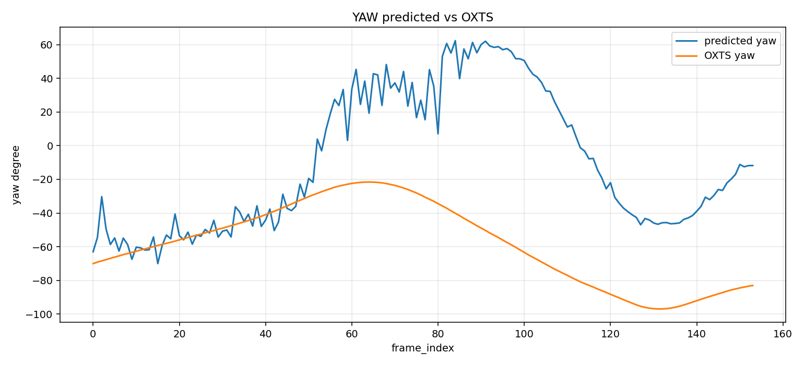
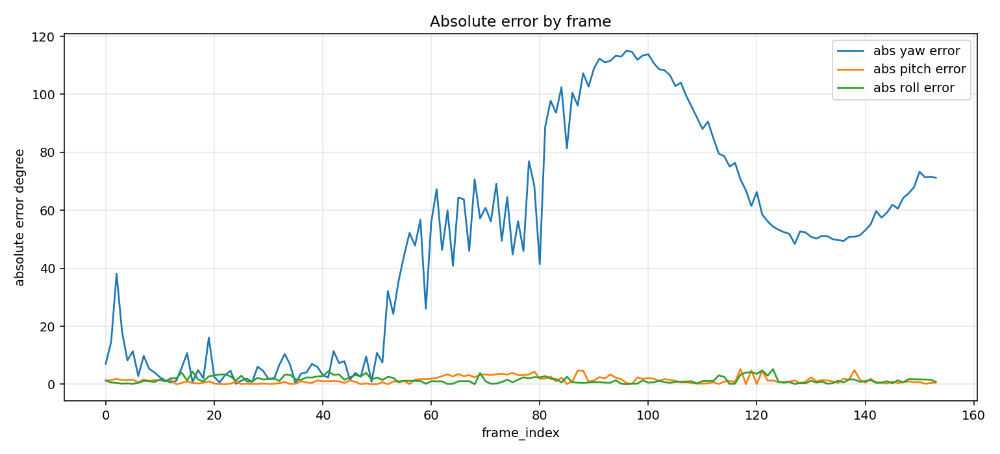
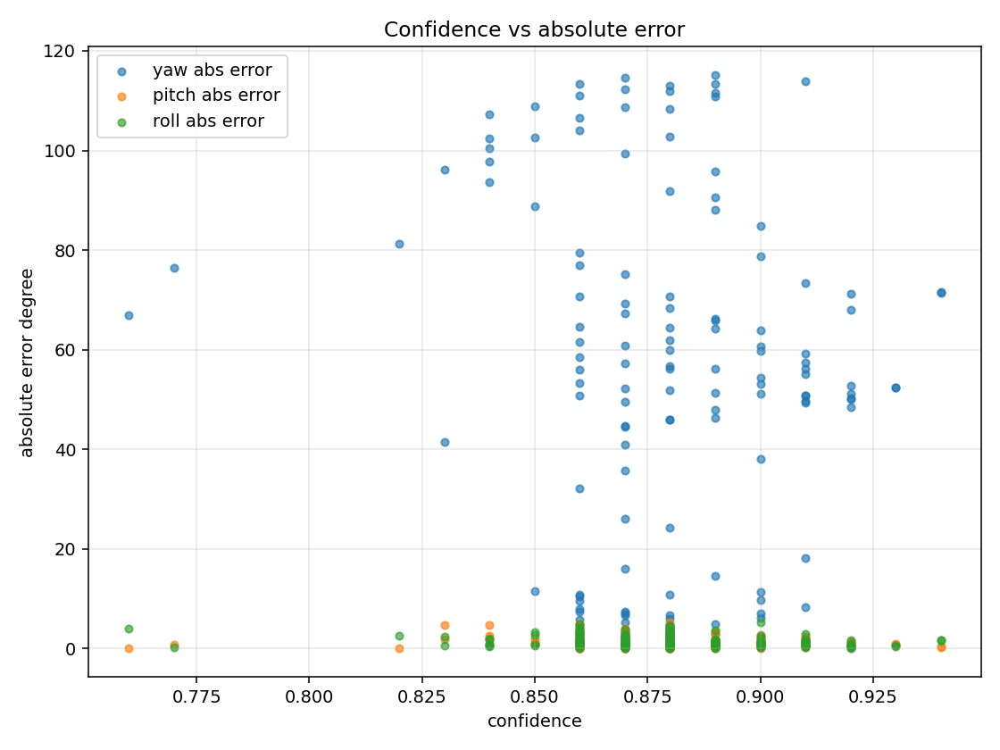

# 幾何特徵姿態估計 vs KITTI OXTS 評估報告

本報告評估 `outputs/video_pose` 內的幾何特徵姿態估計結果，並與 KITTI OXTS 提供的 yaw / pitch / roll 角度進行逐幀比較。

比較來源：

```text
預測結果: outputs/video_pose/pose_timeline.csv
Ground truth: tools/input/oxts
輸出目錄: outputs/video_pose/evaluation
```

## 評估方式

每一幀會比較三個角度：

- `pred_yaw` vs `oxts_yaw`
- `pred_pitch` vs `oxts_pitch`
- `pred_roll` vs `oxts_roll`

誤差定義：

```text
error = predicted - OXTS
abs_error = abs(error)
```

產出的評估檔案：

```text
outputs/video_pose/evaluation/pose_vs_oxts.csv
outputs/video_pose/evaluation/pose_vs_oxts_summary.json
outputs/video_pose/evaluation/worst_frames.csv
outputs/video_pose/evaluation/yaw_pred_vs_oxts.png
outputs/video_pose/evaluation/pitch_pred_vs_oxts.png
outputs/video_pose/evaluation/roll_pred_vs_oxts.png
outputs/video_pose/evaluation/abs_error_by_frame.png
outputs/video_pose/evaluation/confidence_vs_abs_error.png
```

## 整體結果

```text
total_rows: 154
valid_yaw_count: 154
valid_pitch_count: 154
valid_roll_count: 154
```

Yaw 誤差：

```text
mean_abs_yaw_error: 49.2858 deg
median_abs_yaw_error: 52.0403 deg
max_abs_yaw_error: 115.0878 deg
rmse_yaw_error: 61.5331 deg
```

Pitch 誤差：

```text
mean_abs_pitch_error: 1.3891 deg
median_abs_pitch_error: 1.0531 deg
max_abs_pitch_error: 5.2549 deg
rmse_pitch_error: 1.8433 deg
```

Roll 誤差：

```text
mean_abs_roll_error: 1.5228 deg
median_abs_roll_error: 1.1684 deg
max_abs_roll_error: 5.2153 deg
rmse_roll_error: 1.9023 deg
```

## 圖表

### Yaw 預測 vs OXTS



Yaw 是目前誤差最大的角度。幾何 pipeline 的 yaw 主要依賴 vanishing point / perspective lines；在 KITTI 這段影片中，預測 yaw 與 OXTS global heading 的方向與尺度並不穩定，尤其 frame 91 到 frame 100 附近出現超過 110 度的絕對誤差。

這表示目前 yaw 估計更像是「影像透視方向」的 debug signal，而不是可靠的車輛全域 heading。

### Pitch 預測 vs OXTS


Pitch 表現相對穩定，平均絕對誤差約 `1.3891 deg`。最大誤差出現在 frame 117，約 `5.2549 deg`。整體來看，horizon-based pitch 對這段 KITTI 影片有一定可用性，但在 horizon candidates 變少或地平線估計受場景線段干擾時，仍會產生偏移。

### Roll 預測 vs OXTS


Roll 表現也相對可控，平均絕對誤差約 `1.5228 deg`。最大誤差出現在 frame 123，約 `5.2153 deg`。Roll 主要來自線段方向分布，對道路與建築邊緣較敏感；當畫面線段分布不均或透視線主導時，roll 會受到干擾。

### 每幀絕對誤差



從絕對誤差圖可以看出：

- yaw 誤差明顯大於 pitch / roll。
- pitch / roll 多數幀落在較小誤差範圍內。
- yaw 在 frame 91 到 frame 100 附近有明顯高峰，是優先 debug 區間。

### Confidence vs 絕對誤差



目前 confidence 對 pitch / roll 有一定參考價值，但對 yaw 的錯誤預警不足。許多 yaw 高誤差 frame 仍有 `0.86` 到 `0.91` 的 confidence，表示目前 confidence 比較反映「幾何特徵數量與內部一致性」，但尚未充分反映「與 OXTS heading 是否一致」。

## 最差幀摘要

Yaw 最差幀集中在 frame 91 到 frame 100：

```text
frame 96: pred_yaw 57.64, oxts_yaw -57.4478, abs_error 115.0878, confidence 0.89
frame 97: pred_yaw 55.78, oxts_yaw -58.8603, abs_error 114.6403, confidence 0.87
frame 100: pred_yaw 50.52, oxts_yaw -63.3176, abs_error 113.8376, confidence 0.91
frame 99: pred_yaw 51.55, oxts_yaw -61.8571, abs_error 113.4071, confidence 0.89
frame 94: pred_yaw 58.78, oxts_yaw -54.5283, abs_error 113.3083, confidence 0.86
```

Pitch 最差幀：

```text
frame 117: pred_pitch -4.68, oxts_pitch 0.5749, abs_error 5.2549, confidence 0.88
frame 138: pred_pitch -3.58, oxts_pitch 1.2984, abs_error 4.8784, confidence 0.86
frame 119: pred_pitch -4.28, oxts_pitch 0.4827, abs_error 4.7627, confidence 0.86
```

Roll 最差幀：

```text
frame 123: pred_roll 4.18, oxts_roll -1.0353, abs_error 5.2153, confidence 0.90
frame 121: pred_roll 3.68, oxts_roll -1.1342, abs_error 4.8142, confidence 0.86
frame 41: pred_roll -2.49, oxts_roll 1.9747, abs_error 4.4647, confidence 0.88
```

## 分析

幾何特徵 pipeline 目前比較適合用來做單張影像或影片中的 visual pose debug，尤其 pitch / roll 已經有可觀察的穩定性。不過 yaw 與 KITTI OXTS global yaw 的落差很大，這通常不是單純調 threshold 就能完全解決。

主要原因：

- Vanishing point 估計反映的是影像中的透視方向，不一定等同 KITTI OXTS 的車輛全域 heading。
- 畫面中道路線、建築線、車道線與動態物體會影響 perspective line selection。
- 目前 yaw confidence 尚未把「方向符號錯誤」或「與時間序列不連續」納入懲罰。
- Geometry-only pipeline 缺少相機內參與跨幀幾何約束，因此 yaw 容易在特定場景失真。

## 是否需要調整參數

建議需要調整，但重點不同：

1. **Pitch / Roll：可以進行小幅參數調整。**
   建議針對 horizon candidate、line orientation filter、roll histogram 權重做微調，目標是降低 frame 117、121、123 這類局部高誤差。

2. **Yaw：不建議只靠參數微調。**
   Yaw 平均絕對誤差約 `49.2858 deg`，最大超過 `115 deg`。這比較像方法限制與座標定義落差，不是單一 threshold 問題。建議加入時間平滑、方向一致性檢查，或改用 optical-flow / calibrated Essential Matrix 作為 yaw 的主要來源。

3. **Confidence：需要重新校準。**
   目前 yaw 高誤差幀仍有高 confidence，建議加入 temporal stability、vanishing point jump、horizon/VP consistency 等懲罰項。

## 結論

目前幾何特徵 pipeline 的 pitch / roll 可作為可用的 debug estimate；yaw 則需要方法層級改善，不應視為可靠的 KITTI OXTS heading 估計。下一步建議優先調整 confidence 與 yaw 的穩定性判斷，再針對 pitch / roll 做小幅參數微調。
